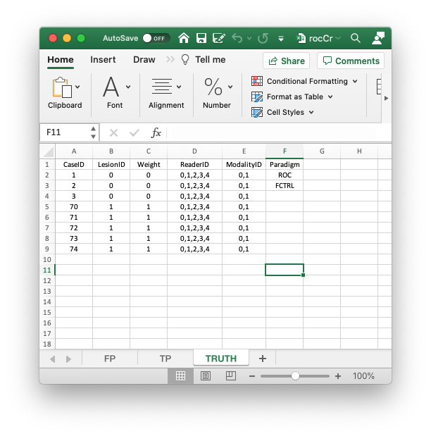

# Reading the Excel data file {#quick-start-read-datafile}


```{r setup, include = FALSE}
knitr::opts_chunk$set(
  collapse = TRUE,
  comment = "#>"
)
library(RJafroc)
```


## How much finished {#quick-start-read-datafile-how-much-finished}
10%


## Introduction {#quick-start-read-datafile-intro}
In the previous chapter I described the format of the Excel file `R/quick-start/rocCr.xlsx` corresponding to a small ROC dataset. Described here is how to read this file in order to create an `RJafroc` dataset. It introduces the `RJafroc` function `DfReadDataFile()`. Also shown are the correspondences between values in the Excel file and the dataset object.


## The structure of an ROC dataset {#quick-start-data-format-structure-roc-dataset}
{width=100%}

In the following code chunk the second statement reads the Excel file using the function `DfReadDataFile()` and saves it to object `x`. The third statement shows the structure of `x`.

```{r}
rocCr <- "R/quick-start/rocCr.xlsx"
x <- DfReadDataFile(rocCr, newExcelFileFormat = TRUE)
str(x)
```             

* In the above code chunk flag `newExcelFileFormat` is set to `TRUE` as otherwise columns D - F in the `Truth` worksheet are ignored and the dataset is assumed to be factorial, with `dataType` "automatically" determined from the contents of the FP and TP worksheets. ^[The assumptions underlying the "automatic" determination could be defeated by data entry errors.] 
* Flag `newExcelFileFormat = FALSE`, the default, is for compatibility with older JAFROC format Excel files, which did not have columns D - F in the `Truth` worksheet. Its usage is deprecated.
* The dataset object `x` is a `list` variable with `r length(x)` members. 
* The `x$ratings$NL` member, with dimension [2, 5, 8, 1], contains the ratings of normal cases. The five extra values ^[with only 3 non-diseased cases why does one need 8 values?] in the third dimension, which are filled with `NAs`, are needed for compatibility with FROC datasets.
* The `x$ratings$LL`, with dimension [2, 5, 5, 1], contains the ratings of abnormal cases.
* The `x$lesions$perCase` member is a vector with 5 ones representing the 5 diseased cases in the dataset. 
* The `x$lesions$IDs` member is an array with 5 ones.
* The `x$lesions$weights` member is an array with 5 ones. These values are irrelevant to an ROC dataset. Likewise, the `lesionVector`, `lesionID` and `lesionWeight` members are not used for ROC datasets. They are there for compatibility with FROC datasets.
* The `dataType` member indicates that this is an `ROC` dataset. 
* The `x$modalityID` member is a vector with two elements `"0"` and `"1"`, naming the two modalities. 
* The `x$readerID` member is a vector with five elements  `"0"`, `"1"`, `"2"`, `"3"` and `"4"`, naming the five readers. 
* The `x$design` member is `r x$design`; specifies the dataset design, which is "FCTRL".
* The `x$descriptions$truthTableStr` member quantifies the structure of the dataset, as explained in TBA**Vignette #3**. **It is used in the `DfReadDataFile()` function to check for data entry errors.**


## Correspondence between `NL` member of dataset and the `FP` worksheet {#quick-start-data-format-correspondence-nl-fp}
{width=100%}

* The list member `x$ratings$NL` is an array with `dim = c(2,5,8,1)`. 
    + The first dimension (2) comes from the number of modalities. 
    + The second dimension (5) comes from the number of readers. 
    + The third dimension (8) comes from the **total** number of cases. 
    + The fourth dimension is alway 1 for an ROC dataset. 
* The value of `x$ratings$NL[1,5,2,1]`, i.e., `r x$ratings$NL[1,5,2,1]`, corresponds to row 15 of the FP table, i.e., to `ModalityID` = 0, `ReaderID` = 4 and `CaseID` = 2.
* The value of `x$ratings$NL[2,3,2,1]`, i.e., `r x$ratings$NL[2,3,2,1]`, corresponds to row 24 of the FP table, i.e., to `ModalityID` 1, `ReaderID` 2 and `CaseID` 2.
* All values for case index > 3 are `-Inf`. For example the value of `x$ratings$NL[2,3,4,1]` is `-Inf`. This is because there are only 3 non-diseased cases. The extra length is needed for compatibility with FROC datasets.

## Correspondence between `LL` member of dataset and the `TP` worksheet {#quick-start-data-format-correspondence-ll-tp}
{width=100%}

* The list member `x$ratings$LL` is an array with `dim = c(2,5,5,1)`. 
    + The first dimension (2) comes from the number of modalities. 
    + The second dimension (5) comes from the number of readers. 
    + The third dimension (5) comes from the number of diseased cases. 
    + The fourth dimension is alway 1 for an ROC dataset. 

* The value of `x$ratings$LL[1,1,5,1]`, i.e., `r x$ratings$LL[1,1,5,1]`, corresponds to row 6 of the TP table, i.e., to `ModalityID` = 0, `ReaderID` = 0 and `CaseID` = 74.
* The value of `x$ratings$LL[1,2,2,1]`, i.e., `r x$ratings$LL[1,2,2,1]`, corresponds to row 8 of the TP table, i.e., to `ModalityID` = 0, `ReaderID` = 1 and `CaseID` = 71.
* There are no -Inf values in `x$ratings$LL`: `any(x$ratings$LL == -Inf)` = `r any(x$ratings$LL == -Inf)`.

## References {#quick-start-read-datafile-references}
