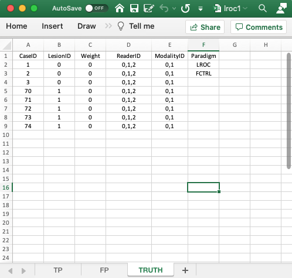
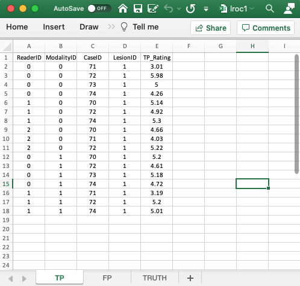
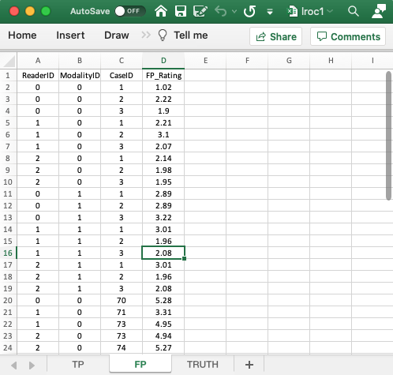
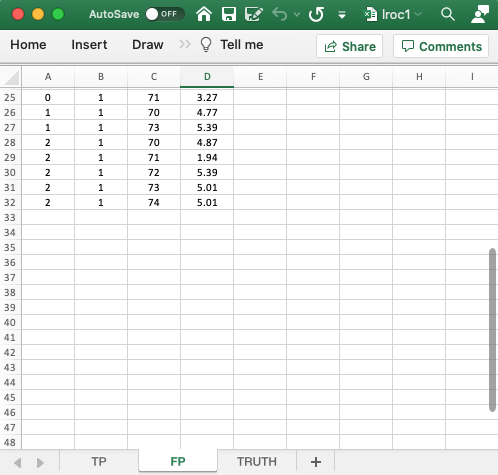

# Data format and reading LROC data {#quick-start-lroc-data}


## TBA How much finished {#quick-start-lroc-data-how-much-finished}
10%


## Introduction {#quick-start-lroc-data-intro}
In the Localization Receiver Operating Characteristic (LROC) paradigm the observer is restricted to at most one mark per case (and the associated rating), and each diseased case has exactly one lesion. On a diseased case the investigator classifies the mark as a correct localization (`CL`) - if the mark is close to the real lesion - or an incorrect localization (`IL`) otherwise. On a non-diseased case the mark is always classified as a false positive (`FP`). 

The paradigm is illustrated with a few toy data files, `R/quick-start/lroc?.xlsx`, where `?` is `1`, `2` or `3`. All of these files illustrate two-modality three-reader LROC datasets with 3 non-diseased and 5 diseased cases. File `lroc1` illustrates the classic LROC paradigm where one mark per case is required. 


## The `Truth` worksheet {#quick-start-lroc-truth}

{width=100%}

* The `Truth` worksheet is similar to that described previously for the ROC and LROC paradigms. The only difference is the first entry in the Paradigm column, which is `LROC`.
* Since a diseased case has one lesion, the first five columns contain as many rows as there are cases in the dataset. There being 8 cases in the dataset, there are 8 rows of data.
* `CaseID`: unique **integers** representing the cases in the dataset: '1', '2', '3', the 3 non-diseased cases, and '70', '71', '72', '73', '74', the 5 diseased cases.   
* `LesionID`: integers 0 or 1. 
    + Each 0 represents a non-diseased case, 
    + Each 1 represents the solitary lesion in the diseased case. 
* There are 3 non-diseased cases in the dataset (the number of 0's in the `LesionID` column).
* There are 5 diseased cases in the dataset (the number of 1's in the `LesionID` column). 
* `Weight`: this column is filled with zeroes. With one lesion per case, the weigts are irrelevant.
* `ReaderID`: In the example shown each cell has the value '0, 1, 2'. There are 3 readers in the dataset, labeled `0`, `1` and `2`.
* `ModalityID`: In the example each cell has the value `0, 1`. There are 2 modalities in the dataset, labeled `0` and `1`.
* `Paradigm`: The contents are `LROC` and `FCTRL`: this is an `LROC` dataset and the design is "factorial".


## The `TP` worksheet {#quick-start-lroc-tp}

{width=100%}


* The `TP` worksheet is similar to that described previously for the ROC and FROC paradigms. 
* This worksheet can only have diseased cases. The presence of a non-diseased case in this worksheet will generate an error.
* The key difference is that for each modality-reader and diseased-case combination there can be at most one entry. Also, if a particular combination is missing in the TP work then it must appear in the FP work. This is because this is a forced-mark-per-case dataset.
* There can be at most 30 rows of data in this worksheet: 2 modalities times 3 readers times 5 diseased cases. Since there in fact only 17 rows of data, the missing 13 rows must occur in the FP work.
* Recall that each entry in the TP worksheet represents a correct localization while each missing entry represents an incorrect localization. The incorrect localizations are recorded in the FP worksheet.


## The `FP` worksheet {#quick-start-lroc-fp}

{width=100%}

{width=100%}

* The `FP` worksheet is similar to that described previously for the ROC and FROC paradigms. 
* Because of the forced mark requirement, there are 18 rows of data corresponding to non-diseased cases: 2 modalities times 3 readers times 3 non-diseased cases. The missing 13 rows from the TP work are listed next; these correspond to the incorrect localizations on diseased cases. Therefore, the total number of rows in this worksheet is 18 + 13 = 31.
* As an example, it is seen that for `modalityID` = 0 and `readerID` = 0, `caseID` = 70 does not appear in the TP worksheet. The lesion on this case was not localized; therefore it must appear in the FP sheet as an incorrect localization, which is seen to be true in the FP worksheet.
* As another example, for `modalityID` = 0 and `readerID` = 1, `caseID` = 71 does not appear in the TP worksheet; instead it appears in the FP sheet.
* As a final example, for `modalityID` = 1 and `readerID` = 2, none of the diseased cases appears in the TP worksheet; instead they all appear in the FP sheet.


## Reading the LROC dataset {#quick-start-lroc-data-structure}


## The LROC dataset {#quick-start-lroc-data-tp}
The example shown above corresponds to file `R/quick-start/lroc1.xlsx`. The next code chunk reads this file into an `R` object `x`. Note the usage of the `lrocForcedMark` flag, which is set to `TRUE`, because this is a forced localization LROC dataset. 


```r
lroc1 <- "R/quick-start/lroc1.xlsx"
x <- DfReadDataFile(lroc1, newExcelFileFormat = TRUE, lrocForcedMark = T)
str(x)
#> List of 3
#>  $ ratings     :List of 3
#>   ..$ NL   : num [1:2, 1:3, 1:8, 1] 1.02 2.89 2.21 3.01 2.14 3.01 2.22 2.89 3.1 1.96 ...
#>   ..$ LL   : num [1:2, 1:3, 1:5, 1] -Inf 5.2 5.14 -Inf 4.66 ...
#>   ..$ LL_IL: num [1:2, 1:3, 1:5, 1] 5.28 -Inf -Inf 4.77 -Inf ...
#>  $ lesions     :List of 3
#>   ..$ perCase: int [1:5] 1 1 1 1 1
#>   ..$ IDs    : num [1:5, 1] 1 1 1 1 1
#>   ..$ weights: num [1:5, 1] 1 1 1 1 1
#>  $ descriptions:List of 7
#>   ..$ fileName     : chr "lroc1"
#>   ..$ type         : chr "LROC"
#>   ..$ name         : logi NA
#>   ..$ truthTableStr: num [1:2, 1:3, 1:8, 1:2] 1 1 1 1 1 1 1 1 1 1 ...
#>   ..$ design       : chr "FCTRL"
#>   ..$ modalityID   : Named chr [1:2] "0" "1"
#>   .. ..- attr(*, "names")= chr [1:2] "0" "1"
#>   ..$ readerID     : Named chr [1:3] "0" "1" "2"
#>   .. ..- attr(*, "names")= chr [1:3] "0" "1" "2"
```

This follows the general description in Chapter \@ref(quick-start-data-format). The differences are described below.

* The `x$ratings$NL` is a [2,3,8,1] dimension vector. For each modality and reader, only the first three elements, corresponding to the three non-diseased cases, are finite, the rest are `-Inf`.

For example:


```r
x$ratings$NL[1,1,,1]
#> [1] 1.02 2.22 1.90 -Inf -Inf -Inf -Inf -Inf
```

* The `x$ratings$LL` is a [2,3,5,1] dimension vector. For each modality and reader, only the first three elements, corresponding to the three non-diseased cases, are finite, the rest are `-Inf`.

For example, since none of the lesions are localized for `modalityID` = 1 (second modality) and `readerID` = 2 (third reader), the following code yields a vector consisting of five `-Inf` values:


```r
x$ratings$LL[2,3,,1]
#> [1] -Inf -Inf -Inf -Inf -Inf
```

* The `x$ratings$LL_IL` is a [2,3,5,1] dimension vector. These contain the ratings of incorrect localizations on diseased cases. For the just preceding modality-reader combination, this yields a vector with 5 finite values, the ratings of incorrect localizations for `modalityID` = 1 and `readerID` = 2.


```r
x$ratings$LL_IL[2,3,,1]
#> [1] 4.87 1.94 5.39 5.01 5.01
```


## Summary {#quick-start-lroc-data-summary}
The difference from the previous data structures is the existence of `LL_IL` in the `ratings` list, which contains the ratings of incorrect localizations. Recall that for ROC and FROC paradigms this member was `NA`. 


## References {#quick-start-lroc-data-references}
