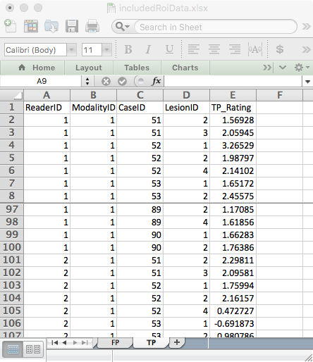

# FROC data Format {#frocdataformat}

```{r setup, include = FALSE}
  knitr::opts_chunk$set(
  collapse = TRUE,
  comment = "#>"
  )
  library(RJafroc)
```

## Introduction
* In the free-response ROC (__FROC__) paradigm [@RN85] the observer's task is to indicate (i.e., __mark__) and __rate__ regions in the image that are perceived as suspicious for presence of disease. Accordingly, FROC data consists of __mark-rating pairs__, where each mark indicates a region ^[In order to avoid confusion with the ROI-paradigm, I do not like to use the term ROI to describe the marks made by the observer.] that was considered suspicious for presence of a localized lesion; the rating is the corresponding confidence level. The number of mark-rating pairs on any particular case is a-priori unpredictable. It is a non-negative random integer (i.e., 0, 1, 2, ...) that depends on the case, the reader and the modality. The relatively unstructured nature of FROC data makes  FROC paradigm data more difficult to analyze than ROC paradigm data ^[Recall that the ROC paradigm always yields a single rating per case.].

* By adopting a proximity criterion, each mark is classified by the investigator as a lesion localization (LL) - if it is close to a real lesion - or a non-lesion localization (NL) otherwise. 
* The observer gives a single rating to each region, denoted ${{R}_{k}}$. The rating can be an integer or quasi- continuous (e.g., 0 – 100), or a floating point value, as long as higher numbers represent greater confidence in presence of one or more lesions in the ROI  ^[The directionaliy of the rating is not a limitation. If lower values correspond to increased confidence level, it is only necessary to transform the observed rating by subtracting it from a constant value. The constant value can be chosen arbitrarily, typically as the maximum of all observed ratings, thereby ensuring that the transformed value is always non-negative.].

* Region-level-normal ratings are stored in the `NL` field and region-level-abnormal ratings are stored in the `LL` field.  

## An actual FROC dataset

An actual FROC dataset [@RN1882] is included as `dataset04`, which has the following structure:
  
```{r}
str(dataset04)
```             
Examination of the output reveals that:

* This is a 5-treatment 4-reader dataset (the first and second dimensions of the `NL` and `LL` arrays). The names of the treatments are in the `modalityID` array:

```{r}
attributes(dataset04$modalityID)
```

For example, the name of the second treatment is `"2"`.

* The names of the readers are in the `readerID` array:

```{r}
attributes(dataset04$readerID)
```

### Numbers of non-diseased and diseased cases

* The third dimension of the `NL` array is the total number of cases, i.e., `r length(dataset04$NL[1,1,,1])`, and the third dimension of the `LL` array,  i.e., `r length(dataset04$LL[1,1,,1])` is the total number of diseased cases. 

* Therefore, in this dataset, there are `r length(dataset04$LL[1,1,,1])` diseased cases and `r (length(dataset04$NL[1,1,,1])-length(dataset04$LL[1,1,,1]))` non-diseased cases.

### Ratings on a non-diseased case

* For treatment 1, reader 1, case 1 (the first non-diseased case) the NL ratings are: 
```{r}
dataset04$NL[1,1,1,]
```

### The meaning of a negative infinity rating
Obviously, a rating cannot be negative infinity. This value is reserved for __missing ratings__, and more generally, __missing marks__ ^[Since there is a one-to-one correspondence between marks and ratings.]. For example, since all values in the above code chunk are negative infinities, this means this treatment-reader-case combination did not yield any mark-rating pairs. This possibility, alluded to above, is only possible with FROC data. All other paradigms (ROC, LROC and ROI) yield at least one rating per case. 

### Ratings on a non-diseased case
Unlike non-diseased cases, diseased cases can have both `NL` and `LL` ratings.

* For treatment 1, reader 1, case 51 (the 1st diseased case) the NL ratings are: 

```{r}
dataset04$NL[1,1,51,]
dataset04$lesionNum[1]
dataset04$LL[1,1,1,]
mean(is.finite(dataset04$LL))
```             


`r dataset04$NL[1,1,51,][is.finite(dataset04$NL[1,1,51,])]`. There are only two finite values because this case has two ROI-level-abnormal regions, and 2 plus 2 makes for the assumed 4-regions per case. The corresponding `$lesionNum` field is `r dataset04$lesionNum[1]`.
```{r}
mean(is.finite(dataset04$NL[,,1:50,]))
dataset04$NL[1,1,51,]
dataset04$lesionNum[1]
dataset04$LL[1,1,1,]
mean(is.finite(dataset04$LL))
```     

```{r}
mean(is.finite(dataset04$NL[,,1:50,]))
dataset04$NL[1,1,51,]
dataset04$lesionNum[1]
dataset04$LL[1,1,1,]
mean(is.finite(dataset04$LL))
```             


* The ratings of the 2 ROI-level-abnormal ROIs on this case are `r dataset04$LL[1,1,1,][is.finite(dataset04$LL[1,1,1,])]`. The mean rating over all ROI-level-abnormal ROIs is `r mean(dataset04$LL[is.finite(dataset04$LL)])`.  
```{r}
mean(is.finite(dataset04$NL[,,1:50,]))
dataset04$NL[1,1,51,]
dataset04$lesionNum[1]
dataset04$LL[1,1,1,]
mean(is.finite(dataset04$LL))
```     

## The FROC  Excel data file
An Excel file in JAFROC format containing simulated ROI data corresponding to `dataset04`, is included with the distribution. The first command (below) finds the location of the file and the second command reads it and saves it to a dataset object `ds`.  
```{r}
fileName <- system.file(
    "extdata", "includedFrocData.xlsx", package = "RJafroc", mustWork = TRUE)
ds <- DfReadDataFile(fileName)
ds$dataType
```             
The `DfReadDataFile` function automatically recognizes that this is an *ROI* dataset. Its structure is similar to the JAFROC format Excel file, with some important differences, noted below. It contains three worksheets: 

{width=40%}{width=40%}
{width=40%}{width=40%}
{width=40%}


* The `Truth` worksheet - this indicates which cases are diseased and which are non-diseased and the number of ROI-level-abnormal region on each case.  
    + There are 50 normal cases (labeled 1-50) under column `CaseID` and 40 abnormal cases (labeled 51-90).  
    + The `LesionID` field for each normal case (e.g., `CaseID` = 1) is zero and there is one row per case. For abnormal cases, this field has a variable number of entries, ranging from 1 to 4. As an example, there are two rows for `CaseID` = 51 in the Excel file: one with `LesionID` = 2 and one with `LesionID` = 3.   
    + The `Weights` field is always zero (this field is not used in ROI analysis).  

{width=40%}
{width=40%}

* The `FP` (or `NL`)  worksheet - this lists the ratings of ROI-level-normal regions.  
    + For `ReaderID` = 1, `ModalityID` = 1 and `CaseID` = 1 there are 4 rows, corresponding to the 4 ROI-level-normal regions in this case. The corresponding ratings are `r dataset04$NL[1,1,1,][is.finite(dataset04$NL[1,1,1,])]`. The pattern repeats for other treatments and readers, but the rating are, of course, different.  
    + Each `CaseID` is represented in the `FP` worksheet (a rare exception could occur if a case-level abnormal case has 4 abnormal regions).

{width=40%}

* The `TP` (or `LL`) worksheet - this lists the ratings of ROI-level-abnormal regions.  
    + Because normal cases generate TPs, one does not find any entry with `CaseID` = 1-50 in the `TP` worksheet.   
    + The lowest `CaseID` in the `TP` worksheet is 51, which corresponds to the first abnormal case.   
    + There are two entries for this case, corresponding to the two ROI-level-abnormal regions present in this case. Recall that corresponding to this `CaseID` in the `Truth` worksheet there were two entries with `LesionID` = 2 and 3. These must match the `LesionID`'s listed for this case in the `TP` worksheet. Complementing these two entries, in the `FP` worksheet for `CaseID` = 51, there are 2 entries corresponding to the two ROI-level-normal regions in this case.   
    + One should be satisfied that for each abnormal case the sum of the number of entries in the `TP` and `FP` worksheets is always 4.  
    
# TBA ROI paradigm    
* One can think of the ROI paradigm as similar to the FROC paradigm, but with localization accuracy restricted to belonging to a region (one cannot distinguish multiple lesions within a region). The ROIs are defined prior to the study and made known to all observers participating in the study. Unlike the FROC paradigm, a __rating is required for every ROI__.    

## References  
