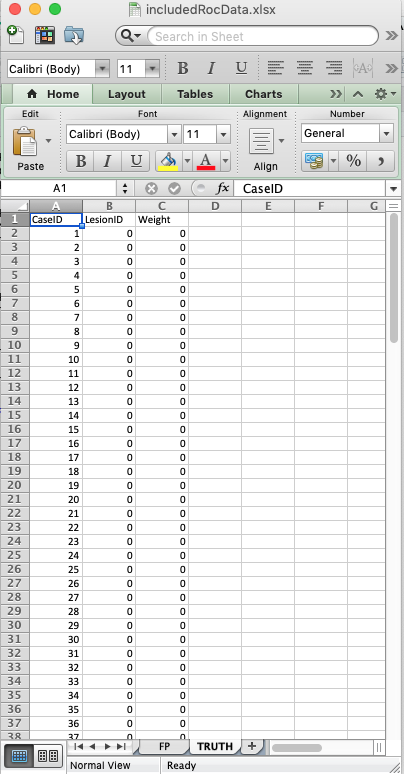
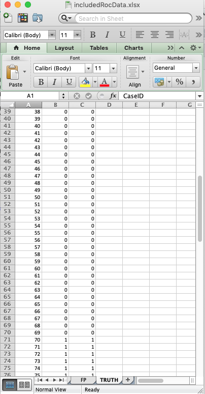
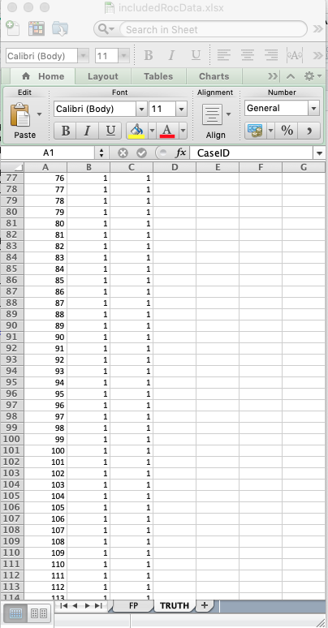
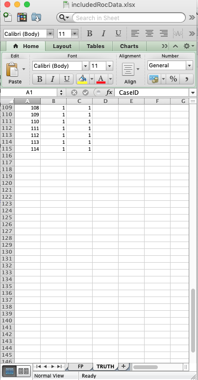
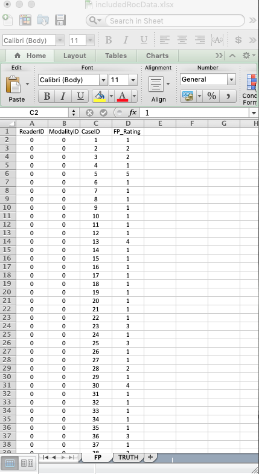
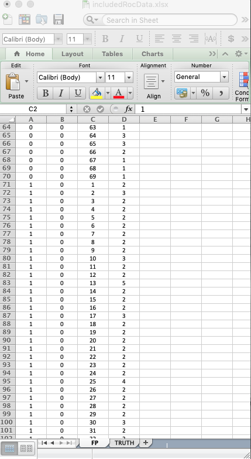
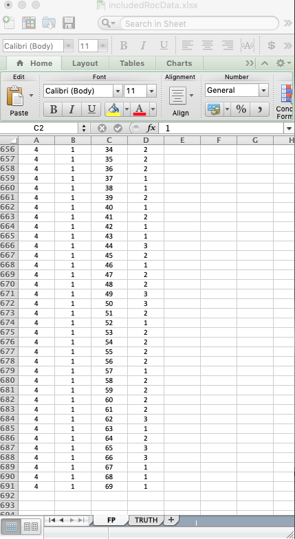
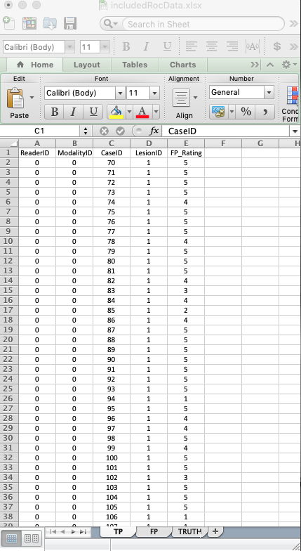
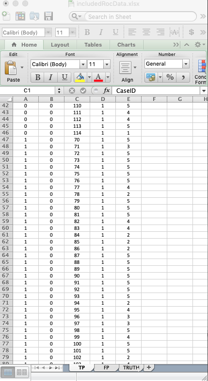
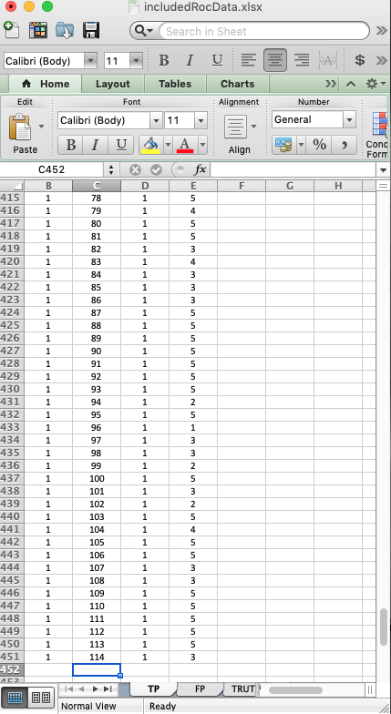

# ROC data format {#rocdataformat}

```{r setup, include = FALSE}
  knitr::opts_chunk$set(
  collapse = TRUE,
  comment = "#>"
  )
  library(RJafroc)
```

## Introduction
* In the receiver operating characteristic (__ROC__) paradigm [@RN1766] the observer's task is to  __rate__ (i.e., assign an ordered label representing the degree of suspicion) each case for confidence in presence of disease. The rating is frequently called a _confidence level_.
* The rating can be an integer or quasi- continuous (e.g., 0 – 100), or a floating point value, as long as higher numbers represent greater confidence in presence of one or more lesions in the case  ^[The directionaliy of the rating is not a limitation. If lower values correspond to increased confidence level, it is only necessary to transform the observed rating by subtracting it from a constant value. The constant value can be chosen arbitrarily, typically as the maximum of all observed ratings, thereby ensuring that the transformed value is always non-negative.].
* For human observer studies a 6-point rating scale is recommended, collected via two questions [@RN2680]:
    + Is the case diseased? 
        * Binary response: _Yes_ or _No_.
    + What is your confidence in the preceding decisions? 
        * Three level response: _Low_, _Medium_ or _High_.
* With algorithmic readers, e.g., computer aided detection (CAD) algorithms, a floating point rating, if possible, should be retained.
* In the most common study design, termed multiple-reader multiple-case (__MRMC__), the rating collection procedure is repeated for all cases, treatments and readers.

## An actual MRMC ROC dataset

An actual MRMC ROC dataset [@RN1993] is included as `dataset02`. It has the following structure:
  
```{r}
str(dataset02)
```             

### Overview of the data structure

* The `dataset` structure is a `list` variable with 8 members ^[This is true for ROC, FROC and ROI datasets. LROC datasets have 9 `list` members.].
    + Ratings of non-diseased cases are stored in the `NL` list member.
    + Ratings of diseased cases are stored in the `LL` list member.
    + The `lesionNum` list member is an array of length `r length(dataset02$lesionNum)`, filled with ones. It lists the number of lesions per case, which for ROC data, is always unity. The length of this array equals the number of diseased cases `K2`, see below.
    + The `lesionID` list member is a `[45 x 1]` array, also filled with ones. ^[The second "unnecessary" dimension is necessary for compatibility with FROC datasets.]
    + The `LesionWeight` list member is also a `[45 x 1]` array filled with ones.
    + The `dataType` list member equals the string `"ROC"`, identifying it as an ROC dataset.
    + The `modalityID` list member is a string array identifying the names of the treatments (see below).
    + The `readerID` list member is a string array, identifying the names of the readers  (see below).

### Details of the `modalityID` and `readerID` list members
* The names of the treatments are in the `modalityID` list member:

```{r}
attributes(dataset02$modalityID)
```

* For example, the name of the first treatment is `"0"`. The names can be longer strings, but use of very long string names may mess up the output formats of the analysis report. As per the __KISS__ principle ^[For those not familiar with it, KISS is American for __Keep It Simple, Stupid__.], keep the names short.
* The names of the readers are in the `readerID` array:

```{r}
attributes(dataset02$readerID)
```

For example, the name of the second reader is `"1"`. A similar caveat regarding long reader names applies.

### Details of the `NL` and `LL` list members
* For either `NL` or `LL` list members, the fourth dimension has unit length. This dimension, which is strictly speaking unnecessary for ROC data, is retained for ease of generalizability to the FROC and ROC paradigms, where more than one rating per case is possible.
* `dataset02` is a 2-treatment 5-reader dataset (the lengths of the first and second dimensions, respectively, of the `NL` and `LL` list members).

#### Numbers of non-diseased and diseased cases

```{r}
K <- length(dataset02$NL[1,1,,1])
K2 <- length(dataset02$LL[1,1,,1])
K1 <- K - K2
```             

* `K1` is the number of non-diseased cases, while `K2` is the number of diseased cases.
* The third dimension of the `NL` array is the total number of __all__ cases, i.e., `K` = `r length(dataset02$NL[1,1,,1])`, and the third dimension of the `LL` array,  i.e., `K2` = `r length(dataset02$LL[1,1,,1])`, is the total number of diseased cases.

* Subtracting the number of diseased cases from the number of all cases yields the number of non-diseased cases.

* Therefore, in this dataset, there are __`r K2`__ diseased cases and __`r K1`__ non-diseased cases.

#### Why dimension the `NL` array for the total number of cases?
* Again, this is for ease of generalizability to the FROC and ROI paradigms. 

#### Ratings on a non-diseased case
* For ROC data a non-diseased case can have only one, and exactly one, `NL` rating.
* For treatment 1, reader 1 and case 1 (the first non-diseased case), the NL rating is `"1"`: 
```{r}
dataset02$NL[1,1,1,1]
mean(dataset02$NL[,,1:K1,1])
```
* This study utilized a 5-point rating scale, 1 thru 5, so non-diseased cases are expected to have low ratings; in this case the lowest rating was observed.
* The mean rating over all non-diseased cases, treatments and readers, is `r mean(dataset02$NL[,,1:K1,1])`.

#### Ratings on a diseased case
* For ROC data a diseased case can have only one, and exactly one, `LL` rating.
* For treatment 1, reader 1, case 1 (the first diseased case) the LL rating is: 

```{r}
dataset02$LL[1,1,1,1]
mean(dataset02$LL)
```

* As noted previously, this study utilized a 5-point rating scale, 1 thru 5, so diseased cases are expected to have high ratings; in this case the highest rating was observed.
* The mean rating over all diseased cases, treatments and readers, is `r mean(dataset02$LL[,,,1])`.

## The ROC Excel data input file
* An Excel file in JAFROC format containing ROC data corresponding to `dataset02` is included with the __RJafroc__ package.  The first command (below) finds the location of the file and the second command reads it and saves it to a dataset object `ds`.  

```{r}
fileName <- system.file(
    "extdata", "includedRocData.xlsx", package = "RJafroc", mustWork = TRUE)
ds <- DfReadDataFile(fileName)
```

* On my Mac, the file name is huge: 
* `r fileName`.
* Use the following code to make a duplicate of the Excel file in a more convenient location.

```{r}
DfSaveDataFile(dataset02, "MyDataset02.xlsx", format = "JAFROC")
```

* `DfReadDataFile` is short for _Data File Function to Read a Data File_. 
* All data file related functions start with `Df`, and a similar organization applies to other functions. This makes it easier, in my opinion, to find a function in the `R` help system.
* To see the online help files, use the following command:

```{r}
help("RJafroc-package")
```

* Click the `"Show in new window"` button to see it full screen (i.e., not constrained to a single quarter panel in __RStudio__).
* This advice applies, of course, to all help files.

### The Excel file organization

* It contains three worksheets, `Truth`, `TP` and `FP`.
* The `Truth` worksheet defines the ground-truth of each case. It indicates which cases are diseased and which are non-diseased. 
* The `FP` worksheet lists the ratings of non-diseased cases. 
* The `TP` worksheet lists the ratings of diseased cases ^[OK, I am being inconsistent. I am using `NL`, `LL` for the ratings and `FP`, `TP`j for the worksheets. The worksheet format will accept `NL` and `LL` instead of `FP` and `TP`. However, for ease of generalization to the FROC paradigm it is necessary to use `NL` and `LL` for the list members of the dataset object.].

### The Truth worksheet organization
* The `CaseID` column lists the numeric labels identifying each case. Again, string names are possible, but keep them short. 
* A `1` in the `LesionID` column denotes a diseased case.
* A `0` in the `LesionID` column denotes a non-diseased case.
* The `Weight` column is irrelevant for ROC data ^[It is only needed for FROC data.].
* The contents of the `Truth` worksheet corresponding to `dataset02` are displayed next:

{width=40%}{width=40%}{width=40%}{width=40%}

* There are 69 non-diseased cases (labeled 1-69) under column `CaseID`.
* There are 45 diseased cases (labeled 70-114) under column `CaseID`.  
* The `LesionID` field for each non-diseased case (e.g., `CaseID` = 1) is zero. A zero in this field defines a non-diseased case. 
* The `LesionID` field for each diseased case (e.g., `CaseID` = 70) is unity. A unit value in this field defines a diseased case. 
* The `Weights` field is irrelevant for ROC datasets. For convenience it is filled with zeroes.  

### The FP/NL worksheet organization
The following screen-shots show different parts of the `FP` worsheet for `dataset02`.

{width=40%}{width=40%}{width=40%}{width=40%}

* The `FP` (or `NL`)  worksheet lists the ratings of non-diseased cases.
* The __ModalityID__ values range from `0` to `1`, corresponding to two treatments. 
* The __ReaderID__ values range from `0` to `4`, corresponding to five readers.
* The __CaseID__ values range from `1` to `69`, corresponding to non-diseased cases __only__.
* For each reader and treatment, each non-diseased case gets one rating; therefore the length of the column labeled __FP-Rating__ is __69 x 2 x 5 = 690__.
* The FP ratings tend to be low, there are a lot of ones, fewer twos, even fewer threes, and an ocassional four and a five rating may be found.  


### The TP/LL worksheet organization
The following screen-shots show different parts of the `FP` worsheet for `dataset02`.

{width=40%}{width=40%}{width=40%}{width=40%}

* The `TP` (or `LL`)  worksheet lists the ratings of diseased cases.
* The __ModalityID__ values range from `0` to `1`, corresponding to two treatments. 
* The __ReaderID__ values range from `0` to `4`, corresponding to five readers.
* The __CaseID__ values range from `70` to `114`, corresponding to diseased cases __only__.
* For each reader and treatment, each non-diseased case gets one rating; therefore the length of the column labeled __FP-Rating__ is __45 x 2 x 5 = 450__.
* The TP ratings tend to be high, there are a lot of fives, fewer fours, even fewer threes, and an ocassional two and a one rating may be found.  

## Summary
* Since each case gets one rating, the ROC data structure is relatively easy to visualize. For a single treatment and single reader, all of the information in the dataset can be summarize by a two-row five-column table, with one row listing the number of non-diseased cases rated 1, the number rated two, etc., ending with the number rated five, and a corresponding row for diseased cases. These 10 values contain all of the information contained in the Excel file for the specified treatment and reader. The example below is for treatment `0` and reader `0`:

```{r}
nl <- dataset02$NL
binnedFpCounts <- array(5)
for (b in 1:5) binnedFpCounts[b] <- sum(nl[1,1,1:K1,1] == b)
ll <- dataset02$LL
binnedTpCounts <- array(5)
for (b in 1:5) binnedTpCounts[b] <- sum(ll[1,1,1:K2,1] == b)
binnedFpCounts
binnedTpCounts
sum(binnedFpCounts)
sum(binnedTpCounts)
```

* The values in `binnedFpCounts` sum to 69.
* The values in `binnedTpCounts` sum to 45.
* A similar table is needed for each treatment-reader combination.
* The real value of the Excel format is that it allows generalization to other paradigms where the number of ratings per case is variable. 
