# FROC data format {#frocdataformat}

```{r setup, include = FALSE}
  knitr::opts_chunk$set(
  collapse = TRUE,
  comment = "#>"
  )
  library(RJafroc)
```

## Introduction
* In the free-response ROC (__FROC__) paradigm [@RN85] the observer's task is to: 
  + __mark__ (i.e., indicate the location of) and 
  +  __rate__ (i.e., assign an ordered label representing the degree of suspicion) regions in the image that are perceived as suspicious for presence of disease. 
  + Accordingly, FROC data consists of __mark-rating pairs__, where each mark indicates a region ^[In order to avoid confusion with the region-of-interest or ROI-paradigm, I do not like to use the term ROI to describe the marks made by the observer.] that was considered suspicious for presence of a localized lesion and the rating is the corresponding confidence level. 
  + The number of mark-rating pairs on any particular case is a-priori unpredictable. It is a non-negative random integer (i.e., 0, 1, 2, ...) that depends on the case, the reader and the modality. The relatively unstructured nature of FROC data makes  FROC paradigm data seemingly more difficult to analyze than ROC paradigm data ^[I say "seemingly", because the only real difference between ROC and FROC analyses is in the selection of the figure of merit.].
* By adopting a proximity criterion, each mark is classified by the investigator as a lesion localization (LL) - if it is close to a real lesion - or a non-lesion localization (NL) otherwise. 
* The rating can be an integer or quasi- continuous (e.g., 0 – 100), or a floating point value, as long as higher numbers represent greater confidence in presence of one or more lesions in the ROI  ^[As with the ROC paradigm, the directionaliy of the rating is not a limitation.].
* For human observer studies a 4 or 5-point rating scale is recommended:
    + 1: Very low, but finite possibility that the region is diseased. 
    + 2: Low possibility that the region is diseased. 
    + 3: Moderate possibility that the region is diseased. 
    + 4: High possibility that the region is diseased. 
    + 5: Very high possibility that the region is diseased.
* The actual adjectives used to describe the labels are unimportant. What is important is the ordering of the labels and that the observer holds them relatively constant for the duration of the study. More allowed ratings, provided the observer can work with them, leads to greater definition of the relevant empirical operating curves (to be introduced later).
* With algorithmic readers, e.g., computer aided detection (CAD) algorithms, a floating point rating, if possible, should be retained.
* In the most common study design, termed multiple-reader multiple-case (__MRMC__), the rating collection procedure is repeated for all cases, treatments and readers.

## An actual MRMC FROC dataset
An actual MRMC FROC dataset is included as `dataset04` [@RN1882]. It has the following structure.

```{r}
str(dataset04)
```             

### Overview of the FROC data structure

* The `dataset` structure is a `list` variable with 8 members.
* Ratings of actually non-diseased regions are stored in the `NL` list member.
* Ratings of actually diseased regions are stored in the `LL` list member.

#### The `lesionNum` list member

* The `lesionNum` list member is an array of length `r length(dataset04$lesionNum)`, filled with integers ranging from 1 to 3, the latter being the maximum number of actual lesions per case in `dataset04`. The length of this array equals the number of diseased cases, 100 in the current example. For this dataset, the contents of `lesionNum` are shown below:

```{r}
dataset04$lesionNum[1:20]
dataset04$lesionNum[21:40]
dataset04$lesionNum[41:60]
dataset04$lesionNum[61:80]
dataset04$lesionNum[81:100]
```

* The above entries tell us that while most cases contain only one lesion each, some contain 2 or even 3 lesions per case.

#### The `lesionID` list member

* The `lesionID` list member is a `[100 x 3]` array. 
* Essentially it establishes a way of distinguishing between different lesions on a case by naming them, or what amounts to the same thing, by labeling them.
* The problem of distinguishing between different lesions on a case is peculiar to the FROC paradigm. With only one conceptual lesion per diseased case, the ROC paradigm does not face this problem.
* The second dimension of this array indicates that there is at least one diseased case with three lesions.
    
```{r}
dataset04$lesionID[1:10,]
```

* This indicates that the first ten diseased cases contain one lesion each.
* The lesion on case 1 is __labeled__ by the value 1. The `-Inf` denote missing values. Since there is only one lesion, the placeholders for the second or third lesion (not present on this case, but needed to hold lesion labels in other cases) need to be filled with negative infinites.
* The following example may help clarify this point.

```{r}
dataset04$lesionID[90:100,]
```

* Diseased case 90 has two lesions, labeled 1 and 2 respectively. 
* The key point is this: each lesion on a case has a distinct _name_. Just as each case has to have a distinct name (i.e., label), each lesion within a (diseased) case has to have a distinct name.
* When an observer assigns a rating to a particular lesion on a casee, the experimenter needs to record this information correctly. 
* For example, if the lesion with `lesionID = 1` is marked and rated a particular value, this value needs to be entered in the spread-sheet as belonging to the lesion named `lesionID = 1`. 
* The `TP/LL` worksheet has a `lesionID` column. ^[Since the ROC paradigm does not allow multiple lesions per case, each diseased case conceptually containing only one lesion, the distinction between different `lesionID` values on the same diseased case does not arise.] 
* The distinction implied by different `lesionID` values is important if the lesion weights are unequal.^[For equally weighted lesions, the name distinction implied by `lesionID` is not important, but then the analysis would only be valid for equally weighted lesions.]

#### The `LesionWeight` list member
    
* The `LesionWeight` list member is also a `[100 x 3]` array filled with values that add up to unity for each case. The meaning of lesion weights is dicussed in here: [@RN1385; @RN1966; @RN2680]
* Briefly, the lesion weights are the clinical importance of detecting the lesion. 
* As an example, a highly visible lesion might have low clinical significance if it is likely to be benign, and it would be characterized by a lower weight than a less visible but more deadly lesion on the same case.
* In order to give each case equal importance, the weights must sum to one.
* In the current example, see below, the lesions are equally weighted. 
* The choice of weights is a clinical consideration, determined by the costs and benefits of missing or finding the lesion. Lacking this information, which is the most common scenario, it makes sense to weight the lesions equally.
* On a case one one lesion, `lesionWeight = 1`, and the other lesionWeights are assigned negative infinity values.
* On a case with two lesions, `lesionWeight = 0.5` for the first two lesions, and the third weight is assigned the negative infinity value.
* On a case with three lesions, `lesionWeight = 0.3333` for the lesions.
* Rather than assign these values manually, set the Weight column of the Truth worksheet to zeroes. Then the software automatically assigns equal weights when the Excel sheet is read.
    
```{r}
dataset04$lesionWeight[1:20,]
dataset04$lesionWeight[21:40,]
dataset04$lesionWeight[41:60,]
dataset04$lesionWeight[61:80,]
dataset04$lesionWeight[81:100,]
```
    
* The `dataType` list member equals the string `"FROC"`, identifying `dataset04` as an FROC dataset.
* The `modalityID` list member is a string array identifying the names of the treatments (see below).
* The `readerID` list member is a string array, identifying the names of the readers  (see below).

Examination of the output reveals that:

* The `dataset` structure is a list with 8 members.
* This is a 5-treatment 4-reader dataset (the lengths of the first and second dimensions, respectively, of the `NL` and `LL` arrays). The names of the treatments are in the `modalityID` array:
* Location-level ratings of non-diseased regions are stored in the `NL` list member.
* Location-level ratings of diseased regions are stored in the `LL` list member.  

### Details of the `modalityID` and `readerID` list members
* The names of the treatments are in the `modalityID` list member:
```{r}
attributes(dataset04$modalityID)
```

* For example, the name of the second treatment is `"2"`. The names can be longer strings, but use of very long string names may mess up the output formats of the analysis report. 

* The names of the readers are in the `readerID` array:

```{r}
attributes(dataset04$readerID)
```

For example, the name of the second reader is `"3"`. Apparently reader `"2"` "dropped out" of the study. A similar caveat regarding long reader names applies.

### Details of the `NL` and `LL` list members
* For either `NL` or `LL` list members, the fourth dimension can have length greater than unity.
* For the `NL` list member __this length is determined by the treatment-reader-case combination yielding the most `NL` marks per case__.
* For the `LL` list member __this length is determined by the case with the most true lesions__.
* `dataset02` is a 2-treatment 5-reader dataset (the lengths of the first and second dimensions, respectively, of the `NL` and `LL` list members).


#### Numbers of non-diseased and diseased cases
```{r}
length(dataset04$NL[1,1,,1])
length(dataset04$LL[1,1,,1])
```             

* The third dimension of the `NL` array is the total number of __all__ cases, i.e., `r length(dataset04$NL[1,1,,1])`, and the third dimension of the `LL` array,  i.e., `r length(dataset04$LL[1,1,,1])`, is the total number of diseased cases.
* Subtracting the number of diseased cases from the number of all cases yields the number of non-diseased cases.
* Therefore, in this dataset, there are `r length(dataset04$LL[1,1,,1])` diseased cases and `r (length(dataset04$NL[1,1,,1])-length(dataset04$LL[1,1,,1]))` non-diseased cases.

### Why dimension the `NL` array for the total number of cases?
* Because, in addition to `LLs`, `NLs` are possible on diseased cases.
* Only `LLs` are possible on diseased cases.
* Only `NLs` are possible on non-diseased cases.
* The missing values are filled in with `-Inf`.

#### Ratings on a non-diseased case

* For treatment 1, reader 1 and case 1 (the first non-diseased case), the NL ratings are: 
```{r}
dataset04$NL[1,1,1,]
```

#### The meaning of a negative infinity rating
* Obviously, a real rating cannot be negative infinity ^[If an observer is so highly confident in the _absence_ of a localized lesion, he will simply _not mark_ the location in question; if he did, then, logically, he should mark _all_ areas in the image that are definitely not lesions; in the FROC paradigm only regions with a reasonable degree of suspicion are marked. The radiologist only wishes to draw attention to regions that are reasonably suspicious; the definition of "reasonable" is determined by clinical considerations.]. This value is reserved for __missing ratings__, and more generally, __missing marks__ ^[Since there is a one-to-one correspondence between marks and ratings.]. For example, since all values in the above code chunk are negative infinities, this means this treatment-reader-case combination did not yield any mark-rating pairs. This possibility, alluded to above, is only possible with FROC data. All other paradigms (ROC, LROC and ROI) yield at least one rating per case. 
* The length of the fourth dimension of the `NL` array is determined by that treatment-reader-case combination yielding the maximum number of `NLs`. Consider the following chunk:

```{r}
for (i in 1:5) 
  for (j in 1:4) 
    for (k in 1:200) 
      if (all(dataset04$NL[i,j,k,] != -Inf)) 
        cat(i, j, k, all(dataset04$NL[i,j,k,] != -Inf),"\n")
```

* This shows that the fourth dimension of the `NL` array has to be of length 7 because _one, and only reader_, specifically reader "4", made 7 `NL` marks on a diseased case in treatment "5"!

### Ratings on a diseased case
Unlike non-diseased cases, diseased cases can have both `NL` and `LL` ratings.

* For treatment 1, reader 1, case 51 (the 1st diseased case) the NL ratings are: 

```{r}
dataset04$NL[1,1,51,]
dataset04$lesionNum[1]
dataset04$LL[1,1,1,]
mean(is.finite(dataset04$LL))
```

`r dataset04$NL[1,1,51,][is.finite(dataset04$NL[1,1,51,])]`. There are only two finite values because this case has two ROI-level-abnormal regions, and 2 plus 2 makes for the assumed 4-regions per case. The corresponding `$lesionNum` field is `r dataset04$lesionNum[1]`.

```{r}
mean(is.finite(dataset04$NL[,,1:50,]))
dataset04$NL[1,1,51,]
dataset04$lesionNum[1]
dataset04$LL[1,1,1,]
mean(is.finite(dataset04$LL))
```    

```{r}
mean(is.finite(dataset04$NL[,,1:50,]))
dataset04$NL[1,1,51,]
dataset04$lesionNum[1]
dataset04$LL[1,1,1,]
mean(is.finite(dataset04$LL))
```


* The ratings of the 2 ROI-level-abnormal ROIs on this case are `r dataset04$LL[1,1,1,][is.finite(dataset04$LL[1,1,1,])]`. The mean rating over all ROI-level-abnormal ROIs is `r mean(dataset04$LL[is.finite(dataset04$LL)])`.  
```{r}
mean(is.finite(dataset04$NL[,,1:50,]))
dataset04$NL[1,1,51,]
dataset04$lesionNum[1]
dataset04$LL[1,1,1,]
mean(is.finite(dataset04$LL))
```

## The FROC Excel data file
* An Excel file in JAFROC format containing FROC data corresponding to `dataset04` is included with the __RJafroc__ package [@RN1882]. 

```{r}
fileName <- system.file(
    "extdata", "includedFrocData.xlsx", package = "RJafroc", mustWork = TRUE)
ds <- DfReadDataFile(fileName)
ds$dataType
```


### The FROC Excel file organization

The structure of the Excel file is superficially similar to the ROC Excel file considered in the previous chapter. However, there are several important differences, noted below __in bold__.  

* The `Truth` worksheet defines the ground-truth of each case. It indicates which cases are diseased and which are non-diseased. __For diseased cases, it additionally indicates the number of lesions, and the weight to be assigned to each lesion.__
* The `FP` worksheet lists the __number (zero or more)__ and ratings of `NLs` on non-diseased __and diseased cases__. 
* The `TP` worksheet lists the __number (zero or more)__ and ratings of __marked lesions__ on diseased cases.

#### The Truth worksheet organization
* The `CaseID` column lists the numeric labels identifying each case. Again, string names are possible, but keep them short. 
* A `1` in the `LesionID` column denotes a diseased case.
* A `0` in the `LesionID` column denotes a non-diseased case.
* The `Weight` column is relevant for FROC data.
* The contents of the `Truth` worksheet corresponding to `dataset04` are displayed next:

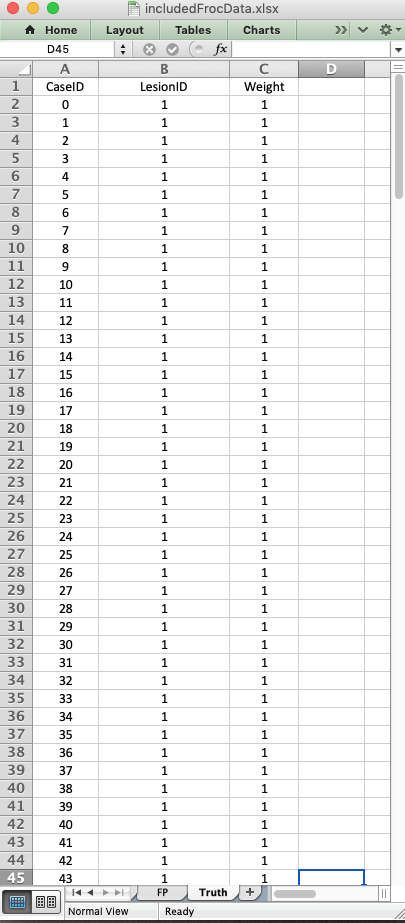{width=40%}{width=40%}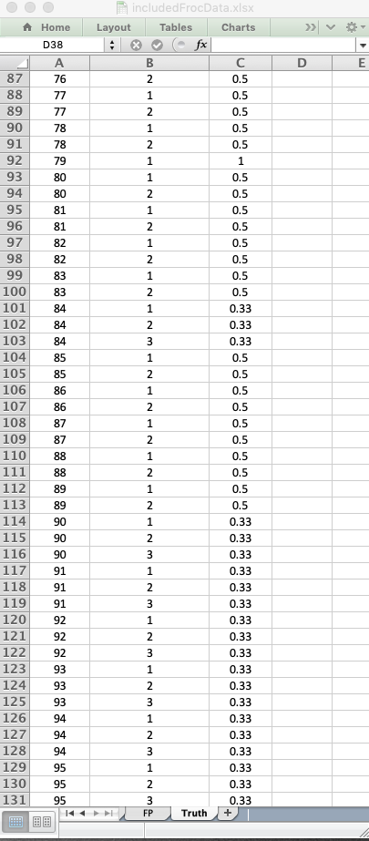{width=40%}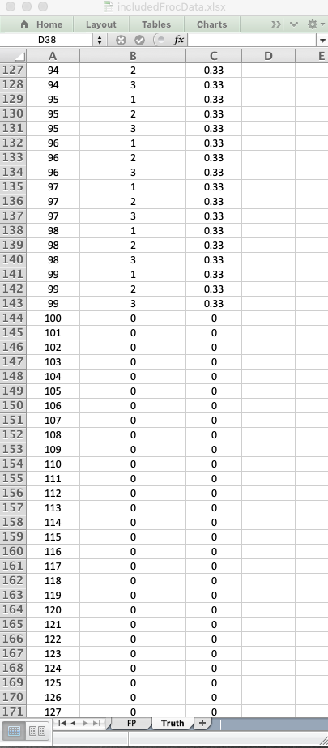{width=40%}

* There are 100 diseased cases (labeled 0-99) under column `CaseID` and 100 non-diseased cases (labeled 109-199). ^[The non-diseased cases numbered 128 - 199 are not shown above. They are similar to the ones that are shown - one row per case with a zero under the lesionID column and a zero under the Weights column.]  
* The `LesionID` field for each non-diseased case is zero and there is one row per case for such cases. __For diseased cases, this field has one or more entries, ranging from 1 to 3 for this particular dataset.__ In other words, for each diseased case, the number of rows equals the number of lesion on the case.
* As an example, there are two rows for `CaseID` = 77: one with `LesionID` = 1 (labeling the first lesion on this case) and one with `LesionID` = 2 (labeling the second and last lesion on this case). The weights of these lesions are explicitly specified to 0.5 each.
* As another example, there are three rows for `CaseID` = 95: one with `LesionID` = 1, one with `LesionID` = 2 and the last with `LesionID` = 3. The weights of these lesions are explicitly specified to be 0.33 each. ^[The sofware performs a check to ensure that the weight sum to unity, in this case 1% error is considered close enough for "government work"!]   
* Alternatively, the `Weights` field can be set to zeroes (for all cases) to more conveniently ensure equal weighting to much higher precision.
* Important: every case must have at least one row describing it in the __Truth__ worksheet.

#### The `FP/NL` worksheet organization
The following screen-shots show different parts of the `FP` worsheet for `dataset04`.

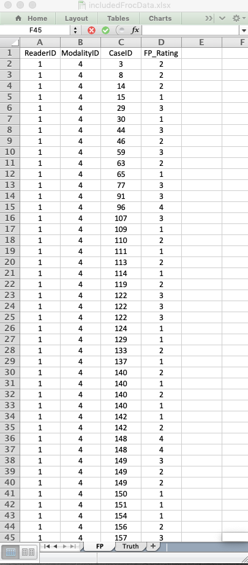{width=40%}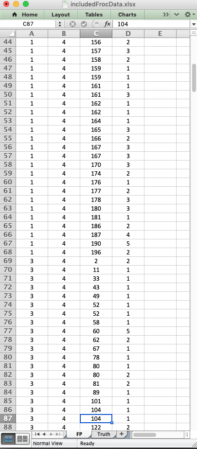{width=40%}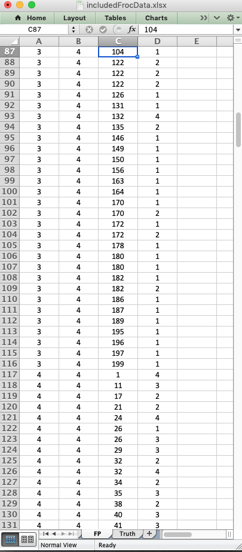{width=40%}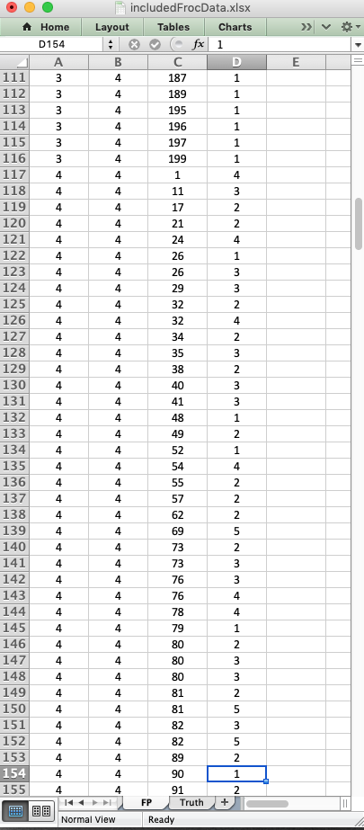{width=40%}

* The `FP` worksheet lists the ratings of `NLs` on both non-diseased and diseased cases. __Unlike the ROC paradigm, `NLs` can occur on diseased cases. Additionally, the number of rows per case cannot be predicted apriori. It could be 0, 1, 2, etc. __
* It is possible that the `FP` worsheet is blank. See [@RN2680] for how the FROC paradigm correctly interprets this situation as indicative of good performance.
* 
  
#### The `TP/LL` worksheet organization
The following screen-shots show different parts of the `TP` worsheet for `dataset04`.

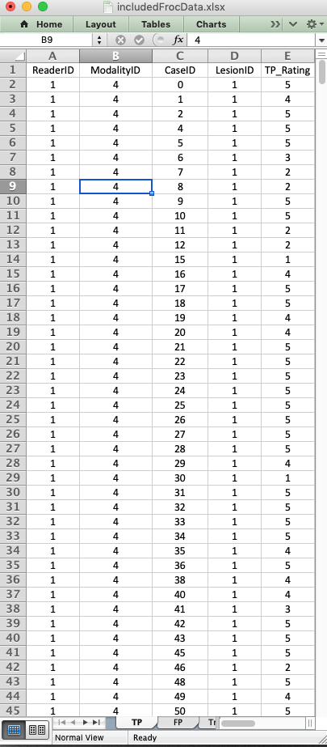{width=40%}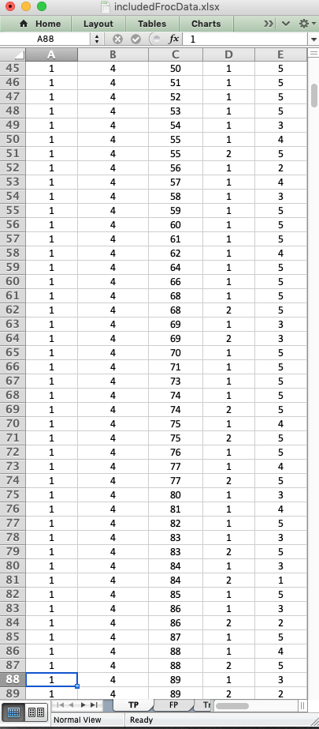{width=40%}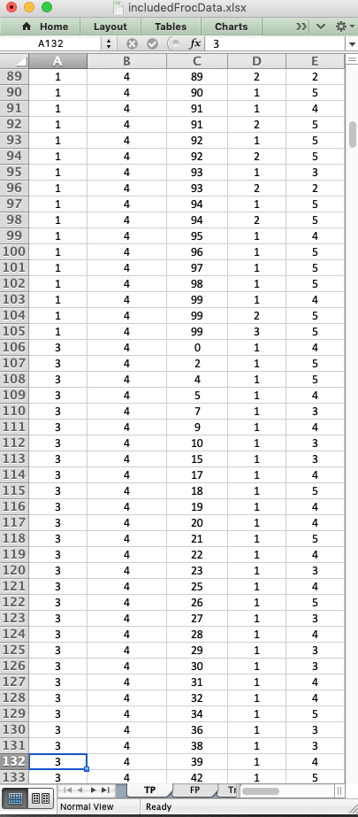{width=40%}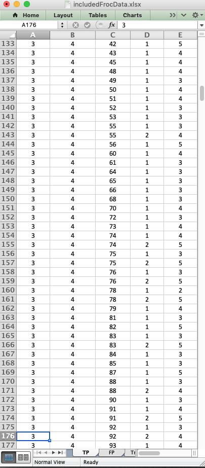{width=40%}

* The `TP`  worksheet lists the ratings of `LLs` on diseased cases. __Unlike the ROC paradigm, `NLs` can occur on diseased cases. Additionally, the number of rows per case cannot be predicted apriori. It could be 0, 1, 2, etc. __
* It is possible (but unlikely) that the `TP` worsheet is blank. See [@RN2680] for how the FROC paradigm correctly interprets this situation as indicative of poor performance.
