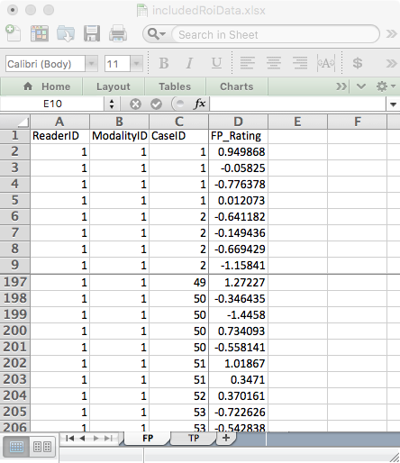

# FROC data format {#frocdataformat}

```{r setup, include = FALSE}
  knitr::opts_chunk$set(
  collapse = TRUE,
  comment = "#>"
  )
  library(RJafroc)
```

## Introduction
* In the free-response ROC (__FROC__) paradigm [@RN85] the observer's task is to indicate (i.e., __mark__ the location of) and __rate__ (i.e., assign an ordered label representing the degree of suspicion) regions in the image that are perceived as suspicious for presence of disease. Accordingly, FROC data consists of __mark-rating pairs__, where each mark indicates a region ^[In order to avoid confusion with the ROI-paradigm, I do not like to use the term ROI to describe the marks made by the observer.] that was considered suspicious for presence of a localized lesion and the rating is the corresponding confidence level. The number of mark-rating pairs on any particular case is a-priori unpredictable. It is a non-negative random integer (i.e., 0, 1, 2, ...) that depends on the case, the reader and the modality. The relatively unstructured nature of FROC data makes  FROC paradigm data seemingly more difficult to analyze than ROC paradigm data ^[I say "seemingly", because the only real difference between ROC and FROC analyses is in the selection of the figure of merit.].
* By adopting a proximity criterion, each mark is classified by the investigator as a lesion localization (LL) - if it is close to a real lesion - or a non-lesion localization (NL) otherwise. 
* The rating can be an integer or quasi- continuous (e.g., 0 – 100), or a floating point value, as long as higher numbers represent greater confidence in presence of one or more lesions in the ROI  ^[As with the ROC paradigm, the directionaliy of the rating is not a limitation.].
* For human observer studies a 5-point rating scale is recommended:
    + 1: Very low, but finite possibility that region is diseased. 
    + 2: Low possibility that region is diseased. 
    + 3: Moderate possibility that region is diseased. 
    + 4: High possibility that region is diseased. 
    + 5: Very high possibility that region is diseased.
* The actual adjectives used to describe the labels are unimportant. What is important is the ordering of the labels and that the observer keeps them relatively constant during the duration of the study.
* With algorithmic readers, e.g., computer aided detection (CAD) algorithms, a floating point rating, if possible, should be retained.
* In the most common study design, termed multiple-reader multiple-case (__MRMC__), the rating collection procedure is repeated for all cases, treatments and readers.

## An actual FROC dataset

An actual FROC dataset [@RN1882] is included as `dataset04`, which has the following structure:
  
```{r}
str(dataset04)
```             

### Overview of the data structure

* The `dataset` structure is a `list` variable with 8 members ^[This is true for ROC, FROC and ROI datasets. LROC datasets have 9 `list` members.].
    + Ratings of non-diseased cases are stored in the `NL` list member.
    + Ratings of diseased cases are stored in the `LL` list member.
    + The `lesionNum` list member is an array of length `r length(dataset04$lesionNum)`, filled with ones. It lists the number of lesions per case, which for ROC data, is always unity. The length of this array equals the number of diseased cases `K2`, see below.
    + The `lesionID` list member is a `[45 x 1]` array, also filled with ones. ^[The second "unnecessary" dimension is necessary for compatibility with FROC datasets.]
    + The `LesionWeight` list member is also a `[45 x 1]` array filled with ones.
    + The `dataType` list member equals the string `"ROC"`, identifying it as an ROC dataset.
    + The `modalityID` list member is a string array identifying the names of the treatments (see below).
    + The `readerID` list member is a string array, identifying the names of the readers  (see below).

Examination of the output reveals that:

* The `dataset` structure is a list with 8 members.
* This is a 5-treatment 4-reader dataset (the lengths of the first and second dimensions, respectively, of the `NL` and `LL` arrays). The names of the treatments are in the `modalityID` array:
* Location-level ratings of non-diseased regions are stored in the `NL` list member of the dataset.
* Location-level ratings of diseased regions are stored in the `LL` list member of the dataset.  

### Details of the `modalityID` and `readerID` list members
* The names of the treatments are in the `modalityID` list member:
```{r}
attributes(dataset04$modalityID)
```

* For example, the name of the second treatment is `"2"`. The names can be longer strings, but use of very long string names may mess up the output formats of the analysis report. 

* The names of the readers are in the `readerID` array:

```{r}
attributes(dataset04$readerID)
```

For example, the name of the second reader is `"3"`. Apparently reader `"2"` "dropped out" of the study. A similar caveat regarding long reader names applies.

### Details of the `NL` and `LL` list members
TBA
* For either `NL` or `LL` list members, the fourth dimension can have length greater than unity.
dfshlajkhfjkahf
* For the `NL` list member this length is determined by the treatment-reader-case combination yielding the most `NL` marks per case.
* For the `LL` list member this length is determined by the case with the most true lesions.
* `dataset02` is a 2-treatment 5-reader dataset (the lengths of the first and second dimensions, respectively, of the `NL` and `LL` list members).


#### Numbers of non-diseased and diseased cases
* TBA
```{r}
length(dataset04$NL[1,1,,1])
length(dataset04$LL[1,1,,1])
```             

* The third dimension of the `NL` array is the total number of __all__ cases, i.e., `r length(dataset04$NL[1,1,,1])`, and the third dimension of the `LL` array,  i.e., `r length(dataset04$LL[1,1,,1])`, is the total number of diseased cases.

* Subtracting the number of diseased cases from the number of all cases yields the number of non-diseased cases.

* Therefore, in this dataset, there are `r length(dataset04$LL[1,1,,1])` diseased cases and `r (length(dataset04$NL[1,1,,1])-length(dataset04$LL[1,1,,1]))` non-diseased cases.

### Why dimension the `NL` array for the total number of cases?
* Because, in addition to `LLs`, `NLs` are possible on diseased cases.
* Only `LLs` are possible on diseased cases.
* Only `NLs` are possible on non-diseased cases.
* The missing values are filled in with `-Inf`.

#### Ratings on a non-diseased case

* For treatment 1, reader 1 and case 1 (the first non-diseased case), the NL ratings are: 
```{r}
dataset04$NL[1,1,1,]
```

#### The meaning of a negative infinity rating
* Obviously, a real rating cannot be negative infinity ^[If an observer is so highly confident in the _absence_ of a localized lesion, he will simply _not mark_ the location in question; if he did, then, logically, he should mark _all_ areas in the image that are definitely not lesions; in the FROC paradigm only regions with a reasonable degree of suspicion are marked. The radiologist only wishes to draw attention to regions that are reasonably suspicious; the definition of "reasonable" is determined by clinical considerations.]. This value is reserved for __missing ratings__, and more generally, __missing marks__ ^[Since there is a one-to-one correspondence between marks and ratings.]. For example, since all values in the above code chunk are negative infinities, this means this treatment-reader-case combination did not yield any mark-rating pairs. This possibility, alluded to above, is only possible with FROC data. All other paradigms (ROC, LROC and ROI) yield at least one rating per case. 
* The length of the fourth dimension of the `NL` array is determined by that treatment-reader-case combination yielding the maximum number of `NLs`. Consider the following chunk:

```{r}
for (i in 1:5) 
  for (j in 1:4) 
    for (k in 1:200) 
      if (all(dataset04$NL[i,j,k,] != -Inf)) 
        cat(i, j, k, all(dataset04$NL[i,j,k,] != -Inf),"\n")
```

* This shows that the fourth dimension of the `NL` array has to be of length 7 because _one, and only reader_, specifically reader "4", made 7 `NL` marks on a diseased case in treatment "5"!

### Ratings on a diseased case
Unlike non-diseased cases, diseased cases can have both `NL` and `LL` ratings.

* For treatment 1, reader 1, case 51 (the 1st diseased case) the NL ratings are: 

```{r}
dataset04$NL[1,1,51,]
dataset04$lesionNum[1]
dataset04$LL[1,1,1,]
mean(is.finite(dataset04$LL))
```

`r dataset04$NL[1,1,51,][is.finite(dataset04$NL[1,1,51,])]`. There are only two finite values because this case has two ROI-level-abnormal regions, and 2 plus 2 makes for the assumed 4-regions per case. The corresponding `$lesionNum` field is `r dataset04$lesionNum[1]`.

```{r}
mean(is.finite(dataset04$NL[,,1:50,]))
dataset04$NL[1,1,51,]
dataset04$lesionNum[1]
dataset04$LL[1,1,1,]
mean(is.finite(dataset04$LL))
```    

```{r}
mean(is.finite(dataset04$NL[,,1:50,]))
dataset04$NL[1,1,51,]
dataset04$lesionNum[1]
dataset04$LL[1,1,1,]
mean(is.finite(dataset04$LL))
```


* The ratings of the 2 ROI-level-abnormal ROIs on this case are `r dataset04$LL[1,1,1,][is.finite(dataset04$LL[1,1,1,])]`. The mean rating over all ROI-level-abnormal ROIs is `r mean(dataset04$LL[is.finite(dataset04$LL)])`.  
```{r}
mean(is.finite(dataset04$NL[,,1:50,]))
dataset04$NL[1,1,51,]
dataset04$lesionNum[1]
dataset04$LL[1,1,1,]
mean(is.finite(dataset04$LL))
```

## The FROC  Excel data file
An Excel file in JAFROC format containing simulated ROI data corresponding to `dataset04`, is included with the distribution. The first command (below) finds the location of the file and the second command reads it and saves it to a dataset object `ds`.  
```{r}
fileName <- system.file(
    "extdata", "includedFrocData.xlsx", package = "RJafroc", mustWork = TRUE)
ds <- DfReadDataFile(fileName)
ds$dataType
```


### The FROC Excel file organization

The `DfReadDataFile` function automatically recognizes that this is an *ROI* dataset. Its structure is similar to the JAFROC format Excel file, with some important differences, noted below. It contains three worksheets: 

#### The Truth worksheet organization


#### The FP/NL worksheet organization


#### The TP/LL worksheet organization


{width=40%}{width=40%}
{width=40%}{width=40%}
{width=40%}


* The `Truth` worksheet - this indicates which cases are diseased and which are non-diseased and the number of ROI-level-abnormal region on each case.  
    + There are 50 normal cases (labeled 1-50) under column `CaseID` and 40 abnormal cases (labeled 51-90).  
    + The `LesionID` field for each normal case (e.g., `CaseID` = 1) is zero and there is one row per case. For abnormal cases, this field has a variable number of entries, ranging from 1 to 4. As an example, there are two rows for `CaseID` = 51 in the Excel file: one with `LesionID` = 2 and one with `LesionID` = 3.   
    + The `Weights` field is always zero (this field is not used in ROI analysis).  

{width=40%}
{width=40%}

* The `FP` (or `NL`)  worksheet - this lists the ratings of ROI-level-normal regions.  
    + For `ReaderID` = 1, `ModalityID` = 1 and `CaseID` = 1 there are 4 rows, corresponding to the 4 ROI-level-normal regions in this case. The corresponding ratings are `r dataset04$NL[1,1,1,][is.finite(dataset04$NL[1,1,1,])]`. The pattern repeats for other treatments and readers, but the rating are, of course, different.  
    + Each `CaseID` is represented in the `FP` worksheet (a rare exception could occur if a case-level abnormal case has 4 abnormal regions).

{width=40%}

* The `TP` (or `LL`) worksheet - this lists the ratings of ROI-level-abnormal regions.  
    + Because normal cases generate TPs, one does not find any entry with `CaseID` = 1-50 in the `TP` worksheet.   
    + The lowest `CaseID` in the `TP` worksheet is 51, which corresponds to the first abnormal case.   
    + There are two entries for this case, corresponding to the two ROI-level-abnormal regions present in this case. Recall that corresponding to this `CaseID` in the `Truth` worksheet there were two entries with `LesionID` = 2 and 3. These must match the `LesionID`'s listed for this case in the `TP` worksheet. Complementing these two entries, in the `FP` worksheet for `CaseID` = 51, there are 2 entries corresponding to the two ROI-level-normal regions in this case.   
    + One should be satisfied that for each abnormal case the sum of the number of entries in the `TP` and `FP` worksheets is always 4.  
