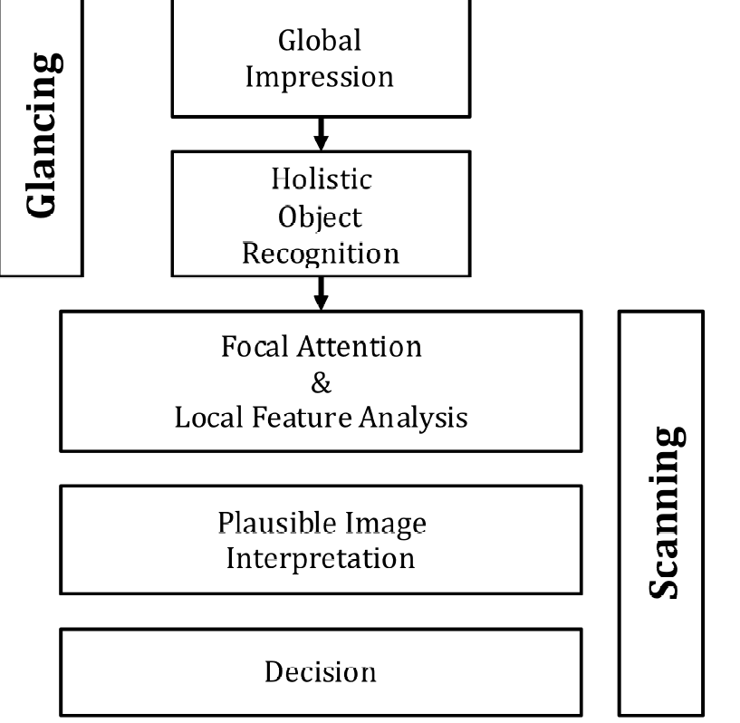
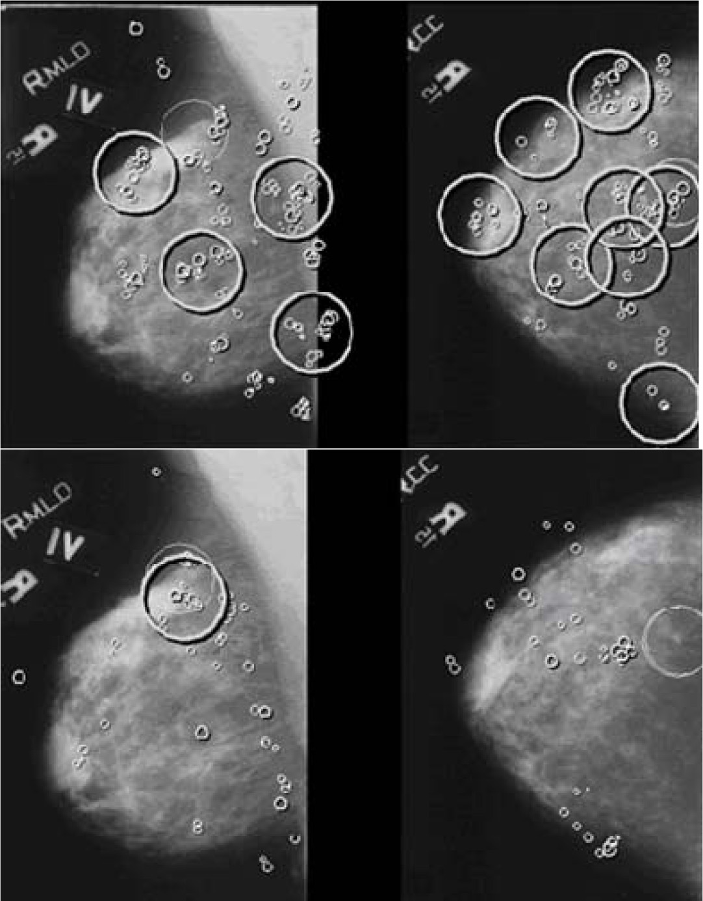

# Visual Search {#visual-search}

## TBA How much finished {#visual-search-how-much-finished}
10%

## Introduction {#visual-search-intro}

To understand free-response data, specifically how radiologists interpret images, one must come to grips with visual search. Casual usage of everyday terms like "search", "recognition" and "detection" in specific scientific contexts can lead to confusion, so in this chapter I will attempt to carefully define them. Visual search, including the medical imaging search task, is defined in a broad sense as grouping and labeling parts of an image. Two experimental methods for studying search are described. The more common method, which is widely used in the non-medical imaging context, consists of showing observers known targets (i.e., known shape and size but unknown location) and known distractors (again, known shapes and sizes but unknown locations). One measures how rapidly the observer can perceive the presence of the target (reaction time) and their accuracy (fraction of correct decisions on target present vs. target absent presentations). In the medical imaging paradigm, one does not know the sizes, shapes and locations of the targets and distractors. Instead, one relies on eye-tracking measurements to determine where the observer is looking and for how long. A clustering algorithm is applied to determine regions that received prolonged examination (dwell time) and presumably are the sites where decisions were made. The focus in this chapter is on the second paradigm, which closely parallels the FROC task. A schema of how radiologists find lesions, termed the Kundel-Nodine search model is described. The importance of this major conceptual model is not widely appreciated by researchers. It is a two-stage model, where the first stage identifies suspicious regions. The second stage analyzes the suspicious regions and if the level of suspicion is high enough, the region is marked. The Kundel-Nodine search model is the basis of the radiological search model (RSM) described in the next chapter. A section is devoted to a recently developed method for analyzing simultaneously acquired eye tracking and FROC data. 

The starting point is the definition of recognition/finding. The following sections draw heavily on work by Nodine and Kundel1-5. The author also acknowledges critical insights gained through conversations with Dr. Claudia Mello-Thoms.

## Grouping and labeling ROIs {#visual-search-grouping-labeling-rois}

Looking at and understanding an image involves grouping and assigning labels to different regions of interest (ROIs) in the image, where the labels correspond to entities that exist (or have existed in the examples to follow) in the real world. As an example, if one looks at Fig. 15.1, one would label them (from left to right and top to bottom, in raster fashion): Franklin Roosevelt, Harry Truman, Lyndon Johnson, Richard Nixon, Jimmy Carter, Ronald Reagan, George H. W. Bush, and the presidential seal. The accuracy of the labeling depends on prior-knowledge, i.e., expertise, of the observer. If one were ignorant about US presidents, one would be unable to correctly label them. 

(\#fig:visual-search-us-presidents)This image consists of 8 sub-images or ROIs. Understanding an image involves grouping and assigning labels to different ROIs, where the labels correspond to entities that exist in the real world. One familiar with US history would label them, from left to right and top to bottom, in raster fashion, Franklin Roosevelt, Harry Truman, Lyndon Johnson, Richard Nixon, Jimmy Carter, Ronald Reagan, George H. Bush and the presidential seal. Labeling accuracy depends on expertise of the observer. The row and column index of each ROI identifies its location.

Image interpretation in radiology is not fundamentally different. It involves assigning labels to an image by grouping and recognizing areas of the image that have correspondences to the radiologist’s knowledge of the underlying anatomy, and, most importantly, deviations from the underlying anatomy. Most doctors, who need not be radiologists, can look at a chest x-ray and say, "this is the heart", "this is a rib", "this is a clavicle", "this is the aortic arch", etc., Fig. 15.2 (A). This is because they know the underlying anatomy, Fig. 15.2 (B) and have a basic understanding of the x-ray image formation physics that relates the anatomy to the image.

(\#fig:visual-search-chest-images)Image interpretation in radiology also involves assigning labels to an image by grouping and recognizing areas of the image that have correspondences to the radiologist’s knowledge of the underlying anatomy. (A) Most doctors can look at a chest x-ray and say, "this is the heart", "this is a rib", "this is the clavicle", "this is the aortic arch", etc. (B) This is because they know the underlying anatomy and have a basic understanding of x-ray image formation physics that relates anatomy to the image.

## Recognition vs. detection {#visual-search-recognition-detection}

The process of grouping and labeling parts of an image is termed recognition. This was illustrated with the pictures of the US presidents, Fig. 15.1. Recognition is distinct from detection, which is deciding about the presence of something that is unexpected or the absence of something that is expected, in other words, a deviation, in either direction, from what is expected. An example of detecting the presence of something that is unexpected would be a lung nodule and an example of detecting the absence of something that is expected would be an image of a patient with a missing rib (yes, it does occur, even excluding the biblical Adam). 

The terms "expected" and "unexpected" are important: they imply expertise dependent expectations regarding the true structure of the non-diseased image, which I term a non-diseased template, and therefore an ability to recognize  clinically relevant deviations or perturbations, in either direction, from this template; e.g., a lung nodule that could be cancer. By "clinically relevant" I mean perturbations related to the patient's health outcome – recognizing scratches, dead pixels, artifacts of know origin, and lead patient ID markers, do not count. There is a location associated with recognition , but not with detection. Detection is the presence or absence of something: the perturbation could be anywhere. For example, in Fig. 15.1, recognizing a face is equivalent to assigning a row and column index in the image. Specifically, recognizing of George H.W. Bush implies pointing to row = two and column = three. Detecting George H.W. Bush implies stating that George H.W. Bush is present in the image, but the location could be in any of the eight locations. Recognition is an FROC paradigm task, while detection is an ROC paradigm task. Instead of recognition, I prefer the more clinical term "finding", as in "finding" a lesion: in the clinic radiologists report "findings".

## Search vs. classification {#visual-search-search-classification}

Since template perturbations can occur at different locations in the images, the ability to selectively recognize them is related to search expertise. The term "selectively" is important: a non-expert can trivially recognize all perturbations by claiming all regions in the image are perturbed. Search expertise is the selective ability to find clinically relevant perturbations that are actually present while minimizing finding what appear to be clinically relevant perturbations that are actually not present. In FROC terminology, search expertise is the ability to find latent LLs while minimizing the numbers of found latent NLs. Lesion-classification expertise is the ability to correctly classify a found suspicious region as malignant or benign. 

The skills required to recognize a nodule in a chest x-ray are different from that required to recognize a low-contrast circular or Gaussian shaped artificial nodule against a background of random noise. In the former instance the skills of the radiologist are relevant: e.g., the skilled radiologist knows not to confuse a blood vessel viewed "end on" for a nodule, especially since the radiologist knows where to expect these vessels, e.g., the aorta. In the latter instance, (i.e., viewing artificial nodules superposed on random noise) there are no expected anatomic structures, so the skills possessed by the radiologist are rendered irrelevant. This is the reason why having radiologists interpret random noise images and pretending that this makes it “clinically relevant” is a waste of reader resources and bad science. One might as well used undergraduates with good eyesight, motivation and training. To quote Nodine and Kundel1 "Detecting an object that is hidden in a natural scene is not the same as detecting an object displayed against a background of random noise." This paragraph also argues against usage of phantoms as stand-ins for clinical images for "clinical" performance assessment. Phantoms are fine in the QC context, as in Chapter 01, but they do not allow radiologists the opportunity to exercise their professional skills.
 

## Two visual search paradigms {#visual-search-two-search-paradigms}
There are two visual search paradigms: what I term the conventional paradigm and the medical imaging paradigm. 

### The conventional paradigm {#visual-search-conventional-paradigm}
In the conventional paradigm, one measures reaction time and percent correct in the following task. Images are shown briefly and followed, after an intersimulus interval, by a mask image (e.g., random noise, to "wipe-out" memory of the preceding image). Each image may contain a defined target in a set of defined distractors. Defined targets and defined distractors mean that their presence and numbers are under the control of the experimenter and the observer, via training images, knows their characteristics (e.g., shapes, sizes, etc.). For example6 a target could be the letter "T" and distractors could be the letter "L". The observer's task is to discriminate between two conditions: (i) target and distractors present and (ii) only distractors present, by pressing a "yes" (target is present) or "no" key. Also measured is the time it takes, from image onset, to make the target-present target-absent decision, termed reaction time. This is by far the most widely used paradigm7,8 (see for example Ref. 7 and the literature cited therein; the paper, cited 2908 times as of 8/18/2016, is an excellent review of this paradigm). Typically measured is the dependence of percent correct and reaction time on set size (defined as the number of distractors). The following example, adapted from Ref. 8, describes an actual study using this paradigm:  

> Stimuli (stimuli = items = distractors plus a possible target) were red and green Xs and Os on a black background. Individual items could be placed at any of 36 locations within a pre-defined square field. On each trial, items were presented at 8, 16, or 32 randomly chosen positions within the square field (thereby varying the set size, i.e., the number of distractors). The target was a red O (in target present images) and distractors were green Os and red Xs. On target present trials, one of the locations contained a target item. Targets were present on 50% of trials. Set size, positions of target and distractors, and presence or absence of a target was random across trials. Subjects responded by pressing one of two keys: a yes key if a target was detected and a no key if it was not. Reaction times were measured from stimulus onset. The stimuli remained visible until the subject responded and feedback was given on each trial.

The results are used to test different models of visual search. In particular, there has been interest in determining if the items are processed in parallel or sequentially. There is, as stated above, a very large literature on this paradigm, or variants of it, and this brief account is given simply to distinguish it from the medical imaging paradigm that follows.

### The medical imaging visual search paradigm {#visual-search-medical-imaging-search-paradigm}

(\#fig:visual-search-eye)Eye position data were recorded using a limbus reflection technique. [Limbus is defined as the border between the cornea (the transparent layer making up the outermost front part of the eye, covering the iris and pupil) and sclera (opaque white of the eye).] Eye movements are measured by having the observer wear a specially designed spectacle frame (newer machines do not require this) containing infrared emitters and sensors that measure changes in light reflected from the border between the iris and sclera.

The key difference is the dependence on eye-tracker technology1,9,10. This is not to imply that users of the conventional paradigm have not used eye-tracker technology. They have, but the medical imaging paradigm is crucially dependent on this technology whereas the conventional paradigm is not.  Eye-tracker technology determines the location and duration of the axis of gaze (i.e., where and for how long the radiologist looks at different locations in the image. The difference between the two paradigms is necessitated by several factors: 
1.	Unlike the conventional paradigm, one does not know the numbers and precise shapes, sizes, contrasts, etc., of true lesions, the "targets" in conventional terminology. These are camouflaged in anatomic noise and are more complex than the "Ts" and "Ls", or "Xs" and "Os", of the conventional method. 
2.	One does not know the numbers and precise shapes, sizes, contrasts, etc., of the "distractors". In fact, the radiologist perceives these and what constitutes a latent NL to one radiologist may not be a latent NL to another. Two radiologists may not even agree on the number of latent NLs on a specific image. Unlike the conventional paradigm, the number of NLs in the medical imaging paradigm must be treated as a radiologist dependent random number.
3.	The medical image paradigm allows for zero latent marks (i.e., no distractors), which has no counterpart in the conventional method. These images are the "unambiguous" non-diseased cases that do not generate any marks.
4.	In medical imaging, one is more interested in objective performance measurements (does a radiologist find the lesion at high confidence?) than in reaction time. 
5.	In addition to eye-tracking data one may acquire ratings data as in the ROC paradigm11, or more recently, mark-rating data, as in the FROC paradigm12,13. If using the ROC method the performance measure (e.g., AUC under ROC curve) is comparable to the percent correct obtained in the conventional paradigm, except that the ROC-ratings method is more efficient14. However, since location of the perceived target or lesion is ignored, the scoring is ambiguous in the sense originally noted by Bunch et al15: i.e., the observer may have not seen the target and mistaken a distractor for the target on a target present image, and that event-combination would be scored as a correct decision. The FROC paradigm accounts for location, thereby ruling out this ambiguity.

Compared to the many papers using the conventional visual search paradigm, research in medical imaging visual search is relatively limited. Prof. Kundel, Prof. Nodine, Prof. Krupinski and Dr. Claudia Mello-Thoms have made major contributions to this field. The following is an example of how data is collected in the medical imaging visual search paradigm16. 
	
Eye position data were recorded using a limbus reflection technique. [Limbus, Fig. 15.3, is defined as the border between the cornea (the transparent layer making up the outermost front part of the eye, covering the iris and pupil) and sclera (opaque white of the eye).] Eye movements are measured by having the observer wear a specially designed spectacle frame (newer machines do not require this) containing infrared emitters and sensors that measure changes in light reflected from the border between the iris and sclera, Fig. 15.3. The viewers were told they had 15 seconds to search the lung fields of each image for the presence of a nodule and additionally to remember the locations of regions suspected of containing a nodule but considered negative. Following the 15-second presentation, the viewers rated each image for presence of disease. 

Eye-position data is collected only during the initial 15 seconds while the radiologist searches the image. One issue with this way of collecting data is that during the reporting phase, a radiologist may discover something new and proceed to investigate this finding, but because eye-position recording has been terminated, that information is not captured. In the data collection methodology used in a recent study13 searching and reporting occur simultaneously with eye-position collection . The newer paradigm more closely resembles clinical practice, and potentially allows one to follow the perceptual and interpretative process entailed in case reading from beginning to end, without researcher-initiated interruptions. 

## Determining where the radiologist looks {#visual-search-determining-where-radiologist-looks}

The eye-tracking (ET) device I am familiar with TBA 17 (ASL Model H6, Applied Sciences Laboratory, Bedford, MA) uses a magnetic head tracker to monitor head position, and this allows the radiologists to freely move their head from side to side as well as towards the displays. The ET system integrates eye position calculated from limbus-reflection, and head position, to calculate the intersection of the line of gaze and the display plane. The data stream (raw-data) provided by the eye-tracker consists of several bytes of data at 60Hz, containing the (x,y) coordinates of where the observer is looking plus various flag bits (e.g., indicating blinks). The eye moves in rapid jumps (saccades) with intervening longer pauses (fixations). The eye-movement induced reflectance changes are converted to display coordinates, which indicate the locations and durations of fixations. Fixations occurring in clusters indicate where attention is being directed and decisions are made. The raw-data needs to be processed, Appendix 15A, to determine regions where decisions were made; the processing, which is guided by models of human perception, does depend on the researcher.

## The Kundel - Nodine search model {#visual-search-kundel-nodine-model}

The Kundel-Nodine model1-5 is a schema of events that occur from the radiologist's first glance to the decision about the image. The model is similar to the guided search model7,8,18 proposed by Prof. Jeremy Wolfe in the non-medical imaging context. 

Assuming the task has been defined prior to viewing, based on eye-tracking recordings obtained on radiologists while they interpreted images, Kundel and Nodine proposed the following schema for the diagnostic interpretation process, consisting of two major  components: (1) glancing or global impression and (2) scanning or feature analysis, Fig. 15.4.

(\#fig:visual-search-kundel-nodine)The Kundel-Nodine 2-stage model of radiological search. The glancing/global stage identifies perturbations from the template of a generic non-diseased case. The scanning stage performs detailed analysis of the identified perturbations and calculates the probability that the perturbation is a true lesion. Only perturbations with sufficiently high probability are marked/reported.

### Glancing / Global impression {#visual-search-glancing-global-impression}
The colloquial term "glancing" is meant literally . The glance is brief, typically lasting about 100 - 300 ms, too short for detailed foveal examination and interpretation. Instead, during this brief interval peripheral vision and reader expertise are the primary mechanisms responsible for the identification of latent marks. The glance results in a global impression, or gestalt, that identifies perturbations from the template defined earlier. Object recognition occurs at a holistic level, i.e., in the context of the whole image, as there is insufficient time for detailed viewing and all of this is going on using peripheral vision. It is remarkable that radiologists can make reasonably accurate interpretations from information obtained in a brief glance (Fig. 6 in Ref. 1). Suspicious regions, which are perturbations from the template, are flagged for subsequent detailed viewing, i.e., the initial glance tells the visual system where to look more closely. See Chapter 12, section on "solar" analogy, for further background on this important aspect of vision. Since eye-tracking technology does not measure peripheral vision, the locations of the perturbations need to be inferred from the scanning stage described next.

### Scanning / local feature analysis {#visual-search-scanning-local-feature-analysis}

The global impression identifies suspicious regions for detailed foveal viewing by the central vision19. During this process - termed scanning or feature analysis - the observer scrutinizes  and analyzes the suspicious regions for evidence of possible disease.  In principle, they calculate the probability of malignancy. For those readers more familiar with how CAD works, this corresponds to the feature analysis stage of CAD where regions found by the global search, termed initial detections in CAD, are analyzed for probability of malignancy. The scrutiny is conducted via clusters of closely spaced fixations. In the absence of closely spaced fixations or retinal jitter, in a laboratory condition known as retinal stabilization, perceptions tend to rapidly fade away20. Perception is sensitive to temporal changes; it there is a high-pass temporal filter that suppresses stationary features, so that changes from it are quickly perceived, no doubt a result of evolution. The evidence is used to decide whether to report the region. The corresponding locations are the "big-clusters" in Fig. 15.A.1 (C) in the online appendix. After places identified during the global impression have been scrutinized, the viewer may follow the same scanning pattern aimed at discovering something that was missed, or, may simply scan at random while thinking about the image.

The fixations that cluster at perturbations are collecting data necessary to test for the presence of a lesion. If testing yields a sufficiently high probability of lesion, a decision is made to report the lesion. If testing is negative or inconclusive, search continues. Thus, the report “normal chest” is an overall impression based on a series of local decisions that are needed because the relevant anatomic features can only be resolved by foveal vision. The viewer is not aware of all of the decisions, positive and negative, made during scanning . The eye-tracking record however, reveals where the eye lingered, providing indirect evidence about where covert decisions were made. However, as noted earlier, the eye-tracking record does not include perturbations perceived by peripheral vision. It is believed that prolonged or multiple fixations that cluster on image detail signal the testing and decision-making activity associated with the interpretation of anatomical perturbations that have potential as tumor targets. This is the reason for the use, in Appendix 15A, of a total dwell time of 800 ms to determine where decisions occurred. The value is somewhat arbitrary and investigator dependent.

The essential point that emerges is that decisions are made at a finite, relatively small, number of regions. Attention units are not uniformly distributed through the image, in raster-scan fashion; rather the global impression identifies a smaller set of regions that require detailed scanning.

Eye-tracker recordings for a two-view digital mammogram for two observers are shown in Fig. 15.3, for an inexperienced observer (upper two panels) and an expert mammographer (lower two panels). The small circles indicate individual fixations (dwell time ~ 100 ms). The larger high-contrast circles indicate clustered fixations (cumulative dwell time ~ 1 s). The larger low-contrast circles indicate a mass visible on both views. The inexperienced observer finds many more suspicious regions than does the expert mammographer but misses the lesion in the MLO view. In other words, the inexperienced observer generates many latent NLs but only one latent LL. The mammographer finds the lesion in the MLO view, which qualifies as a latent LL, without finding suspicious regions in the non-diseased parenchyma, i.e., the expert generated zero latent NLs on this case and one latent LL. It is possible the observer was so confident in the malignancy found in the MLO view that there was no need to fixate the visible lesion in the other view - the decision had already been made to recall the patient for further imaging.

(\#fig:visual-search-eye-tracking)Eye-tracking recordings for a two-view digital mammogram: see details.

**Details:** Eye-tracking recordings for a two-view digital mammogram display for two observers, an inexperienced observer (upper two panels) and an expert mammographer (lower two panels). The small circles indicate individual fixations (dwell time ~ 100 ms).  The larger high-contrast circles indicate clustered fixations (cumulative dwell time ~ 1 sec). The latter correspond to the latent marks in the search-model. The larger low-contrast circles indicate a mass visible on both views. The inexperienced observer finds many more suspicious regions than does the expert mammographer but misses the lesion in the MLO view. In other words the inexperienced observer generates many latent NLs but only one latent LL. The mammographer finds the lesion in the MLO view, which qualifies as a latent LL, without finding suspicious regions in the non-diseased parenchyma, i.e., the expert generated zero latent NLs on this case and one latent LL. It is possible the observer was so confident in the malignancy found in the MLO view that there was no need to fixate the visible lesion in the other view - the decision had already been made to recall the patient for further imaging, which confirmed the finding.

## Kundel-Nodine model and CAD algorithms {#visual-search-Kundel-Nodine-model-CAD}

It turns out that the designers of CAD algorithms independently arrived at a two-stage process remarkably similar to that described by Kundel-Nodine for radiologist observers. CAD algorithms are designed to emulate expert radiologists, and while this goal is not yet met, these algorithms are reasonable approximations to radiologists, and include the critical elements of search and localization that are central to clinical tasks. CAD algorithms involve two steps analogous to the holistic and cognitive stages of the Kundel-Nodine visual search model1,3,4.  In other words, CAD has a perceptual correspondence to human observers that to my knowledge is not shared by other method of predicting what radiologists will call on clinical images.

In the first stage of CAD, termed initial detections21, the algorithm finds "all reasonable" regions that could possibly be a malignancy. The term "all reasonable" is used because an unreasonable observer could trivially "find" every malignancy by marking all regions of the image. A reasonable observer preferably marks lesions while minimizing marking other regions. Therefore, the idea of CAD's initial detection stage is to find many of the malignancies as possible while not finding too many non-diseased regions. This corresponds to the search stage of the Kundel-Nodine model and the RSM. Unfortunately, CAD is rather poor at this task compared to expert radiologists. Progress in this area has been stymied by lack of understanding of search and how to measure performance in the FROC task. Indeed a widely held misconception is that CAD is perfect (!) at search, because it "looks at" everything (Dr. Ron Summers, NIH, private communication, Dublin, ca. 2010). In giving equal attention units to all parts of the image, CAD will trivially find all cancers, but it will also find a large number of NLs. Expert radiologists do not give equal attention units to all parts of the image. They are particularly good at giving more attention units to cancers than the surround, especially for the mass detection task, Fig. 15.3. Measuring search performance is addressed in Chapter 17. 

CAD researchers are, in my opinion, at the forefront of those presuming to understand how radiologists interpret cases. They work with real images and real lesions and the manufacturer's reputation is on the line, just like a radiologist's, and Medicare even reimburses CAD interpretations. While their current track record is not that good for breast masses compared to expert radiologists, with proper understanding of what is limiting CAD, namely the search process, there is no doubt in my opinion, that future generations CAD algorithms will approach and even surpass expert radiologists. 

## Simultaneously acquired eye-tracking and FROC data {#visual-search-eye-tracking-froc}

Studies of medical image interpretation have focused on either assessing radiologists’ performance using, for example, the receiver operating characteristic (ROC) paradigm, or assessing the interpretive process by analyzing eye-tracking (ET) data. Analysis of ET data has not benefited from threshold-bias independent figures-of-merit (FOMs) analogous to the area under the ROC curve. In essence, research in this field is restricted to sensitivity/specificity analysis, and ignoring the benefits of accounting for their anti-correlation (recall the study by Beam et al that showed large decrease in inter-reader variability when AUC was used as a figure of merit instead of sensitivity or specificity, Fig. 3.6 and Table 3.3). A recent study13 demonstrated the feasibility of such FOMs and measured agreement between figures-of-merit derived from free-response ROC (FROC) and ET data. A pre-publication copy, Analysis of simultaneously acquired ET-FROC data.pdf, is included in the online supplemental material. This section summarizes the salient points.

### FROC and Eye-Tracking Data Collection {#visual-search-eye-tracking-froc-data}

The data collection is shown schematically in Fig. 15.7. A head-mounted eye-position tracking system was worn that used an infrared beam to calculate line-of-gaze by monitoring the pupil and the corneal reflection. A magnetic head tracker was used to monitor head position, and this allows the radiologists to freely move their head. The eye-tracker integrates eye-position and head position to calculate the intersection of the line of gaze and the display plane. 

(\#fig:visual-search-eye-tracking-froc)Schematic of the data collection and processing to obtain real and eye-tracking marks: the radiologists interpreted the images using a two-monitor workstation. Concurrently, and for the duration of the interpretation, an ASL eye-position tracking system determined the line-of-gaze. The ASL fixation and clustering algorithms are described in the text. The proximity criterion, defined as 2.5° of visual angle, is the maximum distance between a lesion center and a mark for the mark to be considered a LL (correct localization). Non-lesion localizations are all other marks. ASL = Applied Sciences Laboratory; NL = non-lesion localization; LL = lesion localization. Reproduced, with permission, from Ref. 13.

The computer automatically captured the following information:
i.	The (x,y) location of marks made by the radiologists. Each mark was compared to the locations of the actual lesion and classified as FROC lesion localization (FROC-LL) if it fell within 2.5° (the proximity criterion) of visual angle (roughly 200 pixels). Otherwise, it was classified as FROC non-lesion localization (FROC- NL).
ii.	The confidence level (rating) for each mark. 
iii.	Time-stamped, raw eye-position data collected during the entire time that the radiologists were examining the case. This data, which was acquired at 60 frames per second, included flags to indicate when image manipulation activities (such as marking, rating or window/level adjustments) and blinks occurred. The flagged data frames were excluded from analysis.

Eight expert breast radiologists interpreted a case set of 120 two-view mammograms while eye-tracking (ET) data and FROC data were continuously collected during the interpretation interval. Regions that attract prolonged (>800ms) visual attention, using the algorithm in Appendix 15A, were considered to be eye-tracking marks. Based on the dwell and approach-rate (inverse of time-to-hit) eye-tracking ratings were assigned to each ET-mark. The ET- ratings were used to define threshold-bias independent FOMs in a manner analogous to the area under the trapezoidal alternative FROC (AFROC) curve (0 = worst, 1 = best). Agreement between ET FOM and FROC FOM was measured (0.5 = chance, 1 = perfect) using the jackknife and 95% confidence intervals (CI) for the FOMs and agreement were estimated using the bootstrap.

### Measures of Visual Attention {#visual-search-measures-visual-attention}

At each big cluster location the following eye-position quantities were calculated:
i.	Dwell time (D): this was defined as the cumulative gaze in seconds of all fixations that comprised the big-cluster with total dwell exceeding 800 ms. 
ii.	Approach-rate (A): this was defined as the reciprocal (s-1) of shortest time-to-hit a big-cluster with total dwell exceeding 800 ms, i.e., approach the center of the big-cluster to within 2.5°. The reciprocal is taken to maintain a common directionality. In most cases greater perceptual attention is expected to be accompanied by greater approach-rate and larger values of dwell (the exception to this occurs for very large lesions, which “pop-out” from the surrounding background but do not need much cognitive processing to be resolved – in this case, dwell is not expected to be long).
Dwell time has been linked to the amount of cognitive processing at a given location, and a dwell threshold has been proposed to separate the different types of errors5. Approach-rate can be thought of as a perceptual measure of how much a perceived area “pops-out” from the background, and it has been shown to be significantly related to the likelihood that a given breast cancer will be reported by radiologists22, with greater approach-rates being related to correct decisions23.

### Generalized ratings {#visual-search-generalized-ratings}

The eye tracking paradigm is conceptually similar to the FROC paradigm in the sense that both yield decisions at locations found by the observer. In effect, the big-clusters can be regarded as eye-tracking marks. In the FROC paradigm the observer marks regions that are considered sufficiently suspicious for presence of a lesion, and the degree of suspicion is recorded as a conscious rating. Analogously, eye-tracking yields the locations of regions that attracted visual attention long enough to allow a decision to be made at the location (the big-clusters), and for each region, there is a dwell time and an approach-rate. Dwell and approach-rate can be regarded as generalized (unconscious) ratings. Just as a figure-of-merit can be defined from FROC mark-rating data, likewise figures-of-merit can be defined from the eye tracking marks and generalized ratings. Details are in Appendix 15B, where three figures-of-merit are defined,     and  , where R stands for ratings, D for dwell and A for approach-rate and j is the reader index. These are analogous to the AFROC AUC (since the dataset contained only one lesion per diseased case, these are the same as the wAFROC AUC). The range of each figure-of-merit is from zero to unity. 

A jackknife-based method for measuring individual case-level agreement between any pair of figures-of-merit is described in Appendix 15C. Defined there are  ,  and   which measure agreement between ratings and dwell, dwell and approach-rate and ratings and approach-rate, respectively. Each agreement measure ranges from 0.5 (chance level agreement) to one (perfect agreement). A bootstrap-based method for obtaining confidence intervals for figures-of-merit and agreements is described in Appendix 15D. The two-sided Wilcoxon signed rank test was used to measure the significance of differences between matched pairs of variables, one pair per reader, such as numbers of marks, ratings, figures-of-merit and agreements.

The AFROC mark-ratings FOM was largest 0.734, CI = (0.65, 0.81) followed by the dwell 0.460 (0.34, 0.59) and then by the approach-rate FOM 0.336 (0.25, 0.46). The differences between the FROC mark-ratings FOM and the perceptual FOMs were significant (p < 0.05). All pairwise agreements were significantly better then chance: ratings vs. dwell 0.707 (0.63, 0.88), dwell vs. approach-rate 0.703 (0.60, 0.79) and rating vs. approach-rate 0.606 (0.53, 0.68). The agreement between ratings vs. approach-rate was significantly smaller than that between dwell vs. approach-rate (p = 0.008).

This brief description shows how methods developed for analyzing observer performance data could be leveraged to complement current ways of analyzing ET data and lead to new insights.

## Discussion / Summary {#visual-search-discussion-summary}
This chapter has introduced the terminology associated with a search task: recognition/finding, classification, and detection. Search involves finding lesions and correctly classifying them, so two types of expertise are relevant: search expertise is the ability to find (true) lesions without finding non-lesions, while classification accuracy is concerned with correct classification (benign vs. malignant) of a suspicious region that has already been found. Quantification of these abilities is described in the next chapter. Two paradigms are used to measure search, one in the non-medical context and the other, the focus of this book, in the medical context. The second method is based on the eye tracking measurements performed while radiologists perform quasi-clinical tasks (performing eye-tracking measurements in a true clinical setting is difficult). A method for analyzing eye-tracking data using methods developed for FROC analysis has been described. It has the advantage of taking into account information present in eye-tracking data, such as dwell time and approach rate, in a quantitative manner, essentially by treating them as eye-tracking ratings to which modern FROC methods can be applied. The Kundel-Nodine model of visual search in diagnostic imaging was described. The next chapter describes a statistical parameterization of this model, termed the radiological search model (RSM).

## References {#visual-search-references}
Nodine CF, Kundel HL. Using eye movements to study visual search and to improve tumor detection. RadioGraphics. 1987;7(2):1241-1250.
2.	Kundel HL, Nodine CF, Conant EF, Weinstein SP. Holistic Component of Image Perception in Mammogram Interpretation: Gaze-tracking Study. Radiology. 2007;242(2):396-402.
3.	Kundel HL, Nodine CF. Modeling visual search during mammogram viewing. Proc SPIE. 2004;5372:110-115.
4.	Kundel HL, Nodine CF. A visual concept shapes image perception. Radiology. 1983;146:363-368.
5.	Kundel HL, Nodine CF, Carmody D. Visual scanning, pattern recognition and decision-making in pulmonary nodule detection. Invest Radiol. 1978;13:175-181.
6.	Horowitz TS, Wolfe JM. Visual search has no memory. Nature. 1998;394(6693):575-577.
7.	Wolfe JM. Guided Search 2.0: A revised model of visual search. Psychonomic Bulletin & Review. 1994;1(2):202-238.
8.	Wolfe JM, Cave KR, Franzel SL. Guided search: an alternative to the feature integration model for visual search. Journal of Experimental Psychology: Human perception and performance. 1989;15(3):419.
9.	Carmody DP, Kundel HL, Nodine CF. Performance of a computer system for recording eye fixations using limbus reflection. Behavior Research Methods & Instrumentation. 1980;12(1):63-66.
10.	Duchowski AT. Eye Tracking Methodology: Theory and Practice. Clemson, SC: Clemson University; 2002.
11.	Nodine C, Mello-Thoms C, Kundel H, Weinstein S. Time course of perception and decision making during mammographic interpretation. AJR. 2002;179:917-923.
12.	Nodine CF, Kundel HL, Mello-Thoms C, et al. How experience and training influence mammography expertise. Acad Radiol. 1999;6(10):575-585.
13.	Chakraborty DP, Yoon H-J, Mello-Thoms C. Application of threshold-bias independent analysis to eye-tracking and FROC data. Academic radiology. 2012;19(12):1474-1483.
14.	Burgess AE. Comparison of receiver operating characteristic and forced choice observer performance measurement methods. Med Phys. 1995;22(5):643-655.
15.	Bunch PC, Hamilton JF, Sanderson GK, Simmons AH. A Free-Response Approach to the Measurement and Characterization of Radiographic-Observer Performance. J of Appl Photogr Eng. 1978;4:166-171.
16.	Kundel HL, Nodine CF, Krupinski EA. Searching for lung nodules: visual dwell indicates locations of false-positive and false-negative decisions. Investigative Radiology. 1989;24:472-478.
17.	Chakraborty DP, Yoon H-J, Mello-Thoms C. Application of threshold-bias independent analysis to eye-tracking and FROC data. Academic Radiology. 2012;In press.
18.	Wolfe JM. Visual Search. In: Pashler H, ed. Attention. London, UK: University College London Press; 1998.
19.	Larson AM, Loschky LC. The contributions of central versus peripheral vision to scene gist recognition. Journal of Vision. 2009;9(10):6-6.
20.	Pritchard RM, Heron W, Hebb DO. Visual perception approached by the method of stabilized images. Canadian Journal of Psychology/Revue canadienne de psychologie. 1960;14(2):67.
21.	Edwards DC, Kupinski MA, Metz CE, Nishikawa RM. Maximum likelihood fitting of FROC curves under an initial-detection-and-candidate-analysis model. Med Phys. 2002;29(12):2861-2870.
22.	Kundel HL, Nodine CF, Krupinski EA, Mello-Thoms C. Using Gaze-tracking Data and Mixture Distribution Analysis to Support a Holistic Model for the Detection of Cancers on Mammograms. Academic Radiology. 2008;15(7):881-886.
23.	Mello-Thoms C, Hardesty LA, Sumkin JH, et al. Effects of lesion conspicuity on visual search in mammogram reading. Acad Radiol. 2005;12:830-840.

