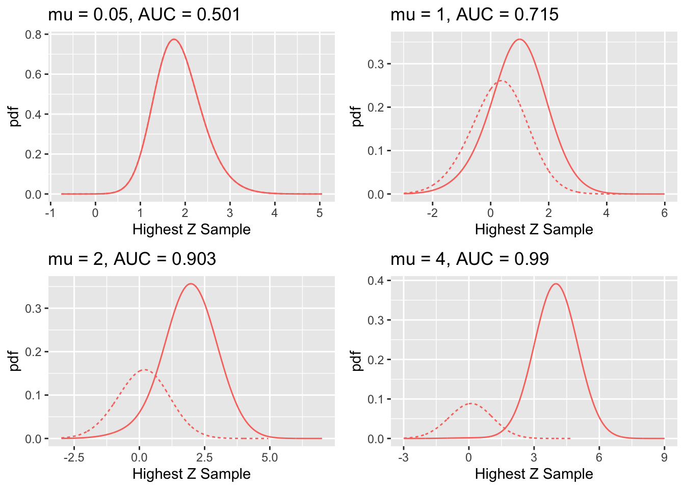
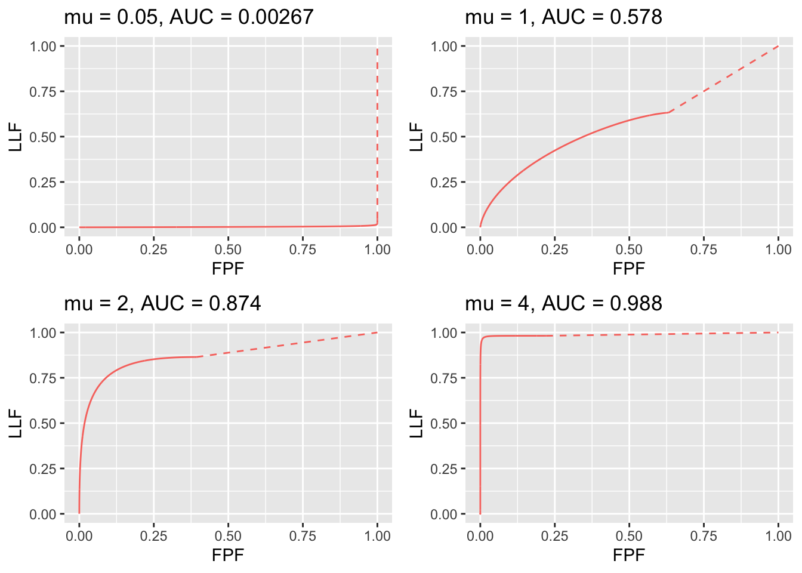

# Radiological search model predictions {#rsm-predictions}


## Introduction {#rsm-predictions-intro}

The preceding chapter described the radiological search model (RSM) for FROC data. This chapter describes predictions of the RSM and how they compare with evidence. The starting point is the inferred ROC curve. While mathematically rather complicated, the results are important because they are needed to derive the ROC-likelihood function, which is used to estimate RSM parameters from ROC data in TBA Chapter 19. The preceding sentence should lead the inquisitive reader to the question: *since the ROC paradigm ignores search, how is it possible to derive parameters of a model of search from the ROC curve?* The answer is that the *shape* of the ROC curve contains information about the RSM parameters. It is fundamentally different from predictions of all conventional ROC models: binormal [@RN1081], contaminated binormal model [@RN1501], bigamma [@RN100] and proper ROC [@RN1499], namely it has a *constrained end-point property*, while all other models predict that the *end-point*, namely the uppermost non-trivial point on the ROC, reached at infinitely low reporting threshold, is (1,1), while the RSM predicts it does not reach (1,1). The nature of search is such that the limiting end-point is constrained to be below and to the left of (1,1). This key difference, allows one to estimate search parameters from ROC data. Next, the RSM is used to predict FROC and AFROC curves. Two following sections show how search performance and lesion-classification performance can be quantified from the location of the ROC end-point. Search performance is the ability to find lesions while avoiding finding non-lesions, and lesion-classification performance is the ability, having found a suspicious region, to correctly classify it; if classified as a NL it would not be marked (in the mind of the observer every mark is a potential LL, albeit at different confidence levels). Note that lesion-classification is different from classification between diseased and non-diseased cases, which is measured by the ROC-AUC. Based on the ROC/FROC/AFROC curve predictions of the RSM, a comparison is presented between area measures that can be calculated from FROC data, and this leads to an important conclusion, namely the FROC curve is a poor descriptor of search performance and that the AFROC/wAFROC are preferred. This will come as a surprise (shock?) to most researchers somewhat familiar with this field, since the overwhelming majority of users of FROC methods, particularly in CAD, have relied on the FROC curve. Finally, evidence for the validity of the RSM is presented. 

## Inferred integer ROC ratings {#rsm-predictions-details-inferred-roc}
Consider a $R_{\text{FROC}} \geq 1$ rating FROC study with allowed ratings $r = 1, 2, ..., R_{\text{FROC}}$. In Chapter TBA 13, the inferred-ROC rating of a case was defined as the rating of the highest rated mark on a case or $-\infty$, if the case has no marks. Since a $-\infty$ rating is inconvenient notation at best and the ratings are ordered labels, the corresponding integer rating is defined to be ROC:1. No ordering information is lost provided every other rating is also "bumped up" by unity. Therefore, the integer inferred ROC scale extends from one to $R_{\text{FROC}} + 1$. Thus, a $R_{\text{FROC}}$ rating FROC study formally corresponds to a $R_{\text{FROC}} + 1$ rating ROC study. 

Henceforth the word "inferred" will be implicit when referring to an RSM-predicted ROC curve.

In addition, instead of referring to FP and TP ratings, in this chapter it will be more convenient to use the symbol $h_{k_t t}$ to denote the rating of the highest rated z-sample on case $k_t t$ with truth state $t$. Thus $h_{k_1 1}$ refers to the highest rating on a non-diseased case $k_1 1$ and $h_{k_2 2}$ refers to the highest rating on diseased case $k_2 2$. For non-diseased cases, the maximum is over all latent NLs on the case. For diseased cases, the maximum is over all latent NLs *and* latent LLs on the case. 

Reiterating, the integer ROC rating is the one-incremented highest FROC rating of the case, or ROC:1 if the case has no marks. 

As before, when there is a possibility of confusion, one precedes the rating with the applicable paradigm. Formally, consider a set of ordered thresholds $\zeta_r < \zeta_{r+1}$ and dummy thresholds defined by $\zeta_0 = -\infty,  \zeta_{\text{FROC}+1} = \infty$, then, if $\zeta_r \leq h_{k_t t} < \zeta_{r+1}$ the case is rated $r$. As an example, if $h_{k_t t} < \zeta_{1}$ the case is rated ROC:1. 

### Comments {#rsm-predictions-details-inferred-roc-comments}
* Since $r = 1, 2, ..., R_{\text{FROC}}$ the lowest allowed ROC rating on a case with at least one mark is ROC:2. 
* On a case with no marks or the highest rated latent site satisfies $h_{k_t t} < \zeta_{1}$ the observer gives the ROC:1 rating. From the analyst's point of view, one cannot distinguish between whether the ROC:1 rating was the result of the case not having any marks or the case had at least one latent site, but none of the z-samples exceeded $\zeta_{1}$.

A consequence of the possibility that some cases have no marks is that all RSM-predicted operating characteristics share a *constrained end-point property*, which is the next topic.

## Constrained end-point property {#rsm-predictions-constrained-end-point}

The full range of ROC space, i.e., $0 \leq FPF(\zeta) \leq 1$ and $0 \leq TPF(\zeta) \leq 1$, is not continuously accessible to the observer. In fact, $0 \leq FPF(\zeta) \leq FPF_{max}$ and $0 \leq TPF(\zeta) \leq TPF_{max}$ where $FPF_{max}$ and TPF_{max} are each generally less than (or, in special cases, equal to) unity. Therefore, $\left (FPF_{max}, TPF_{max} \right )$ represents a constraint on the end-point; the abscissa of the end-point has to be smaller than or equal to $FPF_{max}$ and the ordinate has to be smaller than or equal to $TPF_{max}$.  

*Starting from a finite value, as $\zeta_1$ is lowered to $-\infty$, some of the previously ROC:1 rated cases that had at least one latent site will be marked and "bumped-up" to the ROC:2 bin, until eventually only cases with no marks remain in the ROC:1 bin: these cases will never be rated ROC:2. A rational observer who finds no suspicious regions, literally nothing to report, will assign the lowest available bin to the case, which happens to be ROC:1. The finite number of cases in the ROC:1 bin at infinitely low threshold has the consequence that the uppermost non-trivial continuously accessible operating point – that obtained by cumulating ratings ROC:2 and above, is below and to the left of (1,1). The (1,1) point is reached "trivially" when the researcher cumulates the counts in all bins, i.e., ROC:1 and above. This behavior is distinct from traditional ROC models where the entire curve extending from (0, 0) to (1, 1) is continuously accessible to the observer. This is because in conventional models every case yields a finite decision variable, no matter how small. Lowering the lowest threshold to $-\infty$ eventually moves all cases in the previously ROC:1 bin to the ROC:2 bin, and one is eventually left with zero counts in the ROC:1 bin, and the operating point, obtained by cumulating bins ROC:2 and above, is (1,1).* 

In the RSM, starting with an infinitely high threshold, as the observer is encouraged to be more "aggressive in reporting lesions", the ROC point moves continuously upwards and to the right from (0, 0) to $\left (FPF_{max}, TPF_{max} \right )$ and no further. The ROC curve cannot just “hang there” since cumulating all cases yields the “trivial” (1,1) operating point. Therefore, the complete ROC curve is obtained by extending the end-point using a dashed line that connects it to (1,1). The observer cannot operate along the dashed line.  See further elaboration of this point, in particular why guessing to operate along the dashed line, is not an option, in TBA §17.12.1.
 
How closely the observer approaches the limiting point $\left (FPF_{max}, TPF_{max} \right )$ is unrelated to the number of bins; rather, it depends on the position of the lowest threshold, i.e., $\zeta_1$. As the latter is lowered the observed end-point approaches $\left (FPF_{max}, TPF_{max} \right )$ from below. How closely $\left (FPF_{max}, TPF_{max} \right )$ approaches (1,1) depends on $\lambda'$ and $\nu'$. As $\lambda'$ and $\nu'$ increase, the limiting point  approaches (1,1) from below, see TBA Eqn. (17.1) and Eqn. TBA (17.2). These parameters determine the probability that a case has one or more marks, and depending on the truth-state of case, non-diseased or diseased, these probabilities equal $FPF_{max}$ or $TPF_{max}$, respectively, both of which increase to unity as $\lambda'$ and $\nu'$ increase.


### The abscissa of the ROC end-point {#rsm-predictions-constrained-end-point-abscissa}
One needs the probability that a non-diseased case has at least one latent NL. Such a case will generate a finite value of $h_{k_1 1}$ and with an appropriately low $\zeta_1$ the case will be rated ROC:2 or higher. The probability of zero latent NLs, see TBA Eqn. 16.2, is:  

$$\text{pmf}_{Poi} \left (0,\lambda' \right )$$.

Therefore the probability that the case has at least one latent NL, which is the maximum continuously accessible abscissa of the ROC, is: 

\begin{equation} 
\text{FPF}_{max} = 1 - exp \left ( -\lambda' \right ) = 1 - exp\left ( \frac{-\lambda}{\mu} \right )
(\#eq:rsm-predictions-fpf-max)
\end{equation}


The second form on the right hand side of Eqn. \@ref(eq:rsm-predictions-fpf-max) expresses the result in terms of *intrinsic* RSM parameters (the $\mu$ independent $\lambda, \nu$ parameters; not the physical ones, see section on model re-parameterization in TBA §16.4). As $\mu$ increases $FPF_{max}$ moves to the left, reaching zero in the limit $\mu = \infty$. Recall the by now familiar "solar" analogy in TBA Chapter 12. For fixed $\mu > 0$ increasing $\lambda$ causes $FPF_{max}$ to move to the right approaching one in the limit $\lambda = \infty$, because in this limit every case will have a latent NL.


### The ordinate of the ROC end-point {#rsm-predictions-constrained-end-point-ordinate}
A diseased case has no marks, even for very low $\zeta_1$, if it has zero latent NLs, the probability of which is $exp(-\lambda')$, and it has zero latent LLs, the probability of which is, TBA Eqn. 16.4, 
$$\text{pmf}_{Bin} \left ( 0, L, \nu' \right )$$. 

Here $L$ is the number of lesions in each diseased case, assumed constant. 

* Assumption 1: occurrences of latent LLs are independent of each other, i.e. the probability that a lesion is found is independent of whether other lesions were found on the same case. 

* Assumption 2: occurrences of latent NLs are independent of each other; i.e., the probability that a non-diseased region is found is independent of whether other non-diseased regions were found on the same case.

* Assumption 3: occurrence of a latent NL is independent of the occurrence of a latent LL on the same case.

By the independence assumptions, the probability of zero latent NLs and zero latent LLs on a diseased case is the product of the two probabilities, namely 

$$exp(-\lambda') (1 - \nu')^L$$. 

Therefore, the probability that there exists at least one latent site is:

\begin{equation}
\left. 
\begin{aligned}
\text{TPF}_{max} =& 1 - exp \left ( - \lambda' \right ) \left ( 1 - \nu' \right )^L\\
   =& 1 - exp \left ( - \frac{ \lambda}{ \mu} \right )  exp \left ( - \nu \mu L \right )
\end{aligned}
\right \}
(\#eq:rsm-predictions-tpf-max)
\end{equation}


The second expression on the right hand side, in terms of intrinsic parameters, follows from Eqn. 16.8 and Eqn. 16.9. As $\lambda \rightarrow \infty$, $\left (FPF_{max}, TPF_{max} \right )$ approaches (1,1), because in this limit every case is assured to have a latent NL, thereby yielding a finite z-sample, and will be marked at sufficiently low $\zeta_1$. Conversely, as $\lambda \rightarrow 0$, $\left (FPF_{max}, TPF_{max} \right )$ approaches:

$$\left (0, 1 - exp \left ( - \nu \mu L \right ) \right )$$

as in this limit there are no cases with latent NLs, so all non-diseased cases are unmarked and lesions are marked to the extent determined by the product $\nu \mu L$. As this product increases, $TPF_{max}$ approaches unity, in other words, in the simultaneous limits  $\lambda \rightarrow 0$ and $\mu \nu \rightarrow \infty$, the ROC plot approaches perfect performance, i.e., a vertical line from the origin to (0,1) - the continuously accessible section - followed by the continuously inaccessible horizontal line connecting (0,1) to (1,1). Since $\nu$ is positive, $\mu \nu \rightarrow \infty$ is equivalent to $\mu \rightarrow \infty$.


### Variable number of lesions per case {#rsm-predictions-variable-number-lesions}
Define $f_L$  as the fraction of diseased cases with $L$ lesions, and $L_{max}$  the maximum number of lesions per diseased case in the dataset, then:

\begin{equation}
\sum_{L=1}^{{L_{max}}}  f_L = 1
(\#eq:rsm-predictions-fl-sum)
\end{equation}


By restricting attention to the set of diseased cases with $L$ lesions each, Eqn. \@ref(eq:rsm-predictions-tpf-max) for $TPF_{max}$ applies, and since TPF is a probability, and probabilities of independent processes add, it follows that

\begin{equation}
\text{TPF}_{max} \left ( \mu, \lambda', \nu', \overrightarrow{f_L} \right ) = \sum_{L=1}^{L{max}}  \text{TPF}_{max} \left ( \mu, \lambda', \nu', f_L \right )
(\#eq:rsm-predictions-tpf-max-fl)
\end{equation}


In other words, the ordinate of the uppermost point is a weighted sum over the lesion distribution. It is seen that the ordinate is less than or equal to unity (as each term $\text{TPF}_{max} \left ( \mu, \lambda', \nu', f_L \right )$ in the weighted summation is less than or equal to unity). The expression for $\text{FTPF}_{max}$ is unaffected.


## The RSM-predicted ROC curve {#rsm-predictions-roc-curve}
To predict the continuous ROC curve, one dispenses with binning and assumes the observer indicates the actual value of the z-sample (or some fixed monotonic increasing function of it) for each latent site. The ROC decision variable is the rating of the highest rated mark $h_{k_t t}$ for the case. Since one is on the continuous section of the curve, each case must have at least one site and one does not have to worry about cases with no marks. Therefore, false positive fraction (FPF) is the probability that $h_{k_t t}$ on a non-diseased case exceeds the virtual threshold $\zeta$ and true positive fraction (TPF) is the probability that $h_{k_t t}$ on a diseased case exceeds $\zeta$:
		
\begin{equation}
\left. 
\begin{aligned}
\text{FPF}\left (\zeta  \right ) =& P\left ( h_{k_1 1} \geq \zeta \right )\\
\text{TPF}\left (\zeta  \right ) =& P\left ( h_{k_2 2} \geq \zeta \right )
\end{aligned}
\right \}
(\#eq:rsm-predictions-tpf-fpf-zeta)
\end{equation}


Varying the threshold parameter $\zeta$ from $\infty$ to $-\infty$ sweeps out the continuous section of the predicted RSM-predicted ROC curve, extending from (0,0) to $\left (FPF_{max}, TPF_{max} \right )$. 


### Derivation of FPF {#rsm-predictions-roc-curve-fpf}
* Assumption 4: the z-samples of NLs on the same case are independent of each other.

Consider the set of non-diseased cases with $n$ latent NLs each, where $n > 0$. According to the RSM, each latent NL yields a z sample from $N(0,1)$. The probability that a z-sample from a latent NL is smaller than $\zeta$ is $\Phi(\zeta)$. By the independence assumption the probability that all $n$ samples are smaller than $\zeta$ is $(\Phi(\zeta))^n$. If all z-samples are smaller than $\zeta$, then the highest z-sample $h_{k_1 1}$  must be smaller than $\zeta$. Therefore, the probability that $h_{k_1 1}$ exceeds $\zeta$ is: 

\begin{equation}
\left. 
\begin{aligned}
\text{FPF}\left (\zeta \mid n \right ) =& P\left ( h_{k_1 1} >  \zeta \mid n\right ) \\
=& 1 - \left [ \Phi\left ( \zeta \right )  \right ]^n
\end{aligned}
\right \}
(\#eq:rsm-predictions-fpf-zeta-n)
\end{equation}


The conditioning notation in Eqn. \@ref(eq:rsm-predictions-fpf-zeta-n) reflects the fact that this expression applies specifically to non-diseased cases with $n$ latent NLs. To obtain $(FPF_{max}$ one performs a Poisson-weighted summation of $\text{FPF}\left (\zeta \mid n \right )$ over $n$ from 1 to $\infty$ (in other words, one computes the expectation of $\text{FPF}\left (\zeta \mid n \right )$  by averaging over the Poisson distribution of the random variable $n$ from zero to infinity, as the zero term makes a zero contribution to the above equation):    

\begin{equation}
\text{FPF}\left (\zeta \right ) = \sum_{n=0}^{\infty} \text{pmf}_{Poi} \left ( n, \lambda' \right )\text{FPF}\left (\zeta \mid n \right )
(\#eq:rsm-predictions-fpf-zeta)
\end{equation}


The infinite summations, see below, are easier performed using symbolic algebra software such as $\text{Maple}^{TM}$ Inclusion, in the summation, of $n = 0$, which term evaluates to zero, is done to make it easier for Maple to evaluate the summation in closed form. Otherwise one would need to simplify the Maple-generated result. The result is shown below (Maple 17, Waterloo Maple Inc.), where `lambda` and `nu` refer to the primed quantities. 

>restart;
phi := proc (t, mu) exp(-(1/2)*(t-mu)^2)/sqrt(2*Pi) end: 
PHI := proc (c, mu) local t; int(phi(t, mu), t = -infinity .. c) end: 
Poisson := proc (n, lambda) lambda^n*exp(-lambda)/factorial(n) end: 
Bin := proc (l, L, nu) binomial(L, l)*nu^l*(1-nu)^(L-l) end:
FPF := proc(zeta,lambda) sum(Poisson(n,lambda)*(1 - PHI(zeta,0)^n), n=0..infinity);end:
FPF(zeta, lambda);   

The Maple code yields the following result (the second line uses the physical (primed) to intrinsic transformation):

\begin{equation}
\left. 
\begin{aligned}
\text{FPF}\left (\zeta , \lambda'\right ) =& 1 - exp\left ( -\frac{\lambda'}{2} \left [ 1-erf\left ( \frac{\zeta}{\sqrt{2}} \right ) \right ]  \right ) \\
\text{FPF}\left (\zeta , \lambda \right ) =& 1 - exp\left ( -\frac{\lambda}{2\mu} \left [ 1-erf\left ( \frac{\zeta}{\sqrt{2}} \right ) \right ]  \right ) 
\end{aligned}
\right \}
(\#eq:rsm-predictions-fpf-zeta-2forms)
\end{equation}

The error function in Eqn. \@ref(eq:rsm-predictions-fpf-zeta-2forms) is defined by:	

\begin{equation}
erf \left (x \right ) =  \frac{2}{\sqrt{\pi}} \int_{0}^{x}exp(-t^2) dt
(\#eq:rsm-predictions-erf-def)
\end{equation}

	
It is related, TBA Online Appendix 17.A, to the normal CDF function $\Phi(x)$ by:

\begin{equation}
erf \left (x \right ) =  2\Phi \left ( \sqrt{2} x\right ) - 1
(\#eq:rsm-predictions-erf-phi-relation)
\end{equation}


The error function ranges from -1 to +1 as its argument ranges from $\infty$ to $-\infty$. For $\zeta = -\infty$, Eqn. \@ref(eq:rsm-predictions-fpf-zeta-2forms) yields the same expression for $(FPF_{max}$ as does Eqn. \@ref(eq:rsm-predictions-fpf-max): 

$$1 - exp\left ( -\frac{\lambda}{2\mu} \left [ 1-erf\left ( \frac{\zeta \rightarrow -\infty }{\sqrt{2}} \right ) \right ]  \right ) = 1 - exp\left ( -\frac{\lambda}{2\mu} \left [ 1 + 1  \right ]  \right ) = 1 - exp\left ( -\frac{\lambda}{\mu}  \right )$$

Therefore, FPF ranges from zero to $(FPF_{max}$ as $\zeta$ ranges from $\infty$ to $-\infty$, showing once again the constrained property of the abscissa of the predicted end-point. 


### Derivation of TPF {#rsm-predictions-roc-curve-tpf}
The derivation of the true positive fraction $FPF(\zeta)$ follows a similar line of reasoning except this time one needs to consider the highest of the latent NLs and latent LL z-samples. Consider a diseased case with $n$ latent NLs and $l$ latent LLs. Each latent NL yields a decision variable sample from $N(0,1)$ and each latent LL yields a sample from $N(\mu,1)$. The probability that all $n$  latent NLs have z-samples less than $\zeta$ is $[\Phi(\zeta)]^n$. The probability that all $l$ latent LLs have z-samples less than  $\zeta$ is $[\Phi(\zeta - \mu)]^l$. Using the independence assumptions, the probability that all latent marks have z-samples less than $\zeta$ is the product of these two probabilities. The probability that $h_{k_2 2}$  (the highest z-sample on diseased case $k_2 2$) is larger than $\zeta$  is the complement of the product probabilities, i.e.,

$$\text{TPF}_{n,l}\left ( \zeta, \mu, n, l \right ) = P\left ( h_{k_2 2} > \zeta \mid \mu, n, l \right ) = 1 - \left [ \Phi\left ( \zeta \right ) \right ]^n \left [ \Phi\left ( \zeta - \mu\right ) \right ]^l$$

One averages over the distributions of $n$ and $l$ to obtain the desired ROC-ordinate,

$$\text{TPF}\left ( \zeta, \mu, \lambda', \nu' \right ) = \sum_{n=0}^{\infty} \text{pmf}_{Poi}(n,\lambda')\sum_{n=0}^{L} \text{Bin}_{pmf}(l,\nu',L) \text{TPF}_{n,l}\left ( \zeta, \mu, n, l \right )$$


This can be evaluated using Maple, TBA Online Appendix 17.B, yielding: 

\begin{equation}
\text{TPF}\left (\zeta , \mu, \lambda', \nu', L \right ) = 1 - \left ( 1 - \frac{\nu'}{2} + \frac{\nu'}{2} \text{erf} \left ( \frac{\zeta - \mu}{\sqrt{2}} \right ) \right )^L exp\left ( -\frac{\lambda'}{2} + \frac{\lambda'}{2} \left ( \text{erf} \left ( \frac {\zeta}{\sqrt{2}} \right ) \right )\right )
(\#eq:rsm-predictions-tpf-after-maple)
\end{equation}


It can be confirmed that for $\zeta = -\infty$ Eqn. \@ref(eq:rsm-predictions-tpf-after-maple)) yields the same expression for $TPF_{max}$ as Eqn. \@ref(eq:rsm-predictions-tpf-max):

$$\text{TPF}\left (-\infty , \mu, \lambda', \nu', L \right ) = 1 - \left ( 1 - \nu' \right )^L exp\left ( -\lambda' \right )\\
= 1 - exp\left ( -\frac{\lambda}{\mu} \right ) exp\left ( -\mu \nu L \right )$$ 

### Extension to varying numbers of lesions {#rsm-predictions-roc-curve-varying-lesions}
To extend the results to varying numbers of lesions per diseased case, one averages the right hand side of Eqn. (17.14) over the fraction of diseased cases with $L$ lesions:

\begin{equation}
\text{TPF}\left (\zeta , \mu, \lambda', \nu', \overrightarrow{f_L} \right ) = \sum_{L=1}^{L_{max}} f_L \left ( 1 - \left ( 1 - \frac{\nu'}{2} + \frac{\nu'}{2} \text{erf} \left ( \frac{\zeta - \mu}{\sqrt{2}} \right ) \right )^L exp\left ( -\frac{\lambda'}{2} + \frac{\lambda'}{2} \left ( \text{erf} \left ( \frac {\zeta}{\sqrt{2}} \right ) \right )\right ) \right )
(\#eq:rsm-predictions-tpf-after-maple-varyl)
\end{equation}

The right hand side can be expressed in terms of intrinsic parameters, but the resulting expression is cumbersome and is not shown. The expression for FPF is, of course, unaffected.


### "Proper" property of the RSM-predicted ROC curve {#rsm-predictions-roc-curve-proper}
A "proper" ROC curve has the property that it never crosses the chance line and its slope decreases monotonically as the operating point moves up the ROC curve TBA10. It is shown next that the continuously accessible portion of the ROC curve is "proper". For convenience one abbreviates FPF and TPF to $x$ and $y$, respectively, and suppresses the dependence on model parameters. From Eqn. \@ref(eq:rsm-predictions-fpf-zeta-2forms) and Eqn.  \@ref(eq:rsm-predictions-tpf-after-maple) one can express the ROC coordinates as: 

\begin{equation}
\left. 
\begin{aligned}
x\left ( \zeta \right ) =& 1 - G\left ( \zeta \right )\\
y\left ( \zeta \right ) =& 1 - F\left ( \zeta \right ) G\left ( \zeta \right ) 
\end{aligned}
\right \}
(\#eq:rsm-predictions-f-g)
\end{equation}

where:

\begin{equation}
\left. 
\begin{aligned}
G\left ( \zeta \right ) =& exp\left ( -\frac{\lambda'}{2} + \frac{\lambda'}{2} \text{erf} \left ( \frac{\zeta}{\sqrt{2}} \right )\right )\\
F\left ( \zeta \right ) =& 1 - \left ( 1 - \frac{\nu'}{2} + \frac{\nu'}{2} \text{erf} \left ( \frac{\zeta - \mu}{\sqrt{2}} \right ) \right )^L
\end{aligned}
\right \}
(\#eq:rsm-predictions-fg-defs)
\end{equation}


These equations have exactly the same structure as Swensson's TBA 11 Eqns. 1 and 2 and the logic he used to demonstrate that ROC curves predicted by his model were "proper" also applies to the present situation. Specifically, since the error function ranges between -1 and 1 and $0 \leq \nu' \leq 1$, it follows that $F\left ( \zeta \right ) \leq 1$. Therefore $y\left ( \zeta \right ) \geq x\left ( \zeta \right )$ and the ROC curve is constrained to the upper half of the ROC space, namely the portion above the chance diagonal. Additionally the more general constraint shown by Swensson applies, namely the slope of the ROC curve at any operating point (x, y) cannot be less than the slope of the straight line connecting (x, y) and $x_{max}, y_{max}$ , the coordinates of the predicted end-point. This implies that the slope decreases monotonically and also rules out curves with "hooks". 

The results in this section are also valid for arbitrary numbers of lesions per case. Proving this is left as an exercise for the reader. 

*It is important to note that the proper ROC prediction applies to the continuous section of the ROC only. It is possible for the slope to change abruptly, even increasing, as one crosses over from the continuous section to the inaccessible part of the plot. Recall that the inaccessible part corresponds to cases that do not provide z-samples, and are therefore not subject to the decision rule that generates the continuous section of the plot.*


### The pdfs for the ROC decision variable {#rsm-predictions-roc-curve-pdfs}
In TBA Chapter 06 the pdf functions for non-diseased and diseased cases for the unequal variance binormal ROC model1 were derived. The procedure was to take the derivative of the appropriate cumulative distribution function (CDF) with respect to $\zeta$. An identical procedure is used for the RSM. The CDF for non-diseased cases is the complement of FPF, Eqn. \@ref(eq:rsm-predictions-fpf-zeta-2forms). The pdf corresponding to non-diseased cases is given by:	

\begin{equation}
\text{pdf}_N\left ( \zeta \right ) = \frac{\partial }{\partial \zeta} exp\left ( -\frac {\lambda'}{2} \left [ 1 - \text{erf} \left ( \frac {\zeta}{\sqrt{2}} \right ) \right ] \right )
(\#eq:rsm-predictions-pdf-n1)
\end{equation}


Using Maple, this evaluates to:
 
\begin{equation}
\text{pdf}_N\left ( \zeta \right ) = \frac{\lambda' exp\left ( -\frac{1}{2} \zeta^2\right ) exp \left ( -\frac{-\lambda'}{2} \left [1-\text{erf} \left ( \frac{\zeta}{\sqrt{2}} \right ) \right ]\right )}{\sqrt{2\pi}}
(\#eq:rsm-predictions-pdf-n2)
\end{equation}

Similarly, for the diseased cases,

\begin{equation}
\text{pdf}_D\left ( \zeta \right ) = \frac{\partial }{\partial \zeta} \left ( 1 - \frac{\nu'}{2} + \frac{\nu'}{2} \text{erf} \left ( \frac{\zeta - \mu}{\sqrt{2}} \right ) \right )^L exp\left ( -\frac{\lambda'}{2} + \frac{\lambda'}{2} \left ( \text{erf} \left ( \frac {\zeta}{\sqrt{2}} \right ) \right )\right )
(\#eq:rsm-predictions-pdf-dis-unevaluated)
\end{equation}

Maple does evaluate the derivative, but it is cumbersome to display. The formulas for the RSM-predicted ROC and the pdfs are coded in `RJafroc` in the embedded function `PlotRsmOperatingCharacteristics()`. 

It is seen that the integrals of the pdfs are given by (non-diseased followed by diseased):

\begin{equation}
\left. 
\begin{aligned}
\int_{-\infty}^{\infty}\text{pdf}_N \left ( \zeta \right )d \zeta =& exp\left ( -\frac {\lambda'}{2} \left[ 1-\text{erf} \left ( \frac {\zeta}{\sqrt{2}} \right ) \right ]\right ) \bigg \rvert_{-\infty}^{\infty}\\
=& 1-exp\left ( -\lambda' \right )\\
=& \text{FPF}_{max}
\end{aligned}
\right \}
(\#eq:rsm-predictions-int-pdf-n)
\end{equation}


\begin{equation}
\left. 
\begin{aligned}
\int_{-\infty}^{\infty}\text{pdf}_D \left ( \zeta \right )d \zeta =& \left ( 1 - \frac{\nu'}{2} + \frac{\nu'}{2} \text{erf} \left ( \frac{\zeta - \mu}{\sqrt{2}} \right ) \right )^L exp\left ( -\frac{\lambda'}{2} + \frac{\lambda'}{2} \left ( \text{erf} \left ( \frac {\zeta}{\sqrt{2}} \right ) \right )\right ) \bigg \rvert_{-\infty}^{\infty}\\
=& 1-exp\left ( -\lambda' \right ) \left ( 1 - \nu' \right )^L\\
=& \text{TPF}_{max}
\end{aligned}
\right \}
(\#eq:rsm-predictions-int-pdf-dis)
\end{equation}


In other words, they evaluate to the coordinates of the predicted end-point, *each of which is less than unity*. The reason is that the integration is along the *continuous* section of the ROC curve and does not include the contribution from the the area under the straight line extension from $\left ( FPF_{max}, TPF_{max} \right )$ to (1,1). This contribution is the probability of no marks, $1 - FPF_{max}$ for non-diseased cases and $1 - TPF_{max}$ for diseased cases. Adding these contributions to the integral under the continuous section yields unity for both types of cases. I am aware that pdfs that do not integrate to unity present conceptual problems and the original RSM TBA publications 12,13 unnecessarily introduced Dirac delta functions to force the integrals to be unity. I trust the explanation given here clarifies the issue.


### RSM-predicted ROC-AUC and AFROC-AUC {#rsm-predictions-roc-curve-aucs}
It is possible to numerically perform the integration under the RSM-ROC curve to get RSM-ROC-AUC, $AUC_{RSM}^{ROC}\left ( \mu, \lambda, \nu,  \overrightarrow{f_L} \right )$:


\begin{equation}
AUC_{RSM}^{ROC}\left ( \mu, \lambda, \nu,  \overrightarrow{f_L} \right ) = \sum_{L=0}^{L_{max}} f_L \int_{0}^{1} TPF\left (  \mu, \lambda, \nu,  f_L \right ) d\left ( FPF\left ( \zeta, \lambda \right ) \right )
(\#eq:rsm-predictions-auc)
\end{equation}


Since the RSM predicts other operating characteristics, the superscript $ROC$ is needed to keep track of it. 

The right hand side of Eqn. \@ref(eq:rsm-predictions-auc) can be evaluated using a numerical integration function implemented in `R`, which is used in the `RJafroc` function `UtilAnalyticalAucsRSM()` whose help page follows: 


<div class="figure" style="text-align: center">

<p class="caption">(\#fig:rsm-predictions-help)Help file for function UtilAnalyticalAucsRSM.</p>
</div>
 
The arguments to the function are the intrinsic RSM parameters $\mu$, $\lambda$ and $\nu$. The default value of $\zeta_1$ is used, namely $-\infty$. ^[The AUCs depend on the value of $\zeta_1$; this is used in `RJafrocBook` to optimize the performance of a CAD algorithm, i.e., determine the optimal reporting threshold.] The function also needs to know the lesion distribution `lesDistr`. In  the following it is supplied as the vector `c(0.5, 0.3, 0.2)`, meaning fraction 0.5 of diseased cases have one lesion, fraction 0.3 have two lesions and fraction 0.2 have three lesions. Finally, the function needs to know the lesion weights. In the following the default value, zero, is used, which gives equal weights to all lesions. The function returns a list containing the AUCs under the ROC, the AFROC and the weighted AFROC. TBA!! With equal weights the AFROC and the wAFROC AUCs are identical. 


```r
mu <- 1; lambda <- 1; nu <- 1
lesDistr <- c(0.5, 0.3, 0.2)
aucs <- UtilAnalyticalAucsRSM(mu = mu, lambda = lambda, nu = nu, lesDistr = lesDistr, relWeights = 0)
cat("mu = ", mu, 
", lambda = ", lambda, 
", nu = ", nu,  
", AUC/ROC = ", aucs$aucROC, 
", AUC/AFROC = ", aucs$aucAFROC, "\n")
```

```
## mu =  1 , lambda =  1 , nu =  1 , AUC/ROC =  0.7802109 , AUC/AFROC =  0.577889
```


This code was used with varying RSM parameters to generate the following Table. 


<table class="table" style="margin-left: auto; margin-right: auto;">
<caption>(\#tab:rsm-predictions-table1)The last two columns list the RSM-predicted AUCs under the ROC and AFROC, respectively. The corresponding RSM parameters are listed in the first four columns.</caption>
 <thead>
  <tr>
   <th style="text-align:left;"> $\mu$ </th>
   <th style="text-align:left;"> $\lambda$ </th>
   <th style="text-align:left;"> $\nu$ </th>
   <th style="text-align:left;"> $L_{max}$ </th>
   <th style="text-align:left;"> AUC-ROC </th>
   <th style="text-align:left;"> AUC-AFROC </th>
  </tr>
 </thead>
<tbody>
  <tr>
   <td style="text-align:left;"> 1 </td>
   <td style="text-align:left;vertical-align: middle !important;" rowspan="3"> 1 </td>
   <td style="text-align:left;vertical-align: middle !important;" rowspan="5"> 1 </td>
   <td style="text-align:left;vertical-align: middle !important;" rowspan="8"> 1 </td>
   <td style="text-align:left;"> 0.7148 </td>
   <td style="text-align:left;"> 0.5779 </td>
  </tr>
  <tr>
   <td style="text-align:left;"> 2 </td>
   
   
   
   <td style="text-align:left;"> 0.9027 </td>
   <td style="text-align:left;"> 0.874 </td>
  </tr>
  <tr>
   <td style="text-align:left;"> 3 </td>
   
   
   
   <td style="text-align:left;"> 0.97 </td>
   <td style="text-align:left;"> 0.9628 </td>
  </tr>
  <tr>
   <td style="text-align:left;vertical-align: middle !important;" rowspan="7"> 1 </td>
   <td style="text-align:left;"> 0.5 </td>
   
   
   <td style="text-align:left;"> 0.7551 </td>
   <td style="text-align:left;"> 0.676 </td>
  </tr>
  <tr>
   
   <td style="text-align:left;"> 0.1 </td>
   
   
   <td style="text-align:left;"> 0.8016 </td>
   <td style="text-align:left;"> 0.7838 </td>
  </tr>
  <tr>
   
   <td style="text-align:left;vertical-align: middle !important;" rowspan="6"> 1 </td>
   <td style="text-align:left;"> 2 </td>
   
   <td style="text-align:left;"> 0.7939 </td>
   <td style="text-align:left;"> 0.7228 </td>
  </tr>
  <tr>
   
   
   <td style="text-align:left;"> 0.5 </td>
   
   <td style="text-align:left;"> 0.6337 </td>
   <td style="text-align:left;"> 0.4292 </td>
  </tr>
  <tr>
   
   
   <td style="text-align:left;"> 0.25 </td>
   
   <td style="text-align:left;"> 0.5752 </td>
   <td style="text-align:left;"> 0.3218 </td>
  </tr>
  <tr>
   
   
   <td style="text-align:left;vertical-align: middle !important;" rowspan="3"> 1 </td>
   <td style="text-align:left;"> 2 </td>
   <td style="text-align:left;"> 0.8224 </td>
   <td style="text-align:left;"> 0.5779 </td>
  </tr>
  <tr>
   
   
   
   <td style="text-align:left;vertical-align: middle !important;" rowspan="2"> 3 </td>
   <td style="text-align:left;"> 0.8803 </td>
   <td style="text-align:left;"> 0.5779 </td>
  </tr>
  <tr>
   <td style="text-align:left;"> 3 </td>
   
   
   
   <td style="text-align:left;"> 0.9995 </td>
   <td style="text-align:left;"> 0.9628 </td>
  </tr>
</tbody>
</table>


Examination of Table \@ref(tab:rsm-predictions-table1) reveals the following points.

* Both AUCs are increasing functions of $\mu$. Increasing perceptual signal-to-noise-ratio (pSNR) always leads to improved performance: for background on this dependence the reader is referred to the "solar analogy" in TBA Chapter 12. Increasing $\mu$ increases the separation between the two pdfs defining the ROC curve, which increases ROC AUC. Furthermore, the number of NLs decreases because $\lambda' = \lambda / \mu$ decreases, which increases performance as fewer FPs are generated. Finally, $\nu'$ increases and approaches unity, which leads to more LL events and increased performance. Because all three effects reinforce each other, a change in $\mu$ results in a large effect on performance. 

* Both AUCs are increasing functions of decreasing $\lambda$. This is because decreasing $\lambda$ results in fewer latent NLs per case and thereby increases performance as fewer NLs are marked. This is a relatively weak effect.
	
* Both AUCs are increasing functions of $\nu$. Increasing $\nu$ results in more LLs being marked, which increases performance. This is a relatively strong effect. 

* ROC-AUC increases with $L_{max}$, since with more lesions per case, there is increased probability that that at least one of them will be found, i.e., will be a latent LL and therefore more likely to be marked, and the diseased distribution pdf moves to the right. However, AFROC-AUC is independent of $L_{max}$, because the y-axis is LLF, which is independent of the number of lesions in the dataset or their distribution. 

* ROC-AUC values are constrained to the range 0.5 to 1 while the AFROC-AUC values are constrained to the larger range 0 to 1. The reader should confirm that the difference in ROC-AUC between any two rows in Table \@ref(tab:rsm-predictions-table1) is smaller than the corresponding difference in AFROC-AUC: the AFROC effect-size is always larger than the corresponding ROC effect-size.


### RSM-predicted ROC and pdf curves {#rsm-predictions-roc-curve-pdfs2}


<div class="figure">

<p class="caption">(\#fig:rsm-predictions-fig-auc-mu-plots)RSM-predicted ROC curves for indicated values of the $\mu$ parameter. The solid curve is the continuous section and the dashed part is the inaccessible part. Notice the transition, as $\mu$ increases, from near chance level performance to almost perfect performance, and the end-point moves from near (1,1) to near (0,1). The area under the ROC curve includes that under the red dashed line, which credits unmarked non-diseased cases. If this area is not included, a severe underestimate of performance can occur, especially for large $\mu$.</p>
</div>


Fig. \@ref(fig:rsm-predictions-fig-auc-mu-plots) displays ROC curves for indicated values of $\mu$. The remaining intrinsic RSM model parameters are $\lambda = 1$, $\nu = 1$, $\zeta_1 = -\infty$ and one lesion per diseased case. 


The following are evident from these figures:

1. As $\mu$ increases the ROC curve more closely approaches the upper-left corner of the ROC plot. This signifies increasing performance and the area under the ROC and AFROC curves approach unity, which is the best possible performance. The end-point abscissa decreases, denoting greater numbers of unmarked non-diseased cases, i.e., more good decisions on non-diseased cases. The end-point ordinate increases, denoting smaller numbers of unmarked lesions, i.e., more good decisions on diseased cases. 
2. For $\mu$ close to zero the operating characteristic approaches the chance diagonal and the area under the ROC curve approaches 0.5, which is the worst possible ROC performance.
3. The area under the ROC increases monotonically from 0.5 to 1 as $\mu$ increases from zero to infinity.
4. For large $\mu$ the accessible portion of the operating characteristic approaches the vertical line connecting (0,0) to (0,1), the area under which is zero. The complete ROC curve is obtained by connecting this point to (1,1) by the dashed line and in this limit the area under the complete ROC curve approaches unity. Omitting the area under the dashed portion of the curve will result in a severe underestimate of true performance. 
5. As $\mu$ is increased (allowed values are 1, 2, 3, etc.) the area under the ROC curve increases, approaching unity and  approaches unity while  remains constant at a value determined by  , Eqn. (17.1). With more lesions per diseased case, the chances are higher that at least one of them will be found and marked.
6. As   decreases  decreases to zero and  decreases approaching  , Eqn. (17.2). The decrease in  is in line with the fact that there is less chance of a NL being rated higher than a LL, and one is completely dependent on at least one lesion being found.
7. As   increases  stays constant at the value determined by   and  ,  , Eqn. (17.1), while  approaches unity. The corresponding physical parameter  increases approaching unity, guaranteeing every lesion will be found. 
8. As long as each parameter is in the range > 0, the ROC curve is always proper.


<div class="figure">

<p class="caption">(\#fig:rsm-predictions-fig-pdf-mu-plots)RSM-predicted pdf curves for indicated values of the $\mu$ parameter. The solid curve corresponds to diseased cases and the dotted curve corresponds to non-diseased cases.</p>
</div>


Fig. \@ref(fig:rsm-predictions-fig-pdf-mu-plots) shows pdf plots for the same values of parameters as in Fig. \@ref(fig:rsm-predictions-fig-auc-mu-plots). 

Consider the plot of the pdfs for $\mu = 1$. Since the integral of a pdf function over an interval amounts to counting the fraction of events occurring in the interval, it should be evident that the area under the non-diseased pdf equals $FPF_{max}$ and that under the diseased pdf equals $TPF_{max}$. For the chosen value $\lambda = 1$ one has $FPF_{max} = 1 - e^{-\lambda} = 0.632$. The reason for this has already been given. To repeat, the area under the non-diseased pdf is less than unity because it is missing the contribution of non-diseased cases with no marks, the probability of which is $e^{-\lambda} = e^{-1} = 0.368$. Equivalently, it is missing the area under the straight line segment. Likewise, the area under the diseased pdf equals $TPF_{max}$, Eqn. \@ref(eq:rsm-predictions-tpf-max), which is also less than unity. For the chosen values of $\mu = \lambda = \nu = L = 1$ it equals $TPF_{max} = 1 - e^{-\lambda} e^{-\nu} = 0.865$. This area is somewhat larger than that under the non-diseased pdf, as is evident from visual examination of the plot. A greater fraction of diseased cases generate marks than do non-diseased cases, which is consistent with the presence of lesions in diseased cases. The complement of 0.865 is due to diseased cases with no marks, which account for a fraction 0.135 of diseased cases. To summarize, the pdf's do not integrate to unity for the reason that the integrals account only for the continuous section of the ROC curve and do not include cases with zero latent marks that do not generate z-samples. The effect becomes more exaggerated for higher values of $\mu$ as this causes $FPF_{max} = 1 - e^{-\lambda / \mu}$ to further decrease. 

The plot in Fig. 17.2 labeled $\mu = 0.05$ may be surprising. Since it corresponds to a small value of $\mu$, one may expect both pdfs to overlap and be centered at zero. Instead, while they do overlap, the shape is non-Gaussian and centered at approximately 1.8. This is because the small value of $\mu$ results in a large value of the $\lambda'$ parameter, since $\lambda' = \lambda / \mu = 20$. The highest of a large number of samples from the unit normal distribution is not normal and is peaked at a value above zero [@RN1222].


## The RSM-predicted FROC curve {#rsm-predictions-froc-curve}
The derivation of the FROC curve is much simpler. From the property of the Poisson distribution, namely, its mean is the $\lambda'$ parameter of the distribution, it follows that the expected number of latent NLs per case is $\lambda'$. One multiplies this by $P \left ( Z > \zeta \mid Z \sim N(0,1) \right )$, i.e., $\Phi(-\zeta)$, to obtain the expected number of latent NLs per case that is actually marked, i.e., NLF:

\begin{equation}
NLF \left ( \zeta, \lambda' \right ) = \frac{\lambda}{\mu} \Phi \left (-\zeta \right )
(\#eq:rsm-predictions-NLF)
\end{equation}


Diseased cases are separated into groups, each with a fixed number of $L$ lesions per case, where $L$ varies from one to $L_{max}$. For each group characterized by $L$, one seeks the fraction of the expected number of latent LLs per case divided by the total number of lesions in each case (L). Since $\nu'$ is the probability that a lesion is found, it must equal the desired fraction. Next, one multiplies by $P \left ( Z > \zeta \mid Z \sim N(\mu,1) \right )$ i.e., $\Phi(\mu - \zeta)$, to obtain the fraction that is actually marked. Finally, one performs a weighted summation over the different groups with $f_L$  as the weighting fraction. Therefore,

\begin{equation}
\left. 
\begin{aligned}
LLF\left ( \zeta, \mu, \nu', \overrightarrow{f_L} \right ) =& \sum_{L=1}^{L_{max}} f_L \nu'  \Phi \left ( \mu - \zeta \right )\\
=& \nu'  \Phi \left ( \mu - \zeta \right )\\
= \left ( 1-exp\left ( -\nu \mu \right ) \right )  \Phi \left ( \mu - \zeta \right )& 
\end{aligned}
\right \}
(\#eq:rsm-predictions-LLF)
\end{equation}


Note that $LLF\left ( \zeta, \mu, \nu', \overrightarrow{f_L} \right )$ is independent of $\overrightarrow{f_L}$. Summarizing, the coordinates of the RSM-predicted point on the FROC curve are given by Eqn. \@ref(eq:rsm-predictions-NLF) and Eqn. \@ref(eq:rsm-predictions-LLF). The FROC curve starts at (0,0) and ends at $\left ( \lambda', \nu' \right )$. The x-coordinate does not extend to arbitrarily large values and the y-coordinate does not approach unity (unless $\nu'$).  The constrained end-point property, demonstrated before for the ROC curve, also applies to the FROC curve:

\begin{equation}
\left. 
\begin{aligned}
NLF_{max} =& \lambda / \mu\\
LLF_{max}=& 1 - exp(-\nu \mu))\\
\end{aligned}
\right \}
(\#eq:rsm-predictions-NLF-LLF-max)
\end{equation}


<div class="figure">

<p class="caption">(\#fig:rsm-predictions-fig-froc-mu-plots)RSM-predicted FROC curves for indicated values of the $\mu$ parameter. As $\mu$ increases the curve approaches the top left corner, in the limit it is the vertical line connecting the origin to (0,1). Notice the wide range of variation of the x-axis scaling. In top left it ranges from 0 to 20 while in bottom right it ranges from 0 to 0.2. The total area under the FROC curve actually decreases as $\mu$ increases. Because it is not contained within the unit square, the FROC cannot be used as the basis of a meaningful figure of merit.</p>
</div>


 
## The RSM-predicted AFROC curve {#rsm-predictions-afroc-curve}
The AFROC x-coordinate is the same as the ROC x-coordinate and Eqn. \@ref(eq:rsm-predictions-fpf-zeta-2forms) applies. The AFROC y-coordinate is identical to the FROC y-coordinate and the second Eqn. \@ref(eq:rsm-predictions-LLF) applies. The second expression on the right hand side uses the intrinsic RSM parameters. Note that the expression is independent of the number of lesions in the dataset or their distribution (unlike the AFROC, the weighted AFROC does depend on the lesion distribution  ) TBA!!. The limiting coordinates of the AFROC are: 

\begin{equation}
\left. 
\begin{aligned}
FPF_{max} =& 1 - exp\left (\lambda / \mu \right ) \\
LLF_{max}=& 1 - exp(-\nu \mu))\\
\end{aligned}
\right \}
(\#eq:rsm-predictions-FPF-LLF-max)
\end{equation}

It too has the constrained end-point property. In terms of the intrinsic RSM parameters, As $\mu$ increases starting from $0+$, $FPF_{max}$ decreases starting from $1-$, approaching $0+$ as $\mu$ approaches $\infty$. In the same limit, $TPF_{max}$ increases starting from 0, approaching $1-$. [The notation "1-" denotes a number just less than one.] 

Source the file mainRsmAFROC.R. Note the change at line 7 with type = "AFROC", which generates AFROC plots shown in Fig. 17.4 (A-F) for the following values of  : 0.001, 1, 2, 3, 4 and 5.


<div class="figure">

<p class="caption">(\#fig:rsm-predictions-fig-afroc-mu-plots)RSM-predicted AFROC curves for indicated values of the $\mu$ parameter. As $\mu$ increases, AFROC-AUC increases; the curve increasingly approaches the top-left corner, followed by an inaccessible dashed linear extension to (1,1). Each plot is completely contained within the unit square, which makes it easy to define a figure of merit.</p>
</div>


As $\mu$ increases, the area under the AFROC increases monotonically from 0 to 1. The reader should check that this is true regardless of the choices of the other parameters in the model. This is expected of a well-behaved area measure that can be used as a figure of merit. 

Experiment with different values for the parameters to confirm that the following statements are true:

1.	The AFROC plot is independent of the number of lesions per case. Area under AFROC is independent of  . These statements are not true for the wAFROC TBA!!. In contrast, the ROC ordinate increases with increasing numbers of lesions per case.  

2.	From Eqn. \@ref(eq:rsm-predictions-tpf-max) and Eqn. \@ref(eq:rsm-predictions-NLF-LLF-max) it follows that $TPF_{max} \geq LLF_{max}$  with the equality holding in the limit $\mu \rightarrow \infty$. 

The physical reason for $TPF_{max} \geq LLF_{max}$  is that the ROC gives credit for incorrect localizations on diseased cases, while the AFROC does not. This is the well-known "right for wrong reason" argument [@bunch1977free] originally advanced in 1977.

3.	As   increases the AFROC curve more closely approaches the upper-left corner of the plot, denoting increasing performance and the area under the AFROC curve approaches 1, which is the best possible performance: (a)  decreases and (b)   increases, denoting decreasing numbers of incorrect decisions on non-diseased and diseased cases, respectively. 
4.	For   and non-zero   the operating characteristic approaches the horizontal line extending from the origin to (1,0), which is the continuous section of the curve, followed by the vertical dashed line connecting (1,0) to (1,1) and AFROC-AUC approaches zero. In this limit, none of the lesions is localized and every case has at least one NL mark, which implies worst possible performance.
5.	For   the accessible portion of the operating characteristic approaches the vertical line connecting (0,0) to (0,1), the area under which is zero. The complete AFROC curve is obtained by connecting this point to (1,1) by the dashed line and in this limit the area under the complete ROC curve approaches 1. As with the ROC, omitting the area under the dashed portion of the curve will result in a severe underestimate of true performance. 
6.	As   decreases  decreases to zero while  stays constant, Eqn. (17.35), as the latter is independent of  . 
7.	As   increases  stays constant (it is independent of  ) while  approaches unity. As   increases, the corresponding physical parameter  increases, approaching unity, guaranteeing that every lesion is found. AFROC-AUC approaches one.
8.	Over the range (0,0) to  , the slope of the AFROC decreases monotonically. It is infinite at the origin and zero at the end-point. 


### Chance level performance on AFROC {#rsm-predictions-afroc-chance}
There appears to be a misconception24,25 that chance level performance on an AFROC corresponds to the positive diagonal of the plot, yielding AFROC-AUC of 0.5. Fig. 17.4 (A) shows that chance level performance corresponds to the horizontal line connecting the origin to (1,0) and a vertical dashed line connecting (1,0) to (1,1) corresponding to AFROC-AUC of zero. If the lesion perceptual contrast is zero, then no lesions are found and all marks are NLs. The AFROC-AUC FOM, namely the probability that a lesion rating exceeds the ratings of NLs on non-diseased cases, see §14.2, is zero.


### The reader who does not yield any marks {#rsm-predictions-no-marks}
Suppose the radiologist does not mark any case, as in §13.4.2.2, resulting in an empty data file. One possibility is that the radiologist did not interpret the cases and simply "whizzed" through them. In this situation, the radiologist is not performing the diagnostic task. The AFROC operating point is stuck at the origin and connecting the straight-line extension yields AFROC-AUC = 0.5, would be incorrect as it implies finite performance (any value greater than zero for AFROC-AUC implies some degree of expertise). All models of observer performance assume that the observer is behaving rationally10, so this possibility is not analyzable. On the other hand, there is the real possibility that the radiologist did not detect any lesions and did not mark any non-diseased case. Assuming the radiologist is behaving rationally, one needs an explanation for AFROC-AUC = 0.5. It turns out that this observer is perfect at not generating NLs on non-diseased cases, so no patient is recalled incorrectly. The radiologist needs to get some credit for this ability, and this is the explanation of AFROC-AUC = 0.5 for a rational observer. Since this radiologist's LLF = zero obviously the radiologist is far from perfect. The radiologist needs to be trained to find lesions. A suitable training set would consist of diseased cases only. The FROC data from such a dataset could be analyzed using the AFROC1 figure of merit, which could be used to measure the improvement of the radiologist in finding lesions. There is no point wasting non-diseased cases on this radiologist, as the radiologist has proven perfect performance on them by not generating NL marks on any non-diseased case.

The following code, mainNoMarks.R, illustrates how this observer can be simulated.


The corresponding AFROC plot, obtained by sourcing this code, is shown in Fig. 17.5.

Fig. 5 here

Fig. 17.5: The case of the rational observer who does not mark any image, who operates at (0,0) on the AFROC and for whom the AFROC plot consists only of the straight line extension connecting the origin to (1,1) and AFROC-AUC = 0.5. This observer has better performance (specifically unit case-level specificity) than the worst observer shown in Fig. 17.4 (A) who yielded AFROC-AUC = 0 (zero sensitivity and zero specificity). [This figure was generated by sourcing file mainNoMarks.R]

The explanation lies in the values of the chosen parameters. The   parameter was set to 0.001 as setting it to zero would create a divide by zero error when   is calculated. Instead one sets   to 0.000001, so  . With such small   the probability is almost zero that any case will have a NL mark – according to the Poisson distribution, the probability of no mark is  . Of course, the fact that   is close to zero means the  , so no lesion is found. 

The corresponding code output is shown below.


This tells us that FROC-AUC = 0, ROC-AUC = 0.5 and AFROC-AUC = 0.5. FROC-AUC is meaningless as the operating point is stuck at the origin and one has no idea where it is supposed to end. ROC-AUC = 0.5 means that the observer is showing chance-level performance at the task of separating non-diseased and diseased cases. The ROC paradigm does not credit the observer for avoiding marking non-diseased cases. AFROC-AUC = 0.5 credits the observer for not marking any non-diseased cases but there is no credit for unmarked lesions. The difference between the ROC and FROC paradigms, both predicting AUC = 0.5, but these have different meanings, is because FROC is a location specific paradigm but ROC is not. 

## Discussion / Summary {#rsm-predictions-discussion-summary}
This chapter has detailed ROC, FROC and AFROC curves predicted by the radiological search model (RSM). All RSM-predicted curves share the constrained end-point property that is qualitatively different from previous ROC models. In the author's experience, it is a property that most researchers in this field have difficulty accepting. There is too much history going back to the early 1940s, of the ROC curve extending from (0,0) to (1,1) that one has to let go of, and this can be difficult. 

The author is not aware of any direct evidence that radiologists can move the operating point continuously in the range (0,0) to (1,1) in search tasks, so the existence of such an ROC is tantamount to an assumption. Algorithmic observers that do not involve the element of search can extend continuously to (1,1). An example of an algorithmic observer not involving search is a diagnostic test that rates the results of a laboratory measurement, e.g., the A1C measure of blood glucose  for presence of a disease. If A1C ≥ 6.5% the patient is diagnosed as diabetic. By moving the threshold from infinity to –infinity, and assuming a large population of patients, one can trace out the entire ROC curve from the origin to (1,1). This is because every patient yields an A1C value. Now imagine that some finite fraction of the test results are "lost in the mail"; then the ROC curve, calculated over all patients, would have the constrained end-point property, albeit due to an unreasonable cause.

The situation in medical imaging involving search tasks is qualitatively different. Not every case yields a decision variable. There is a reasonable cause for this – to render a decision variable sample the radiologist must find something suspicious to report, and if none is found, there is no decision variable to report. The ROC curve calculated over all patients would exhibit the constrained end-point property, even in the limit of an infinite number of patients. If calculated over only those patients that yielded at least one mark, the ROC curve would extend from (0,0) to (1,1) but then one would be ignoring the cases with no marks, which represent valuable information: unmarked non-diseased cases represent perfect decisions and unmarked diseased cases represent worst-case decisions.

RSM-predicted ROC, FROC and AFROC curves were derived (wAFROC is implemented in the Rjafroc). These were used to demonstrate that the FROC is a poor descriptor of performance. Since almost all work to date, including some by the author47,48, has used FROC curves to measure performance, this is going to be difficulty for some to accept. The examples in Fig. 17.6 (A- F) and Fig. 17.7 (A-B) should convince one that the FROC curve is indeed a poor measure of performance. The only situation where one can safely use the FROC curve is if the two modalities produce curves extending over the same NLF range. This can happen with two variants of a CAD algorithm, but rarely with radiologist observers.

A unique feature is that the RSM provides measures of search and lesion-classification performance. It bears repeating that search performance is the ability to find lesions while avoiding finding non-lesions. Search performance can be determined from the position of the ROC end-point (which in turn is determined by RSM-based fitting of ROC data, Chapter 19). The perpendicular distance between the end-point and the chance diagonal is, apart from a factor of 1.414, a measure of search performance. All ROC models that predict continuous curves extending to (1,1), imply zero search performance. 

Lesion-classification performance is measured by the AUC value corresponding to the   parameter. Lesion-classification performance is the ability to discriminate between LLs and NLs, not between diseased and non-diseased cases: the latter is measured by RSM-AUC. There is a close analogy between the two ways of measuring lesion-classification performance and CAD used to find lesions in screening mammography vs. CAD used in the diagnostic context to determine if a lesion found at screening is actually malignant. The former is termed CADe, for CAD detection, which in the author's opinion, is slightly misleading as at screening lesions are found not detected ("detection" is "discover or identify the presence or existence of something ", correct localization is not necessarily implied; the more precise term is "localize"). In the diagnostic context one has CADx, for CAD diagnostic, i.e., given a specific region of the image, is the region malignant? 

Search and lesion-classification performance can be used as "diagnostic aids" to optimize performance of a reader. For example, is search performance is low, then training using mainly non-diseased cases is called for, so the resident learns the different variants of non-diseased tissues that can appear to be true lesions. If lesion-classification performance is low then training with diseased cases only is called for, so the resident learns the distinguishing features characterizing true lesions from non-diseased tissues that fake true lesions.

Finally, evidence for the RSM is summarized. Its correspondence to the empirical Kundel-Nodine model of visual search that is grounded in eye-tracking measurements. It reduces in the limit of large  , which guarantees that every case will yield a decision variable sample, to the binormal model; the predicted pdfs in this limit are not strictly normal, but deviations from normality would require very large sample size to demonstrate. Examples were given where even with 1200 cases the binormal model provides statistically good fits, as judged by the chi-square goodness of fit statistic, Table 17.2. Since the binormal model has proven quite successful in describing a large body of data, it satisfying that the RSM can mimic it in the limit of large  . The RSM explains most empirical results regarding binormal model fits: the common finding that b < 1; that b decreases with increasing lesion pSNR (large   and / or  ); and the finding that the difference in means divided by the difference in standard deviations is fairly constant for a fixed experimental situation, Table 17.3. The RSM explains data degeneracy, especially for radiologists with high expertise.

The contaminated binormal model2-4 (CBM), Chapter 20, which models the diseased distribution as having two peaks, one at zero and the other at a constrained value, also explains the empirical observation that b-parameter < 1 and data degeneracy. Because it allows the ROC curve to go continuously to (1,1), CBM does not completely account for search performance – it accounts for search when it comes to finding lesions, but not for avoiding finding non-lesions.

The author does not want to leave the impression that RSM is the ultimate model. The current model does not predict satisfaction of search (SOS) effects27-29. Attempts to incorporate SOS effects in the RSM are in the early research stage. As stated earlier, the RSM is a first-order model: a lot of interesting science remains to be uncovered.

### The Wagner review

The two RSM papers12,13 were honored by being included in a list of 25 papers the "Highlights of 2006" in Physics in Medicine and Biology. As stated by the publisher: "I am delighted to present a special collection of articles that highlight the very best research published in Physics in Medicine and Biology in 2006. Articles were selected for their presentation of outstanding new research, receipt of the highest praise from our international referees, and the highest number of downloads from the journal website.

One of the reviewers was the late Dr. Robert ("Bob") Wagner – he had an open-minded approach to imaging science that is lacking these days, and a unique writing style. The author reproduces one of his comments with minor edits, as it pertains to the most interesting and misunderstood prediction of the RSM, namely its constrained end-point property.

I'm thinking here about the straight-line piece of the ROC curve from the max to (1, 1). 
1.	This can be thought of as resulting from two overlapping uniform distributions (thus guessing) far to the left in decision space (rather than delta functions). Please think some more about this point--because it might make better contact with the classical literature. 
2.	BTW -- it just occurs to me (based on the classical early ROC work of Swets & co.) -- that there is a test that can resolve the issue that I struggled with in my earlier remarks. The experimenter can try to force the reader to provide further data that will fill in the space above the max point. If the results are a straight line, then the reader would just be guessing -- as implied by the present model. If the results are concave downward, then further information has been extracted from the data. This could require a great amount of data to sort out--but it's an interesting point (at least to me).


Dr. Wagner made two interesting points. With his passing, the author has been deprived of the penetrating and incisive evaluation of his ongoing work, which the author deeply misses. Here is the author's response (ca. 2006):

The need for delta functions at negative infinity can be seen from the following argument. Let us postulate two constrained width pdfs with the same shapes but different areas, centered at a common value far to the left in decision space, but not at negative infinity. These pdfs would also yield a straight-line portion to the ROC curve. However, they would be inconsistent with the search model assumption that some images yield no decision variable samples and therefore cannot be rated in bin ROC:2 or higher. Therefore, if the distributions are as postulated above then choice of a cutoff in the neighborhood of the overlap would result in some of these images being rated 2 or higher, contradicting the RSM assumption.  The delta function pdfs at negative infinity are seen to be a consequence of the search model. 

One could argue that when the observer sees nothing to report then he starts guessing and indeed this would enable the observer to move along the dashed portion of the curve. This argument implies that the observer knows when the threshold is at negative infinity, at which point the observer turns on the guessing mechanism (the observer who always guesses would move along the chance diagonal). In the author's judgment, this is unreasonable. The existence of two thresholds, one for moving along the non-guessing portion and one for switching to the guessing mode would require abandoning the concept of a single decision rule. To preserve this concept one needs the delta functions at negative infinity.

Regarding Dr. Wagner's second point, it would require a great amount of data to sort out whether forcing the observer to guess would fill in the dashed portion of the curve, but the author doubts it is worth the effort. Given the bad consequences of guessing (incorrect recalls) the author believes that in the clinical situation, the radiologist will never guess. If the radiologist sees nothing to report, nothing will be reported. In addition, the author believes that forcing the observer, to prove some research point, is not a good idea. 


## References {#rsm-predictions-references}
1.	Chakraborty DP. Computer analysis of mammography phantom images (CAMPI): An application to the measurement of microcalcification image quality of directly acquired digital images. Medical Physics. 1997;24(8):1269-1277.
2.	Chakraborty DP, Eckert MP. Quantitative versus subjective evaluation of mammography accreditation phantom images. Medical Physics. 1995;22(2):133-143.
3.	Chakraborty DP, Yoon H-J, Mello-Thoms C. Application of threshold-bias independent analysis to eye-tracking and FROC data. Academic Radiology. 2012;In press.
4.	Chakraborty DP. ROC Curves predicted by a model of visual search. Phys Med Biol. 2006;51:3463–3482.
5.	Chakraborty DP. A search model and figure of merit for observer data acquired according to the free-response paradigm. Phys Med Biol. 2006;51:3449–3462.

