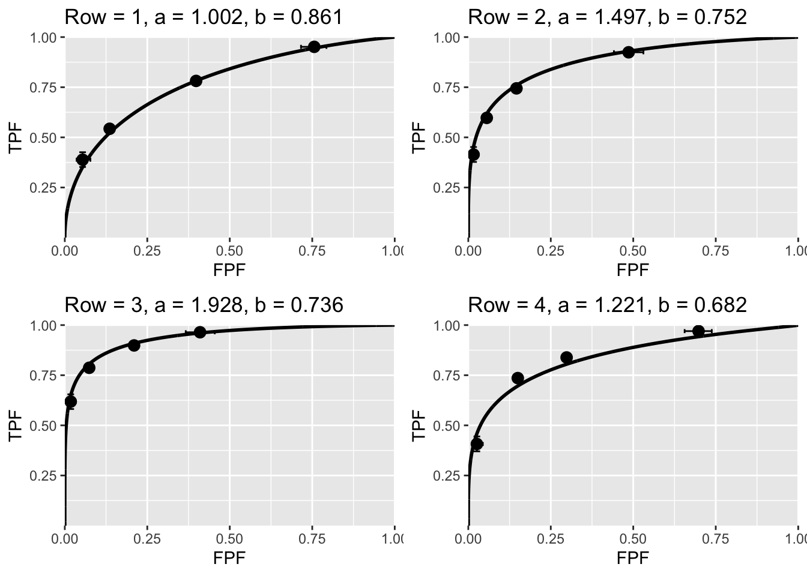
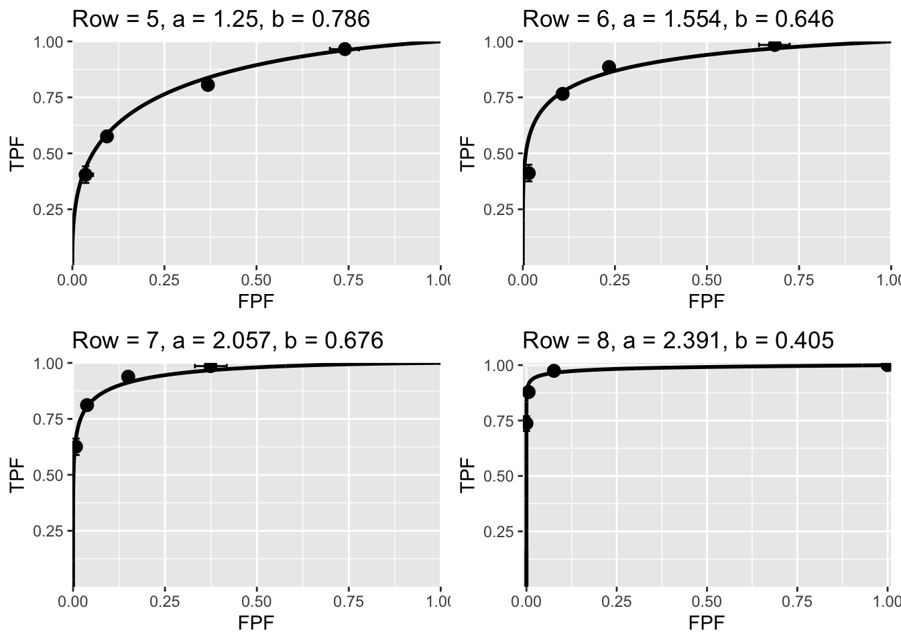
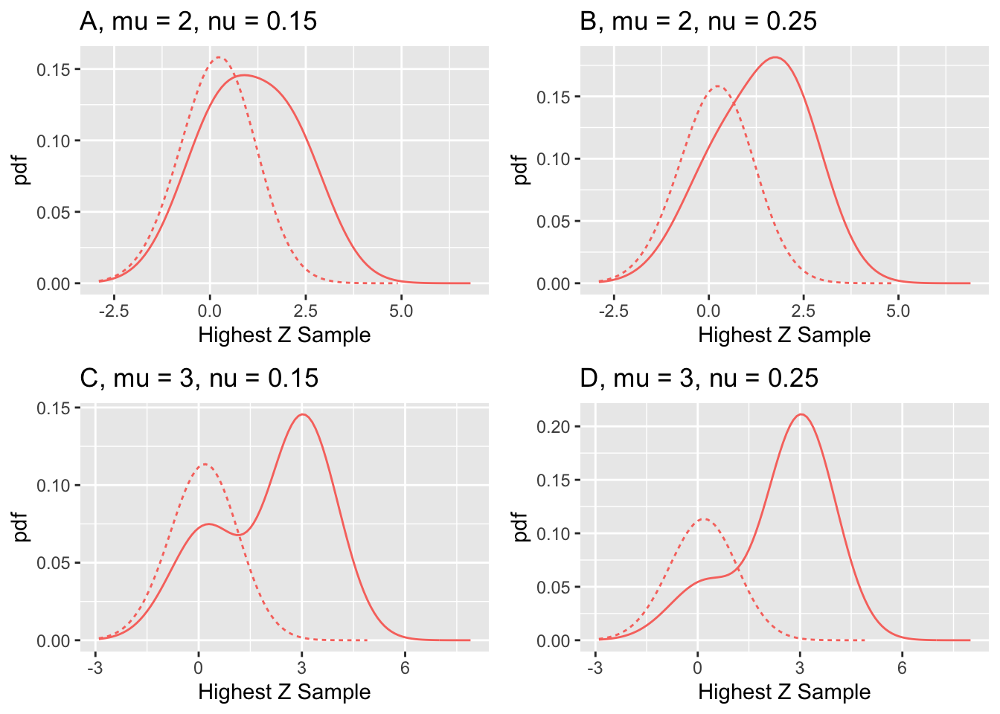

# Validity of the RSM {#rsm-evidence}


## Introduction {#rsm-evidence-intro}

This chapter details the evidence for the validity of the radiological search model (RSM). Listed next are the specific reasons. 

1.	Its correspondence to the empirical (i.e., measurement based) Kundel-Nodine model of radiological search. 
2.	In special cases, it reduces to being indistinguishable from the binormal model.
3.	It explains: 
    a. The empirical observation [@RN298] that most ROC datasets are characterized by b-parameter $b < 1$. 
    b. The empirical observation [@RN2635] that the $b$ tends to decrease as contrast increases. 
    c. The empirical observation [@RN2635], that the difference in means of the two pdfs divided by the difference in standard deviations is roughly constant.
4.	It explains data degeneracy, i.e., no interior data points, sometimes observed especially with expert observers. 
5.	It predicts FROC/AFROC and LROC curves that fit real datasets.

As described in TBA Chapter 20, the CBM explains 3(a) and 4 while the bigamma model [@RN100] explains 3(c).

## Correspondence to the Kundel-Nodine model {#rsm-predictions-corresponence-kundel-nodine}
The strongest evidence for the validity of the RSM is its close correspondence to the Kundel-Nodine model of radiological search [@RN1533; @RN1388; @RN438; @RN1663], which in turn is derived from eye-tracking measurements made on radiologists while they perform diagnostic tasks. These show that radiologists identify suspicious regions in a short time and this ability corresponds to the $\lambda', \nu'$ parameters of the RSM. Having found suspicious regions, the next activity uncovered by eye-tracking measurements is the detailed examination of each suspicious region in order to determine if it is a significant finding. This is where the z-sample is calculated, and this process is modeled by two unit normal distributions separated by the $\mu$ parameter of the RSM. 

Other ROC models do not share this close correspondence. The CBM model comes closest – it models the probability that lesions are *found*, which is part of search performance, but the ability to *avoid finding NLs* is not modeled. Like other ROC models, CBM predicts that the point (1,1) is continuously accessible to observer, which implies zero search performance, TBA Fig. 17.6.

## The binormal model is a special case of the RSM {#rsm-predictions-binormal-model}


ROC models assume that every case provides a finite decision variable sample. This is what permits the observer to *continuously* move the operating point to (1,1). According to the RSM a decision sample on every case is possible if $\lambda$ is large, since in the limit $\lambda \rightarrow \infty$ every case has at least one latent NL. It turns out, as shown next, that it is not necessary to go to infinite values of $\lambda$ to produce RSM-generated ratings data that are indistinguishable from those generated by the binormal model. Values of $\lambda$ around 1 to 10 are sufficient to demonstrate this fact. A factor that helps showing the indistinguishability is that the binormal model is remarkably resilient to departures from normality, its *robustness property*, demonstrated in [@RN1216]. It literally takes huge datasets, numbering in the thousands of cases, to show departures from strict normality. 

The ROC ratings datasets used in the following examples were generated by the RSM. The parameter values are listed in Table \@ref(tab:rsm-evidence-binormal-table2). RSM generated FROC datasets, in each case 500 non-diseased and 700 diseased cases were used, were converted to (highest rating) ROC datasets, each dataset was binned into 5 bins and then analyzed by an online Java program [@RN1975] which implements Metz's ROCFIT program, TBA Chapter 06, yielding the binormal parameters $a, b$ and the p-value of the chisquare goodness of fit statistic. Shown next are the binormal-model-fitted ROC curves to these datasets as well as the corresponding $a,b$ parameters. The value of Row corresponds to the row number in Table \@ref(tab:rsm-evidence-binormal-table2). 




<div class="figure">

<p class="caption">(\#fig:rsm-evidence-binormal-plots2)RSM generated ROC points and corresponding binormal model fitted curves.</p>
</div>

Fig. \@ref(fig:rsm-evidence-binormal-plots2): ROC *operating points* obtained using RSM ratings-generator and corresponding binormal model *fitted curves*. The $a, b$ parameters are shown in the figure labels. The value of `Row` corresponds to the row number in Table \@ref(tab:rsm-evidence-binormal-table2). The plots show that over a wide range of parameters RSM generated ROC data is fitted reasonably by the binormal model. The p-values of the goodness of fit statistic, see Table \@ref(tab:rsm-evidence-binormal-table2), are all in the range of what is considered an acceptable fit to a model. As far as the binormal model-fitting software is concerned, the counts data arose from two *effectively normal distributions* (i.e., apart from the intrinsic uncertainty due to allowed arbitrary monotone transformations). Even with the large number of cases, sampling variability affects the binormal model fits: e.g., the binormal model curves in plots labeled "2" and "4" differ only in seed values. The hooks near (1,1) in the binormal ROC fitted curves are not easily visible but are nevertheless present as each of the b-parameters in Table \@ref(tab:rsm-evidence-binormal-table2) is less than unity. The error bars are exact 95% binomial confidence intervals on the operating points.   

**Since the binormal model has been used successfully for almost six decades, the ability to the RSM to mimic it is an important justification for the validity of the RSM.**


<table class="table" style="margin-left: auto; margin-right: auto;">
<caption>(\#tab:rsm-evidence-binormal-table2)Simulating ROC binned ratings data using the RSM and fitting the ratings using the binormal model; s is the seed, L is the maximum number of lesions per case, A is the RSM-predicted ROC-AUC, Az is the binormal model fitted AUC and $\nu = 1$ for all datasets.</caption>
 <thead>
  <tr>
   <th style="text-align:left;"> Row </th>
   <th style="text-align:left;"> s </th>
   <th style="text-align:left;"> L </th>
   <th style="text-align:left;"> $\mu$ </th>
   <th style="text-align:left;"> $\lambda$ </th>
   <th style="text-align:left;"> A </th>
   <th style="text-align:left;"> a </th>
   <th style="text-align:left;"> b </th>
   <th style="text-align:left;"> Az </th>
   <th style="text-align:left;"> pVal </th>
  </tr>
 </thead>
<tbody>
  <tr>
   <td style="text-align:left;"> 1 </td>
   <td style="text-align:left;"> 1 </td>
   <td style="text-align:left;"> 1 </td>
   <td style="text-align:left;"> 2 </td>
   <td style="text-align:left;"> 10 </td>
   <td style="text-align:left;"> 0.787 </td>
   <td style="text-align:left;"> 1.002 </td>
   <td style="text-align:left;"> 0.861 </td>
   <td style="text-align:left;"> 0.776 </td>
   <td style="text-align:left;"> 0.223 </td>
  </tr>
  <tr>
   <td style="text-align:left;"> 2 </td>
   <td style="text-align:left;"> 1 </td>
   <td style="text-align:left;"> 1 </td>
   <td style="text-align:left;"> 2.5 </td>
   <td style="text-align:left;"> 10 </td>
   <td style="text-align:left;"> 0.879 </td>
   <td style="text-align:left;"> 1.497 </td>
   <td style="text-align:left;"> 0.752 </td>
   <td style="text-align:left;"> 0.884 </td>
   <td style="text-align:left;"> 0.46 </td>
  </tr>
  <tr>
   <td style="text-align:left;"> 3 </td>
   <td style="text-align:left;"> 1 </td>
   <td style="text-align:left;"> 1 </td>
   <td style="text-align:left;"> 3 </td>
   <td style="text-align:left;"> 10 </td>
   <td style="text-align:left;"> 0.938 </td>
   <td style="text-align:left;"> 1.928 </td>
   <td style="text-align:left;"> 0.736 </td>
   <td style="text-align:left;"> 0.94 </td>
   <td style="text-align:left;"> 0.198 </td>
  </tr>
  <tr>
   <td style="text-align:left;"> 4 </td>
   <td style="text-align:left;"> 2 </td>
   <td style="text-align:left;"> 1 </td>
   <td style="text-align:left;"> 2.5 </td>
   <td style="text-align:left;"> 10 </td>
   <td style="text-align:left;"> 0.879 </td>
   <td style="text-align:left;"> 1.221 </td>
   <td style="text-align:left;"> 0.682 </td>
   <td style="text-align:left;"> 0.843 </td>
   <td style="text-align:left;"> 0.12 </td>
  </tr>
  <tr>
   <td style="text-align:left;"> 5 </td>
   <td style="text-align:left;"> 2 </td>
   <td style="text-align:left;"> 2 </td>
   <td style="text-align:left;"> 2 </td>
   <td style="text-align:left;"> 10 </td>
   <td style="text-align:left;"> 0.844 </td>
   <td style="text-align:left;"> 1.25 </td>
   <td style="text-align:left;"> 0.786 </td>
   <td style="text-align:left;"> 0.837 </td>
   <td style="text-align:left;"> 0.903 </td>
  </tr>
  <tr>
   <td style="text-align:left;"> 6 </td>
   <td style="text-align:left;"> 2 </td>
   <td style="text-align:left;"> 2 </td>
   <td style="text-align:left;"> 2.5 </td>
   <td style="text-align:left;"> 10 </td>
   <td style="text-align:left;"> 0.922 </td>
   <td style="text-align:left;"> 1.554 </td>
   <td style="text-align:left;"> 0.646 </td>
   <td style="text-align:left;"> 0.904 </td>
   <td style="text-align:left;"> 0.592 </td>
  </tr>
  <tr>
   <td style="text-align:left;"> 7 </td>
   <td style="text-align:left;"> 2 </td>
   <td style="text-align:left;"> 2 </td>
   <td style="text-align:left;"> 3 </td>
   <td style="text-align:left;"> 10 </td>
   <td style="text-align:left;"> 0.965 </td>
   <td style="text-align:left;"> 2.057 </td>
   <td style="text-align:left;"> 0.676 </td>
   <td style="text-align:left;"> 0.956 </td>
   <td style="text-align:left;"> 0.009 </td>
  </tr>
  <tr>
   <td style="text-align:left;"> 8 </td>
   <td style="text-align:left;"> 2 </td>
   <td style="text-align:left;"> 2 </td>
   <td style="text-align:left;"> 3 </td>
   <td style="text-align:left;"> 1 </td>
   <td style="text-align:left;"> 0.985 </td>
   <td style="text-align:left;"> 2.391 </td>
   <td style="text-align:left;"> 0.405 </td>
   <td style="text-align:left;"> 0.987 </td>
   <td style="text-align:left;"> 0.988 </td>
  </tr>
</tbody>
</table>


Table \@ref(tab:rsm-evidence-binormal-table2): Results of simulating ROC ratings tables using seeds and RSM parameter values specified in columns 2 – 5 and fitting each ratings table using the binormal model. The corresponding binormal model fitted ROC curves are shown in Fig. \@ref(fig:rsm-evidence-binormal-plots2). The number of non-diseased cases was 500, the number of diseased cases was 700, and the reporting threshold $\zeta_1 = -1$. 

Of interest in Table \@ref(tab:rsm-evidence-binormal-table2) is the observation that $b < 1$, and the qualities of the fits are quite good (p > 0.001 is generally considered acceptable, see [@RN300], 3rd edition, page 779). 

One expects $A \equiv AUC_{ROC}^{RSM}$ to exceed the binormal fitted value $A_z$. This has to do with the "proper" property of the RSM-ROC curve, which implies an *ideal observer*, while the binormal model predicts "improper" ROC curves, TBA Chapter 20. For rows 2 and 3, the expected orderings are reversed but the magnitudes of the discrepancies are small. This is because RSM-predicted values are *not* subject to sampling variability as they are derived by numerical integration, whose estimation error is very small compared to sampling error. In contrast, the estimates of $A_z$ are subject to sampling variability, even though large numbers of cases were used. Row-4 repeats Row-2 with a different value of `seed`: this time the expected ordering is observed $A > Az$. 


## Explanations of empirical observations regarding binormal parameters
As summarized previously, there are three empirical observations: 

* $b < 1$, 
* $b$ decreases as $\mu$ increases, and 
* $\Delta(mean) / \Delta(\sigma)$ is approximately constant for fixed experimental conditions. To not confuse with the RSM $\mu$ parameter, the difference in means is denoted $\Delta(mean)$, not $\Delta \mu$. 


### Explanation for empirical observation $b < 1$
The RSM-predicted ROC curves are consistent with empirical observations [@RN298] that observed ROC data, when fitted by the unequal variance binormal model, yield $b < 1$, implying that the diseased case pdf is wider than the non-diseased case pdf. The RSM provides an explanation for this: diseased cases yield two types of z-samples, namely NL z-samples from a zero-centered unit variance normal distribution and LL z-samples from a  $\mu$-centered unit variance normal distribution. The resulting *mixture distribution* is expected, when one attempts to fit it with a normal distribution, to yield standard deviation for diseased cases greater than 1, or, equivalently, $b < 1$. The fit is not expected to be ideal, but it is known that for relatively small numbers of cases, as is true with clinical data sets, it is difficult to detect deviations from strict normality; indeed, the binormal model is quite robust with respect to deviations from strict normality [@RN298]. Several examples of this were evident in the goodness of fit p-values in Table \@ref(tab:rsm-evidence-binormal-table2), which show good binormal fits to RSM generated data even with 1200 cases. 


<div class="figure">

<p class="caption">(\#fig:rsm-evidence-pdf-plots)pdfs along with the parameter values. The dotted curves correspond to non-diseased cases while solid curves correspond to diseased cases.</p>
</div>


Fig. \@ref(fig:rsm-evidence-pdf-plots): This figure provides an explanation for empirical observation $b < 1$. Displayed are pdfs along with the parameter values. For all plots $\lambda = 1$ and $L_{max} = 1$. The dotted curves correspond to non-diseased cases while the solid curves correspond to diseased cases. The solid curves are broader than the dotted ones. In (A) and (B) the solid curve is noticeably broader. In (D) there is a hint of a secondary peak at zero, which is quite prominent in (C), which corresponds to the largest $\mu$ and the smallest $\nu$. In each case the resulting mixture distribution is expected to lead to a larger estimate of standard deviation of the assumed normal distribution of diseased cases relative to non-diseased cases. 


### Explanation of Swets et al' observations 

More than 55 years ago, [@RN2635] noticed in non-medical imaging contexts:
 
* The standard deviation of the non-diseased distribution divided by the standard deviation of the diseased distribution, tended to decrease as contrast increased. 

* The ratio $\Delta(mean) / \Delta(\sigma)$ is approximately constant for a fixed set of experimental conditions.

In the RSM  $\mu$ is the perceptual signal to noise *pSNR* of found lesions. Swets' first empirical observation implies that the $b$ parameter should decrease with increasing $\mu$. Testing this proposition over a wide range of $\mu$ using the preceding methods (i.e., binormal model maximum likelihood fitting) is direct but cumbersome and subject to failure. This is because it depends on the ability to find five counts in each bin and convergence of the binormal model algorithm, which is problematical for larger values of $\mu$ which lead to degenerate datasets. Instead, the following method was used. The search model predicted pdfs were normalized so that they individually integrated to unit areas. This was accomplished by dividing the non-diseased pdf by the x-coordinate of the end-point, and the diseased pdf by the y-coordinate of the end-point. The means and standard deviations of these distributions were calculated by numerical integration. If $f(x)$ is a unit-normalized pdf its mean $<x>$  and variance $\sigma_x^2$ are defined by:

\begin{equation}
\left. 
\begin{aligned}
\left \langle x \right \rangle = & \int_{-\infty}^{\infty} xf(x) dx \\
\sigma_x^2 = & \int_{-\infty}^{\infty} \left (x - \left \langle x \right \rangle  \right )^2f(x) dx \\
\end{aligned}
\right \}
(\#eq:rsm-evidence-x-sigmax2)
\end{equation}


The needed quantities are defined as:

\begin{equation}
\left. 
\begin{aligned}
\Delta(mean) = & \left \langle x \right \rangle_D - \left \langle x \right \rangle_N  \\
\Delta(\sigma)= & \sigma_D - \sigma_N
\end{aligned}
\right \}
(\#eq:rsm-evidence-delta-mean-sigma)
\end{equation}


*The standard deviation is the square root of the variance. Varying experimental conditions were simulated by individually varying the two of the three parameters of the RSM under the constraint that the RSM predicted AUC remained constant at a specified value. Without this constraint, variation of a single parameter, e.g.,  $\mu$, would cause AUC to vary over the entire range 0.5 to 1, which is uncharacteristic of radiologists interpreting the same case set. The underlying assumption is that observers, characterized by different RSM parameters, nevertheless converge on roughly the same RSM-AUCs. In other words, they tend to compensate for deficiencies in some area (e.g., finding too many NLs, large $\lambda$) with increased performance in other areas (e.g., finding more lesions, i.e., larger $\nu$, and/or extracting greater pSNR from found lesions, i.e., larger $\mu$).*


```
##    AUC       mu lambda        nu    effmu         b  dmudsig
## 1  0.7 2.000000      2 0.3040194 1.006825 0.7539348 3.136005
## 2  0.7 2.214346      2 0.2600273 1.129415 0.7107209 2.812443
## 3  0.7 2.451665      2 0.2252662 1.276371 0.6670500 2.585494
## 4  0.7 2.714418      2 0.1973748 1.451139 0.6235964 2.425911
## 5  0.7 3.005330      2 0.1746062 1.657169 0.5810496 2.315364
## 6  0.7 3.327421      2 0.1556552 1.897802 0.5400178 2.241479
## 7  0.7 3.684031      2 0.1395508 2.176243 0.5009616 2.195411
## 8  0.7 4.078861      2 0.1255604 2.495426 0.4641586 2.170306
## 9  0.7 4.516005      2 0.1132283 2.859036 0.4297620 2.161810
## 10 0.7 5.000000      2 0.1021570 3.270140 0.3977542 2.165567
```

```
##    AUC       mu lambda        nu    effmu         b  dmudsig
## 1  0.7 2.000000      2 0.3040194 1.006825 0.7539348 3.136005
## 2  0.7 2.214346      2 0.2600273 1.129415 0.7107209 2.812443
## 3  0.7 2.451665      2 0.2252662 1.276371 0.6670500 2.585494
## 4  0.7 2.714418      2 0.1973748 1.451139 0.6235964 2.425911
## 5  0.7 3.005330      2 0.1746062 1.657169 0.5810496 2.315364
## 6  0.7 3.327421      2 0.1556552 1.897802 0.5400178 2.241479
## 7  0.7 3.684031      2 0.1395508 2.176243 0.5009616 2.195411
## 8  0.7 4.078861      2 0.1255604 2.495426 0.4641586 2.170306
## 9  0.7 4.516005      2 0.1132283 2.859036 0.4297620 2.161810
## 10 0.7 5.000000      2 0.1021570 3.270140 0.3977542 2.165567
```

```
##    AUC mu    lambda        nu     effmu         b   dmudsig
## 1  0.7  2 0.1000000 0.2580240 1.8544816 0.8966579 16.091266
## 2  0.7  2 0.1544452 0.2594364 1.7868249 0.8631606 11.272127
## 3  0.7  2 0.2385332 0.2616054 1.6950567 0.8274848  8.132437
## 4  0.7  2 0.3684031 0.2649264 1.5773402 0.7940112  6.083536
## 5  0.7  2 0.5689810 0.2699885 1.4368181 0.7675247  4.750151
## 6  0.7  2 0.8787639 0.2776535 1.2830448 0.7516999  3.896845
## 7  0.7  2 1.3572088 0.2891525 1.1303902 0.7479598  3.380376
## 8  0.7  2 2.0961440 0.3061914 0.9930460 0.7551508  3.118380
## 9  0.7  2 3.2373940 0.3310898 0.8788939 0.7697799  3.063390
## 10 0.7  2 5.0000000 0.3670313 0.7855144 0.7857195  3.156897
```


<table class="table" style="margin-left: auto; margin-right: auto;">
<caption>(\#tab:rsm-evidence-table1A)The last two columns list the RSM-predicted AUCs under the ROC and AFROC, respectively. The corresponding RSM parameters are listed in the first four columns.</caption>
 <thead>
  <tr>
   <th style="text-align:right;"> AUC </th>
   <th style="text-align:right;"> mu </th>
   <th style="text-align:right;"> lambda </th>
   <th style="text-align:right;"> nu </th>
   <th style="text-align:right;"> effmu </th>
   <th style="text-align:right;"> b </th>
   <th style="text-align:right;"> dmudsig </th>
  </tr>
 </thead>
<tbody>
  <tr>
   <td style="text-align:right;"> 0.7 </td>
   <td style="text-align:right;"> 2.000000 </td>
   <td style="text-align:right;"> 2 </td>
   <td style="text-align:right;"> 0.3040194 </td>
   <td style="text-align:right;"> 1.006825 </td>
   <td style="text-align:right;"> 0.7539348 </td>
   <td style="text-align:right;"> 3.136005 </td>
  </tr>
  <tr>
   <td style="text-align:right;"> 0.7 </td>
   <td style="text-align:right;"> 2.214346 </td>
   <td style="text-align:right;"> 2 </td>
   <td style="text-align:right;"> 0.2600273 </td>
   <td style="text-align:right;"> 1.129415 </td>
   <td style="text-align:right;"> 0.7107209 </td>
   <td style="text-align:right;"> 2.812442 </td>
  </tr>
  <tr>
   <td style="text-align:right;"> 0.7 </td>
   <td style="text-align:right;"> 2.451665 </td>
   <td style="text-align:right;"> 2 </td>
   <td style="text-align:right;"> 0.2252662 </td>
   <td style="text-align:right;"> 1.276371 </td>
   <td style="text-align:right;"> 0.6670500 </td>
   <td style="text-align:right;"> 2.585494 </td>
  </tr>
  <tr>
   <td style="text-align:right;"> 0.7 </td>
   <td style="text-align:right;"> 2.714418 </td>
   <td style="text-align:right;"> 2 </td>
   <td style="text-align:right;"> 0.1973748 </td>
   <td style="text-align:right;"> 1.451139 </td>
   <td style="text-align:right;"> 0.6235964 </td>
   <td style="text-align:right;"> 2.425911 </td>
  </tr>
  <tr>
   <td style="text-align:right;"> 0.7 </td>
   <td style="text-align:right;"> 3.005330 </td>
   <td style="text-align:right;"> 2 </td>
   <td style="text-align:right;"> 0.1746062 </td>
   <td style="text-align:right;"> 1.657169 </td>
   <td style="text-align:right;"> 0.5810496 </td>
   <td style="text-align:right;"> 2.315364 </td>
  </tr>
  <tr>
   <td style="text-align:right;"> 0.7 </td>
   <td style="text-align:right;"> 3.327421 </td>
   <td style="text-align:right;"> 2 </td>
   <td style="text-align:right;"> 0.1556552 </td>
   <td style="text-align:right;"> 1.897802 </td>
   <td style="text-align:right;"> 0.5400178 </td>
   <td style="text-align:right;"> 2.241479 </td>
  </tr>
  <tr>
   <td style="text-align:right;"> 0.7 </td>
   <td style="text-align:right;"> 3.684032 </td>
   <td style="text-align:right;"> 2 </td>
   <td style="text-align:right;"> 0.1395508 </td>
   <td style="text-align:right;"> 2.176243 </td>
   <td style="text-align:right;"> 0.5009616 </td>
   <td style="text-align:right;"> 2.195411 </td>
  </tr>
  <tr>
   <td style="text-align:right;"> 0.7 </td>
   <td style="text-align:right;"> 4.078861 </td>
   <td style="text-align:right;"> 2 </td>
   <td style="text-align:right;"> 0.1255604 </td>
   <td style="text-align:right;"> 2.495426 </td>
   <td style="text-align:right;"> 0.4641586 </td>
   <td style="text-align:right;"> 2.170307 </td>
  </tr>
  <tr>
   <td style="text-align:right;"> 0.7 </td>
   <td style="text-align:right;"> 4.516005 </td>
   <td style="text-align:right;"> 2 </td>
   <td style="text-align:right;"> 0.1132283 </td>
   <td style="text-align:right;"> 2.859036 </td>
   <td style="text-align:right;"> 0.4297620 </td>
   <td style="text-align:right;"> 2.161810 </td>
  </tr>
  <tr>
   <td style="text-align:right;"> 0.7 </td>
   <td style="text-align:right;"> 5.000000 </td>
   <td style="text-align:right;"> 2 </td>
   <td style="text-align:right;"> 0.1021570 </td>
   <td style="text-align:right;"> 3.270140 </td>
   <td style="text-align:right;"> 0.3977542 </td>
   <td style="text-align:right;"> 2.165567 </td>
  </tr>
</tbody>
</table>


```
##    AUC       mu lambda        nu    effmu         b  dmudsig
## 1  0.8 2.000000      2 0.5750174 1.366996 0.8105541 5.945703
## 2  0.8 2.214346      2 0.4826833 1.519525 0.7649096 5.011078
## 3  0.8 2.451665      2 0.4128075 1.700445 0.7208098 4.438846
## 4  0.8 2.714418      2 0.3585499 1.912912 0.6784979 4.073575
## 5  0.8 3.005330      2 0.3154119 2.160031 0.6382351 3.838983
## 6  0.8 3.327421      2 0.2801812 2.444396 0.6001421 3.690938
## 7  0.8 3.684031      2 0.2506689 2.768579 0.5642539 3.602765
## 8  0.8 4.078861      2 0.2253300 3.135116 0.5304907 3.556586
## 9  0.8 4.516005      2 0.2030971 3.546769 0.4987007 3.539988
## 10 0.8 5.000000      2 0.1833044 4.007088 0.4687580 3.545271
```

```
##    AUC       mu lambda        nu    effmu         b  dmudsig
## 1  0.8 2.000000      2 0.5750174 1.366996 0.8105541 5.945703
## 2  0.8 2.214346      2 0.4826833 1.519525 0.7649096 5.011078
## 3  0.8 2.451665      2 0.4128075 1.700445 0.7208098 4.438846
## 4  0.8 2.714418      2 0.3585499 1.912912 0.6784979 4.073575
## 5  0.8 3.005330      2 0.3154119 2.160031 0.6382351 3.838983
## 6  0.8 3.327421      2 0.2801812 2.444396 0.6001421 3.690938
## 7  0.8 3.684031      2 0.2506689 2.768579 0.5642539 3.602765
## 8  0.8 4.078861      2 0.2253300 3.135116 0.5304907 3.556586
## 9  0.8 4.516005      2 0.2030971 3.546769 0.4987007 3.539988
## 10 0.8 5.000000      2 0.1833044 4.007088 0.4687580 3.545271
```

```
##    AUC mu    lambda        nu    effmu         b   dmudsig
## 1  0.8  2 0.1000000 0.4640280 1.926954 0.9476004 34.848720
## 2  0.8  2 0.1544452 0.4672318 1.891150 0.9265439 23.856540
## 3  0.8  2 0.2385332 0.4721744 1.840571 0.9009387 16.743548
## 4  0.8  2 0.3684031 0.4797958 1.772047 0.8726752 12.152413
## 5  0.8  2 0.5689810 0.4915404 1.684378 0.8452798  9.214737
## 6  0.8  2 0.8787639 0.5096299 1.580243 0.8232878  7.386057
## 7  0.8  2 1.3572088 0.5375296 1.467147 0.8110032  6.344095
## 8  0.8  2 2.0961440 0.5806387 1.355241 0.8112136  5.929330
## 9  0.8  2 3.2373940 0.6480658 1.251461 0.8241099  6.112281
## 10 0.8  2 5.0000000 0.7572216 1.152663 0.8448119  6.877419
```


The code for this is in file mainRsmSwetsObservations.R in Online Appendix 17.G, which was used to populate Table 17.3. The table is organized into three parts, A, B and C. Part A varies   for constant RSM-AUC for  . Part B varies   for constant RSM-AUC for  . Part C varies   for constant RSM-AUC for  . The 1st column lists the constrained  , set to either 0.7 or 0.8, the 2nd and 3rd columns list the parameters that were varied, subject to the AUC constraint, followed by the empirical b-parameter and  . A similar organization applies to part B, where only   are varied and to part C where only   are varied. The number of lesions per diseased case was set to one. The function FindParamFixAuc() finds the missing RSM parameter, indicated by initializing it with NA, prior to the function call, given the two other RSM parameters. The function rsmPdfMeansAndStddevs() calculates the means and standard deviations of the two distributions, after appropriately normalizing them to unit areas. 

Examination of Table 17.3 reveals, for both values of AUC, an inverse relation between   and b, Parts A and B, and an inverse relation between   and b, Part C.  In (C), for fixed  , the only way to improve performance is by increasing  , i.e., by the observer getting better at finding lesions. Furthermore, Table 17.3 reveals an approximately constant value of   especially in Parts A and B. 

The biggest deviation from approximate constancy is observed in Part C: this could be due to unreasonably low values of  , e.g., 0.1, necessary in order to satisfy the AUC constraint. It should be noted that the Swets et al observations are based on only two datasets and they state that   = 4, their observed value, is probably not generally applicable. 

	
The empirical observation that b decreases with increasing lesion detectability is likely more generally true and the results, Table 17.3, support it. It makes physical sense if one assumes that sometimes a sample from the non-diseased distribution exceeds that from the diseased distribution. This implies the existence of two types of z-samples in diseased cases. Another explanation is the existence of heterogeneity in the distribution for diseased cases, e.g., a mix of easy and hard lesions, which too would tend to broaden the diseased distribution and make b < 1 and b decreasing with increasing lesion detectability. Putting all this together, the author makes the following prediction: if the possible location of the lesion is pre-specified (i.e., there is no location uncertainty and therefore latent NLs are eliminated) and all lesions have the same detectability, then one expects b = 1 and no dependence of b on lesion detectability. This is a fairly simple experiment to conduct using simulated Gaussian noise backgrounds and superposed Gaussian disk lesions41-43 with fixed contrast (using simulated clinical backgrounds is not recommended for this study as it could cause differences in lesion detectability depending on variations in the background in the immediate vicinity of the lesion).


 
Table 17.3: This table is organized into 3 parts, A, B and C. The remaining parameter of the RSM, the one held constant, is shown in the second header. Part A: This show that b decreases as   increases: the last two columns in part A list the b-parameter and the    to   ratio, non-diseased to diseased. This confirms that the model has the expected behavior noted by Swets, namely b decreases as   increases and the    to   ratio is approximately constant. A similar organization applies to the other parts of the table. Part B: this shows the dependence of the b-parameter and the   to   ratio on  . Part C: this shows the dependence of the b-parameter and the   to   ratio on  . In all examples, the b-parameter decreases as   increases or   increases. [All parameters in this table represent intrinsic values.]


### Explanation of data degeneracy
An ROC dataset is said to be degenerate if the corresponding ROC plot does not have any interior data points. Data degeneracy is a significant problem faced by the binormal model1,6,44, e.g., ROCFIT or RSCORE-II software. Degenerate datasets cannot be analyzed by binormal model. The RSM provides a natural explanation for such datasets, and as shown in Chapter 19, such datasets are readily fitted by the RSM. The CBM model2-4 also provides an alternative explanation for the data degeneracy and a method for fitting such datasets.

The reason for degenerate datasets is the existence of cases not providing any decision variable samples. Such cases are always binned in the lowest ROC:1 bin. The possibility of data degeneracy can be appreciated by examining Fig. 17.1 (in particular plots D through F, i.e., the higher values of  ). As   increases the accessible portion of the ROC curve shrinks and the curve increasingly approaches the top-left corner of the plot. The effect is particularly pronounced for observers characterized by large values of   and small values of  , i.e., the experts. For them the operating points will be clustered near the initial near-vertical section of the ROC curve. It will be difficult to get such observers to generate appreciable numbers of false positives. Instructions such as "spread your ratings"45 or the use "continuous" ratings46 may not always work; interference with the radiologist's readings style to make the data easier to analyze is undesirable. To the experimenter it will appear that the observer is not cooperating, when in fact they are being perfectly reasonable. A similar issue affected Dr. Swensson's LROC analysis method11 in which originally every case had to be assigned a "most-suspicious" region, even if the radiologist thought the case was perfectly normal: this met with resistance from radiologists. In later versions of his software, Dr. Swensson removed the forced localization requirement and instead did it in software by sampling a random number generator. Radiologists don't like to be told, "even if you believe the case is definitely normal, there must be some region that is least normal, or most suspicious". All of these sematic difficulties go away if one abandons the premise that every case must generate a z-sample.


### Predictions of observed FROC/AFROC/LROC curves
Besides predicting ROC, FROC and AFROC curves, as shown in this chapter, the RSM also predicts LROC curves15. Moreover, these are generally better fits to experimental data since they do not allow the AFROC and LROC curve to go continuously to FPF = 1, as do earlier models, two by the author22,23 and one by the late Dr. Swensson11. As a historical note, the FROCFIT and AFROC software developed22 by the author in 1989 was more successful at fitting microcalcification data than mass data (private communication, Prof. Heang-Ping Chan, ca. 1990). This is consistent with the premise that the microcalcification task is characterized by larger   than the mass task. Radiologists literally use a magnifying glass (a physical on or a software implementation) to search each image for the much smaller specks, and this increases the potential for finding NLs, hence the larger  . Mass detection is more a function of the global gestalt view described in the previous chapter. Larger  yields an FROC curve that traverses more to the right than the corresponding mass curve. The FROCFIT program allows the FROC curve to go far to the right and reach unit ordinate, which is not observed with mass data, but could approximate microcalcification data. 


## Discussion / Summary {#rsm-evidence-discussion-summary}
This chapter has detailed ROC, FROC and AFROC curves predicted by the radiological search model (RSM). All RSM-predicted curves share the constrained end-point property that is qualitatively different from previous ROC models. In the author's experience, it is a property that most researchers in this field have difficulty accepting. There is too much history going back to the early 1940s, of the ROC curve extending from (0,0) to (1,1) that one has to let go of, and this can be difficult. 

The author is not aware of any direct evidence that radiologists can move the operating point continuously in the range (0,0) to (1,1) in search tasks, so the existence of such an ROC is tantamount to an assumption. Algorithmic observers that do not involve the element of search can extend continuously to (1,1). An example of an algorithmic observer not involving search is a diagnostic test that rates the results of a laboratory measurement, e.g., the A1C measure of blood glucose  for presence of a disease. If A1C ≥ 6.5% the patient is diagnosed as diabetic. By moving the threshold from infinity to –infinity, and assuming a large population of patients, one can trace out the entire ROC curve from the origin to (1,1). This is because every patient yields an A1C value. Now imagine that some finite fraction of the test results are "lost in the mail"; then the ROC curve, calculated over all patients, would have the constrained end-point property, albeit due to an unreasonable cause.

The situation in medical imaging involving search tasks is qualitatively different. Not every case yields a decision variable. There is a reasonable cause for this – to render a decision variable sample the radiologist must find something suspicious to report, and if none is found, there is no decision variable to report. The ROC curve calculated over all patients would exhibit the constrained end-point property, even in the limit of an infinite number of patients. If calculated over only those patients that yielded at least one mark, the ROC curve would extend from (0,0) to (1,1) but then one would be ignoring the cases with no marks, which represent valuable information: unmarked non-diseased cases represent perfect decisions and unmarked diseased cases represent worst-case decisions.

RSM-predicted ROC, FROC and AFROC curves were derived (wAFROC is implemented in the Rjafroc). These were used to demonstrate that the FROC is a poor descriptor of performance. Since almost all work to date, including some by the author47,48, has used FROC curves to measure performance, this is going to be difficulty for some to accept. The examples in Fig. 17.6 (A- F) and Fig. 17.7 (A-B) should convince one that the FROC curve is indeed a poor measure of performance. The only situation where one can safely use the FROC curve is if the two modalities produce curves extending over the same NLF range. This can happen with two variants of a CAD algorithm, but rarely with radiologist observers.

A unique feature is that the RSM provides measures of search and lesion-classification performance. It bears repeating that search performance is the ability to find lesions while avoiding finding non-lesions. Search performance can be determined from the position of the ROC end-point (which in turn is determined by RSM-based fitting of ROC data, Chapter 19). The perpendicular distance between the end-point and the chance diagonal is, apart from a factor of 1.414, a measure of search performance. All ROC models that predict continuous curves extending to (1,1), imply zero search performance. 

Lesion-classification performance is measured by the AUC value corresponding to the   parameter. Lesion-classification performance is the ability to discriminate between LLs and NLs, not between diseased and non-diseased cases: the latter is measured by RSM-AUC. There is a close analogy between the two ways of measuring lesion-classification performance and CAD used to find lesions in screening mammography vs. CAD used in the diagnostic context to determine if a lesion found at screening is actually malignant. The former is termed CADe, for CAD detection, which in the author's opinion, is slightly misleading as at screening lesions are found not detected ("detection" is "discover or identify the presence or existence of something ", correct localization is not necessarily implied; the more precise term is "localize"). In the diagnostic context one has CADx, for CAD diagnostic, i.e., given a specific region of the image, is the region malignant? 

Search and lesion-classification performance can be used as "diagnostic aids" to optimize performance of a reader. For example, is search performance is low, then training using mainly non-diseased cases is called for, so the resident learns the different variants of non-diseased tissues that can appear to be true lesions. If lesion-classification performance is low then training with diseased cases only is called for, so the resident learns the distinguishing features characterizing true lesions from non-diseased tissues that fake true lesions.

Finally, evidence for the RSM is summarized. Its correspondence to the empirical Kundel-Nodine model of visual search that is grounded in eye-tracking measurements. It reduces in the limit of large  , which guarantees that every case will yield a decision variable sample, to the binormal model; the predicted pdfs in this limit are not strictly normal, but deviations from normality would require very large sample size to demonstrate. Examples were given where even with 1200 cases the binormal model provides statistically good fits, as judged by the chi-square goodness of fit statistic, Table 17.2. Since the binormal model has proven quite successful in describing a large body of data, it satisfying that the RSM can mimic it in the limit of large  . The RSM explains most empirical results regarding binormal model fits: the common finding that b < 1; that b decreases with increasing lesion pSNR (large   and / or  ); and the finding that the difference in means divided by the difference in standard deviations is fairly constant for a fixed experimental situation, Table 17.3. The RSM explains data degeneracy, especially for radiologists with high expertise.

The contaminated binormal model2-4 (CBM), Chapter 20, which models the diseased distribution as having two peaks, one at zero and the other at a constrained value, also explains the empirical observation that b-parameter < 1 and data degeneracy. Because it allows the ROC curve to go continuously to (1,1), CBM does not completely account for search performance – it accounts for search when it comes to finding lesions, but not for avoiding finding non-lesions.

The author does not want to leave the impression that RSM is the ultimate model. The current model does not predict satisfaction of search (SOS) effects27-29. Attempts to incorporate SOS effects in the RSM are in the early research stage. As stated earlier, the RSM is a first-order model: a lot of interesting science remains to be uncovered.

### The Wagner review

The two RSM papers12,13 were honored by being included in a list of 25 papers the "Highlights of 2006" in Physics in Medicine and Biology. As stated by the publisher: "I am delighted to present a special collection of articles that highlight the very best research published in Physics in Medicine and Biology in 2006. Articles were selected for their presentation of outstanding new research, receipt of the highest praise from our international referees, and the highest number of downloads from the journal website.

One of the reviewers was the late Dr. Robert ("Bob") Wagner – he had an open-minded approach to imaging science that is lacking these days, and a unique writing style. The author reproduces one of his comments with minor edits, as it pertains to the most interesting and misunderstood prediction of the RSM, namely its constrained end-point property.

I'm thinking here about the straight-line piece of the ROC curve from the max to (1, 1). 
1.	This can be thought of as resulting from two overlapping uniform distributions (thus guessing) far to the left in decision space (rather than delta functions). Please think some more about this point--because it might make better contact with the classical literature. 
2.	BTW -- it just occurs to me (based on the classical early ROC work of Swets & co.) -- that there is a test that can resolve the issue that I struggled with in my earlier remarks. The experimenter can try to force the reader to provide further data that will fill in the space above the max point. If the results are a straight line, then the reader would just be guessing -- as implied by the present model. If the results are concave downward, then further information has been extracted from the data. This could require a great amount of data to sort out--but it's an interesting point (at least to me).


Dr. Wagner made two interesting points. With his passing, the author has been deprived of the penetrating and incisive evaluation of his ongoing work, which the author deeply misses. Here is the author's response (ca. 2006):

The need for delta functions at negative infinity can be seen from the following argument. Let us postulate two constrained width pdfs with the same shapes but different areas, centered at a common value far to the left in decision space, but not at negative infinity. These pdfs would also yield a straight-line portion to the ROC curve. However, they would be inconsistent with the search model assumption that some images yield no decision variable samples and therefore cannot be rated in bin ROC:2 or higher. Therefore, if the distributions are as postulated above then choice of a cutoff in the neighborhood of the overlap would result in some of these images being rated 2 or higher, contradicting the RSM assumption.  The delta function pdfs at negative infinity are seen to be a consequence of the search model. 

One could argue that when the observer sees nothing to report then he starts guessing and indeed this would enable the observer to move along the dashed portion of the curve. This argument implies that the observer knows when the threshold is at negative infinity, at which point the observer turns on the guessing mechanism (the observer who always guesses would move along the chance diagonal). In the author's judgment, this is unreasonable. The existence of two thresholds, one for moving along the non-guessing portion and one for switching to the guessing mode would require abandoning the concept of a single decision rule. To preserve this concept one needs the delta functions at negative infinity.

Regarding Dr. Wagner's second point, it would require a great amount of data to sort out whether forcing the observer to guess would fill in the dashed portion of the curve, but the author doubts it is worth the effort. Given the bad consequences of guessing (incorrect recalls) the author believes that in the clinical situation, the radiologist will never guess. If the radiologist sees nothing to report, nothing will be reported. In addition, the author believes that forcing the observer, to prove some research point, is not a good idea. 


## References {#rsm-evidence-references}
1.	Chakraborty DP. Computer analysis of mammography phantom images (CAMPI): An application to the measurement of microcalcification image quality of directly acquired digital images. Medical Physics. 1997;24(8):1269-1277.
2.	Chakraborty DP, Eckert MP. Quantitative versus subjective evaluation of mammography accreditation phantom images. Medical Physics. 1995;22(2):133-143.
3.	Chakraborty DP, Yoon H-J, Mello-Thoms C. Application of threshold-bias independent analysis to eye-tracking and FROC data. Academic Radiology. 2012;In press.
4.	Chakraborty DP. ROC Curves predicted by a model of visual search. Phys Med Biol. 2006;51:3463–3482.
5.	Chakraborty DP. A search model and figure of merit for observer data acquired according to the free-response paradigm. Phys Med Biol. 2006;51:3449–3462.

