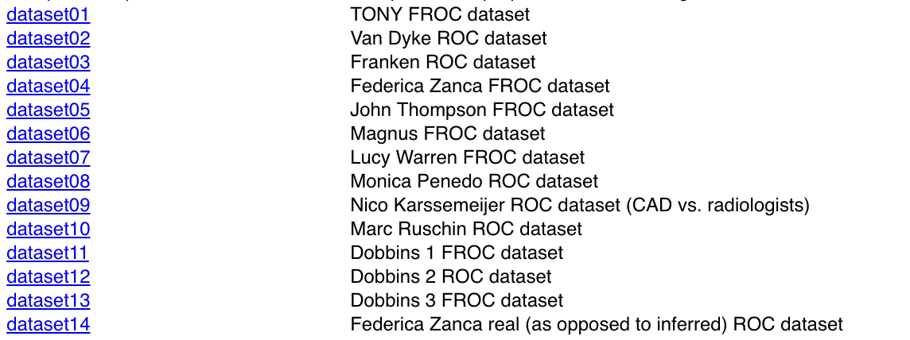
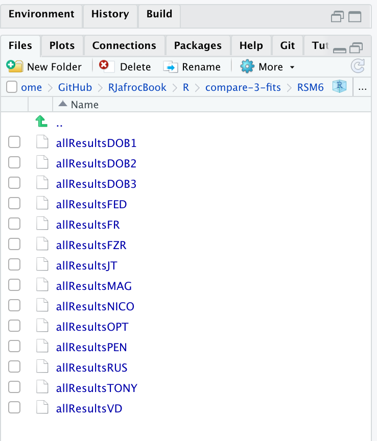

# Three proper ROC fits {#rsm-3-fits}


```{r setup, include=FALSE}
knitr::opts_chunk$set(echo = TRUE)
library(kableExtra)
library(seqinr)
library(RJafroc)
library(ggplot2)
library(gridExtra)
library(binom)
library(here)
```


## How much finished {#rsm-3-fits-how-much-finished}
40%


## Introduction {#rsm-3-fits-intro}
There are three methods for fitting proper curves to ROC datasets. This chapter compares these fits for a number of datasets. The RSM fitting algorithm was tested against PROPROC and CBM, both of which are proper ROC fitting methods described in TBA Chapter 20. Comparing RSM against the binormal model would be inappropriate, as the latter does not predict proper ROCs.


## Datasets {#rsm-3-fits-14-datasets}

```{r rsm-3-fits-datasets, echo=FALSE,fig.cap="`RJafroc` embedded datasets displayed by help file.",fig.show='hold',fig.align='center'}

``` 

Fig. \@ref(fig:rsm-3-fits-datasets): Screen shot of `RJafroc` help file showing the datasets included with the current distribution (v2.0.1).


The datasets are identified in the code by character strings `datasetxx` as follows:

* `dataset01` "TONY" FROC dataset [@RN2125]

```{r, echo=FALSE}
str(dataset01$ratings)
str(dataset01$descriptions$design)
```


* `dataset01` "VAN-DYKE" Van Dyke ROC dataset [@RN1993]

```{r, echo=FALSE}
str(dataset02$ratings)
str(dataset02$descriptions$design)
```


* `dataset03` "FRANKEN" Franken ROC dataset [@RN1995]

```{r, echo=FALSE}
str(dataset03$ratings)
str(dataset03$descriptions$design)
```


* `dataset04` "FEDERICA" Federica Zanca FROC dataset [@RN1882]

```{r, echo=FALSE}
str(dataset04$ratings)
str(dataset04$descriptions$design)
```


* `dataset05` "THOMPSON" John Thompson FROC dataset [@RN2368]

```{r, echo=FALSE}
str(dataset05$ratings)
str(dataset05$descriptions$design)
```


* `dataset06` "MAGNUS" Magnus Bath FROC dataset [@RN1929]

```{r, echo=FALSE}
str(dataset06$ratings)
str(dataset06$descriptions$design)
```


* `dataset07` "LUCY-WARREN" Lucy Warren FROC dataset [@RN2507]

```{r, echo=FALSE}
str(dataset07$ratings)
str(dataset07$descriptions$design)
```


* `dataset08` "PENEDO" Monica Penedo FROC dataset [@RN1520]

```{r, echo=FALSE}
str(dataset08$ratings)
str(dataset08$descriptions$design)
```


* `dataset09` "NICO-CAD-ROC" Nico Karssemeijer ROC dataset [@hupse2013standalone]

```{r, echo=FALSE}
str(dataset09$ratings)
str(dataset09$descriptions$design)
```


* `dataset10` "RUSCHIN" Mark Ruschin ROC dataset [@RN1646]

```{r, echo=FALSE}
str(dataset10$ratings)
str(dataset10$descriptions$design)
```


* `dataset11` "DOBBINS-1" Dobbins I FROC dataset [@Dobbins2016MultiInstitutional]

```{r, echo=FALSE}
str(dataset11$ratings)
str(dataset11$descriptions$design)
```


* `dataset12`  "DOBBINS-2" Dobbins II ROC dataset [@Dobbins2016MultiInstitutional]

```{r, echo=FALSE}
str(dataset12$ratings)
str(dataset12$descriptions$design)
```


* `dataset13` "DOBBINS-3" Dobbins III FROC dataset [@Dobbins2016MultiInstitutional]

```{r, echo=FALSE}
str(dataset13$ratings)
str(dataset13$descriptions$design)
```


* `dataset14` "FEDERICA-REAL-ROC" Federica Zanca *real* ROC dataset [@RN2318]

```{r, echo=FALSE}
str(dataset14$ratings)
str(dataset14$descriptions$design)
```


An additional dataset is not used in this chapter.


* `datasetCrossedModality` "THOMPSON-X-MOD" John Thompson FROC dataset [@RN2419]

```{r, echo=FALSE}
str(datasetCrossedModality$ratings)
str(datasetCrossedModality$descriptions$design)
```


## Application to datasets {#rsm-3-fits-roc-application-datasets}
The RSM and CBM, implemented in `RJafroc` and `PROPROC`, implemented in software available from the University of Iowa ROC website, were applied to the fourteen datasets.


The RSM has three parameters (excluding thresholds) $\mu$, $\lambda'$, and $\nu'$. CBM has two parameters $\mu$ and $\alpha$, as detailed in TBA Chapter 20. Both RSM and CBM fitting methods are implemented in `RJafroc`. 

`PROPROC` is a two-parameter model, with parameters $c$ and $d_a$, as detailed in TBA Chapter 20: these parameters were obtained by running Windows software (OR DBM-MRMC 2.5 (Sept. 04, 2014) with PROPROC selected as the curve-fitting method. The relevant results are saved in files that end with "proprocnormareapooled.csv" ^[In accordance with R-package policies white-spaces in the original `PROPROC` output file name have been removed.] contained in "R/compare-3-fits/MRMCRuns/xx/", where xx denotes the name of the dataset (for example, for the Van Dyke dataset, xx = "VD"). The `VD.lrc` file is the Van Dyke data formatted for input to OR DBM-MRMC 2.5. The values $c$ and $d_a$  are in the last two columns, see Fig. \@ref(fig:rsm-3-fits-proproc-output-van-dyke). The column names are `T` = treatment; `R` = reader; `return-code` = undocumented value, `area` = PROPROC AUC; `numCAT` = number of ROC bins; `adjPMean` = undocumented value; `c` =  $c$ and `d_a` =  $d_a$, are the PROPROC parameters defined in [@RN1499].


```{r rsm-3-fits-proproc-output-van-dyke, echo=FALSE,out.width="50%",out.height="20%",fig.cap="PROPROC output for Van Dyke ROC data set.",fig.show='hold',fig.align='center'}
knitr::include_graphics("images/compare-3-fits/vanDyke.png")
``` 


```{r rsm-3-fits-code, echo=FALSE}
source(here("R/compare-3-fits/Compare3ProperRocFits.R"))
```


```{r rsm-3-fits-code-f2, echo=TRUE, cache=TRUE}
startIndx <-  2
endIndx <- 2
ret <- Compare3ProperRocFits(startIndx = startIndx, 
                             endIndx = endIndx, 
                             reAnalyze = FALSE)

plotArr <- array(list(), dim = c(endIndx - startIndx + 1))

for (f in 1:(endIndx-startIndx+1)) {
  plotArr[[f]] <- ret$allCompPlots[[f]]
}
```


```{r rsm-3-fits-f2, fig.cap="Each panel shows RSM (black), CBM (blue) and PROPROC (red) curves fitted to the same ROC dataset. Operating points are shown as filled circles (confidence intervals are only shown for the lowest and uppermost points). In each plot the labels at the top identify the dataset (f), the treatment (i) and the reader (j) indices.", fig.show='hold', echo=FALSE}
  f <- 1
  I <- dim(ret$allCompPlots[[f]])[1]
  J <- dim(ret$allCompPlots[[f]])[2]
  for (i in 1:I) {
    for (ip in i:I) {
      if (i == ip) next
      if (i > ip) next
      for (j in 1:J) {
        p1 <- plotArr[[f]][[i,j]]
        p2 <- plotArr[[f]][[ip,j]]
        gA <- ggplotGrob(p1)
        gB <- ggplotGrob(p2)
        #grid::grid.newpage()
        #grid::grid.draw(cbind(gA, gB))
        # see R/learn/_grid.arrange.Rmd
        grid.arrange(gA,gB, ncol=2, widths = c(1,1), 
             heights=unit(c(4), c("in")))
      }
    }
  }
```


Fig. 18.3: Screen shot of the `R/compare-3-fits/MRMCRuns` directory showing the contents of the file VD_MRMC proproc area pooled.csv generated by Windows DBM-MRMC for the VD dataset with PROPROC analysis selected. The last two columns contain the  ,   parameters of the PROPROC algorithm for this dataset. For example, for treatment 2 and reader 1,   =  0.321 and   = 2.35. Since there are five readers and two treatments, the file has 10 data rows. Row 10, showing results for treatment 2 and reader 5, yielded c = 1 and  = 0, corresponding to perfect performance, AUC = 1. `T` = treatment; `R` = reader; `area` = PROPROC AUC; `numCAT` = # ROC bins; `adjPMean` = undocumented value; `c` =  $c$ parameter; `d_a` =  $d_a$ parameter defined in [@RN1499].

The analysis code is in file `R/compare-3-fits/Compare3ProperRocFits.R`. Briefly, it reads the dataset file, applies RSM and CBM fitting, reads the appropriate PROPROC parameters from OR DBM-MRMC 2.5 generated files and returns results and plots. 


```{r rsm-3-fits-rsm6, echo=FALSE,out.width="50%",out.height="20%",fig.cap="Pre-analyzed results files contained in `R/compare-3-fits/RSM6`.",fig.show='hold',fig.align='center'}

``` 


 
Fig. \@ref(fig:rsm-3-fits-rsm6): Contents of directory `R/compare-3-fits/RSM6`. Each file contains the results of RSM, PROPROC and CBM fits to the dataset named following `allResults`. For example, `allResultsVD` contains the results for the Van Dyke dataset.

The object `ret` contains all the results; this saves time by not having to reanalyze datasets.

They are index by f (for filename). Line 24 selects the dataset to be analyzed. In the example shown the "TONY" dataset has been selected 21. Line 27 - 28 loads the dataset (loadDataFile) and converts it to an ROC dataset (DfFRoc2HrRoc; for an ROC dataset this function is redundant). The PROPROC parameter values were extracted from the saved text files, described above, using function ProprocFits(), called at line 37. Line 55 implements Eqn. (36) of the Metz and Pan paper6 to calculate   from the retrieved  ,   parameters. The formula will be detailed later in Chapter 20. Line 56 calls function FitRsmRoc(frocData,i,j). The (i,j) indices tell the function which treatment and reader to analyze. The conversion to ROC data is performed internal to this function . Lines 57 – 60 extract the three parameters and the RSM-fitted AUC. Line 61 calls function UtilOperatingPoints() to get the ROC operating points defined by the selected dataset, treatment and reader. Line 63 performs the CBM fit using function FitCbmRoc(). 

Since all 14 datasets have already been analyzed and the results saved, all the the preceding analysis is bypassed (see test at line 43 for existence of a pre-analyzed results file) and program execution starts effectively at line 76, which loads the saved results using the load() function, which is the inverse of the save() function used at line 74 for a new dataset. Line 78 – 97 extract parameters of the three fits, and plot three curves, using PlotRsmPropCbm(), with superposed the operating points, with exact binomial confidence intervals. The black line fit is RSM, the red line fit is PROPROC and the blue line fit is CBM. An example is shown in 18.5 (A).

Source the code, with the TONY dataset selected, yielding the following code output and plots like those in Fig. 18.5 (A - L). All generated plots for the TONY dataset are not shown in this figure, which shows instead, a sampling of 12 plots from the 14 datasets. The red font indicates an instance where the chi-square goodness of fit and degrees of freedom could be calculated; the NAs indicate when it could not.


Here is an explanation of the variable names used in the code output:     

* mu = $\mu$ = RSM perceptual SNR parameter
* lambdaP = $\lambda'$ = RSM Poisson parameter (physical)
* nuP = $\nu'$ = RSM binomial parameter (physical)
* c = $c$ = PROPROC c-parameter
* da = $d_a$ = PROPROC $d_a$ parameter
* alpha = $\alpha$ = CBM $\alpha$ parameter, probability that disease is visible 
* muCbm = $\mu_{CBM}$ = CBM $\mu$ parameter
* aucRsm = $A_{RSM}$ = RSM AUC
* aucProproc = $A_{PROPROC}$ = PROPROC AUC
* aucCbm = $A_{CBM}$ = CBM AUC
* chisqr(p-value) = $\chi^2$ = RSM goodness of fit statistic p-value
* df = $df_{RSM}$ = RSM goodness of fit degrees of freedom

For the selected dataset, each line of the output lists  , , , , , , , ,   , . The last two values (chisquare goodness of fit statistic and degrees of freedom) are only listed if they can be calculated. Plots are produced of the predicted ROC curves with superposed operating points and 95% confidence intervals. Detailed results for three datasets ("TONY", "VD" and "FR") are reported here and results for all 236 datasets are in the online Supplemental Material directory corresponding to this chapter. 

* The parameters and AUCs are summarized in file RSM Vs. Others.xlsx. 
* Plots comparing the three methods are in RSM Vs. Others.docx.


For this dataset the goodness of fit could only be calculated for treatment 2 and reader 3, p-value = 0.18, df = 1, indicative of a valid fit, and the others are listed as NAs in code output. The output was used to populate the values in Table 18.1. 

Sourcing mainRSM.R two more times, each time with the appropriate dataset specified, yields the results summarized in Table 18.1 for dataset "TONY", in Table 18.2 for (Van Dyke) dataset22 "VD", and in Table 18.3 for (Franken) dataset23 "FR". These tables list, for each treatment (i) and reader (j) in the dataset, RSM parameter estimates  , followed by the corresponding PROPROC parameter estimates   and finally the CBM parameter estimates  . Listed next are the RSM, PROPROC and CBM fitted AUCs. The last row lists the averages of the corresponding AUC columns.


The serendipitous finding, alluded to in the title to this section, is that all three proper ROC fitting methods yield almost identical AUCs, to within a few percent. This is best appreciated by comparing the numbers in the last (AVG) row of each table. To the best of the author's knowledge the near equality of proper ROC AUCs has not been noted in the literature except in a proceedings paper by the author and a collaborator5. The explanation is deferred to §18.6.


## Discussion / Summary {#rsm-3-fits-discussion-summary}
Over the years, there have been several attempts at fitting FROC data. Prior to the RSM-based ROC curve approach described in this chapter, all methods were aimed at fitting FROC curves, in the mistaken belief that this approach was using all the data. The earliest was the author's FROCFIT software36. This was followed by Swensson's approach37, subsequently shown to be equivalent to the author's earlier work, as far as predicting the FROC curve was concerned11. In the meantime, CAD developers, who relied heavily on the FROC curve to evaluate their algorithms, developed an empirical approach that was subsequently put on a formal basis in the IDCA method12. 

This chapter describes an approach to fitting ROC curves, instead of FROC curves, using the RSM. Fits were described for 14 datasets, comprising 236 distinct treatment-reader combinations. All fits and parameter values are viewable in the online "Supplemental Material" directory corresponding to this chapter. Validity of fit was assessed by the chisquare goodness of fit p-value; unfortunately using adjacent bin combining this could not be calculated in most instances; ongoing research at other ways of validating the fits is underway. PROPROC and CBM were fitted to the same datasets, yielding further validation and insights. One of the insights was the finding that the AUCS were almost identical, with PROPROC yielding the highest value, followed by CBM and closely by the RSM. The PROPROC-AUC / CBM-AUC, vs. RSM-AUC straight-line fits, constrained to go through the origin, had slopes 1.0255 (1.021, 1.030) and 1.0097 (1.006, 1.013), respectively. The R2 values were generally in excess of 0.999, indicative of excellent fits.

On the face of it, fitting the ROC curve seems to be ignoring much of the data. As an example, the ROC rating on a non-diseased case is the rating of the highest-rated mark on that image, or negative infinity if the case has no marks. If the case has several NL marks, only the highest rated one is used. In fact the highest rated mark contains information about the other marks on the case, namely they were all rated lower. There is a statistical term for this, namely sufficiency38. As an example, the highest of a number of samples from a uniform distribution is a sufficient statistic, i.e., it contains all the information contained in the observed samples. While not quite the same for normally distributed values, neglect of the NLs rated lower is not as bad as might seem at first. A similar argument applies to LLs and NLs on diseased cases. The advantage of fitting to the ROC is that the coupling of NLs and LLs on diseased cases breaks the degeneracy problem described in §18.2.3.

The reader may wonder why the author chose not to fit the wAFROC. After all, it is the recommended figure of merit for FROC studies. While the methods described in this chapter are readily adapted to the wAFROC, they are more susceptible to degeneracy issues. The reason is that the y-axis is defined by LL-events, in other words by the   parameters, while the x-axis is defined by the highest rated NL on non-diseased cases, in other words by the   parameter. The consequent decoupling of parameters leads to degeneracy of the type described in §18.2.3. This is avoided in ROC fitting because the y-axis is defined by LLs and NLs, in other words all parameters of the RSM are involved. The situation with the wAFROC is not quite as severe as with fitting FROC curves but it does have a problem with degeneracy. There are some ideas on how to improve the fits, perhaps by simultaneously fitting ROC and wAFROC-operating points, which amounts to putting constraints on the parameters, but for now this remains an open research subject. Empirical wAFROC, which is the current method implemented in RJafroc, is expected to have the same issues with variability of thresholds between treatments as the empirical ROC-AUC, as discussed in §5.9. So the fitting problem has to be solved. There is no need to fit the FROC, as it should never be used as a basis of a figure of merit for human observer studies; this is distinct from the severe degeneracy issues encountered with fitting it for human observers.

The application to a large number (236) of real datasets revealed that PROPROC has serious issues. These were apparently not revealed by the millions of simulations used to validate it39. To quote the cited reference, "The new algorithm never failed to converge and produced good fits for all of the several million datasets on which it was tested". This is a good illustration of why simulations studies are not a good alternative to the method described in §18.5.1.3.  In the author's experience, this is a common misconception in this field, and is discussed further in the following chapter. Fig. 18.5, panels (J), (K) and (L) show that PROPROC, and to a lesser extent CBM, can, under some circumstances, severely overestimate performance. Recommendations regarding usage of PROPROC and CBM are deferred to Chapter 20. 

The current ROC-based effort led to some interesting findings. The near equality of the AUCs predicted by the three proper ROC fitting methods, summarized in Table 18.4, has been noted, which is explained by the fact that proper ROC fitting methods represent different approaches to realizing an ideal observer, and the ideal observer must be unique, §18.6. 

This chapter explores what is termed inter-correlations, between RSM and CBM parameters. Since they have similar physical meanings, the RSM and CBM separation parameters were found to be significantly correlated,   = 0.86 (0.76, 0.89), as were the RSM and CBM parameters corresponding to the fraction of lesions that was actually visible,  = 0.77 (0.68, 0.82). This type of correspondence between two different models can be interpreted as evidence of mutually reinforcing validity of each of the models.

The CBM method comes closest to the RSM in terms of yielding meaningful measures, but the fact that it allows the ROC curve to go continuously to (1,1) implies that it is not completely accounting for search performance, §17.8. There are two components to search performance: finding lesions and avoiding non-lesions. The CBM model accounts for finding lesions, but it does not account for avoiding suspicious regions that are non-diseased, an important characteristic of expert radiologists.

An important finding is the inverse correlation between search performance and lesion-classification performance, which suggest there could be tradeoffs in attempts to optimize them. As a simplistic illustration, a low-resolution gestalt-view of the image1, such as seen by the peripheral viewing mechanism, is expected to make it easier to rapidly spot deviations from the expected normal template described in Chapter 15. However, the observer may not be able to switch effectively between this and the high-resolution viewing mode necessary to correctly classify found suspicious region. 

The main scientific conclusion of this chapter is that search-performance is the primary bottleneck in limiting observer performance. It is unfortunate that search is ignored in the ROC paradigm, usage of which is decreasing, albeit at an agonizingly slow rate. Evidence presented in this chapter should convince researchers to reconsider the focus of their investigations, most of which is currently directed at improving classification performance, which has been shown not to be the bottleneck. Another conclusion is that the three method of fitting ROC data yield almost identical AUCs. Relative to the RSM the PROPROC estimates are about 2.6% larger while CBM estimates are about 1% larger. This was a serendipitous finding that makes sense, in retrospect, but to the best of the author's knowledge is not known in the research community. PROPROC and to a lesser extent CBM are prone to severely overestimating performance in situations where the operating points are limited to a steep ascending section at the low end of false positive fraction scale. This parallels an earlier comment regarding the FROC, namely measurements derived from the steep part of the curve are unreliable, §17.10.1.


## Appendix 1


## References {#rsm-3-fits-references}


