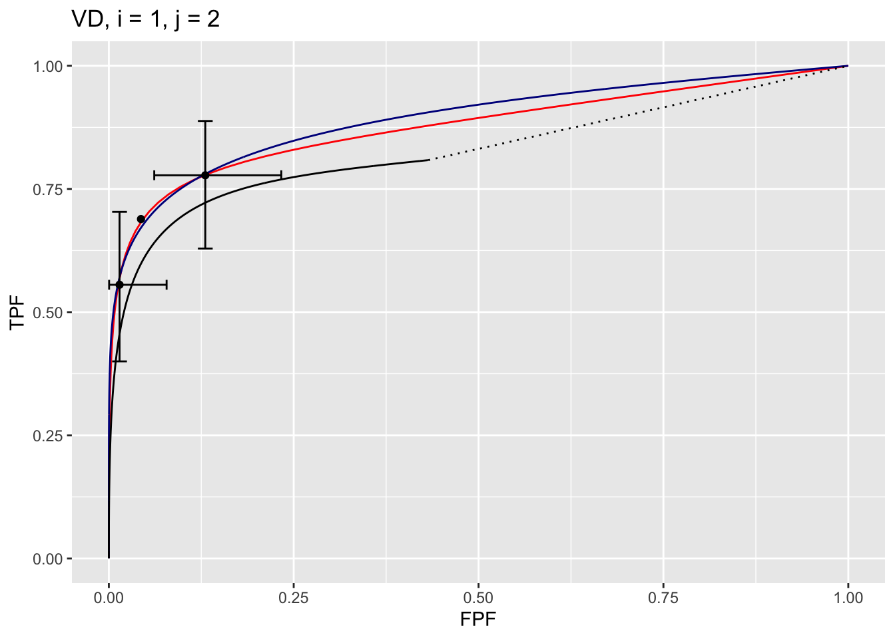
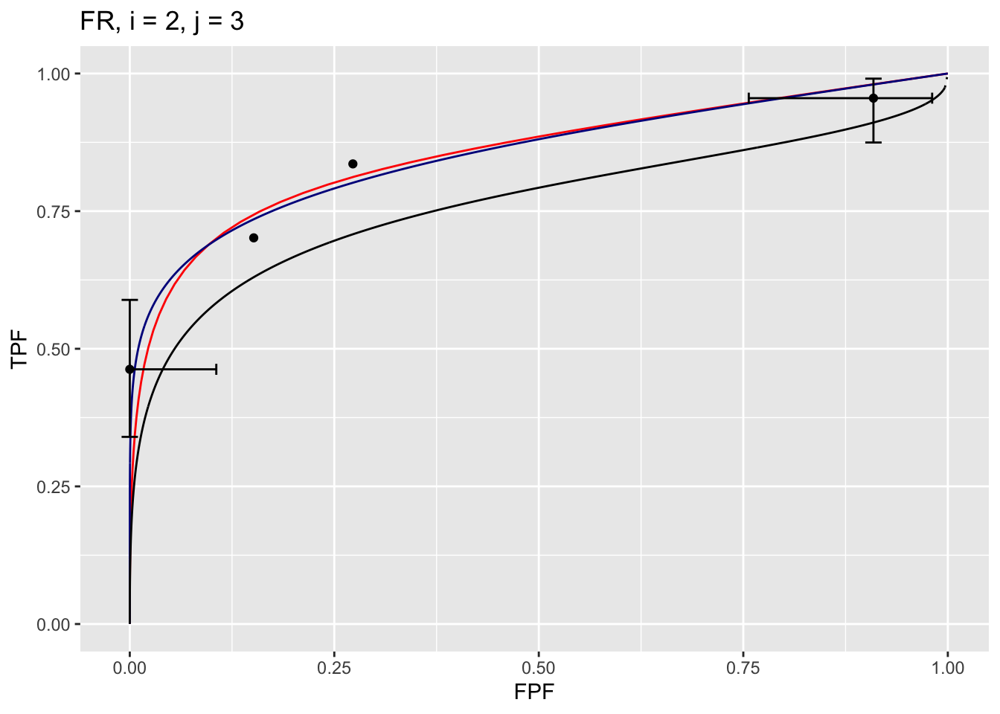

# Three proper ROC fits {#rsm-3-fits}


## How much finished {#rsm-3-fits-how-much-finished}
60%


## Introduction {#rsm-3-fits-intro}
A proper ROC curve is one whose slope decreases monotonically as the operating point moves up the curve, a consequence of which is that a proper ROC does not display an inappropriate chance line crossing followed by a sharp upward turn, i.e., a "hook", usually near the (1,1) upper right corner. 

There are three methods for fitting proper curves to ROC datasets: 

* The radiological search model (RSM) described in Chapter \@ref(rsm-fitting), 
* The PROPROC (proper ROC) and CBM (contaminated binormal model) described in TBA Chapter 20. 

This chapter compares these methods for a number of datasets. Comparing the RSM to the binormal model would be inappropriate, as the latter does not predict proper ROCs.

* Both RSM and CBM are implemented in `RJafroc`. 
* `PROPROC` is implemented in Windows software ^[OR DBM-MRMC 2.5, Sept. 04, 2014; this version, used in this chapter, is no longer distributed but is available from the author upon request.] available [here](https://perception.lab.uiowa.edu/OR-DBM-MRMC-252), last accessed 1/4/21.


## Applications {#rsm-3-fits-applications}

The RSM, PROPROC and CBM algorithms were applied to the 14 datasets described in \@ref(rsm-3-fits-14-datasets). The datasets are indexed as described in \@ref(rsm-3-fits-one-dataset-indexing). To save time the datasets have already been analyzed and the location of pre-analyzed results files are in \@ref(rsm-3-fits-one-dataset-proproc) and \@ref(rsm-3-fits-pre-analyzed-results).


```r
datasetNames <-  c("TONY", "VD", "FR", 
            "FED", "JT", "MAG", 
            "OPT", "PEN", "NICO",
            "RUS", "DOB1", "DOB2", 
            "DOB3", "FZR")
```

Instead of going through all 14 datasets in the following we focus on two ROC datasets widely used to illustrate 
ROC methodological advances, namely the Van Dyke (VD) and the Franken (FR) datasets.


### Application to two datasets {#rsm-3-fits-two-datasets}

The code uses the function `Compare3ProperRocFits()`, located in `R/compare-3-fits/Compare3ProperRocFits.R`, to compute or retrieve the 3 fits. In the following code:

* `startIndx` is the  first `index` to analyze and `endIndx` is the last. 
* In the current example two datasets are analyzed corresponding to `datasetNames[2]` and `datasetNames[3]`, i.e., VD and FR. 
* To analyze all datasets one would set `startIndx <-  1` and `endIndx <-  14`. 
* `reAnalyze` is set to `FALSE` causing pre-analyzed results (to be found in directory `R/compare-3-fits/RSM6`) to be retrieved.
* if `reAnalyze` is `TRUE` the analysis is repeated, leading to possibly slightly different results (the maximum likelihood parameter-search algorithm has inherent randomness aimed at avoiding finding false local maxima). 
* The fitted parameter results are contained in `ret$allResults` and the *composite plots* (i.e., 3 combined plots corresponding to the three proper ROC fitting algorithms) are contained in `ret$allPlots`. 
* These are saved to lists `plotArr` and `resultsArr`. 


```r
startIndx <-  2
endIndx <- 3
ret <- Compare3ProperRocFits(datasetNames,
                             startIndx = startIndx, 
                             endIndx = endIndx, 
                             reAnalyze = FALSE)

resultsArr <- plotArr <- array(list(), 
                               dim = c(endIndx - startIndx + 1))

for (f in 1:(endIndx-startIndx+1)) {
  plotArr[[f]] <- ret$allPlots[[f]]
  resultsArr[[f]] <- ret$allResults[[f]]
}
```

We next show how to display the composite plots.

### Displaying a composite plot {#rsm-3-fits-composite-plot}

The `plotArr` list contains plots for the two datasets. The Van Dyke dataset plots are in `plotArr[[1]]` and the Franken in `plotArr[[2]]`. The Van Dyke plots contain $I \times J = 2 \times 5 = 10$ composite plots, and similarly for the Franken dataset (both datasets consist of 2 treatments and 5 readers). The following shows how to display the composite plot for the Van Dyke dataset for treatment 1 and reader 2. 


```r
plotArr[[1]][[1,2]]
```



The plot is labeled **D2, i = 1, j = 2**, meaning the second dataset, the first treatment and the second reader. It contains 3 curves:

* The RSM fitted curve is in black. It is the only one with a dotted line connecting the uppermost continuously accessible operating point to (1,1).
* The PROPROC fitted curve is in red. 
* The CBM fitted curve is in blue. 
* Three operating points from the binned data are shown as well as exact 95% confidence intervals for the lowest and uppermost operating points. 

The following example displays the composite plots for the Franken dataset, treatment 2 and reader 3:


```r
plotArr[[2]][[2,3]]
```



We next show how to display the parameters corresponding to the fitted curves.

### Displaying RSM parameter values {#rsm-3-fits-rsm-parameter-values}

The RSM has parameters: $\mu$, $\lambda'$, $\nu'$ and $\zeta_1$. The parameters corresponding to the RSM plots are accessed as shown next. 

* `resultsArr[[1]][[2]]$retRsm$mu` is the RSM $\mu$ parameter for dataset 1, treatment 1 and reader 2, 
* `resultsArr[[1]][[2]]$retRsm$lambdaP` is the corresponding $\lambda'$ parameter, and  
* `resultsArr[[1]][[2]]$retRsm$nuP` is the corresponding $\nu'$ parameter. 
* `resultsArr[[1]][[2]]$retRsm$zeta1` is the corresponding $\zeta_1$ parameter. 
* Treatment 2 and reader 1 values would be accessed as `resultsArr[[1]][[6]]$retRsm$mu`, etc.
* More generally the values are accessed as `[[f]][[(i-1)*J+j]]`, where `f` is the dataset index, `i` is the treatment index, `j` is the reader index and `J` is the total number of readers. 
* For the Van Dyke dataset `f = 1` and for the Franken dataset `f = 2`.

The first example displays RSM parameters for the Van Dyke dataset, treatment 1 and reader 2:


```r
f <- 1;i <- 1; j <- 2;J <- 5
cat("RSM parameters, Van Dyke Dataset, treatment 1, reader 2:",
"\nmu = ",        resultsArr[[f]][[(i-1)*J+j]]$retRsm$mu,
"\nlambdaP = ",   resultsArr[[f]][[(i-1)*J+j]]$retRsm$lambdaP,
"\nnuP = ",       resultsArr[[f]][[(i-1)*J+j]]$retRsm$nuP,
"\nzeta_1 = ",    as.numeric(resultsArr[[f]][[(i-1)*J+j]]$retRsm$zetas[1]),
"\nAUC = ",       resultsArr[[f]][[(i-1)*J+j]]$retRsm$AUC,
"\nsigma_AUC = ", as.numeric(resultsArr[[f]][[(i-1)*J+j]]$retRsm$StdAUC),
"\nNLLini = ",    resultsArr[[f]][[(i-1)*J+j]]$retRsm$NLLIni,
"\nNLLfin = ",    resultsArr[[f]][[(i-1)*J+j]]$retRsm$NLLFin)
```

```
## RSM parameters, Van Dyke Dataset, treatment 1, reader 2: 
## mu =  2.201413 
## lambdaP =  0.2569453 
## nuP =  0.7524016 
## zeta_1 =  -0.1097901 
## AUC =  0.8653694 
## sigma_AUC =  0.04740562 
## NLLini =  96.48516 
## NLLfin =  85.86244
```


The next example displays RSM parameters for the Franken dataset, treatment 2 and reader 3:


```
## RSM parameters, Franken dataset, treatment 2, reader 3: 
## mu =  3.287996 
## lambdaP =  9.371198 
## nuP =  0.7186006 
## zeta_1 =  1.646943 
## AUC =  0.8234519 
## sigma_AUC =  0.04054005 
## NLLini =  128.91 
## NLLfin =  122.4996
```

The first four values are the fitted values for the RSM parameters $\mu$, $\lambda'$, $\nu'$ and $\zeta_1$. The next value is the AUC under the fitted RSM curve followed by its standard error. The last two values are the initial and final values of negative log-likelihood ^[The initial value is calculated using initial estimates of parameters and the final value is that resulting from the log-likelihood maximization procedure. Since negative log-likelihood is being *minimized*, the final value is smaller than the initial value.].  


### Displaying CBM parameter values {#rsm-3-fits-cbm-parameter-values}

CBM has parameters $\mu_{CBM}$, $\alpha$ and $\zeta_1$. The next example displays CBM parameters and AUC etc. for the Van Dyke dataset, treatment 1 and reader 2:


```r
f <- 1;i <- 1; j <- 2;J <- 5
cat("CBM parameters, Van Dyke Dataset, treatment 1, reader 2:",
"\nmu = ",         resultsArr[[f]][[(i-1)*J+j]]$retCbm$mu,
"\nalpha = ",      resultsArr[[f]][[(i-1)*J+j]]$retCbm$alpha,
"\nzeta_1 = ",     as.numeric(resultsArr[[f]][[(i-1)*J+j]]$retCbm$zetas[1]),
"\nAUC = ",        resultsArr[[f]][[(i-1)*J+j]]$retCbm$AUC,
"\nsigma_AUC = ",  as.numeric(resultsArr[[f]][[(i-1)*J+j]]$retCbm$StdAUC),
"\nNLLini = ",     resultsArr[[f]][[(i-1)*J+j]]$retCbm$NLLIni,
"\nNLLfin = ",     resultsArr[[f]][[(i-1)*J+j]]$retCbm$NLLFin)
```

```
## CBM parameters, Van Dyke Dataset, treatment 1, reader 2: 
## mu =  2.745791 
## alpha =  0.7931264 
## zeta_1 =  1.125028 
## AUC =  0.8758668 
## sigma_AUC =  0.03964492 
## NLLini =  86.23289 
## NLLfin =  85.88459
```


The next example displays CBM parameters for the Franken dataset, treatment 2 and reader 3:


```
## CBM parameters, Franken dataset, treatment 2, reader 3: 
## mu =  2.533668 
## alpha =  0.6892561 
## zeta_1 =  0.3097191 
## AUC =  0.8194009 
## sigma_AUC =  0.03968962 
## NLLini =  122.6812 
## NLLfin =  122.5604
```


The first three values are the fitted values for the CBM parameters $\mu$, $\alpha$ and $\zeta_1$. The next value is the AUC under the fitted CBM curve followed by its standard error. The last two values are the initial and final values of negative log-likelihood.  


### Displaying PROPROC parameter values {#rsm-3-fits-proproc-parameter-values}


`PROPROC` displayed parameters are $c$ and $d_a$. The next example displays PROPROC parameters for the Van Dyke dataset, treatment 1 and reader 2:


```r
f <- 1;i <- 1; j <- 2;J <- 5
cat("PROPROC parameters, Van Dyke Dataset, treatment 1, reader 2:",
"\nc = ",     resultsArr[[f]][[(i-1)*J+j]]$c1,
"\nd_a = ",   resultsArr[[f]][[(i-1)*J+j]]$da,
"\nAUC = ",   resultsArr[[f]][[(i-1)*J+j]]$aucProp)
```

```
## PROPROC parameters, Van Dyke Dataset, treatment 1, reader 2: 
## c =  -0.2809004 
## d_a =  1.731472 
## AUC =  0.8910714
```


The values are identical to those listed for treatment 1 and reader 2 in Fig. \@ref(fig:rsm-3-fits-proproc-output-van-dyke). Other values, such as standard error of AUC, are not provided by PROPROC software.

The next example displays PROPROC parameters for the Franken dataset, treatment 2 and reader 3:


```
## PROPROC parameters, Franken dataset, treatment 2, reader 3: 
## c =  -0.4420007 
## d_a =  0.9836615 
## AUC =  0.8252824
```


Shown next are all 10 composite plots for the Van Dyke dataset.


## Plots for Van Dyke dataset {#rsm-3-fits-representative-plots-van-dyke}

The following plots are arranged in pairs, with the left plot corresponding to treatment 1 and the right to treatment 2. 


<div class="figure">

<p class="caption">(\#fig:rsm-3-fits-plots-1-1)Composite plots in both treatments for Van Dyke dataset, reader 1.</p>
</div>


<div class="figure">

<p class="caption">(\#fig:rsm-3-fits-plots-1-2)Composite plots in both treatments for Van Dyke dataset, reader 2. For treatment 2 the RSM and PROPROC fits are indistinguishable.</p>
</div>


The RSM parameter values for the treatment 2 plot are: $\mu$ = 5.767237, $\lambda'$ = 2.7212621, $\nu'$ = 0.8021718, $\zeta_1$ = -1.5717303. The corresponding CBM values are $\mu$ = 5.4464738, $\alpha$ = 0.8023609, $\zeta_1$ = -1.4253826. The RSM and CBM $\mu$ parameters are very close and likewise the RSM $\nu'$ and CBM $\alpha$ parameters are very close - this is because they have similar physical meanings, which is investigated later in this chapter TBA. [The CBM does not have a parameter analogous to the RSM $\lambda'$ parameter.] 


<div class="figure">

<p class="caption">(\#fig:rsm-3-fits-plots-1-3)Composite plots in both treatments for Van Dyke dataset, reader 3.</p>
</div>


The RSM parameters for the treatment 1 plot are: $\mu$ = 3.1527627, $\lambda'$ = 9.9986154, $\nu'$ = 0.9899933, $\zeta_1$ = 1.1733988. The corresponding CBM values are $\mu$ = 2.1927712, $\alpha$ = 0.98, $\zeta_1$ = -0.5168848. 


<div class="figure">

<p class="caption">(\#fig:rsm-3-fits-plots-1-4)Composite plots in both treatments for Van Dyke dataset, reader 4. For treatment 2 the 3 plots are indistinguishable and each one has AUC = 1. The degeneracy is due to all operating points being on the axes of the unit square.</p>
</div>


<div class="figure">

<p class="caption">(\#fig:rsm-3-fits-plots-1-5)Composite plots in both treatments for Van Dyke dataset, reader 5.</p>
</div>

## Overview of findings {#rsm-3-fits-overview}

With 14 datasets the total number of individual modality-reader combinations is 236: in other words, there are 236 datasets to each of which the three algorithms were applied. It is easy to be overwhelmed by the numbers and this section summarizes the most important conclusion: *all three fitting methods are consistent with a single method-independent AUC*.

If the AUCs of the three methods are identical the following relations should hold: 


\begin{equation}
\left. 
\begin{aligned}
AUC_{PRO} =& m_{PR} AUC_{PRO}  \\
AUC_{CBM} =& m_{CR} AUC_{PRO}  
\end{aligned}
\right \}
(\#eq:rsm-3-fits-slopes-equation1)
\end{equation}

The abbreviations are as follows: 

* PRO = PROPROC, 
* PR = PROPROC vs. RSM and 
* CR = CBM vs. RSM. 

For example, a plot of PROPROC AUC vs. RSM AUC should be linear with zero intercept and slope $m_{PR}$. The reason for the *zero intercept* is that if one of the AUCs indicates zero performance the other AUC must also be zero. Likewise, chance level performance (AUC = 0.5) must be common to all method of estimating AUC. Finally, perfect performance must be common to all methods. All of these conditions require a zero-intercept linear fit. 


An analysis was conducted to determine the average slopes $<m_{PR}>$ and $<m_{CR}>$, averaged over all datasets, and a bootstrap analysis was conducted to determine the corresponding confidence intervals. The code for calculating the slopes is in `R/compare-3-fits/slopesConvVsRsm.R` and that for calculating the bootstrap confidence intervals is in  `R/compare-3-fits/slopesConvVsRsmCI.R`.   


```r
ret <- slopesConvVsRsm(datasetNames)
retCI <- slopesConvVsRsmCI(datasetNames)
x <- cbind(ret$m_pro_rsm, ret$m_cbm_rsm)
x <- rbind(x, apply(x,2, mean))
x  <- round(x, digits = 4)
z1 <- format(retCI$cislopeProRsm, digits = 4)
z2 <- format(retCI$cislopeCbmRsm, digits = 3)
x <- rbind(x, 
           c(paste0("(", z1[1], ", ", z1[2], ")"), # for seed = 1
             NA,
             paste0("(", z2[1], ", ", z2[2], ")"), # for seed = 1
             NA))
row.names(x) <- c(as.character(1:14), "AVG", "CI")
colnames(x) <- c("mProRsm", "R2ProRsm", "mCbmRsm", "R2CbmRsm")
```


The call to function `slopesConvVsRsm()` returns `ret`, which contains, for each of 14 datasets, two plots and two slopes. For example:

* `ret$p1[[2]]` is the plot of $AUC_{PRO}$ vs. of $AUC_{RSM}$ for the Van Dyke dataset (`index` = 2).
* `ret$p2[[2]]` is the plot of $AUC_{CBM}$ vs. of $AUC_{RSM}$ for the Van Dyke dataset (`index` = 2).
* `ret$p1[[3]]` is the plot of $AUC_{PRO}$ vs. of $AUC_{RSM}$ for the Franken dataset (`index` = 3).
* `ret$p2[[3]]` is the plot of $AUC_{CBM}$ vs. of $AUC_{RSM}$ for the Franken dataset (`index` = 3).
* `ret$m_pro_rsm` has two columns, each of length 14, the slopes $m_{PR}$ for the datasets and the corresponding R2 values.  
* `ret$m_cbm_rsm` has two columns, each of length 14, the slopes $m_{CR}$ for the datasets and the corresponding R2 values.  

As an example, `ret$p1[[2]]`, the plot plot of $AUC_{PRO}$ vs. of $AUC_{RSM}$ for the Van Dyke dataset (`index` = 2), is shown below:


```r
ret$p1[[2]]
```


It is labeled **D2, nPts = 10** since it corresponds to the Van Dyke dataset, with 10 treatment-reader pairings.

The slopes and R2 values for the 14 datasets are shown next:


```r
ret$m_pro_rsm[[1]][2] # slope m_PR for Van Dyke dataset 
```

```
## [1] 1.006127
```

```r
ret$m_pro_rsm[[2]][2] # corresponding R2
```

```
## [1] 0.999773
```

```r
ret$m_cbm_rsm[[1]][2] # slope m_CR for Van Dyke dataset 
```

```
## [1] 1.000699
```

```r
ret$m_cbm_rsm[[2]][2] # corresponding R2
```

```
## [1] 0.9999832
```


The call to `slopesConvVsRsmCI` returns `retCI`, containing (note that $<...>$ *always* represents an average over 14 datasets.):

* `retCI$cislopeProRsm` confidence interval for $<m_{PR}>$
* `retCI$cislopeCbmRsm` confidence interval for $<m_{CR}>$
* `retCI$histSlopeProRsm` histogram plot for 200 bootstrap values of $<m_{PR}>$
* `retCI$histSlopeCbmRsm` histogram plot for 200 bootstrap values of $<m_{CR}>$
* `retCI$ciAvgAucRsm` confidence interval for 200 bootstrap values of $<AUC_{RSM}>$
* `retCI$ciAvgAucPro` confidence interval for 200 bootstrap values of $<AUC_{PRO}>$
* `retCI$ciAvgAucCbm` confidence interval for 200 bootstrap values of $<AUC_{CBM}>$

As examples,


```r
retCI$cislopeProRsm
```

```
##     2.5%    97.5% 
## 1.005092 1.012285
```

```r
retCI$cislopeCbmRsm
```

```
##      2.5%     97.5% 
## 0.9919886 0.9966149
```

The CI for $<m_{PR}>$ is slightly above unity, while that for $<m_{CR}>$ is slightly below. Shown next is the histogram plot for $<m_{PR}>$ and $<m_{CR}>$.


