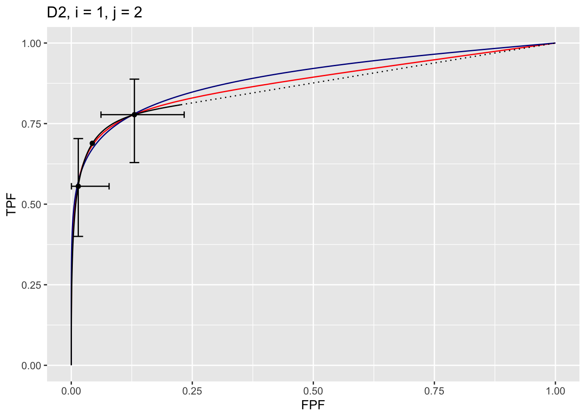

# Three proper ROC fits {#rsm-3-fits}


## How much finished {#rsm-3-fits-how-much-finished}
40%


## Introduction {#rsm-3-fits-intro}
There are three methods for fitting proper curves to ROC datasets. These are the RSM described in Chapter \@ref(rsm-fitting), and the PROPROC (proper ROC) and CBM (contaminated binormal model) described in TBA Chapter 20. This chapter compares these methods for a number of datasets. ^[Comparing the RSM to the binormal model would be inappropriate, as the latter does not predict proper ROCs.]


## Datasets {#rsm-3-fits-14-datasets}


```r
?`RJafroc-package`
```


The datasets are embedded in ther `RJafroc` package. They can be viewed in the help file of the package, a partial screen-shot of which is shown next.


<div class="figure" style="text-align: center">

<p class="caption">(\#fig:rsm-3-fits-datasets)Partial screen shot of `RJafroc` help file showing the datasets included with the current distribution (v2.0.1).</p>
</div>


The datasets are identified in the code by `datasetdd` (where `dd` is an integer in the range `01` to `14`) as follows:

* `dataset01` "TONY" FROC dataset [@RN2125]


```
## List of 3
##  $ NL   : num [1:2, 1:5, 1:185, 1:3] 3 -Inf 3 -Inf 4 ...
##  $ LL   : num [1:2, 1:5, 1:89, 1:2] 4 4 3 -Inf 3.5 ...
##  $ LL_IL: logi NA
```


* `dataset01` "VAN-DYKE" Van Dyke ROC dataset [@RN1993]


```
## List of 3
##  $ NL   : num [1:2, 1:5, 1:114, 1] 1 3 2 3 2 2 1 2 3 2 ...
##  $ LL   : num [1:2, 1:5, 1:45, 1] 5 5 5 5 5 5 5 5 5 5 ...
##  $ LL_IL: logi NA
```


* `dataset03` "FRANKEN" Franken ROC dataset [@RN1995]


```
## List of 3
##  $ NL   : num [1:2, 1:4, 1:100, 1] 3 3 4 3 3 3 4 1 1 3 ...
##  $ LL   : num [1:2, 1:4, 1:67, 1] 5 5 4 4 5 4 4 5 2 2 ...
##  $ LL_IL: logi NA
```


* `dataset04` "FEDERICA" Federica Zanca FROC dataset [@RN1882]


```
## List of 3
##  $ NL   : num [1:5, 1:4, 1:200, 1:7] -Inf -Inf 1 -Inf -Inf ...
##  $ LL   : num [1:5, 1:4, 1:100, 1:3] 4 5 4 5 4 3 5 4 4 3 ...
##  $ LL_IL: logi NA
```


* `dataset05` "THOMPSON" John Thompson FROC dataset [@RN2368]


```
## List of 3
##  $ NL   : num [1:2, 1:9, 1:92, 1:7] 4 5 -Inf -Inf 8 ...
##  $ LL   : num [1:2, 1:9, 1:47, 1:3] 5 9 -Inf 10 8 ...
##  $ LL_IL: logi NA
```


* `dataset06` "MAGNUS" Magnus Bath FROC dataset [@RN1929]


```
## List of 3
##  $ NL   : num [1:2, 1:4, 1:89, 1:17] 1 -Inf -Inf -Inf 1 ...
##  $ LL   : num [1:2, 1:4, 1:42, 1:15] -Inf -Inf -Inf -Inf -Inf ...
##  $ LL_IL: logi NA
```


* `dataset07` "LUCY-WARREN" Lucy Warren FROC dataset [@RN2507]


```
## List of 3
##  $ NL   : num [1:5, 1:7, 1:162, 1:4] 1 2 1 2 -Inf ...
##  $ LL   : num [1:5, 1:7, 1:81, 1:3] 2 -Inf 2 -Inf 1 ...
##  $ LL_IL: logi NA
```


* `dataset08` "PENEDO" Monica Penedo FROC dataset [@RN1520]


```
## List of 3
##  $ NL   : num [1:5, 1:5, 1:112, 1] 3 2 3 2 3 0 0 4 0 2 ...
##  $ LL   : num [1:5, 1:5, 1:64, 1] 3 2 4 3 3 3 3 4 4 3 ...
##  $ LL_IL: logi NA
```


* `dataset09` "NICO-CAD-ROC" Nico Karssemeijer ROC dataset [@hupse2013standalone]


```
## List of 3
##  $ NL   : num [1, 1:10, 1:200, 1] 28 0 14 0 16 0 31 0 0 0 ...
##  $ LL   : num [1, 1:10, 1:80, 1] 29 12 13 10 41 67 61 51 67 0 ...
##  $ LL_IL: logi NA
```


* `dataset10` "RUSCHIN" Mark Ruschin ROC dataset [@RN1646]


```
## List of 3
##  $ NL   : num [1:3, 1:8, 1:90, 1] 1 0 0 0 0 0 1 0 0 0 ...
##  $ LL   : num [1:3, 1:8, 1:40, 1] 2 1 1 2 0 0 0 0 0 3 ...
##  $ LL_IL: logi NA
```


* `dataset11` "DOBBINS-1" Dobbins I FROC dataset [@Dobbins2016MultiInstitutional]


```
## List of 3
##  $ NL   : num [1:4, 1:5, 1:158, 1:4] -Inf -Inf -Inf -Inf -Inf ...
##  $ LL   : num [1:4, 1:5, 1:115, 1:20] -Inf -Inf -Inf -Inf -Inf ...
##  $ LL_IL: logi NA
```


* `dataset12`  "DOBBINS-2" Dobbins II ROC dataset [@Dobbins2016MultiInstitutional]


```
## List of 3
##  $ NL   : num [1:4, 1:5, 1:152, 1] -Inf -Inf -Inf -Inf -Inf ...
##  $ LL   : num [1:4, 1:5, 1:88, 1] 3 4 4 -Inf -Inf ...
##  $ LL_IL: logi NA
```


* `dataset13` "DOBBINS-3" Dobbins III FROC dataset [@Dobbins2016MultiInstitutional]


```
## List of 3
##  $ NL   : num [1:4, 1:5, 1:158, 1:4] -Inf 3 -Inf 4 5 ...
##  $ LL   : num [1:4, 1:5, 1:106, 1:15] -Inf -Inf -Inf -Inf -Inf ...
##  $ LL_IL: logi NA
```


* `dataset14` "FEDERICA-REAL-ROC" Federica Zanca *real* ROC dataset [@RN2318]


```
## List of 3
##  $ NL   : num [1:2, 1:4, 1:200, 1] 2 2 2 2 1 3 2 2 3 1 ...
##  $ LL   : num [1:2, 1:4, 1:100, 1] 6 5 6 4 5 5 5 5 5 4 ...
##  $ LL_IL: logi NA
```


## Application to one dataset {#rsm-3-fits-one-dataset}

Both RSM and CBM fitting methods are implemented in `RJafroc`. `PROPROC` is implemented in Windows software ^[OR DBM-MRMC 2.5 (Sept. 04, 2014; this version is no longer distributed but is available upon request.] available [here](https://perception.lab.uiowa.edu/OR-DBM-MRMC-252), last accessed 1/4/21.


The RSM has three parameters (excluding thresholds): $\mu$, $\lambda'$, and $\nu'$. CBM has two parameters $\mu_{CBM}$ and $\alpha$. `PROPROC` has two parameters $c$ and $d_a$. CBM and PROPROC are detailed in TBA Chapter 20. 


### Location of PROPROC files {#rsm-3-fits-one-dataset-proproc}

For each dataset PROPROC parameters were obtained by running the software with PROPROC selected as the curve-fitting method. The results are saved to files that end with `proprocnormareapooled.csv` ^[In accordance with R-package policies white-spaces in the original `PROPROC` output file names have been removed.] contained in "R/compare-3-fits/MRMCRuns/CCC/", where `CCC` denotes the name of the dataset (for example, for the Van Dyke dataset, `CCC` = "VD"). Examples are shown in the next two screen-shots.


<div class="figure" style="text-align: center">

<p class="caption">(\#fig:rsm-3-fits-mrmc-runs)Screen shot (1 of 2) of `R/compare-3-fits/MRMCRuns` showing the results of PROPROC analysis on 14 datasets.</p>
</div>


<div class="figure" style="text-align: center">

<p class="caption">(\#fig:rsm-3-fits-mrmc-runs-vd)Screen shot (2 of 2) of `R/compare-3-fits/MRMCRuns/VD` showing the results of PROPROC analysis for the Van Dyke dataset.</p>
</div>

The contents of `R/compare-3-fits/MRMCRuns/VD/VDproprocnormareapooled.csv` are shown next, see Fig. \@ref(fig:rsm-3-fits-proproc-output-van-dyke). ^[The `VD.lrc` file in this directory is the Van Dyke data formatted for input to OR DBM-MRMC 2.5.] The PROPROC parameters $c$ and $d_a$  are in the last two columns. The column names are `T` = treatment; `R` = reader; `return-code` = undocumented value, `area` = PROPROC AUC; `numCAT` = number of ROC bins; `adjPMean` = undocumented value; `c` =  $c$ and `d_a` =  $d_a$, are the PROPROC parameters defined in [@RN1499].


<div class="figure" style="text-align: center">

<p class="caption">(\#fig:rsm-3-fits-proproc-output-van-dyke)PROPROC output for the Van Dyke ROC data set.</p>
</div>


### Dataset indexing {#rsm-3-fits-one-dataset-indexing}

The datasets are indexed by an integer 1 through 14. The following shows the correspondence of `index` to dataset name.


```r
index <- seq(1:14)
fileNames <-  c("TONY", "VD", "FR", 
            "FED", "JT", "MAG", 
            "OPT", "PEN", "NICO",
            "RUS", "DOB1", "DOB2", 
            "DOB3", "FZR")

cat("File name for index = ", index[2], " is ", fileNames[index[2]], "\n")
```

```
## File name for index =  2  is  VD
```

### All results for Van Dyke dataset {#rsm-3-fits-one-dataset-all-results}

The following screen shot shows the pre-analyzed files created by the function `Compare3ProperRocFits()` described below. Each file is named `allResultsCCC`, where `CCC` is the name of the dataset.

<div class="figure" style="text-align: center">

<p class="caption">(\#fig:rsm-3-fits-all-results-rsm6)Screen shot of `R/compare-3-fits/RSM6` showing the results files created by  `Compare3ProperRocFits()` .</p>
</div>


In the following example only the `VD` dataset is analyzed. The flag `reAnalyze` is set to `FALSE` causing pre-analyzed results (to be found in directory `R/compare-3-fits/RSM6`) to be read; if `TRUE` the analysis is redone, leading to possibly slightly different results (the maximum likelihood algorithm has inherent randomness). The `list` variable `ret` contains the results, in `allResults`, and the composite plots, in `allPlots`. These are saved to lists `plotArr` and `resultsArr`.

The following code uses the function `Compare3ProperRocFits()` to compute the 3 fits. In this code `startIndx` is the  first `index` to analyze and `endIndx` is the last. To analyze all datasets one would put `startIndx <-  1` and `endIndx <-  14`. 


```r
startIndx <-  2
endIndx <- 2
ret <- Compare3ProperRocFits(startIndx = startIndx, 
                             endIndx = endIndx, 
                             reAnalyze = FALSE)

resultsArr <- plotArr <- array(list(), 
                               dim = c(endIndx - startIndx + 1))

for (f in 1:(endIndx-startIndx+1)) {
  plotArr[[f]] <- ret$allPlots[[f]]
  resultsArr[[f]] <- ret$allResults[[f]]
}
```


### Displaying one plot {#rsm-3-fits-one-plot}

The `plotArr` list contains the plots. For the current example, the plots are contained in `plotArr[[1]]`, where the list index `[[1]]` is because there is only one dataset being analyzed (the Van Dyke dataset). ^[With two datasets, the first dataset plots would be in `plotArr[[1]]` and the second in `plotArr[[2]]`.] 

It contains $I \times J = 2 \times 5 = 10$ plots. To display the plot for the VD dataset for treatment 1 and reader 2, use `plotArr[[1]][[1,2]]` as shown below. 


```r
plotArr[[1]][[1,2]]
```



The plot is labeled **D2, i = 1, j = 2**, meaning the second dataset, the first treatment and the second reader. It contains 3 curves:

* The RSM fitted curve is in black. It is the only one with a dotted line connecting the uppermost continuously accessible operating point to (1,1).
* The PROPROC fitted curve is in red. 
* The CBM fitted curve is in blue. 

Three operating points from the binned data are shown as well as exact 95% confidence intervals for the lowest and uppermost operating points. 


### Displaying RSM parameter values {#rsm-3-fits-rsm-one-dataset}

The parameter values corresponding to RSM plot are accessed as shown next.


```r
cat("RSM mu = ", resultsArr[[1]][[2]]$retRsm$mu,
"\nRSM lambdaP = ", resultsArr[[1]][[2]]$retRsm$lambdaP,
"\nRSM nuP = ", resultsArr[[1]][[2]]$retRsm$nuP,
"\nRSM zeta_1 = ", as.numeric(resultsArr[[1]][[2]]$retRsm$zetas[1]),
"\nRSM AUC = ", resultsArr[[1]][[2]]$retRsm$AUC,
"\nRSM sigma_AUC = ", as.numeric(resultsArr[[1]][[2]]$retRsm$StdAUC),
"\nRSM NLLini = ", resultsArr[[1]][[2]]$retRsm$NLLIni,
"\nRSM NLLfin = ", resultsArr[[1]][[2]]$retRsm$NLLFin)
```

```
## RSM mu =  2.201413 
## RSM lambdaP =  0.2569453 
## RSM nuP =  0.7524016 
## RSM zeta_1 =  -0.1097901 
## RSM AUC =  0.8653694 
## RSM sigma_AUC =  0.04740562 
## RSM NLLini =  96.48516 
## RSM NLLfin =  85.86244
```

The first four values are the fitted values for the RSM parameters $\mu$, $\lambda'$, $\nu'$ and $\zeta_1$. The next value is the AUC under the fitted RSM curve followed by its standard error. The last two values are the initial and final values of negative log-likelihood ^[The initial value is calculated using initial estimates of parameters and the final value is that resulting from the log-likelihood maximization procedure].  


### Displaying CBM parameter values {#rsm-3-fits-cbm-one-dataset}


```r
cat("CBM mu = ", resultsArr[[1]][[2]]$retCbm$mu,
"\nCBM alpha = ", resultsArr[[1]][[2]]$retCbm$alpha,
"\nCBM zeta_1 = ", as.numeric(resultsArr[[1]][[2]]$retCbm$zetas[1]),
"\nCBM AUC = ", resultsArr[[1]][[2]]$retCbm$AUC,
"\nCBM sigma_AUC = ", as.numeric(resultsArr[[1]][[2]]$retCbm$StdAUC),
"\nCBM NLLini = ", resultsArr[[1]][[2]]$retCbm$NLLIni,
"\nCBM NLLfin = ", resultsArr[[1]][[2]]$retCbm$NLLFin)
```

```
## CBM mu =  2.745791 
## CBM alpha =  0.7931264 
## CBM zeta_1 =  1.125028 
## CBM AUC =  0.8758668 
## CBM sigma_AUC =  0.03964492 
## CBM NLLini =  86.23289 
## CBM NLLfin =  85.88459
```

The first three values are the fitted values for the CBM parameters $\mu$, $\alpha$, and $\zeta_1$. The next value is the AUC under the fitted CBM curve followed by its standard error. The last two values are the initial and final values of negative log-likelihood.  


### Displaying PROPROC parameter values {#rsm-3-fits-proproc-one-dataset}


```r
cat("PROPROC c = ", resultsArr[[1]][[2]]$c1,
"\nPROPROC d_a = ", resultsArr[[1]][[2]]$da,
"\nPROPROC AUC = ", resultsArr[[1]][[2]]$aucProp)
```

```
## PROPROC c =  -0.2809004 
## PROPROC d_a =  1.731472 
## PROPROC AUC =  0.8910714
```

These values are identical to those listed for treatment 1 and reader 2 in Fig. \@ref(fig:rsm-3-fits-proproc-output-van-dyke). ^[Other values for PROPROC (e.g., standard error of AUC) are not available to me.]


## All plots for Van Dyke dataset {#rsm-3-fits-all-plots-van-dyke}

Shown next are the ten plots for the Van Dyke dataset. Each plot contains 3 curves, RSM (black), CBM (blue) and PROPROC (red). The plots are arranged in pairs, with the plot on the left corrsponding to treatment 1 and that on the right corresponding to treatment 2. 


<div class="figure">

<p class="caption">(\#fig:rsm-3-fits-f2)Each panel shows RSM (black), CBM (blue) and PROPROC (red) curves fitted to the same ROC dataset. Operating points are shown as filled circles (confidence intervals are only shown for the lowest and uppermost points). In each plot the labels at the top identify the dataset (f), the treatment (i) and the reader (j) indices.</p>
</div>


## Overview of findings {#rsm-3-fits-overview}

With 14 datasets, comprising 43 modalities, 80 readers, 2012 cases, the total number of individual modality-reader combinations is 236: in other words, there are 236 datasets to each of which the three algorithms was applied. It is easy to be overwhelmed by the numbers and this section summarizes the most important conclusion: *all three fitting methods are consistent with a single method-independent AUC*.

If one accepts the proposition that the AUCs of the three methods are identical, then the following relations should hold: 


\begin{equation}
\left. 
\begin{aligned}
AUC_{PRO} =& m_{PR} AUC_{PRO}  \\
AUC_{CBM} =& m_{CR} AUC_{PRO}  
\end{aligned}
\right \}
(\#eq:rsm-3-fits-slopes-equation1)
\end{equation}

For example, a plot of PROPROC vs. RSM AUCs should be linear with zero intercept and slope $m_{PR}$ (PR = PROPROC vs. RSM; CR= CBM vs. RSM). The reason for the zero intercept is because if one of the AUCs indicates zero performance the other AUC must also be zero. Likewise, chance level performance (AUC = 0.5) must be common to all method of estimating AUC. Finally, perfect performance must be common to all methods. All of these conditions dictate a zero-intercept fitting model. 

An analysis was conducted to determine the average slopes (i.e., over all datasets) in Eqn. \@ref(eq:rsm-3-fits-slopes-equation1) and a bootstrap analysis was conducted to determine the corresponding confidence intervals. 


Plots of PROPROC-AUC vs. RSM-AUC and CBM-AUC vs. RSM-AUC, where each plot has the constrained linear fit superposed on the data points, are shown below. Each point corresponds to a distinct modality-reader combination. The average slopes and $R^2$ values ($R^2$ is the fraction of variance explained by the constrained straight line fit) are listed in Table \@ref(tab:rsm-3-fits-slopes-table1). 


<div class="figure">

<p class="caption">(\#fig:rsm-3-fits-plots-2)Dataset `D2` (Van Dyke): Left plot is PROPROC-AUC vs. RSM-AUC with the superposed constrained linear fit. The number of data points is `nPts` = 10, equal to `IJ`. Right plot is CBM-AUC vs. RSM-AUC. The slopes and R2 values are listed in the following Table.</p>
</div>

<div class="figure">

<p class="caption">(\#fig:rsm-3-fits-plots-3)Similar to previous plot, for dataset `D3` (Franken), `nPts` = 20.</p>
</div>


<div class="figure">

<p class="caption">(\#fig:rsm-3-fits-plots-7)Similar to previous plot, for dataset `D7` (Lucy Warren), `nPts` = 35.</p>
</div>


<table class="table" style="margin-left: auto; margin-right: auto;">
<caption>(\#tab:rsm-3-fits-slopes-table1)Summary of slopes and correlations for the two constrained fits: PROPROC AUC vs. RSM AUC and CBM AUC vs. RSM AUC; see below. The average of each slope equals unity to within 0.6 percent.</caption>
 <thead>
  <tr>
   <th style="text-align:left;">   </th>
   <th style="text-align:left;"> mProRsm </th>
   <th style="text-align:left;"> R2ProRsm </th>
   <th style="text-align:left;"> mCbmRsm </th>
   <th style="text-align:left;"> R2CbmRsm </th>
  </tr>
 </thead>
<tbody>
  <tr>
   <td style="text-align:left;"> 1 </td>
   <td style="text-align:left;"> 1.0002 </td>
   <td style="text-align:left;"> 0.9997 </td>
   <td style="text-align:left;"> 0.9933 </td>
   <td style="text-align:left;"> 0.9997 </td>
  </tr>
  <tr>
   <td style="text-align:left;"> 2 </td>
   <td style="text-align:left;"> 1.0061 </td>
   <td style="text-align:left;"> 0.9998 </td>
   <td style="text-align:left;"> 1.0007 </td>
   <td style="text-align:left;"> 1 </td>
  </tr>
  <tr>
   <td style="text-align:left;"> 3 </td>
   <td style="text-align:left;"> 0.9995 </td>
   <td style="text-align:left;"> 1 </td>
   <td style="text-align:left;"> 0.9977 </td>
   <td style="text-align:left;"> 1 </td>
  </tr>
  <tr>
   <td style="text-align:left;"> 4 </td>
   <td style="text-align:left;"> 1.0146 </td>
   <td style="text-align:left;"> 0.9998 </td>
   <td style="text-align:left;"> 0.9999 </td>
   <td style="text-align:left;"> 0.9999 </td>
  </tr>
  <tr>
   <td style="text-align:left;"> 5 </td>
   <td style="text-align:left;"> 0.9964 </td>
   <td style="text-align:left;"> 0.9995 </td>
   <td style="text-align:left;"> 0.9972 </td>
   <td style="text-align:left;"> 1 </td>
  </tr>
  <tr>
   <td style="text-align:left;"> 6 </td>
   <td style="text-align:left;"> 1.036 </td>
   <td style="text-align:left;"> 0.9983 </td>
   <td style="text-align:left;"> 0.9953 </td>
   <td style="text-align:left;"> 1 </td>
  </tr>
  <tr>
   <td style="text-align:left;"> 7 </td>
   <td style="text-align:left;"> 1.0184 </td>
   <td style="text-align:left;"> 0.9997 </td>
   <td style="text-align:left;"> 1.0059 </td>
   <td style="text-align:left;"> 0.9997 </td>
  </tr>
  <tr>
   <td style="text-align:left;"> 8 </td>
   <td style="text-align:left;"> 1.0081 </td>
   <td style="text-align:left;"> 0.9996 </td>
   <td style="text-align:left;"> 0.9976 </td>
   <td style="text-align:left;"> 1 </td>
  </tr>
  <tr>
   <td style="text-align:left;"> 9 </td>
   <td style="text-align:left;"> 0.9843 </td>
   <td style="text-align:left;"> 0.9998 </td>
   <td style="text-align:left;"> 0.997 </td>
   <td style="text-align:left;"> 1 </td>
  </tr>
  <tr>
   <td style="text-align:left;"> 10 </td>
   <td style="text-align:left;"> 0.9989 </td>
   <td style="text-align:left;"> 0.9999 </td>
   <td style="text-align:left;"> 0.9921 </td>
   <td style="text-align:left;"> 0.9999 </td>
  </tr>
  <tr>
   <td style="text-align:left;"> 11 </td>
   <td style="text-align:left;"> 1.0262 </td>
   <td style="text-align:left;"> 0.9963 </td>
   <td style="text-align:left;"> 0.9886 </td>
   <td style="text-align:left;"> 0.9962 </td>
  </tr>
  <tr>
   <td style="text-align:left;"> 12 </td>
   <td style="text-align:left;"> 1.0056 </td>
   <td style="text-align:left;"> 0.9987 </td>
   <td style="text-align:left;"> 0.971 </td>
   <td style="text-align:left;"> 0.9978 </td>
  </tr>
  <tr>
   <td style="text-align:left;"> 13 </td>
   <td style="text-align:left;"> 1.0211 </td>
   <td style="text-align:left;"> 0.998 </td>
   <td style="text-align:left;"> 0.9847 </td>
   <td style="text-align:left;"> 0.9986 </td>
  </tr>
  <tr>
   <td style="text-align:left;"> 14 </td>
   <td style="text-align:left;"> 1.0027 </td>
   <td style="text-align:left;"> 0.9999 </td>
   <td style="text-align:left;"> 0.9996 </td>
   <td style="text-align:left;"> 1 </td>
  </tr>
  <tr>
   <td style="text-align:left;"> AVG </td>
   <td style="text-align:left;"> 1.0084 </td>
   <td style="text-align:left;"> 0.9992 </td>
   <td style="text-align:left;"> 0.9943 </td>
   <td style="text-align:left;"> 0.9994 </td>
  </tr>
  <tr>
   <td style="text-align:left;"> CI </td>
   <td style="text-align:left;"> (1.005, 1.011) </td>
   <td style="text-align:left;"> NA </td>
   <td style="text-align:left;"> (0.992, 0.997) </td>
   <td style="text-align:left;"> NA </td>
  </tr>
</tbody>
</table>

Table \@ref(tab:rsm-3-fits-slopes-table1): The first column, labeled $mProRsm$, shows results of fitting straight lines, constrained to go through the origin, to fitted PROPROC AUC vs. RSM AUC results, for each of the 14 datasets, as labeled. The second column, labeled $R2ProRsm$, lists the square of the correlation coefficient for each fit. The third and fourth columns list the corresponding values for the CBM AUC vs. RSM AUC fits. The second last row lists the averages (AVG) and the last row lists the 95 percent confidence intervals (CI) for the average slopes.


## Discussion / Summary {#rsm-3-fits-discussion-summary}

Over the years, there have been several attempts at fitting FROC data. Prior to the RSM-based ROC curve approach described in this chapter, all methods were aimed at fitting FROC curves, in the mistaken belief that this approach was using all the data. The earliest was the author's FROCFIT software36. This was followed by Swensson's approach37, subsequently shown to be equivalent to the author's earlier work, as far as predicting the FROC curve was concerned11. In the meantime, CAD developers, who relied heavily on the FROC curve to evaluate their algorithms, developed an empirical approach that was subsequently put on a formal basis in the IDCA method12. 

This chapter describes an approach to fitting ROC curves, instead of FROC curves, using the RSM. Fits were described for 14 datasets, comprising 236 distinct treatment-reader combinations. All fits and parameter values are viewable in the online "Supplemental Material" directory corresponding to this chapter. Validity of fit was assessed by the chisquare goodness of fit p-value; unfortunately using adjacent bin combining this could not be calculated in most instances; ongoing research at other ways of validating the fits is underway. PROPROC and CBM were fitted to the same datasets, yielding further validation and insights. One of the insights was the finding that the AUCS were almost identical, with PROPROC yielding the highest value, followed by CBM and closely by the RSM. The PROPROC-AUC / CBM-AUC, vs. RSM-AUC straight-line fits, constrained to go through the origin, had slopes 1.0255 (1.021, 1.030) and 1.0097 (1.006, 1.013), respectively. The R2 values were generally in excess of 0.999, indicative of excellent fits.

On the face of it, fitting the ROC curve seems to be ignoring much of the data. As an example, the ROC rating on a non-diseased case is the rating of the highest-rated mark on that image, or negative infinity if the case has no marks. If the case has several NL marks, only the highest rated one is used. In fact the highest rated mark contains information about the other marks on the case, namely they were all rated lower. There is a statistical term for this, namely sufficiency38. As an example, the highest of a number of samples from a uniform distribution is a sufficient statistic, i.e., it contains all the information contained in the observed samples. While not quite the same for normally distributed values, neglect of the NLs rated lower is not as bad as might seem at first. A similar argument applies to LLs and NLs on diseased cases. The advantage of fitting to the ROC is that the coupling of NLs and LLs on diseased cases breaks the degeneracy problem described in §18.2.3.

The reader may wonder why the author chose not to fit the wAFROC. After all, it is the recommended figure of merit for FROC studies. While the methods described in this chapter are readily adapted to the wAFROC, they are more susceptible to degeneracy issues. The reason is that the y-axis is defined by LL-events, in other words by the   parameters, while the x-axis is defined by the highest rated NL on non-diseased cases, in other words by the   parameter. The consequent decoupling of parameters leads to degeneracy of the type described in §18.2.3. This is avoided in ROC fitting because the y-axis is defined by LLs and NLs, in other words all parameters of the RSM are involved. The situation with the wAFROC is not quite as severe as with fitting FROC curves but it does have a problem with degeneracy. There are some ideas on how to improve the fits, perhaps by simultaneously fitting ROC and wAFROC-operating points, which amounts to putting constraints on the parameters, but for now this remains an open research subject. Empirical wAFROC, which is the current method implemented in RJafroc, is expected to have the same issues with variability of thresholds between treatments as the empirical ROC-AUC, as discussed in §5.9. So the fitting problem has to be solved. There is no need to fit the FROC, as it should never be used as a basis of a figure of merit for human observer studies; this is distinct from the severe degeneracy issues encountered with fitting it for human observers.

The application to a large number (236) of real datasets revealed that PROPROC has serious issues. These were apparently not revealed by the millions of simulations used to validate it39. To quote the cited reference, "The new algorithm never failed to converge and produced good fits for all of the several million datasets on which it was tested". This is a good illustration of why simulations studies are not a good alternative to the method described in §18.5.1.3.  In the author's experience, this is a common misconception in this field, and is discussed further in the following chapter. Fig. 18.5, panels (J), (K) and (L) show that PROPROC, and to a lesser extent CBM, can, under some circumstances, severely overestimate performance. Recommendations regarding usage of PROPROC and CBM are deferred to Chapter 20. 

The current ROC-based effort led to some interesting findings. The near equality of the AUCs predicted by the three proper ROC fitting methods, summarized in Table 18.4, has been noted, which is explained by the fact that proper ROC fitting methods represent different approaches to realizing an ideal observer, and the ideal observer must be unique, §18.6. 

This chapter explores what is termed inter-correlations, between RSM and CBM parameters. Since they have similar physical meanings, the RSM and CBM separation parameters were found to be significantly correlated,   = 0.86 (0.76, 0.89), as were the RSM and CBM parameters corresponding to the fraction of lesions that was actually visible,  = 0.77 (0.68, 0.82). This type of correspondence between two different models can be interpreted as evidence of mutually reinforcing validity of each of the models.

The CBM method comes closest to the RSM in terms of yielding meaningful measures, but the fact that it allows the ROC curve to go continuously to (1,1) implies that it is not completely accounting for search performance, §17.8. There are two components to search performance: finding lesions and avoiding non-lesions. The CBM model accounts for finding lesions, but it does not account for avoiding suspicious regions that are non-diseased, an important characteristic of expert radiologists.

An important finding is the inverse correlation between search performance and lesion-classification performance, which suggest there could be tradeoffs in attempts to optimize them. As a simplistic illustration, a low-resolution gestalt-view of the image1, such as seen by the peripheral viewing mechanism, is expected to make it easier to rapidly spot deviations from the expected normal template described in Chapter 15. However, the observer may not be able to switch effectively between this and the high-resolution viewing mode necessary to correctly classify found suspicious region. 

The main scientific conclusion of this chapter is that search-performance is the primary bottleneck in limiting observer performance. It is unfortunate that search is ignored in the ROC paradigm, usage of which is decreasing, albeit at an agonizingly slow rate. Evidence presented in this chapter should convince researchers to reconsider the focus of their investigations, most of which is currently directed at improving classification performance, which has been shown not to be the bottleneck. Another conclusion is that the three method of fitting ROC data yield almost identical AUCs. Relative to the RSM the PROPROC estimates are about 2.6% larger while CBM estimates are about 1% larger. This was a serendipitous finding that makes sense, in retrospect, but to the best of the author's knowledge is not known in the research community. PROPROC and to a lesser extent CBM are prone to severely overestimating performance in situations where the operating points are limited to a steep ascending section at the low end of false positive fraction scale. This parallels an earlier comment regarding the FROC, namely measurements derived from the steep part of the curve are unreliable, §17.10.1.


## Appendix 1


## References {#rsm-3-fits-references}


