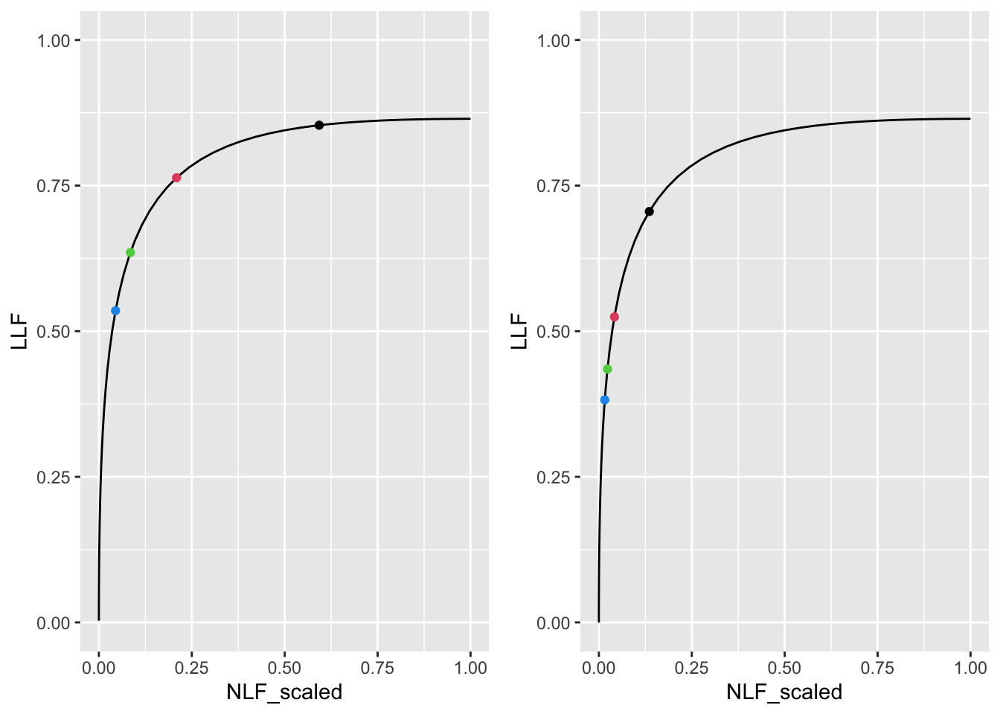

# Optimal operating point on FROC {#optim-op-point}

---
output:
  rmarkdown::pdf_document:
    fig_caption: yes        
    includes:  
      in_header: R/learn/my_header.tex
---


## TBA How much finished {#optim-op-point-how-much-finished}
80%

Discussion and Intro need more work; coding is done


## Introduction {#optim-op-point-intro}

This chapter deals with finding the optimal reporting threshold of an algorithmic observer, such as CAD. We assume that designer level FROC data is available for the algorithm, i.e., the data consists of mark-rating pairs, with continuous-scale ratings, and a decision needs to be made as to the optimal reporting threshold, i.e., the minimum rating of a mark before it is shown to the radiologist. This is a familiar problem faced by a CAD algorithm designer. 

The problem has been solved in the context of ROC analysis [@metz1978rocmethodology], namely, the optimal operating point on the ROC corresponds to a slope determined by disease prevalence and the cost of decisions in the four basic binary paradigm categories: true and false positives and true and false negatives. In practice the costs are difficult to quantify. However, for equal numbers of diseased and non-diseased cases and equal costs it can be shown that the slope of the ROC curve at the optimal point is unity. For a proper ROC curve this corresponds to the point that maximizes the Youden-index [@youden1950index], defined as the sum of sensitivity and specificity minus one. Typically it is maximized at the point that is closest to the (0,1) corner of the ROC. 

CAD produces FROC data and lacking a procedure for setting it analytically, CAD manufacturers, in consultation with radiologists, set site-specific reporting thresholds. For example, if radiologists at a site are comfortable with more false marks as the price of potentially greater lesion-level sensitivity, the reporting threshold for them is adjusted downward. 

This chapter describes an analytic method for finding the optimal reporting threshold. The method is based on maximizing AUC (area under curve) under the wAFROC curve. The method is compared to the Youden-index based method.   


## Methods {#optim-op-point-methods}

The ROC, FROC and wAFROC curves are completely defined by the RSM (radiological search model) parameters: $\lambda$, $\nu$, $\mu$ and $\zeta_1$, which have the following meanings:

* The $\mu$ parameter is the perceptual signal to noise ratio of lesions measured under location-known-exactly conditions. Higher values of $\mu$ lead to increased overall performance of the algorithm.

* The intrinsic $\lambda$ parameter determines the number of non-lesion localizations, NLs, per case (location level "false positives"). Lower values lead to fewer NL marks and increased algorithm performance. It is related to the physical $\lambda'$ parameter by $\lambda' = \lambda/\mu$. The physical parameter $\lambda'$ equals the mean of the assumed Poisson distribution of NLs per case.

* The intrinsic $\nu$ parameter determines the probability of a lesion localizations, LLs, (location level "true positives"). Higher values lead to more LL marks. It is related to the physical $\nu'$ parameter by $\nu' = 1 - \exp(-\mu \nu)$. The physical parameter $\nu'$ equals the success probability of the assumed binomial distribution of LLs per case.

* The $\zeta_1$ parameter determines if a suspicious region found by the algorithm is actually marked. The higher this value, the fewer the reported marks. The objective is to optimize $\zeta_1$. 


In the following sections each of the first three parameters is varied in turn and the corresponding optimal $\zeta_1$ determined by maximizing one of two figures of merit (FOMs), namely, the wAFROC-AUC and the Youden-index. 


### Functions to be maximized
The functions to be maximized, `wAFROC` and `Youden`, are defined next: 

* wAFROC-AUC is computed by `UtilAnalyticalAucsRSM`. Lines 2 - 19 returns `-wAFROC`, the *negative* of wAFROC-AUC. The negative sign is needed because the `optimize()` function, used later, finds the *minimum* of wAFROC-AUC. The first argument is $\zeta_1$, the variable to be varied to find the maximum. The remaining arguments passed to the function, needed to calculate the FOMs, are $\mu$, $\lambda$, $\nu$, `lesDistr` and `relWeights.` The last two specify the number of lesions per case and their weights. The following code below uses `lesDistr = c(0.5,0.5)`, i.e., half of the diseased cases contain one lesion and the rest contain two lesions, and `relWeights = c(0.5,0.5)`, which specifies equal weights to all lesions.


* The Youden-index is defined as the sum of sensitivity and specificity minus 1. Sensitivity is computed by `RSM_yROC` and specificity by `(1 - RSM_xROC)`. Lines 22 - 42 returns `-Youden`, the *negative* of the Youden-index. 


```{.r .numberLines}

wAFROC <- function (
  zeta1, 
  mu, 
  lambda, 
  nu, 
  lesDistr, 
  relWeights) {
  x <- UtilAnalyticalAucsRSM(
    mu, 
    lambda, 
    nu, zeta1, 
    lesDistr, 
    relWeights)$aucwAFROC
  # return negative of aucwAFROC 
  # (as optimize finds minimum of function)
  return(-x)
  
}


Youden <- function (
  zeta1, 
  mu, 
  lambda, 
  nu, 
  lesDistr, 
  relWeights) {
  # add sensitivity and specificity 
  # and subtract 1, i.e., Youden's index
  x <- RSM_yROC(
    zeta1, 
    mu, 
    lambda, 
    nu, 
    lesDistr) + 
    (1 - RSM_xROC(zeta1, lambda/mu)) - 1
  # return negative of Youden-index 
  # (as optimize finds minimum of function)
  return(-x)
  
}
```


### Vary lambda  {#optim-op-point-vary-lambda}

For $\mu = 2$ and $\nu = 1$, wAFROC-AUC and Youden-index based optimizations were performed for $\lambda = 1, 5, 10, 15$. The following quantities were calculated:

* `zetaOptArr`, a [2,4] array, the optimal thresholds $\zeta_1$; 
* `fomMaxArr`, a [2,4] array, the maximized values of wAFROC-AUC, using either wAFROC based or Youden-index based optimization; note that in the latter we report wAFROC-AUC even though the optimized quantity is the Youden-index.
* `rocAucArr`, a [2,4] array, the AUCs under the ROC curves corresponding to optimizations based on wAFROC-AUC or Youden-index;   
* `nlfOptArr`, a [2,4] array, the abscissa of the optimal reporting point on the FROC curve corresponding to optimizations based on wAFROC-AUC or Youden-index;   
* `llfOptArr`, a [2,4] array, the ordinate of the optimal reporting point on the FROC curve corresponding to optimizations based on wAFROC-AUC or Youden-index.   

In each of these arrays the first index, `y` in the following code, denotes whether wAFROC-AUC is being maximized (`y` = 1, see lines 14 - 20) - or if Youden-index is being optimized (`y` = 2, see lines 39 - 45). The second index `i` in the following code,  corresponds to $\lambda$.


```{.r .numberLines}
mu <- 2
nu <- 1
lambdaArr <- c(1,5,10,15)
fomMaxArr <- array(dim = c(2,length(lambdaArr)))
zetaOptArr <- array(dim = c(2,length(lambdaArr)))
rocAucArr <- array(dim = c(2,length(lambdaArr)))
nlfOptArr <- array(dim = c(2,length(lambdaArr)))
llfOptArr <- array(dim = c(2,length(lambdaArr)))
lesDistr <- c(0.5, 0.5)
relWeights <- c(0.5, 0.5)
for (y in 1:2) {
  for (i in 1:length(lambdaArr)) {
    if (y == 1) {
      x <- optimize(wAFROC, 
                    interval = c(-5,5), 
                    mu, 
                    lambdaArr[i], 
                    nu, 
                    lesDistr, 
                    relWeights)
      zetaOptArr[y,i] <- x$minimum
      fomMaxArr[y,i] <- -x$objective # safe to use objective here
      rocAucArr[y,i] <- UtilAnalyticalAucsRSM(
        mu, 
        lambdaArr[i], 
        nu, 
        zeta1 = x$minimum, 
        lesDistr, 
        relWeights)$aucROC
      nlfOptArr[y,i] <- RSM_xFROC(
        z = x$minimum, 
        lambda = lambdaArr[i])
      llfOptArr[y,i] <- RSM_yFROC(
        z = x$minimum, 
        mu, 
        nu)
    } else if (y == 2) {
      x <- optimize(Youden, 
                    interval = c(-5,5), 
                    mu, 
                    lambdaArr[i], 
                    nu, 
                    lesDistr, 
                    relWeights)
      zetaOptArr[y,i] <- x$minimum
      fomMaxArr[y,i] <- UtilAnalyticalAucsRSM(
        mu, 
        lambdaArr[i], 
        nu, 
        zeta1 = x$minimum, 
        lesDistr, 
        relWeights)$aucwAFROC
      rocAucArr[y,i] <- UtilAnalyticalAucsRSM(
        mu, 
        lambdaArr[i], 
        nu, 
        zeta1 = x$minimum, 
        lesDistr, 
        relWeights)$aucROC
      nlfOptArr[y,i] <- RSM_xFROC(
        z = x$minimum, 
        lambda = lambdaArr[i])
      llfOptArr[y,i] <- RSM_yFROC(
        z = x$minimum, mu, nu)
    } else stop("incorrect y")
  }
}
```


Table \@ref(tab:optim-op-point-table1) summarizes the results. The column labeled "FOM" shows the quantity being maximized, "lambda" corresponds to the 4 values of $\lambda$, "zeta1" is the optimal value of $\zeta_1$ that maximizes FOM, "wAFROC" is the wAFROC-AUC, "ROC" is the AUC under the ROC curve, i.e., ROC-AUC, and "OptOpPt" is the optimal operating point on the FROC curve. 

For the wAFROC-AUC based optimizations (first four rows of table), as $\lambda$ increases:

* The optimal threshold $\zeta_1$ increases;
* wAFROC-AUC decreases;
* ROC-AUC decreases;
* The optimal operating point moves to lower LLF values, i.e., lower values of location-level "sensitivity".
* The advantage of wAFROC-AUC over Youden-index based optimizations, as measured by the differences between the corresponding wAFROC-AUCs, decreases with increasing $\lambda$: `fomMaxArr[1,] - fomMaxArr[2,]` = 0.037, 0.016, 0.000, 0.003, where the successive values correspond to $\lambda = 1, 5, 10, 15$.   

The $\lambda'$ Poisson parameter controls the average number of perceived NLs per case. For example, for $\mu = 2$ and $\lambda = 1$, the average number is $\lambda' = \lambda /\mu = 0.5$, i.e., an average of one perceived NL every two non-diseased case. With increasing numbers of NLs per case it is necessary to increase the reporting threshold and LLF consequently decreases. Also, overall CAD performance, regardless of how it is measured (i.e., wAFROC-AUC or ROC-AUC), decreases.   

Similar trends are observed for the Youden-index based optimizations (last four rows of table). However, Youden-index based optimizations compared as a group to wAFROC-AUC based optimizations show that Youden yields higher reporting thresholds, lower wAFROC-AUC, lower ROC-AUC and lower LLF values. 


<table class="table" style="margin-left: auto; margin-right: auto;">
<caption>(\#tab:optim-op-point-table1)Summary of optimization results for $\mu = 2$, $\nu = 1$ and different values of $\lambda$. The wAFROC column always displays wAFROC-AUC, even though the optimized quantity may the Youden-index, as in the last four rows.</caption>
 <thead>
  <tr>
   <th style="text-align:left;"> FOM </th>
   <th style="text-align:left;"> lambda </th>
   <th style="text-align:left;"> zeta1 </th>
   <th style="text-align:left;"> wAFROC </th>
   <th style="text-align:left;"> ROC </th>
   <th style="text-align:left;"> OptOpPt </th>
  </tr>
 </thead>
<tbody>
  <tr>
   <td style="text-align:left;vertical-align: middle !important;" rowspan="4"> wAFROC </td>
   <td style="text-align:left;"> 1 </td>
   <td style="text-align:left;"> -5.000 </td>
   <td style="text-align:left;"> 0.931 </td>
   <td style="text-align:left;"> 0.959 </td>
   <td style="text-align:left;"> (1.000, 1.000) </td>
  </tr>
  <tr>
   
   <td style="text-align:left;"> 5 </td>
   <td style="text-align:left;"> -4.996 </td>
   <td style="text-align:left;"> 0.769 </td>
   <td style="text-align:left;"> 0.878 </td>
   <td style="text-align:left;"> (5.000, 1.000) </td>
  </tr>
  <tr>
   
   <td style="text-align:left;"> 10 </td>
   <td style="text-align:left;"> 1.639 </td>
   <td style="text-align:left;"> 0.679 </td>
   <td style="text-align:left;"> 0.815 </td>
   <td style="text-align:left;"> (0.506, 0.641) </td>
  </tr>
  <tr>
   
   <td style="text-align:left;"> 15 </td>
   <td style="text-align:left;"> 2.012 </td>
   <td style="text-align:left;"> 0.635 </td>
   <td style="text-align:left;"> 0.768 </td>
   <td style="text-align:left;"> (0.331, 0.495) </td>
  </tr>
  <tr>
   <td style="text-align:left;vertical-align: middle !important;" rowspan="4"> Youden </td>
   <td style="text-align:left;"> 1 </td>
   <td style="text-align:left;"> 0.864 </td>
   <td style="text-align:left;"> 0.894 </td>
   <td style="text-align:left;"> 0.941 </td>
   <td style="text-align:left;"> (0.194, 0.872) </td>
  </tr>
  <tr>
   
   <td style="text-align:left;"> 5 </td>
   <td style="text-align:left;"> 1.466 </td>
   <td style="text-align:left;"> 0.753 </td>
   <td style="text-align:left;"> 0.857 </td>
   <td style="text-align:left;"> (0.356, 0.703) </td>
  </tr>
  <tr>
   
   <td style="text-align:left;"> 10 </td>
   <td style="text-align:left;"> 1.702 </td>
   <td style="text-align:left;"> 0.679 </td>
   <td style="text-align:left;"> 0.811 </td>
   <td style="text-align:left;"> (0.444, 0.617) </td>
  </tr>
  <tr>
   
   <td style="text-align:left;"> 15 </td>
   <td style="text-align:left;"> 1.834 </td>
   <td style="text-align:left;"> 0.633 </td>
   <td style="text-align:left;"> 0.783 </td>
   <td style="text-align:left;"> (0.499, 0.566) </td>
  </tr>
</tbody>
</table>


One could display 8 FROC plots, each corresponding to a row of the preceding table, but there is a more efficient method. The FROC curve is defined in terms of the RSM parameters as follows:


\begin{equation}
\left. 
\begin{aligned}
NLF \left ( \zeta, \lambda' \right ) =& \lambda' \Phi \left (-\zeta \right ) \\
LLF\left ( \zeta, \mu, \nu', \overrightarrow{f_L} \right ) =& \nu' \Phi \left ( \mu - \zeta \right ) 
\end{aligned}
\right \}
(\#eq:rsm-froc-predictions)
\end{equation}

Here $\overrightarrow{f_L}$ is the lesion-distribution vector, `c(0.5, 0.5)` in the current example. 

The *end-point* of the FROC defined by $\left ( \lambda', \nu' \right )$ is not to be confused with the *optimal* value of $\zeta_1$; the former corresponds to $\zeta_1 = -\infty$ while the latter is a finite value of $\zeta_1$ as found by the optimization procedure.


Since the $\Phi$ function ranges from one to unity, the *four FROC curves for different values of $\lambda$ are scaled versions of a single curve whose x-axis ranges from 0 to 1*. The single curve corresponds to $\lambda' = 1$ and the true curves are obtained by scaling this curve along the x-axis by the appropriate $\lambda'$ factor. With this understanding one can display 4 FROC curves with a single FROC curve where the x-axis is $NLF \left ( \zeta, \lambda' = 1 \right )$. The true FROC curve is defined by:  


\begin{equation}
\left. 
\begin{aligned}
NLF \left ( \zeta, \lambda' \right ) =& \lambda' NLF \left ( \zeta, \lambda' = 1 \right ) \\
LLF\left ( \zeta, \mu, \nu', \overrightarrow{f_L} \right ) =& \nu' \Phi \left ( \mu - \zeta \right ) 
\end{aligned}
\right \}
(\#eq:rsm-froc-predictions2)
\end{equation}


```
#> Warning: Removed 50 row(s) containing missing values (geom_path).
#> geom_path: Each group consists of only one observation. Do you need to adjust
#> the group aesthetic?
#> Warning: Removed 1 rows containing missing values (geom_point).
#> Warning: Removed 1 rows containing missing values (geom_point).
#> Warning: Removed 50 row(s) containing missing values (geom_path).
```

<div class="figure">

<p class="caption">(\#fig:optim-op-point-vary-lambda)Left panel: maximized wAFROC AUC was used to find optimal $\zeta_1$. Right panel: maximized Youden-index was used to find optimal $\zeta_1$. Dot colors: black means $\lambda = 1$, red means $\lambda = 5$, green means $\lambda = 10$ and blue means $\lambda = 15$.</p>
</div>


The left panel in \@ref(fig:optim-op-point-vary-lambda) shows the optimal operating points when wAFROC-AUC is maximized. The 4 operating points are color coded as follows:

* The black dot corresponds to $\lambda = 1$, i.e., $\lambda' = 1/2 = 0.5$. In other words, the true FROC is obtained by *shrinking* the plot shown, including the superposed black dot, along the x-axis by a factor of 2.  
* The red dot corresponds to $\lambda' = 2.5$. In other words, the true FROC is obtained by *magnifying* that shown, including the red dot, along the x-axis by a factor of 2.5.   
* The green dot corresponds to $\lambda' = 5$. 
* The blue dot corresponds to $\lambda' = 7.5$.  

These plots illustrate the previous comments, namely, as $\lambda$ increases, *the optimal operating point moves down the scaled curve*.

The right panel shows the optimal operating point when the Youden-index is maximized. It shows the same general features as the previous example but the group of four operating points in the right panel are below-left those in the left panel, representing higher values of optimal $\zeta_1$, i.e., a more stringent criteria. As seen in the preceding table the overly strict criteria, using Youden-index based optimization, leads to lower true performance: i.e., lower wAFROC-AUC and lower ROC-AUC, and lower LLF.


The FROC curve does not represent true performance. To visualize true performance one compares wAFROC curves.    


<div class="figure">

<p class="caption">(\#fig:optim-op-point-vary-lambda-wafroc)wAFROC curves for wAFROC-AUC and Youden-index based optimizations: both curves correspond to $\mu = 2$, $\nu = 1$ and $\lambda = 1$. The optimal reporting theshold $\zeta_1$ is determined by the selected FOM. The red curve corresponds to FOM = wAFROC-AUC and the blue curve corresponds to FOM = Youden-index. The stricter reporting threshold found by the Youden-index based method sacrifices a considerable amount of area under the wAFROC.  The two wAFROC-AUCs are 0.880 and 0.856, respectively.</p>
</div>


Each curve ends at the optimal threshold listed in Table \@ref(tab:optim-op-point-table1), namely $\zeta_1$ = -5.000 for the red curve and $\zeta_1$ = 0.864 for the blue curve. The lower performance represented by the blue curve, based on Youden-index maximization, is due to the adoption of an overly strict threshold.


### Vary nu {#optim-op-point-vary-nu}

For $\mu = 2$ and $\lambda= 5$, wAFROC-AUC and Youden-index based optimizations were performed for $\nu = 0.1,0.5,1,2$. Table \@ref(tab:optim-op-point-table2) summarizes the results. 


