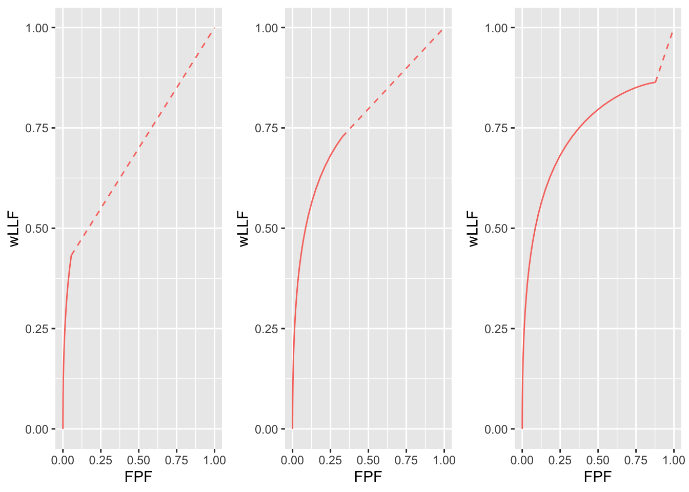
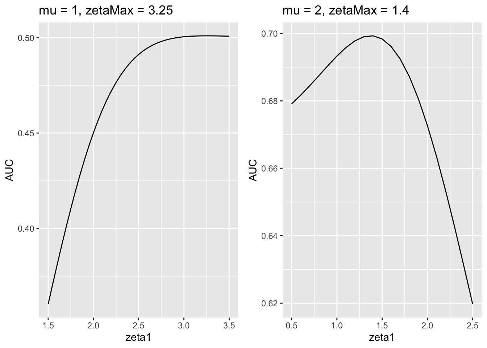
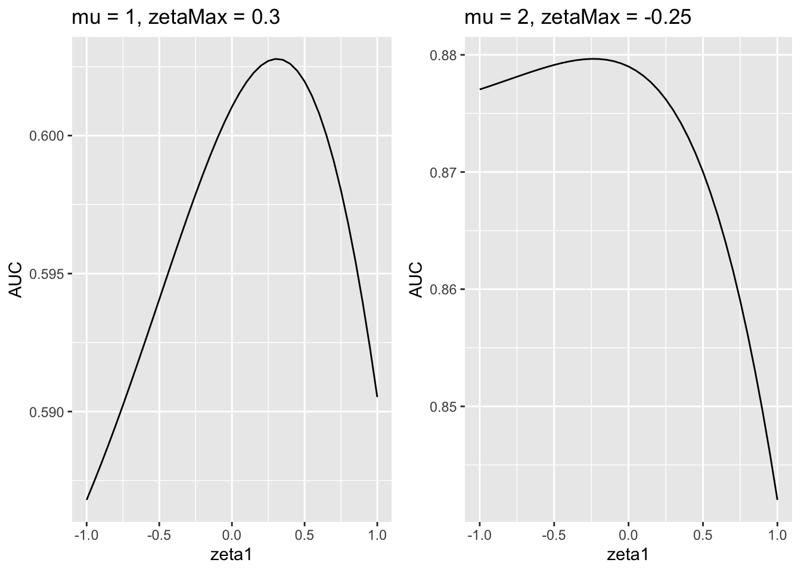
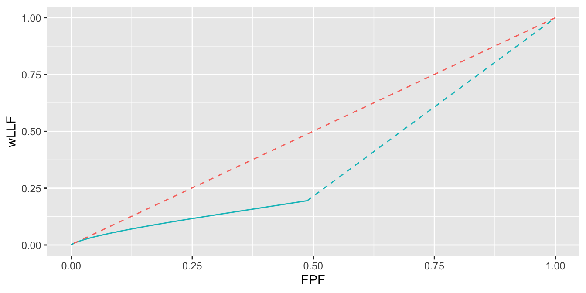

# Optimal operating point on FROC {#optim-op-point}

---
output:
  rmarkdown::pdf_document:
    fig_caption: yes        
    includes:  
      in_header: R/learn/my_header.tex
---


## How much finished {#optim-op-point-how-much-finished}
70%


## Introduction {#optim-op-point-intro}
A CAD system yields FROC mark-rating data where the (continuous scale) ratings generated by the algorithm are available to the algorithm designer with the understanding that only marks with ratings exceeding a pre-selected threshold are to be displayed (or reported) to the radiologist. The problem addressed in this chapter is how to select the optimal reporting threshold.

TBA: literature review

It is assumed that *the optimal reporting threshold $\zeta_{\text{max}}$ is the value of $\zeta_1$ that maximizes the area under curve (AUC) of an appropriately selected operating characteristic*. This chapter examines the effect of changing the reporting threshold $\zeta_1$ on the area under curve for (a) the receiver operating characteristic (ROC) and (b) the weighted alternative free-response receiver operating characteristic (wAFROC).

TBA Summarize the sections that follow.

## Dependence of ROC performance on threshold {#optim-op-point-dependence-threshold-roc}
It is clear that moving the reporting threshold $\zeta_1$ along the ROC curve does not change the *total* area under the ROC curve. This was the reason, Section \@ref(binary-task-auc-roc-important), for preferring, as a figure of merit, the area under the full curve in lieu of reported sensitivity-specificity pairs. One might incorrectly assume that this means that performance is independent of reporting threshold. When $\zeta_1 = -\infty$ then performance, represented by the area $\text{area under curve}$ under the full continuous curve shown below (left plot), is indeed independent of reporting threshold (trivially, because the latter is constant at $-\infty$). However, if the observer adopts a finite reporting threshold $\zeta_1$ then the ROC curve stops at an operating point, see Fig. \@ref(fig:optim-op-point-dependence-threshold-roc-plot1) -- solid dot, left plot -- that is below-left of (1,1). *Net performance, represented by the area under the continuous section up to the solid dot plus the area under the dashed line in the left plot*, is denoted $\text{area under curve}(\zeta_1)$, which depends on $\zeta_1$. It is clear from the left plot that $\text{area under curve}(\zeta_1) \le \text{area under curve}$. The left plot also demonstrates that $\text{area under curve}(\zeta_1)$ as a function of $\zeta_1$ has a maximum at $\zeta_1 = -\infty$. In other words, using the ROC figure of merit, performance of the CAD algorithm is maximized by displaying *all* the marks. 

The restriction above to the left plot is because it is (almost) a proper ROC curve ^[whenever $b \ne 1$ the binormal ROC curve is improper, although the "hook" may not be readily visible under normal plotting conditions.]. For a proper ROC curve the slope decreases continuously as one moves up the plot. This ensures that the continuous section to the right of the solid dot in the left plot is always *above* the dashed line. The right plot in see Fig. \@ref(fig:optim-op-point-dependence-threshold-roc-plot1) corresponding to $a = 1$ and $b = 0.2$, illustrates the situation when the curve is visibly improper. Now the dashed line is mostly above the continuous section and performance is maximized at a finite value of $\zeta_1$: an invalid conclusion due to the fact that an improper ROC curve is a fitting artifact of the binormal model.  


<div class="figure">

<p class="caption">(\#fig:optim-op-point-dependence-threshold-roc-plot1)Left plot: almost proper binormal ROC curve corresponding to a = 2 and b = 0.8. The solid dot is the operating point corresponding to $\zeta_1 = 1.5$. The solid curve corresponds to $\zeta_1 = -\infty$. Note that the solid curve is above the dashed line. Right plot: improper binormal ROC curve corresponding to a = 1 and b = 0.2. The solid curve is below the dashed line.</p>
</div>


## Dependence of FROC performance on threshold {#optim-op-point-dependence-threshold-wafroc}
The situation is different if one uses the wAFROC figure of merit. Consider the three wAFROC plots shown in see Fig. \@ref(fig:optim-op-point-dependence-threshold-wafroc-plot). These correspond to $\mu = 2$, $\lambda = 5$, $\nu = 1$, one lesion per case, and values of $\zeta_1$, from left to right: $\zeta_1 = 2$, $\zeta_1 = 1$ and $\zeta_1 = -1$. The area under the wAFROC curve in the middle plot is actually greater than that for the plots on either side of it, a fact that be difficult to appreciate, but is brought out more clearly in the next plot.  


<div class="figure">

<p class="caption">(\#fig:optim-op-point-dependence-threshold-wafroc-plot)Left plot: wAFROC curve for $\zeta_1 = 2$; Middle plot: wAFROC curve for $\zeta_1 = 1$; Right plot: wAFROC curve for $\zeta_1 = -1$. The middle curve has the highest area under the curve. This fact is made clearer in the next figure.</p>
</div>


The next plot, see Fig. \@ref(fig:optim-op-point-dependence-threshold-wafroc-plot2), in which three previous plots are superposed, shows the differences in areas more clearly. The green plot (solid green line plus the dashed green line), corresponding to $\zeta_1 = 2$, clearly has the least area. The "green-red" plot (i.e., the solid green line plus the solid red line plus the dashed red line), corresponding to $\zeta_1 = 1$, has the greatest area. The "green-red-blue" plot (i.e., the solid green line plus the solid red line plus the solid blue line plus the dashed blue line), corresponding to $\zeta_1 = -1$, has slightly smaller area than that of the "green-red" plot. There is a maximum in area under the wAFROC curve near $\zeta_1 = 1$. A more precise determination of the optimal value of $\zeta_1$, using numerical search, will be shown later, but it is clear a maximum exists and that it does not correspond to $\zeta_1 = -\infty$, in other words it does not correspond to showing all the marks, as was the case when one used the ROC operating characteristic. 

The essential difference between the ROC and the wAFROC examples is this: as one moves up the proper ROC curve, the slope decreases monotonically and the curve ends at (1,1) while the wAFROC curve has monotonically decreasing slope but it ends at a point below-left to (1,1): the wAFROC somewhat resembles an improper ROC but this time it is not a fitting artifact. *The geometrical difference in the shape of the two curves enables a finite and meaningful optimal $\zeta_1$ for the wAFROC but not for the ROC*.

In the following sections the optimal operating point determined using the wAFROC curve will be explored for two algorithmic observer, one with low performance and one with performance similar to an expert radiologist. Since CAD developers are more familiar with FROC curves than wAFROC curves, the optimal operating points for the two algorithms will be illustrated using FROC curves. 


<div class="figure">

<p class="caption">(\#fig:optim-op-point-dependence-threshold-wafroc-plot2)The green curve corresponds to $\zeta_1 = 2$, the green+red curve corresponds to $\zeta_1 = 1$ and the green+red+blue curve corresponds to $\zeta_1 = -1$. The green+red curve plus the red dashed line extension has the greatest area under the wAFROC, corresponding to being near the optimal choice of threshold. Note that each area includes that under the corresponding dashed line.</p>
</div>


## Methods {#optim-op-point-methods}

Two values of the $\lambda$ parameter were used: $\lambda = 10$ and $\lambda = 1$. For each $\lambda$ two value of $\mu$ were used: $\mu = 1$ and $\mu = 2$. The $\nu$ parameter was held constant at $\nu = 1$. Diseased cases with one or two lesions occurring with equal probability (`lesDistr` in following code) and equally weighted lesions were assumed (`relWeights`). 

$\lambda = 10$ characterizes a CAD system that generates about 10 times the number of latent NL marks as an expert radiologist, while $\lambda = 1$ characterizes a CAD system that generates about the same number of latent NL marks as an expert radiologist. Performance improves with increasing $\mu$ and decreasing $\lambda$. 

For each $(\lambda,\mu)$ pair a range of values of $\zeta_1$ was scanned. For each $\zeta_1$ the area under the wAFROC curve was calculated using function `UtilAnalyticalAucsRSM()`. This function returns the wAFROC area under curve. The procedure for different values of $\zeta_1$ to find the value of $\zeta_1$  -- denoted $\zeta_{\text{max}}$ -- that maximized the area under curve. The corresponding (NLF,LLF) values on the FROC curve and the optimal wAFROC area under curve were recorded. 

Shown next is the variation of wAFROC area under curve vs. $\zeta_1$ for $\lambda = 10$ and the two values of the $\mu$ parameter.


### $\zeta_1$ optimization for $\lambda = 10$


```r
# determine plotArr[[1,]], zetaMaxArr[1,] and maxFomArr[1,]
lambda <- 10
nu <- 1
mu_arr <- c(1, 2)
maxFomArr <- array(dim = c(2,length(mu_arr)))
zetaMaxArr <- array(dim = c(2, length(mu_arr)))
plotArr <- array(list(), dim = c(2, length(mu_arr)))
lesDistr <- c(0.5, 0.5)
relWeights <- c(0.5, 0.5)
for (i in 1:length(mu_arr)) {
  if (i == 1) zeta1Arr <- seq(1.5,3.5,0.05) else zeta1Arr <- seq(0.5,2.5,0.1)
  x <- do_one_mu (mu_arr[i], lambda, nu, zeta1Arr, lesDistr, relWeights)
  plotArr[[1,i]] <- x$p + 
    ggtitle(paste0("mu = ", 
                   as.character(mu_arr[i]), 
                   ", zetaMax = ", 
                   format(x$zetaMax, digits = 3)))
  zetaMaxArr[1,i] <- x$zetaMax
  maxFomArr[1,i] <- x$maxFom
  # plotArr[[2,i]] etc. reserved for lambda = 1 results, done later
}
```


In the above code `plotArr` contains the plots (`x$p` plus a title string) of wAFROC area under curve vs. $\zeta_1$, `zetaMaxArr` contains the value of $\zeta_1$ that maximizes wAFROC area under curve (`x$zetaMax`) and `maxFomArr` contains the maximum value of wAFROC (`x$maxFom`). The first dimension of the arrays is reserved for the two values of $\lambda$, the second for the two values of $\mu$. 


<div class="figure">

<p class="caption">(\#fig:optim-op-point-auc-vs-zeta1-10)Variation of area under curve vs. $\zeta_1$ for $\lambda = 10$; AUC is the wAFROC area under curve. Panels are labeled by the values of $\mu$ and $\zeta_{\text{max}}$. For $\mu = 1$ there is a broad maximum but for $\mu = 2$ it is better defined.</p>
</div>


Shown next is the variation of wAFROC area under curve vs. $\zeta_1$ for $\lambda = 1$ and the two values of the $\mu$ parameter.


### $\zeta_1$ optimization for $\lambda = 1$


<div class="figure">

<p class="caption">(\#fig:optim-op-point-auc-vs-zeta1-01)Variation of area under curve vs. $\zeta_1$ for $\lambda = 1$.</p>
</div>

Fig. \@ref(fig:optim-op-point-auc-vs-zeta1-01) corresponds to $\lambda = 1$ and employs a similar labeling scheme as Fig. \@ref(fig:optim-op-point-auc-vs-zeta1-10). For example, the panel labeled `mu = 1, zetaMax = 0.3` shows that area under curve has a maximum at $\zeta_1 = 0.3$. 


### Summary of optimization results {#optim-op-point-comments-threshold-optimization}


<table class="table" style="margin-left: auto; margin-right: auto;">
<caption>(\#tab:optim-op-point-cad-optim-table)Summary of performance measures corresponding to optimal thresholds for the two $\lambda$ and $\mu$ values: "Measure" refers to a performance measure such as AUC or an operating point, AUC is the wAFROC area under curve, etc.</caption>
 <thead>
  <tr>
   <th style="text-align:right;"> Lambda </th>
   <th style="text-align:left;"> Measure </th>
   <th style="text-align:left;"> mu = 1 </th>
   <th style="text-align:left;"> mu = 2 </th>
  </tr>
 </thead>
<tbody>
  <tr>
   <td style="text-align:right;"> 10 </td>
   <td style="text-align:left;"> AUC </td>
   <td style="text-align:left;"> 0.501 </td>
   <td style="text-align:left;"> 0.699 </td>
  </tr>
  <tr>
   <td style="text-align:right;"> 1 </td>
   <td style="text-align:left;"> AUC </td>
   <td style="text-align:left;"> 0.603 </td>
   <td style="text-align:left;"> 0.880 </td>
  </tr>
  <tr>
   <td style="text-align:right;"> 10 </td>
   <td style="text-align:left;"> (NLF, LLF) </td>
   <td style="text-align:left;"> (0.006, 0.008) </td>
   <td style="text-align:left;"> (0.404, 0.628) </td>
  </tr>
  <tr>
   <td style="text-align:right;"> 1 </td>
   <td style="text-align:left;"> (NLF, LLF) </td>
   <td style="text-align:left;"> (0.382, 0.479) </td>
   <td style="text-align:left;"> (0.299, 0.854) </td>
  </tr>
</tbody>
</table>

Table \@ref(tab:optim-op-point-cad-optim-table) summarizes the results of the optimizations. The first two rows compare the AUCs for $\lambda=10$ and $\lambda=1$ for the two values of $\mu$. The next row shows the operating point (NLF, LLF) for $\lambda = 10$ for the two values of $\mu$ and the final row shows the operating point for $\lambda = 1$ for the two values of $\mu$. The following trends are evident (in the following *optimal NLF* means NLF at the optimal operating point on the FROC, etc.).

* Area under curve increases with increasing $\mu$. Increasing the separation of the two unit variance normal distributions that determine the ratings of NLs and LLs leads to higher performance.
* Area under curve increases with *decreasing* $\lambda$. Decreasing the tendency of the observer to generate NLs leads to increasing performance.
* Increasing $\mu$ causes the optimal operating point to move up the FROC curve. 
* Decreasing $\lambda$ causes the optimal operating point to move up the FROC curve. 
* All of these observations can be summarized by the following: *as performance increases the CAD designer can afford to show more of the marks generated by the algorithm*. 

### Illustrative FROC curves {#optim-op-point-threshold-illustrations}


#### $\lambda = 10, \mu = 1$ {#optim-op-point-threshold-illustrations-10-1}

<div class="figure">

<p class="caption">(\#fig:optim-op-point-froc-10)Extended FROC plots: panel labeled 10-1 is for $\lambda = 10$ and $\mu = 1$, and that labeled 10-1.5 is for $\lambda = 10$ and $\mu = 1.5$. The blue line indicates the optimal operating point.</p>
</div>


* In order to show a fuller extent of the FROC curve it is necessary to *extend* the curves beyond the *optimal* operating point. This was done by setting $\zeta_1$ = $\zeta_{\text{max}} - 0.5$, which has the effect of letting the curve run a little bit further to the upper-right. 

* The *optimal* operating-point, corresponding to the vertical blue line, for the curve in Fig. \@ref(fig:optim-op-point-froc-10) labeled **10-1** is (0.006, 0.008) while the *extended* point, corresponding to the edge of the plot, is (0.030, 0.025). The *highest* operating point, that reached when all marks are reported, is (10.000, 0.632). This point lies about a factor 300 to the right of the displayed curve and about a factor of six higher along the y-axis. It vividly illustrates a low-performing FROC curve. Note the "expanded-view" scale factors, focusing on the region very near the origin: the x-axis runs from 0 to 0.03 while the y-axis runs from 0 to 0.1. Otherwise this curve would be almost indistinguishable from the x-axis. For large $\lambda$ and small $\mu$ performance is very low, in fact wAFROC AUC = 0.501 (note that we are using the wAFROC FOM, whose minimum possible value is 0, not 0.5). The optimal operating point of the algorithm is close to the origin. With such poor algorithm performance the sensible choice is to only show those marks that have, according to the algorithm, very high confidence level for being right (an operating point near the origin corresponds to a high value of $\zeta$). 

* Fig. \@ref(fig:optim-op-point-2plots) demonstrates visually the effect on wAFROC area under curve of showing very few marks (red dashed line - this line extends almost all the way to the origin as on this scale the short continuous section is not visible) as compared to showing more marks (blue solid plus dashed line). These plots are for $\lambda = 10$, $\mu = 1$ and $\zeta_1 = 3.25$ for the upper curve and $\zeta_1 = 1.5$ for the lower curve.


<div class="figure">

<p class="caption">(\#fig:optim-op-point-2plots) With a poor algorithm it pays to not show too many marks. Shown are wAFROC plots for $\mu = 1$, $\lambda = 10$ and $\nu = 1$. The upper curve corresponds to $\zeta_1 = 3.25$, the lower to $\zeta_1 = 1.5$. By reporting fewer marks algorithm performance in the upper plot is visibly improved over that in the lower.</p>
</div>


#### $\lambda = 10, \mu = 2$ {#optim-op-point-threshold-illustrations-10-2}


* In Fig. \@ref(fig:optim-op-point-froc-10) panel labeled **10-2**: the optimal operating point is (0.404, 0.628). Given the higher value of $\mu$ the algorithm designer can show marks with lower confidence levels, corresponding to the optimal operating point moving up the FROC curve. The end-point of the extended curve is (0.920, 0.747). The highest operating point, when all marks are reported, is (5.000, 0.865). 


<div class="figure">

<p class="caption">(\#fig:optim-op-point-froc-01)Extended FROC plots: panel labeled 1-1 is for $\lambda = 1$ and $\mu = 1$ and that labeled 10-1.5 is for $\lambda = 1$ and $\mu = 1.5$. The blue line indicates the optimal operating point.</p>
</div>


#### $\lambda = 1, \mu = 1$ {#optim-op-point-threshold-illustrations-1-1}

* In Fig. \@ref(fig:optim-op-point-froc-01) panel labeled **1-1**: The optimal operating point is (0.382, 0.479). The end-point of the extended curve is (0.579, 0.559). The highest operating point on the FROC is (1.000, 0.632). 


#### $\lambda = 1, \mu = 2$ {#optim-op-point-threshold-illustrations-1-2}

* In Fig. \@ref(fig:optim-op-point-froc-01) panel labeled **1-2**: The optimal operating point is (0.299, 0.854). The end-point of the extended curve is (0.387, 0.862). The highest operating point on the FROC is  (0.500, 0.865). 


### Applying the method {#optim-op-point-how-to-use-method}
* Assume that one has designed an algorithmic observer that has been optimized with respect to all other parameters except the reporting threshold and that with sufficiently low reporting threshold the algorithm reports *every* suspicious region it found. All that remains is to find the optimal reporting threshold. 

* The mark-rating pairs are entered into a `RJafroc` format Excel input file. 

* Read the data file -- `DfReadDataFile()` -- and convert it to an ROC dataset -- `DfFroc2Roc()`. 

* Fit the radiological search model (RSM) to the ROC dataset -- `FitRsmRoc()`. 

* This yields the parameters -- $\lambda, \mu, \nu$  -- needed to perform the calculations described in the embedded code of this chapter. 

* This determines the optimal reporting threshold $\zeta_{\text{max}}$. 

* Set the algorithm to only report marks with confidence levels exceeding $\zeta_{\text{max}}$.  


## Discussion {#optim-op-point-Discussion}


## References {#optim-op-point-references}
