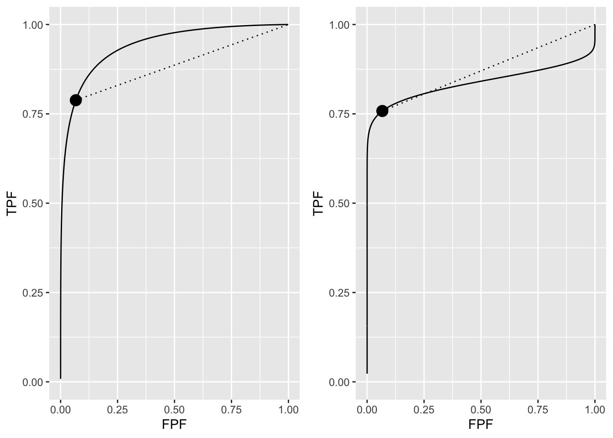
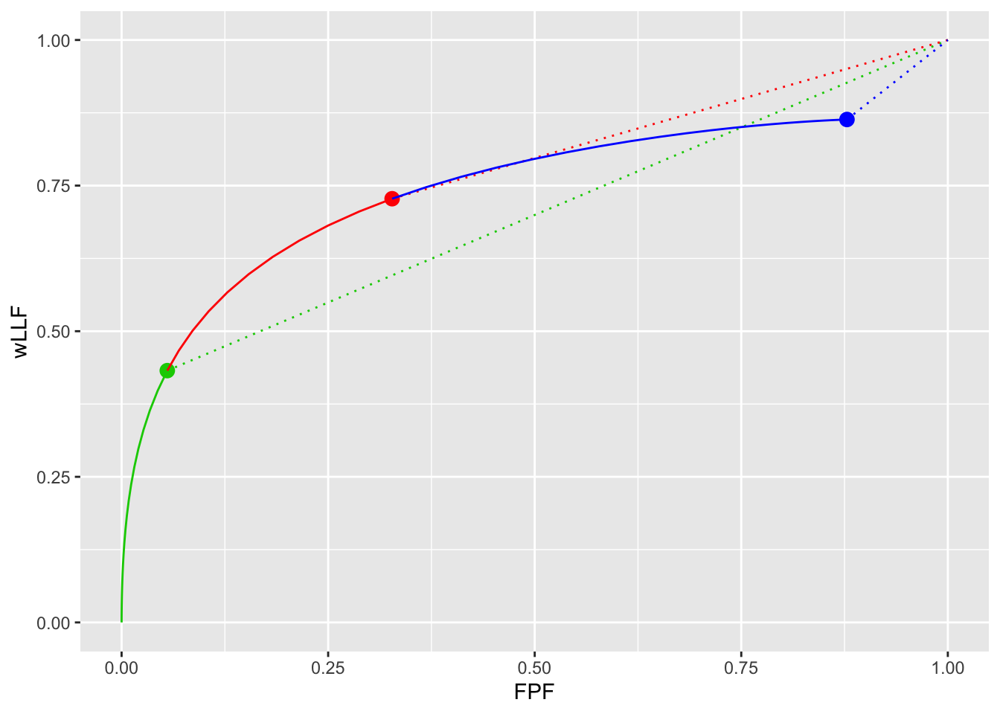
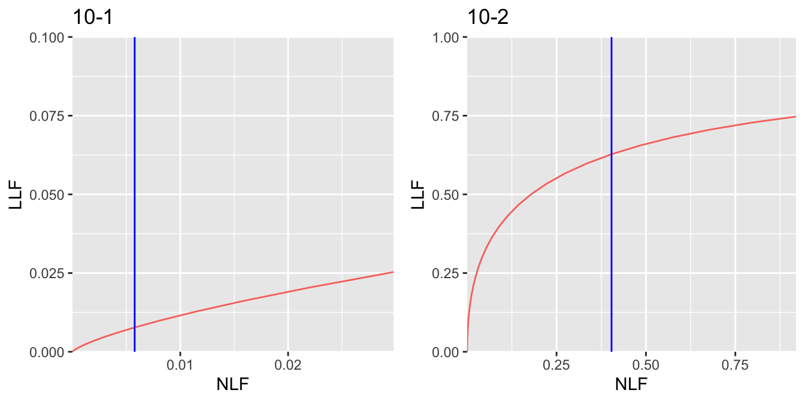
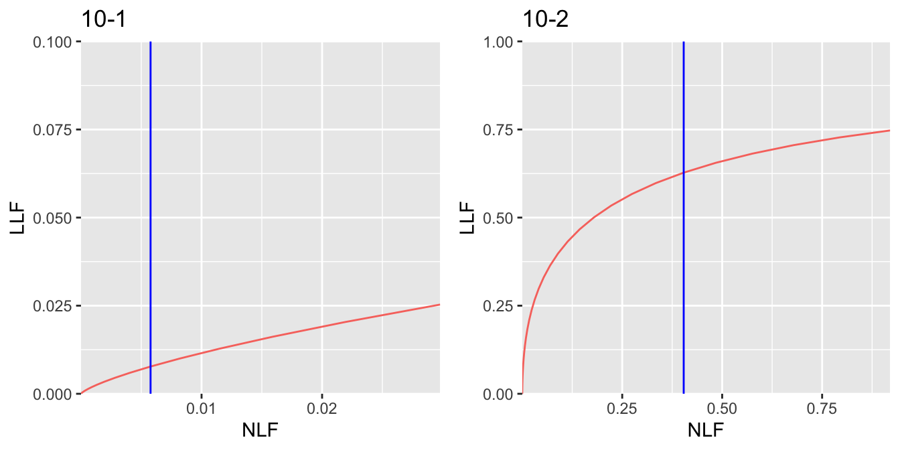
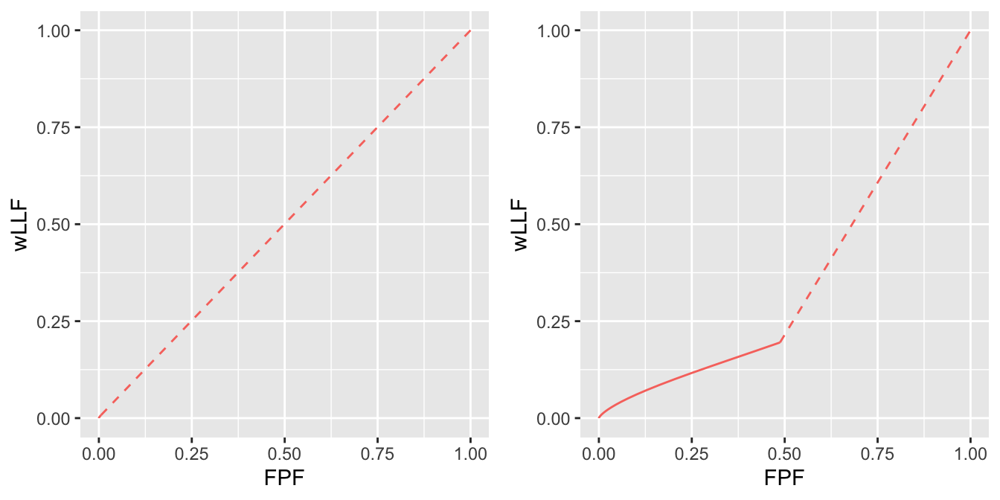
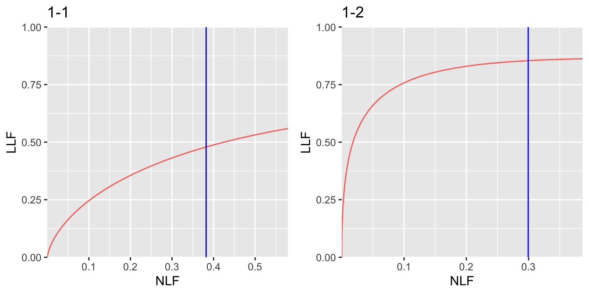
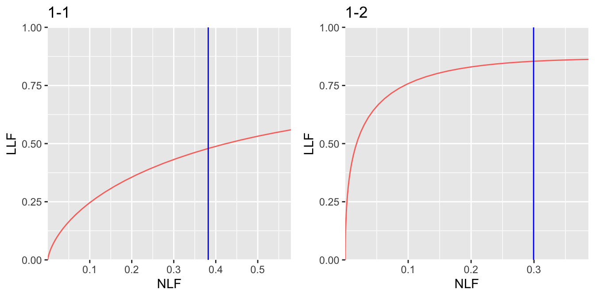

# Optimal operating point on FROC {#optim-op-point-froc}

---
output:
  rmarkdown::pdf_document:
    fig_caption: yes        
    includes:  
      in_header: R/learn/my_header.tex
---


## How much finished {#optim-op-point-froc-how-much-finished}
10%


## Introduction {#optim-op-point-froc-intro}
A CAD system yields FROC mark-rating data where the (continuous scale) ratings are available to the algorithm designer with the understanding that only marks with ratings exceeding a pre-selected threshold are to be displayed (or reported) to the radiologist. The problem addressed in this chapter is how to select the optimal reporting threshold.

It is taken as an axiomatic truth that *the optimal reporting threshold $\zeta_{\text{max}}$ is that value of $\zeta_1$ that maximizes the area under curve (AUC) of an appropriate operating characteristic*. This chapter examines the effect of changing the reporting threshold $\zeta_1$ on the area under curve, with the object of determining the value that maximizes the area under curve.

TBA Summarize the sections that follow.

## Dependence of ROC performance on threshold {#optim-op-point-froc-dependence-threshold-roc}
It is clear that moving the reporting threshold $\zeta_1$ along the ROC curve does not change the *total* area under the ROC curve. This was the reason, Chapter TBA, for preferring, as a figure of merit, the area under curve under the full curve in lieu of reported sensitivity-specificity pairs. One might incorrectly assume that this means that performance is independent of reporting threshold. When $\zeta_1 = -\infty$ then performance, represented by the area $\text{area under curve}$ under the full continuous curve shown below (left plot), is indeed independent of reporting threshold (trivially, because the latter is constant at $-\infty$). However, if the observer adopts a finite reporting threshold $\zeta_1$ then the ROC curve stops at an operating point (solid dot, left plot) that is below-left of (1,1). *Net performance, represented by the area under the continuous section up to the solid dot plus the area under the dashed line in the left plot*, is denoted $\text{area under curve}(\zeta_1)$, which depends on $\zeta_1$. It is clear from the left plot that $\text{area under curve}(\zeta_1) \le \text{area under curve}$. The left plot also demonstrates that $\text{area under curve}(\zeta_1)$ as a function of $\zeta_1$ has a maximum at $\zeta_1 = -\infty$. In other words, using the ROC figure of merit, performance of the CAD algorithm is maximized by displaying *all* the marks. 

The restriction above to the left plot is because it is (almost) a proper ROC curve ^[whenever $b \ne 1$ the binormal ROC curve is improper, although the "hook" may not be readily visible under normal plotting conditions.]. For a proper ROC curve the slope decreases continuously as one moves up the plot. This ensures that the continuous section to the right of the solid dot in the left plot is always *above* the dashed line. The right plot (a = 1, b = 0.2) illustrates the situation when the curve is visibly improper. Now the dashed line is mostly above the continuous section and performance is maximized at a finite value of $\zeta_1$: an invalid conclusion because the improper ROC curve is a fitting artifact of the binormal model.  


<div class="figure">

<p class="caption">(\#fig:optim-op-point-froc-dependence-threshold-roc-plot1)Left plot: almost proper binormal ROC curve corresponding to a = 2 and b = 0.8. The solid dot is the operating point corresponding to $\zeta_1 = 1.5$. The solid curve corresponds to $\zeta_1 = -\infty$. Note that the solid curve is above the dashed line. Right plot: improper binormal ROC curve corresponding to a = 1 and b = 0.2. The solid curve is below the dashed line.</p>
</div>


## Dependence of FROC performance on threshold {#optim-op-point-froc-dependence-threshold-froc}
The situation is different if one uses the wAFROC figure of merit. Consider the three wAFROC plots shown below. These correspond to $\mu = 2$, $\lambda = 5$, $\nu = 1$, one lesion per case, and values of $\zeta_1$, from left to right: $\zeta_1 = 2$, $\zeta_1 = 1$ and $\zeta_1 = -1$. The area under the wAFROC curve in the middle plot is actually greater than that for the plots on either side of it, a fact that be difficult to appreciate, but is brought out more clearly in the next plot.  


<div class="figure">

<p class="caption">(\#fig:optim-op-point-froc-dependence-threshold-wafroc-plot)Left plot: wAFROC curve for $\zeta_1 = 25$; Middle plot: wAFROC curve for $\zeta_1 = 1$; Right plot: wAFROC curve for $\zeta_1 = -1$. The middle curve has the highest area under the curve. This fact is made clearer in the next figure.</p>
</div>


The next plot, in which three previous plots are effectively superposed, shows the differences in areas more clearly. The green plot (solid green line plus the dashed green line) clearly has the least area; it corresponds to $\zeta_1 = 2$. The "green-red" plot (i.e., the solid green line plus the solid red line plus the dashed red line) has the greatest area; it corresponds to $\zeta_1 = 1$. The "green-red-blue" plot (i.e., the solid green line plus the solid red line plus the solid blue line plus the dashed blue line) has area slightly smaller than that of the "green-red" plot; it corresponds to $\zeta_1 = -1$. Decreasing $\zeta_1$ from 2 to -1 reveals a maximum in area under the wAFROC curve. A more precise determination of the optimal value of $\zeta_1$, using numerical search, will be shown next, but it is clear a maximum exists and that it does not correspond to $\zeta_1 = -\infty$, in other words it does not correspond to showing all the marks, as was the case when one used the ROC figure of merit. 

The essential difference between the ROC and the wAFROC examples is this: moving up the curve, a proper ROC curve has monotonically decreasing slope and ends at (1,1) while the wAFROC curve has monotonically decreasing slope and ends at a point below-left to (1,1). This geometrical difference in the shape of the two curves enables a finite optimal $\zeta_1$ for the wAFROC but not for the ROC.

In the following sections the optimal operating point determined using the wAFROC curve will be explored for two algorithmic observer, one with low performance (as compared to an expert radiologist) and one with similar performance to an expert radiologist. Since CAD developers are more familiar with FROC curves than wAFROC curves, the optimal operating points for the two algorithms will be illustrated using FROC curves. 


<div class="figure">

<p class="caption">(\#fig:optim-op-point-froc-dependence-threshold-wafroc-plot2)The green curve corresponds to $\zeta_1 = 2$, the green+red curve corresponds to $\zeta_1 = 1$ and the green+red+blue curve corresponds to $\zeta_1 = -1$. The green+red curve plus the red dashed line extension has the greatest area under the wAFROC, corresponding to being near the optimal choice of threshold. Note that each area includes that under the corresponding dashed line.</p>
</div>


## Methods {#optim-op-point-froc-methods}

Two values of the $\lambda$ parameter were considered: $\lambda = 10$ and $\lambda = 1$. For each $\lambda$ two value of $\mu$ were considered: $\mu = 1$ and $\mu = 2$. The $\nu$ parameter was held constant at $\nu = 1$. Diseased cases with one or two lesions occurring with equal probability (`lesDistr`) and equally weighted lesions were assumed (`relWeights`). 

$\lambda = 10$ characterizes a CAD system that generates about 10 times the number of latent NL marks as an expert radiologist, while $\lambda = 1$ characterizes a CAD system that generates about the same number of latent NL marks as an expert radiologist. Performance improves with increasing $\mu$ and decreasing $\lambda$. 

For each $(\lambda,\mu)$ pair one scans a range of values of $\zeta_1$. For each $\zeta_1$ one calculates the area under the wAFROC curve - using function `UtilAnalyticalAucsRSM()`. This returns the wAFROC area under curve for chosen values of parameters $(\mu, \lambda, \nu, \zeta_1)$. Repeating the procedure for different values of $\zeta_1$ one determines the value of $\zeta_1$ that maximizes area under curve -- denoted $\zeta_{\text{max}}$. Finally, using $\zeta_{\text{max}}$ one calculates the corresponding (NLF,LLF) values on the FROC curve and the optimal wAFROC area under curve. 


### $\zeta_1$ optimization for $\lambda = 10$

Shown next is the variation of wAFROC area under curve vs. $\zeta_1$ for $\lambda = 10$ and the two values of the $\mu$ parameter.


```r
# determine plotArr[[1,]], zetaMaxArr[1,] and maxFomArr[1,]
lambda <- 10
nu <- 1
mu_arr <- c(1, 2)
maxFomArr <- array(dim = c(2,length(mu_arr)))
zetaMaxArr <- array(dim = c(2, length(mu_arr)))
plotArr <- array(list(), dim = c(2, length(mu_arr)))
lesDistr <- c(0.5, 0.5)
relWeights <- c(0.5, 0.5)
for (i in 1:length(mu_arr)) {
  if (i == 1) zeta1Arr <- seq(1.5,3.5,0.05) else zeta1Arr <- seq(0.5,2.5,0.1)
  x <- do_one_mu (mu_arr[i], lambda, nu, zeta1Arr, lesDistr, relWeights)
  plotArr[[1,i]] <- x$p + 
    ggtitle(paste0("mu = ", 
                   as.character(mu_arr[i]), 
                   ", zetaMax = ", 
                   format(x$zetaMax, digits = 3)))
  zetaMaxArr[1,i] <- x$zetaMax
  maxFomArr[1,i] <- x$maxFom
  # plotArr[[2,i]] etc. reserved for lambda = 1 results, done later
}
```


In the above code `plotArr` contains the plots (`x$p` plus a title string) of wAFROC area under curve vs. $\zeta_1$, `zetaMaxArr` contains the value of $\zeta_1$ that maximizes wAFROC area under curve (`x$zetaMax`) and `maxFomArr` contains the maximum value of wAFROC (`x$maxFom`). The first dimension of the arrays is reserved for the two values of $\lambda$, the second for the two values of $\mu$. 


<div class="figure">

<p class="caption">(\#fig:optim-op-point-froc-auc-vs-zeta1-10)Variation of area under curve vs. $\zeta_1$ for $\lambda = 10$; AUC is the wAFROC area under curve. Panels are labeled by the values of $\mu$ and $\zeta_{\text{max}}$. For $\mu = 1$ there is a broad maximum but for $\mu = 2$ it is better defined.</p>
</div>


### $\zeta_1$ optimization for $\lambda = 1$

Shown next is the variation of wAFROC area under curve vs. $\zeta_1$ for $\lambda = 1$ and the two values of the $\mu$ parameter.


<div class="figure">

<p class="caption">(\#fig:optim-op-point-froc-auc-vs-zeta1-01)Variation of area under curve vs. $\zeta_1$ for $\lambda = 1$.</p>
</div>

Fig. \@ref(fig:optim-op-point-froc-auc-vs-zeta1-01) corresponds to $\lambda = 1$ and employs a similar labeling scheme as Fig. \@ref(fig:optim-op-point-froc-auc-vs-zeta1-10). For example, the panel labeled `mu = 1, zetaMax = 0.3` shows that area under curve has a maximum at $\zeta_1 = 0.3$. 


### Summary of simulations and comments {#optim-op-point-froc-comments-threshold-optimization}


<table>
<caption>(\#tab:optim-op-point-froc-cad-optim-table)Summary of performance measures corresponding to optimal thresholds: "Measure" refers to a performance measure, AUC is the wAFROC area under curve, etc.</caption>
 <thead>
  <tr>
   <th style="text-align:left;"> Measure </th>
   <th style="text-align:right;"> lambda </th>
   <th style="text-align:right;"> mu = 1 </th>
   <th style="text-align:right;"> mu = 2 </th>
  </tr>
 </thead>
<tbody>
  <tr>
   <td style="text-align:left;"> AUC </td>
   <td style="text-align:right;"> 10 </td>
   <td style="text-align:right;"> 0.501 </td>
   <td style="text-align:right;"> 0.699 </td>
  </tr>
  <tr>
   <td style="text-align:left;"> AUC </td>
   <td style="text-align:right;"> 1 </td>
   <td style="text-align:right;"> 0.603 </td>
   <td style="text-align:right;"> 0.880 </td>
  </tr>
  <tr>
   <td style="text-align:left;"> NLF </td>
   <td style="text-align:right;"> 10 </td>
   <td style="text-align:right;"> 0.006 </td>
   <td style="text-align:right;"> 0.404 </td>
  </tr>
  <tr>
   <td style="text-align:left;"> LLF </td>
   <td style="text-align:right;"> 10 </td>
   <td style="text-align:right;"> 0.008 </td>
   <td style="text-align:right;"> 0.628 </td>
  </tr>
  <tr>
   <td style="text-align:left;"> NLF </td>
   <td style="text-align:right;"> 1 </td>
   <td style="text-align:right;"> 0.382 </td>
   <td style="text-align:right;"> 0.299 </td>
  </tr>
  <tr>
   <td style="text-align:left;"> LLF </td>
   <td style="text-align:right;"> 1 </td>
   <td style="text-align:right;"> 0.479 </td>
   <td style="text-align:right;"> 0.854 </td>
  </tr>
</tbody>
</table>

Table \@ref(tab:optim-op-point-froc-cad-optim-table) summarizes the results of the optimizations. In this table the first two rows compare the AUCs for $\lambda=10$ and $\lambda=1$ for the two values of $\mu$. The next two rows show the operating point (NLF, LLF) for $\lambda = 10$ for the two values of $\mu$ and the final two rows are the operating point for $\lambda = 1$ for the two values of $\mu$. The following trends are evident (in the following *optimal NLF* means NLF at the optimal operating point on the FROC, etc.).

* All else being equal, and as expected, area under curve increases with increasing $\mu$. Increasing the separation of the two unit variance normal distributions that determine the ratings of NLs and LLs leads to higher performance.
* All else being equal, and as expected, area under curve increases with *decreasing* $\lambda$. Decreasing the tendency of the observer to generate NLs leads to increasing performance.
* For either value of $\lambda$ optimal LLF increases with increasing $\mu$.
* For $\lambda = 10$ optimal NLF increases with increasing $\mu$.
* For $\lambda = 1$ optimal NLF *decreases* with increasing $\mu$.

All of these observations make intuitive sense except TBA. 

#### Explanations {#optim-op-point-froc-threshold-explanations}

<div class="figure">

<p class="caption">(\#fig:optim-op-point-froc-froc-10-first-two-plots)Extended FROC plots: panel labeled 10-1 is for $\lambda = 10$ and $\mu = 1$, and that labeled 10-1.5 is for $\lambda = 10$ and $\mu = 1.5$. The blue line indicates the optimal operating point.</p>
</div>


* In Fig. \@ref(fig:optim-op-point-froc-froc-10-first-two-plots) panel labeled **10-1** is the *extended* FROC curve for $\lambda = 10$ and $\mu = 1$. The vertical blue line is drawn at the optimal NLF corresponding to $\zeta_{\text{max}}$ for this parameter combination.  

* Note the "magnified view" scale factors chosen for Fig. \@ref(fig:optim-op-point-froc-froc-10-first-two-plots) panel labeled **10-1**. The x-axis runs from 0 to 0.03 while the y-axis runs from 0 to 0.1. Otherwise this curve would be almost indistinguishable from the x-axis. 

* In order to show a fuller extent of the FROC curve it is necessary to *extend* the curves beyond the *optimal* end-points. This was done by setting $\zeta_1$ = $\zeta_{\text{max}} - 0.5$, which has the effect of letting the curve run a little bit further to the right. As an example the *optimal* end-point for the curve in Fig. \@ref(fig:optim-op-point-froc-froc-10-first-two-plots) labeled **10-1** is (NLF = 0.00577, LLF = 0.00773) while the *extended* end-point is (NLF = 0.0297976, LLF = 0.0253222). The *highest* operating point, that reached when all marks are reported, is at (NLF = 10, LLF = 0.632). This point lies about a factor 300 to the right of the displayed curve and about a factor of six higher along the y-axis. It vividly illustrates a low-performing FROC curve.

* In Fig. \@ref(fig:optim-op-point-froc-froc-10-first-two-plots) panel labeled **10-1.5**: the vertical blue line is at NLF = 0.404 and the corresponding LLF is 0.628. The end-point of the extended curve is (NLF = 0.92, LLF = 0.747). The highest operating point, that reached when all marks are reported, is at (NLF = 5, LLF = 0.865). 


<div class="figure">

<p class="caption">(\#fig:optim-op-point-froc-froc-10-next-two-plots)Extended FROC plots: panel labeled 10-2 is for $\lambda = 10$ and $\mu = 2$ and that labeled 10-2.5 is for $\lambda = 10$ and $\mu = 2.5$. The blue line indicates the optimal operating point.</p>
</div>


* In Fig. \@ref(fig:optim-op-point-froc-froc-10-first-two-plots) panel labeled **10-1**, area under curve performance is quite low. In fact area under curve = 0.5009901 (note that we are using the wAFROC FOM, whose minimum value is 0, not 0.5). The optimal operating point of the algorithm is close to the origin, specifically NLF = 0.00577 and LLF = 0.00773. Since algorithm performance is so poor, the sensible choice for the algorithm designer is to only show those marks that have, according to the algorithm, very high confidence level for being right (an operating point near the origin corresponds to a high value of $\zeta$). See Fig. \@ref(fig:optim-op-point-froc-2plots) for a demonstration of the effect on wAFROC area under curve of showing very few marks (left panel) as compared to showing many (right panel). 


<div class="figure">

<p class="caption">(\#fig:optim-op-point-froc-2plots) With a poor algorithm it pays to not show too many marks. Shown are wAFROC plots for $\mu = 1$, $\lambda = 10$ and $\nu = 1$. The upper curve corresponds to $\zeta_1 = 3.25$, the lower to $\zeta_1 = 1.5$. By reporting fewer marks algorithm performance in the upper plot is visibly improved over that in the lower.</p>
</div>


* For higher values of $\mu$ shown in Fig. \@ref(fig:optim-op-point-froc-froc-10-first-two-plots) and Fig. \@ref(fig:optim-op-point-froc-froc-10-next-two-plots) -- e.g., panels labeled **10-1.5, 10-2 and 10-2.5** -- area under curve performance progressively increases. It now makes sense for the algorithm designer to show marks with lower confidence levels, corresponding to moving up the FROC curve. While it is true that one is also showing more NLs, the increase in the number of LLs compensates -- upto a point -- showing marks beyond the optimal point would result in decreased performance, see for example the plots in Fig. \@ref(fig:optim-op-point-froc-auc-vs-zeta1-10).


<div class="figure">

<p class="caption">(\#fig:optim-op-point-froc-froc-01-first-two-plots)Extended FROC plots: panel labeled 1-1 is for $\lambda = 1$ and $\mu = 1$ and that labeled 10-1.5 is for $\lambda = 1$ and $\mu = 1.5$. The blue line indicates the optimal operating point.</p>
</div>


* In Fig. \@ref(fig:optim-op-point-froc-froc-01-first-two-plots) panel labeled **1-1**: The vertical blue line is at NLF = 0.382 corresponding to LLF = 0.479. The end-point of the extended curve is (NLF = 0.579, LLF = 0.559). The highest operating point is at (NLF = 1, LLF = 0.632). 

* In Fig. \@ref(fig:optim-op-point-froc-froc-01-first-two-plots) panel labeled **1-1.5**: The vertical blue line is at NLF = 0.299 corresponding to LLF = 0.854. The end-point of the extended curve is (NLF = 0.387, LLF = 0.862). The highest operating point is at (NLF = 0.5, LLF = 0.865). 

* It remains to explain the seemingly anomalous behavior seen in the fifth row of Table \@ref(tab:optim-op-point-froc-cad-optim-table) - i.e., NLF peaks at $\mu = 1.5$ and thereafter NLF decreases. The relevant FROC curve is shown in Fig. \@ref(fig:optim-op-point-froc-froc-01-first-two-plots), panel labeled **1-1.5**. The reason is that as $\mu$ increases, the end-point of the FROC keeps moving upwards and to the left, approaching NLF = 0 and LLF = 1 in the limit of infinite $\mu$. Consequently, the expected increase in NLF is cut short or terminated - *one literally runs out of FROC curve to move up on*. Another way of explaining this is that in Fig. \@ref(fig:optim-op-point-froc-froc-01-first-two-plots) panel labeled **1-1** the abscissa of the highest operating point, which equals 1, is further to the right than in Fig. \@ref(fig:optim-op-point-froc-froc-01-first-two-plots) panel labeled **1-1.5**, where the corresponding abscissa equals 0.5. This allows NLF to "access" larger values in Fig. \@ref(fig:optim-op-point-froc-froc-01-first-two-plots) panel labeled **1-1** than in Fig. \@ref(fig:optim-op-point-froc-froc-01-first-two-plots) panel labeled **1-1.5**. 

* The explanations in terms of operating points may seem tedious, and indeed they are, which is the reason for choosing a scalar figure of merit, such as the area under curve under the wAFROC curve for the optimization. The latter approach obviates convoluted explanations in terms of how much additional or fewer LLs or NLs occur as a result of a change in operating point.


<div class="figure">

<p class="caption">(\#fig:optim-op-point-froc-froc-01-next-two-plots)Extended FROC plots: panel labeled 1-2 is for $\lambda = 1$ and $\mu = 2$ and that labeled TBA 1-2.5 is for $\lambda = 1$ and $\mu = 2.5$. The blue line indicates the optimal operating point.</p>
</div>


## Using the method {#optim-op-point-froc-how-to-use-method}
Assume that one has designed an algorithmic observer that has been optimized with respect to all other parameters except the reporting threshold. At this point the algorithm reports every suspicious region no matter how low the malignancy index. The mark-rating pairs are entered into a `RJafroc` format Excel input file. The next step is to read the data file -- `DfReadDataFile()` -- convert it to an ROC dataset -- `DfFroc2Roc()` -- and then perform a radiological search model (RSM) fit to the dataset using function `FitRsmRoc()`. This yields the necessary $\lambda, \mu, \nu$ parameters. These values are used to perform the simulations described in the embedded code in this chapter, i.e., that leading to, for example, one of the panels in Fig. \@ref(fig:optim-op-point-froc-auc-vs-zeta1-01). This determines the optimal reporting threshold: essentially, one scans $\zeta_1$ values looking for maximum in wAFROC area under curve -- calculated using `UtilFigureOfMerit()`. This determines the optimal value of $\zeta_1$, namely $\zeta_{\text{max}}$. The RSM parameter values and $\zeta_{\text{max}}$ determine NLF, the optimal reporting point on the FROC curve. The designer sets the algorithm to only report marks with confidence levels exceeding $\zeta_{\text{max}}$.  


## Discussion {#optim-op-point-froc-Discussion}
By selecting the area under the ROC curve one could have performed a similar optimization. One could use this method to select the optimal operating point on the ROC for a radiologist. 

## References {#optim-op-point-froc-references}
