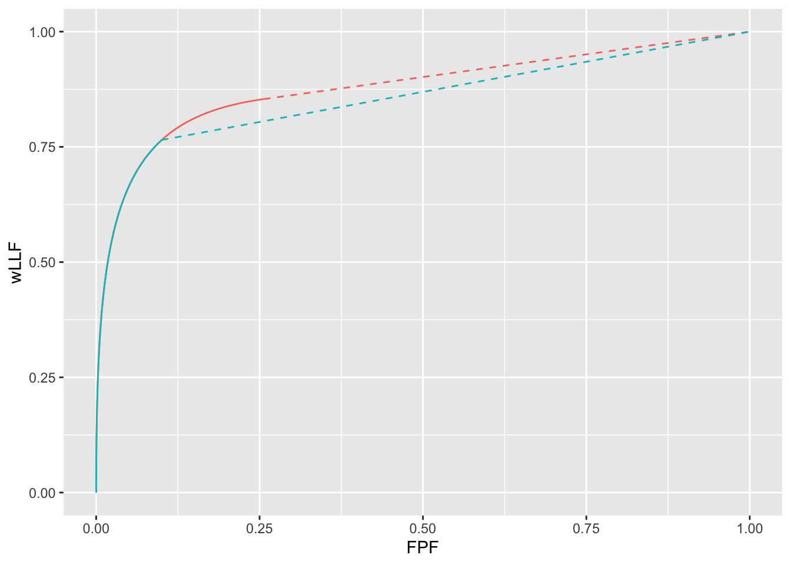
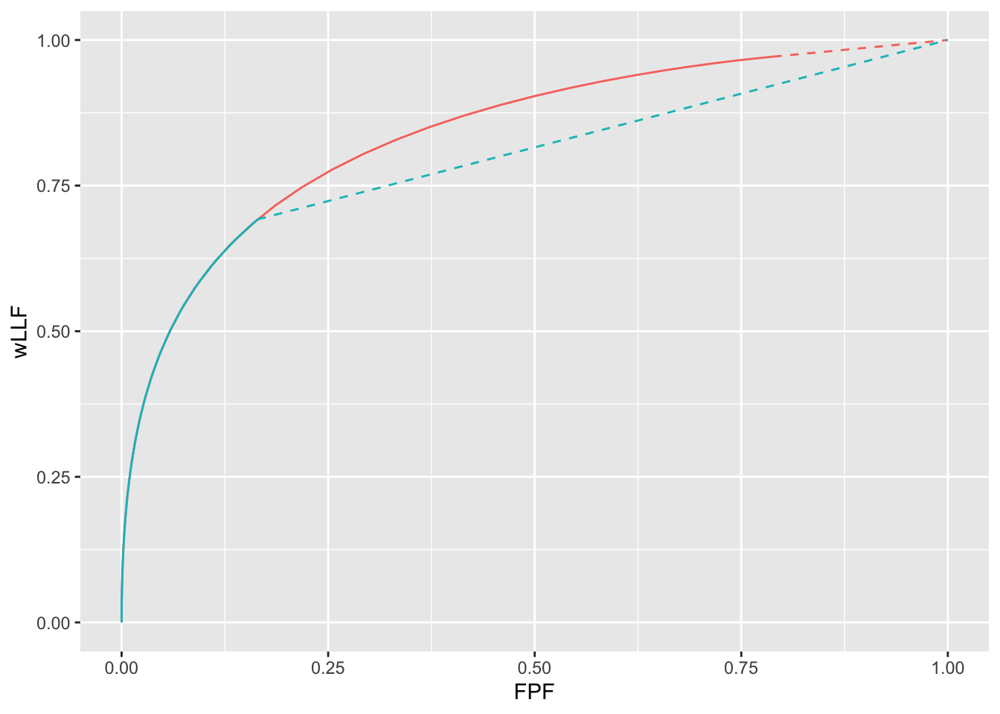
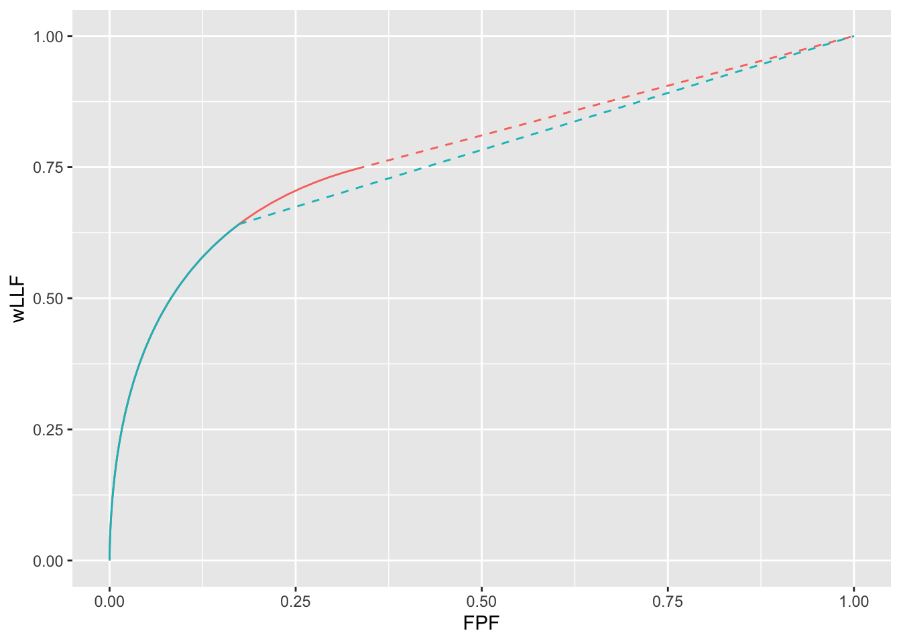

# Optimal operating point on FROC {#optim-op-point}

---
output:
  rmarkdown::pdf_document:
    fig_caption: yes        
    includes:  
      in_header: R/learn/my_header.tex
---


## How much finished {#optim-op-point-how-much-finished}
40%
Major update to 21-optim-op-point.Rmd - need to resolve plots in vary mu


## Methods {#optim-op-point-methods}

The RSM parameters are $\lambda$, $\nu$, $\mu$ and $\zeta_1$. In the following sections each of the first three parameters is varied in turn and the optimal $\zeta_1$ determined by maximizing one of two figures of merit (FOM) namely, the wAFROC-AUC or the Youden-index. The two functions to be minimized, `wAFROC` and `Youden`, are defined next: 

* wAFROC-AUC is computed by `UtilAnalyticalAucsRSM`. Lines 2 - 17 returns `-wAFROC`, the *negative* of wAFROC-AUC. The negative sign is needed because the `optimize()` function, used later, finds the *minimum* of wAFROC-AUC. The first argument is $\zeta_1$, the variable to be varied to find the minimum. The remaining arguments are needed by `UtilAnalyticalAucsRSM`: $\mu$, $\lambda$, $\nu$, `lesDistr` and `relWeights.` The last two specify the number of lesions per case and their weights. The example below uses `lesDistr = c(0.5,0.5)`, i.e., half the abnormal cases contain one lesion and the rest contain two lesions, and `relWeights = c(0.5,0.5)` specifies equal weights.


* The Youden-index is defined as the sum of sensitivity and specificity minus 1. Sensitivity is computed by `RSM_yROC` and specificity by `(1 - RSM_xROC)`. Lines 22 - 40 returns `-Youden`, the *negative* of the Youden-index. 


```{.r .numberLines}

wAFROC <- function (
  zeta1, 
  mu, 
  lambda, 
  nu, 
  lesDistr, 
  relWeights) {
  x <- UtilAnalyticalAucsRSM(
    mu, 
    lambda, 
    nu, zeta1, 
    lesDistr, 
    relWeights)$aucwAFROC
  # return negative of aucwAFROC 
  # (as optimize finds minimum of function)
  return(-x)
  
}


Youden <- function (
  zeta1, 
  mu, 
  lambda, 
  nu, 
  lesDistr, 
  relWeights) {
  # add sensitivity and specificity 
  # and subtract 1, i.e., Youden's index
  x <- RSM_yROC(
    zeta1, 
    mu, 
    lambda, 
    nu, 
    lesDistr) + 
    (1 - RSM_xROC(zeta1, lambda)) - 1
  # return negative of Youden 
  # (as optimize finds minimum of function)
  return(-x)
  
}
```


## Vary lambda  {#optim-op-point-vary-lambda}

For $\mu = 2$ and $\nu = 1$ wAFROC and Youden-index based optimizations were performed for 4 values of $\lambda = 1, 5, 10, 15$. The following quantities were calculated:

* `zetaOptArr`, a [2,4] array, the optimal thresholds $\zeta_1$; 
* `maxFomArr`, a [2,4] array, the optimal values of the figures of merit, wAFROC-AUC or Youden; 
* `rocAucArr`, a [2,4] array, the AUCs under the ROC curves corresponding to optimizations based on wAFROC or Youden-index;   
* `nlfOptArr`, a [2,4] array, the abscissa of the FROC curve corresponding to optimizations based on wAFROC or Youden-index;   
* `llfOptArr`, a [2,4] array, the ordinate of the FROC curve corresponding to optimizations based on wAFROC or Youden-index.   

In each of these arrays the first index `y` denotes whether wAFROC-AUC is being maximized (`y` = 1, see lines 14 - 20) - or if Youden-index is being optimized (`y` = 2, see lines 39 - 45). The second index corresponds to $\lambda$.


```{.r .numberLines}
mu <- 2
nu <- 1
lambdaArr <- c(1,5,10,15)
maxFomArr <- array(dim = c(2,length(lambdaArr)))
zetaOptArr <- array(dim = c(2,length(lambdaArr)))
rocAucArr <- array(dim = c(2,length(lambdaArr)))
nlfOptArr <- array(dim = c(2,length(lambdaArr)))
llfOptArr <- array(dim = c(2,length(lambdaArr)))
lesDistr <- c(0.5, 0.5)
relWeights <- c(0.5, 0.5)
for (y in 1:2) {
  for (i in 1:length(lambdaArr)) {
    if (y == 1) {
      x <- optimize(wAFROC, 
                    interval = c(-5,5), 
                    mu, 
                    lambdaArr[i], 
                    nu, 
                    lesDistr, 
                    relWeights)
      zetaOptArr[y,i] <- x$minimum
      maxFomArr[y,i] <- -x$objective
      rocAucArr[y,i] <- UtilAnalyticalAucsRSM(
        mu, 
        lambdaArr[i], 
        nu, 
        zeta1 = x$minimum, 
        lesDistr, 
        relWeights)$aucROC
      nlfOptArr[y,i] <- RSM_xFROC(
        z = x$minimum, 
        mu, 
        lambda = lambdaArr[i])
      llfOptArr[y,i] <- RSM_yFROC(
        z = x$minimum, 
        mu, 
        nu)
    } else if (y == 2) {
      x <- optimize(Youden, 
                    interval = c(-5,5), 
                    mu, 
                    lambdaArr[i], 
                    nu, 
                    lesDistr, 
                    relWeights)
      zetaOptArr[y,i] <- x$minimum
      maxFomArr[y,i] <- -x$objective
      rocAucArr[y,i] <- UtilAnalyticalAucsRSM(
        mu, 
        lambdaArr[i], 
        nu, 
        zeta1 = x$minimum, 
        lesDistr, 
        relWeights)$aucROC
      nlfOptArr[y,i] <- RSM_xFROC(
        z = x$minimum, 
        mu, 
        lambda = lambdaArr[i])
      llfOptArr[y,i] <- RSM_yFROC(
        z = x$minimum, mu, nu)
    } else stop("incorrect y")
  }
}
```


Table \@ref(tab:optim-op-point-table1) summarizes the results. The column labeled "FOM" shows what is being maximized, "lambda" corresponds to the 4 values of $\lambda$, "zeta1" is the optimal value of $\zeta_1$ that maximizes FOM, "wAFROC" is the wAFROC-AUC, "ROC" is the AUC under the ROC curve, i.e., ROC-AUC, and "OptOpPt" is the optimal operating point on the FROC curve. 

Focusing on the wAFROC-AUC based optimizations (first four rows of table), it is seen that as $\lambda$ increases:

* The optimal threshold $\zeta_1$ increases;
* wAFROC-AUC decreases;
* ROC-AUC decreases;
* The optimal operating point on the FROC moves to lower LLF values, i.e., lower values of lesion-level "sensitivity".

The $\lambda$ Poisson parameter controls the average number of latent non-lesion localizations (NLs or "false-positives") per case. For example, for $\mu = 2$ and $\lambda = 1$, the average number of latent NLs per case is $\lambda' = \lambda /\mu = 0.5$, i.e., an average of one NL every two non-diseased case. With increasing numbers of NLs it is necessary to adopt an increasing reporting threshold in order to not overwhelm the radiologist with NLs, and the price paid is decreasing LLF. Overall CAD performance, regardless of how it is measured, decreases.   

Similar trends are observed for the Youden-index based optimizations (last four rows of table). However, comparing Youden-index based optimizations to wAFROC-AUC based optimizations shows that Youden-index based optimizations yield higher reporting thresholds resulting in lower wAFROC-AUC, lower ROC-AUC and lower LLF values. 


<table class="table" style="margin-left: auto; margin-right: auto;">
<caption>(\#tab:optim-op-point-table1)Summary of optimization results for $\mu = 2$ and $\nu = 1$ .</caption>
 <thead>
  <tr>
   <th style="text-align:left;"> FOM </th>
   <th style="text-align:left;"> lambda </th>
   <th style="text-align:left;"> zeta1 </th>
   <th style="text-align:left;"> wAFROC </th>
   <th style="text-align:left;"> ROC </th>
   <th style="text-align:left;"> OptOpPt </th>
  </tr>
 </thead>
<tbody>
  <tr>
   <td style="text-align:left;"> wAFROC </td>
   <td style="text-align:left;"> 1 </td>
   <td style="text-align:left;"> -0.235 </td>
   <td style="text-align:left;"> 0.880 </td>
   <td style="text-align:left;"> 0.937 </td>
   <td style="text-align:left;"> (0.296, 0.854) </td>
  </tr>
  <tr>
   <td style="text-align:left;"> wAFROC </td>
   <td style="text-align:left;"> 5 </td>
   <td style="text-align:left;"> 0.810 </td>
   <td style="text-align:left;"> 0.768 </td>
   <td style="text-align:left;"> 0.875 </td>
   <td style="text-align:left;"> (0.522, 0.763) </td>
  </tr>
  <tr>
   <td style="text-align:left;"> wAFROC </td>
   <td style="text-align:left;"> 10 </td>
   <td style="text-align:left;"> 1.373 </td>
   <td style="text-align:left;"> 0.699 </td>
   <td style="text-align:left;"> 0.825 </td>
   <td style="text-align:left;"> (0.424, 0.635) </td>
  </tr>
  <tr>
   <td style="text-align:left;"> wAFROC </td>
   <td style="text-align:left;"> 15 </td>
   <td style="text-align:left;"> 1.697 </td>
   <td style="text-align:left;"> 0.660 </td>
   <td style="text-align:left;"> 0.788 </td>
   <td style="text-align:left;"> (0.336, 0.535) </td>
  </tr>
  <tr>
   <td style="text-align:left;"> Youden </td>
   <td style="text-align:left;"> 1 </td>
   <td style="text-align:left;"> 1.100 </td>
   <td style="text-align:left;"> 0.695 </td>
   <td style="text-align:left;"> 0.896 </td>
   <td style="text-align:left;"> (0.068, 0.706) </td>
  </tr>
  <tr>
   <td style="text-align:left;"> Youden </td>
   <td style="text-align:left;"> 5 </td>
   <td style="text-align:left;"> 1.729 </td>
   <td style="text-align:left;"> 0.495 </td>
   <td style="text-align:left;"> 0.810 </td>
   <td style="text-align:left;"> (0.105, 0.525) </td>
  </tr>
  <tr>
   <td style="text-align:left;"> Youden </td>
   <td style="text-align:left;"> 10 </td>
   <td style="text-align:left;"> 1.992 </td>
   <td style="text-align:left;"> 0.399 </td>
   <td style="text-align:left;"> 0.764 </td>
   <td style="text-align:left;"> (0.116, 0.435) </td>
  </tr>
  <tr>
   <td style="text-align:left;"> Youden </td>
   <td style="text-align:left;"> 15 </td>
   <td style="text-align:left;"> 2.146 </td>
   <td style="text-align:left;"> 0.344 </td>
   <td style="text-align:left;"> 0.736 </td>
   <td style="text-align:left;"> (0.120, 0.382) </td>
  </tr>
</tbody>
</table>


It remains to display the FROC curves with superimposed optimal operating points. One could generate 8 FROC plots, each corresponding to a row of the preceding table, but there is a more efficient method. The FROC curve is defined by the search model parameters as follows:


\begin{equation}
\left. 
\begin{aligned}
NLF \left ( \zeta, \lambda' \right ) =& \lambda' \Phi \left (-\zeta \right ) \\
LLF\left ( \zeta, \mu, \nu', \overrightarrow{f_L} \right ) =& \nu' \Phi \left ( \mu - \zeta \right ) 
\end{aligned}
\right \}
(\#eq:rsm-froc-predictions)
\end{equation}

The *physical* parameters $\lambda'$ and $\nu'$ are related to the *intrinsic* parameters $\mu$, $\lambda$ and $\nu$ by: 

\begin{equation}
\left. 
\begin{aligned}
\lambda' =& \frac{\lambda  }{\mu} \\
\nu' =& 1 - exp\left (-\mu \nu \right ) 
\end{aligned}
\right \}
(\#eq:rsm-intrinsic-physical)
\end{equation}


Since the $\Phi$ function ranges from one to unity, the *four FROC curves are scaled versions of a single curve whose x-axis ranges from 0 to 1*. The single curve corresponds to $\lambda' = 1$ and the true curves are obtained by scaling this curve along the x-axis by the appropriate $\lambda'$ factor. With this understanding one can display 4 FROC curves with a single FROC curve where the x-axis is $NLF \left ( \zeta, \lambda' = 1 \right )$. The true FROC curve is defined by:  


\begin{equation}
\left. 
\begin{aligned}
NLF \left ( \zeta, \lambda' \right ) =& \lambda' NLF \left ( \zeta, \lambda' = 1 \right ) \\
LLF\left ( \zeta, \mu, \nu', \overrightarrow{f_L} \right ) =& \nu' \Phi \left ( \mu - \zeta \right ) 
\end{aligned}
\right \}
(\#eq:rsm-froc-predictions2)
\end{equation}


<div class="figure">

<p class="caption">(\#fig:optim-op-point-vary-lambda)Left panel: maximized wAFROC AUC was used to find optimal $\zeta_1$. Right panel: maximized Youden index was used to find optimal $\zeta_1$. Dot colors: black means $\lambda = 1$, red means $\lambda = 5$, green means $\lambda = 10$ and blue means $\lambda = 15$.</p>
</div>


The left panel in \@ref(fig:optim-op-point-vary-lambda) shows the optimal operating points when wAFROC-AUC is maximized. The 4 operating points are color coded as follows:

* Black dot corresponds to $\lambda = 1$, i.e., $\lambda' = 1/2 = 0.5$. In other words, the true FROC is obtained by *shrinking* the plot, including the superposed black dot, along the x-axis by a factor of 2.  
* Red dot corresponds to $\lambda' = 2.5$. In other words, the true FROC is obtained by *magnifying* that shown, including the red dot, along the x-axis by a factor of 2.5.   
* Green dot corresponds to $\lambda' = 5$. 
* Blue dot corresponds to $\lambda' = 7.5$.  

These plots illustrate the previous comments, namely, as $\lambda$ increases, *the optimal operating point moves down the scaled curve*.

The right panel shows the optimal operating point when the Youden index is maximized. It shows the same general features as the previous example - the optimal operating point moves down the scaled curve - and additionally, the group of four operating points in the right panel are below-left those in the left panel, representing higher values of optimal $\zeta_1$, i.e., a more stringent criteria. 


The FROC curve does not represent true performance. To visualize true performance one compares wAFROC curves, as done below for $\lambda = 1$ and $\lambda = 15$.    


<div class="figure">

<p class="caption">(\#fig:optim-op-point-vary-lambda-wafroc)Results of wAFROC-AUC based optimizations; wAFROC curves corresponding to $\lambda = 1$, red curve, and $\lambda = 15$, blue curve.</p>
</div>


Only results of wAFROC-AUC based optimizations are shown in \@ref(fig:optim-op-point-vary-lambda-wafroc). The larger area under the red curve, corresponding to the lower value of $\lambda$ is obvious. Each curve ends at the optimal threshold listed in Table \@ref(tab:optim-op-point-table1), namely $\zeta_1$ = -0.235 for the red curve and $\zeta_1$ = 1.697 for the blue curve. The lower performance represented by the blue curve, relative to the red curve, requires the adoption of a higher reporting threshold. For either curve the maximization procedure means that any threshold other than that used would depress performance.


## Vary nu {#optim-op-point-vary-nu}

For $\mu = 2$ and $\lambda= 5$ wAFROC and Youden-index based optimizations were performed for 4 values of $\nu = 0.1,0.5,1,2$. Table \@ref(tab:optim-op-point-table2) summarizes the results. 


<table class="table" style="margin-left: auto; margin-right: auto;">
<caption>(\#tab:optim-op-point-table2)Summary of optimization results for $\mu = 2$ and $\lambda = 5$ .</caption>
 <thead>
  <tr>
   <th style="text-align:left;"> FOM </th>
   <th style="text-align:left;"> nu </th>
   <th style="text-align:left;"> zeta1 </th>
   <th style="text-align:left;"> wAFROC </th>
   <th style="text-align:left;"> ROC </th>
   <th style="text-align:left;"> OptOpPt </th>
  </tr>
 </thead>
<tbody>
  <tr>
   <td style="text-align:left;"> wAFROC </td>
   <td style="text-align:left;"> 0.1 </td>
   <td style="text-align:left;"> 2.275 </td>
   <td style="text-align:left;"> 0.522 </td>
   <td style="text-align:left;"> 0.551 </td>
   <td style="text-align:left;"> (0.029, 0.071) </td>
  </tr>
  <tr>
   <td style="text-align:left;"> wAFROC </td>
   <td style="text-align:left;"> 0.5 </td>
   <td style="text-align:left;"> 1.376 </td>
   <td style="text-align:left;"> 0.660 </td>
   <td style="text-align:left;"> 0.771 </td>
   <td style="text-align:left;"> (0.211, 0.464) </td>
  </tr>
  <tr>
   <td style="text-align:left;"> wAFROC </td>
   <td style="text-align:left;"> 1 </td>
   <td style="text-align:left;"> 0.810 </td>
   <td style="text-align:left;"> 0.768 </td>
   <td style="text-align:left;"> 0.875 </td>
   <td style="text-align:left;"> (0.522, 0.763) </td>
  </tr>
  <tr>
   <td style="text-align:left;"> wAFROC </td>
   <td style="text-align:left;"> 2 </td>
   <td style="text-align:left;"> -0.311 </td>
   <td style="text-align:left;"> 0.841 </td>
   <td style="text-align:left;"> 0.915 </td>
   <td style="text-align:left;"> (1.555, 0.971) </td>
  </tr>
  <tr>
   <td style="text-align:left;"> Youden </td>
   <td style="text-align:left;"> 0.1 </td>
   <td style="text-align:left;"> 2.156 </td>
   <td style="text-align:left;"> 0.075 </td>
   <td style="text-align:left;"> 0.557 </td>
   <td style="text-align:left;"> (0.039, 0.079) </td>
  </tr>
  <tr>
   <td style="text-align:left;"> Youden </td>
   <td style="text-align:left;"> 0.5 </td>
   <td style="text-align:left;"> 1.763 </td>
   <td style="text-align:left;"> 0.363 </td>
   <td style="text-align:left;"> 0.736 </td>
   <td style="text-align:left;"> (0.097, 0.375) </td>
  </tr>
  <tr>
   <td style="text-align:left;"> Youden </td>
   <td style="text-align:left;"> 1 </td>
   <td style="text-align:left;"> 1.729 </td>
   <td style="text-align:left;"> 0.495 </td>
   <td style="text-align:left;"> 0.810 </td>
   <td style="text-align:left;"> (0.105, 0.525) </td>
  </tr>
  <tr>
   <td style="text-align:left;"> Youden </td>
   <td style="text-align:left;"> 2 </td>
   <td style="text-align:left;"> 1.727 </td>
   <td style="text-align:left;"> 0.555 </td>
   <td style="text-align:left;"> 0.843 </td>
   <td style="text-align:left;"> (0.105, 0.597) </td>
  </tr>
</tbody>
</table>


The effect of increasing $\nu$ is to cause the optimal operationg point to move up the FROC curve: it is opposite to the effect of increasing $\lambda$. Focusing on the wAFROC-AUC based optimizations (first four rows of table), it is seen that as $\nu$ increases:

* The optimal threshold $\zeta_1$ decreases, resulting in more marks being reported;
* wAFROC-AUC increases;
* ROC-AUC increases;
* The optimal operating point on the FROC moves to higher LLF values, i.e., higher values of lesion-level "sensitivity".

The $\nu$ binomial parameter controls the average fraction of latent lesion localizations (LLs or "true-positives") per diseased case. For example, for $\mu = 2$ and $\nu = 0.1$, the fraction is $\nu' = 1 - \exp(-\mu \nu) = 0.1813$, i.e., an average of 18 percent of lesions present are seen by CAD at confidence level $ > -\infty$. Overall CAD performance increases with increasing $\nu$.   

Comparing Youden-index based optimizations (last four rows of table) to wAFROC-AUC based optimizations shows that the former yields higher reporting thresholds, lower wAFROC-AUC, lower ROC-AUC and lower LLF values. 


<div class="figure">

<p class="caption">(\#fig:optim-op-point-vary-nu)Left panel: maximized wAFROC AUC was used to find optimal $\zeta_1$. Right panel: maximized Youden index was used to find optimal $\zeta_1$. Dot colors: black means $\nu = 0.1$, red means $\nu = 0.5$, green means $\nu = 1$ and blue means $\nu = 2$.</p>
</div>


Fig. \@ref(fig:optim-op-point-vary-nu) shows the FROC curves with optimal operating points superimposed. The left panel corresponds to wAFROC-AUC based optimizations while the right panel corresponds to Youden-index based optimizations. These illustrate the previous comments, namely, as $\nu$ increases, *the optimal operating point moves up the FROC curve*.


To visualize true performance one compares wAFROC curves as done in Fig. \@ref(fig:optim-op-point-vary-mu-wafroc) for  $\nu = 0.1$ and $\nu = 2$.    


<div class="figure">

<p class="caption">(\#fig:optim-op-point-vary-nu-wafroc)Results of wAFROC-AUC based optimizations; wAFROC curves corresponding to $\nu = 0.1$, red curve, and $\nu = 2$, blue curve.</p>
</div>


The larger area under the red curve, corresponding to the lower value of $\nu$, is obvious. Each curve ends at the optimal threshold listed in Table \@ref(tab:optim-op-point-table2), namely $\zeta_1$ = 2.275 for the red curve and $\zeta_1$ = -0.311 for the blue curve. The lower performance represented by the red curve requires the adoption of a higher reporting threshold. 


## Vary mu {#optim-op-point-vary-mu}

For $\nu = 1$ and $\lambda= 1$ wAFROC and Youden-index based optimizations were performed for 4 values of $\mu = 0.75,1,1.25,1.5$. Table \@ref(tab:optim-op-point-table2) summarizes the results.  


<table class="table" style="margin-left: auto; margin-right: auto;">
<caption>(\#tab:optim-op-point-table3)Summary of optimization results for $\nu = 1$ and $\lambda = 1$ .</caption>
 <thead>
  <tr>
   <th style="text-align:left;"> FOM </th>
   <th style="text-align:left;"> mu </th>
   <th style="text-align:left;"> zeta1 </th>
   <th style="text-align:left;"> wAFROC </th>
   <th style="text-align:left;"> ROC </th>
   <th style="text-align:left;"> OptOpPt </th>
  </tr>
 </thead>
<tbody>
  <tr>
   <td style="text-align:left;"> wAFROC </td>
   <td style="text-align:left;"> 0.75 </td>
   <td style="text-align:left;"> 1.422 </td>
   <td style="text-align:left;"> 0.518 </td>
   <td style="text-align:left;"> 0.587 </td>
   <td style="text-align:left;"> (0.103, 0.132) </td>
  </tr>
  <tr>
   <td style="text-align:left;"> wAFROC </td>
   <td style="text-align:left;"> 1 </td>
   <td style="text-align:left;"> 0.310 </td>
   <td style="text-align:left;"> 0.603 </td>
   <td style="text-align:left;"> 0.745 </td>
   <td style="text-align:left;"> (0.378, 0.477) </td>
  </tr>
  <tr>
   <td style="text-align:left;"> wAFROC </td>
   <td style="text-align:left;"> 1.25 </td>
   <td style="text-align:left;"> -0.132 </td>
   <td style="text-align:left;"> 0.699 </td>
   <td style="text-align:left;"> 0.823 </td>
   <td style="text-align:left;"> (0.442, 0.654) </td>
  </tr>
  <tr>
   <td style="text-align:left;"> wAFROC </td>
   <td style="text-align:left;"> 1.5 </td>
   <td style="text-align:left;"> -0.268 </td>
   <td style="text-align:left;"> 0.777 </td>
   <td style="text-align:left;"> 0.875 </td>
   <td style="text-align:left;"> (0.404, 0.747) </td>
  </tr>
  <tr>
   <td style="text-align:left;"> Youden </td>
   <td style="text-align:left;"> 0.75 </td>
   <td style="text-align:left;"> 0.144 </td>
   <td style="text-align:left;"> 0.366 </td>
   <td style="text-align:left;"> 0.676 </td>
   <td style="text-align:left;"> (0.590, 0.384) </td>
  </tr>
  <tr>
   <td style="text-align:left;"> Youden </td>
   <td style="text-align:left;"> 1 </td>
   <td style="text-align:left;"> 0.386 </td>
   <td style="text-align:left;"> 0.413 </td>
   <td style="text-align:left;"> 0.741 </td>
   <td style="text-align:left;"> (0.350, 0.462) </td>
  </tr>
  <tr>
   <td style="text-align:left;"> Youden </td>
   <td style="text-align:left;"> 1.25 </td>
   <td style="text-align:left;"> 0.599 </td>
   <td style="text-align:left;"> 0.482 </td>
   <td style="text-align:left;"> 0.793 </td>
   <td style="text-align:left;"> (0.220, 0.530) </td>
  </tr>
  <tr>
   <td style="text-align:left;"> Youden </td>
   <td style="text-align:left;"> 1.5 </td>
   <td style="text-align:left;"> 0.782 </td>
   <td style="text-align:left;"> 0.557 </td>
   <td style="text-align:left;"> 0.835 </td>
   <td style="text-align:left;"> (0.145, 0.593) </td>
  </tr>
</tbody>
</table>


* From Table \@ref(tab:optim-op-point-table3) for the lowest value $\mu = 0.75$ the end-point of the FROC, corresponding to $\zeta_1 = -\infty$, is the farthest to the right and lowest in the vertical direction, and the optimal operating point is closest to the origin, i.e., (0.103, 0.132). wAFROC-AUC performance = 0.518 is least as is ROC-AUC = 0.587. ^[With even lower performance - achieved by choosing, for example, a smaller value of $\mu$, both wAFROC and ROC AUCs approach 0.5 and the optimal operating point is at the origin - basically the algorithm is so poor that none of its marks should be shown to the radiologist.] 

* As $\mu$ increases, the FROC end-point moves to the upper left and the optimal operating point moves up.

* At the highest value $\mu = 1.5$ the end-point of the FROC is the closest to (0,1), and the optimal operating point is farthest from the origin, i.e., (0.404, 0.747). wAFROC-AUC performance = 0.777 is greatest as is ROC-AUC = 0.875. With good performance one shows lower confidence level marks: $\zeta_1$ = -0.268 than is possible with poorer performance. With even higher values of $\mu$ both wAFROC and ROC AUCs approach 1 and the optimal operating point approaches (0,1) - the algorithm is so good that all of its marks should be shown to the radiologist. 

* At the lowest value $\mu = 0.75$ the end-point of the FROC is at (0.590, 0.384). wAFROC-AUC performance = 0.366 and ROC-AUC = 0.676, both of which are smaller than the values obtained using wAFROC-AUC maximization. 

* At the highest value $\mu = 1.5$ the end-point of the FROC at (0.145, 0.593). wAFROC-AUC performance = 0.557 and ROC-AUC = 0.835, both of which are smaller that the values obtained using wAFROC-AUC maximization. 

* TBA With one exception the operating points in the right panel are below-left (i.e., represent higher thresholds) those in the left panel. The Youden-index based optimization yields stricter reporting threshold. Somewhat paradoxically, for the lowest value of $\mu$ the method predicts a lenient threshold.  


Fig. \@ref(fig:optim-op-point-vary-mu) shows FROC curves with superimposed optimal operating points. 


<div class="figure">

<p class="caption">(\#fig:optim-op-point-vary-mu)Left panel: maximized wAFROC AUC was used to find optimal $\zeta_1$. Right panel: maximized Youden-index was used to find optimal $\zeta_1$. Dot colors: black means $\mu = 0.75$, red means $\mu = 1$, green means $\lambda = 1.25$ and blue means $\mu = 1.5$.</p>
</div>


For each of the four values of $\mu$ the left panel in Fig. \@ref(fig:optim-op-point-vary-mu) shows the optimal operating point when wAFROC-AUC is maximized. It shows the FROC curves with optimal operating points superimposed. These illustrate the previous comments, namely, as $\mu$ increases, *the optimal operating point moves up the FROC curve*.


The right panel in Fig. \@ref(fig:optim-op-point-vary-mu) shows the optimal operating point when the Youden-index is maximized. 


To visualize true performance one compares wAFROC curves as done in Fig. \@ref(fig:optim-op-point-vary-mu-wafroc) for $\mu = 0.75$ and $\mu = 1.5$.    


<div class="figure">

<p class="caption">(\#fig:optim-op-point-vary-mu-wafroc)Results of wAFROC-AUC based optimizations; wAFROC curves corresponding to $\mu = 0.75$, red curve, and $\mu = 1.5$, blue curve.</p>
</div>


The larger area under the blue curve, corresponding to the greater value of $\mu$, is obvious. Each curve ends at the optimal threshold listed in Table \@ref(tab:optim-op-point-table3), namely $\zeta_1$ = 1.422 for the red curve and $\zeta_1$ = -0.268 for the blue curve. The lower performance represented by the red curve requires the adoption of a higher reporting threshold. 


## Using the method {#optim-op-point-how-to-use-method}
Assume that one has designed an algorithmic observer that has been optimized with respect to all other parameters except the reporting threshold. At this point the algorithm reports every suspicious region, no matter how low the malignancy index. The mark-rating pairs are entered into a `RJafroc` format Excel input file. The next step is to read the data file -- `DfReadDataFile()` -- convert it to an ROC dataset -- `DfFroc2Roc()` -- and then perform a radiological search model (RSM) fit to the dataset using function `FitRsmRoc()`. This yields the necessary $\lambda, \mu, \nu$ parameters. These values are used to perform the computations described in the embedded code in this chapter, see for example Section \@ref(optim-op-point-vary-lambda). This determines the optimal reporting threshold. The RSM parameter values and the reporting threshold determine the optimal reporting point on the FROC curve. The designer sets the algorithm to only report marks with confidence levels exceeding this threshold. 


## Application {#optim-op-point-application}

TBA Fit the LROC dataset to the RSM.


```r
ds <- datasetCadSimuFroc
dsCad <- DfExtractDataset(ds, rdrs = 1)
dsCadRoc <- DfFroc2Roc(dsCad)
dsCadRocBinned <- DfBinDataset(dsCadRoc, opChType = "ROC")
lesDistr <- c(1)
fit <- FitRsmRoc(dsCadRocBinned, lesDistr)
mu <- fit$mu
lambdaP <- fit$lambdaP
nuP <- fit$nuP
x <- UtilPhysical2IntrinsicRSM(mu, lambdaP, nuP)
lambda <- x$lambda
nu <- x$nu
```


Table \@ref(tab:optim-op-point-table4) summarizes the results.


<table class="table" style="margin-left: auto; margin-right: auto;">
<caption>(\#tab:optim-op-point-table4)Summary of optimization results for $\nu = 1$ and $\lambda = 1$ .</caption>
 <thead>
  <tr>
   <th style="text-align:left;"> FOM </th>
   <th style="text-align:left;"> lambda </th>
   <th style="text-align:left;"> zeta1 </th>
   <th style="text-align:left;"> wAFROC </th>
   <th style="text-align:left;"> ROC </th>
   <th style="text-align:left;"> OptOpPt </th>
  </tr>
 </thead>
<tbody>
  <tr>
   <td style="text-align:left;"> wAFROC </td>
   <td style="text-align:left;"> 18.680 </td>
   <td style="text-align:left;"> 1.739 </td>
   <td style="text-align:left;"> 0.774 </td>
   <td style="text-align:left;"> 0.815 </td>
   <td style="text-align:left;"> (0.278, 0.679) </td>
  </tr>
  <tr>
   <td style="text-align:left;"> Youden </td>
   <td style="text-align:left;"> 18.680 </td>
   <td style="text-align:left;"> 2.406 </td>
   <td style="text-align:left;"> 0.398 </td>
   <td style="text-align:left;"> 0.750 </td>
   <td style="text-align:left;"> (0.055, 0.512) </td>
  </tr>
</tbody>
</table>


Fig. \@ref(fig:optim-op-point-application-froc) shows FROC curves with superimposed optimal operating points. 


<div class="figure">

<p class="caption">(\#fig:optim-op-point-application-froc)Maximized wAFROC AUC was used to find optimal $\zeta_1$.</p>
</div>


<div class="figure">

<p class="caption">(\#fig:optim-op-point-application-wafroc)Results of wAFROC-AUC based optimizations; wAFROC curves corresponding to $\mu = 0.75$, red curve, and $\mu = 1.5$, blue curve.</p>
</div>


## References {#optim-op-point-references}
