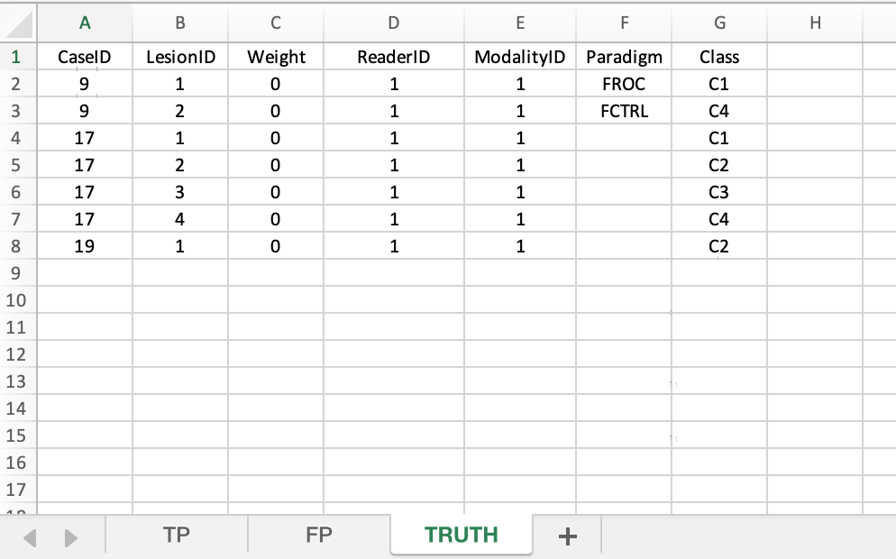
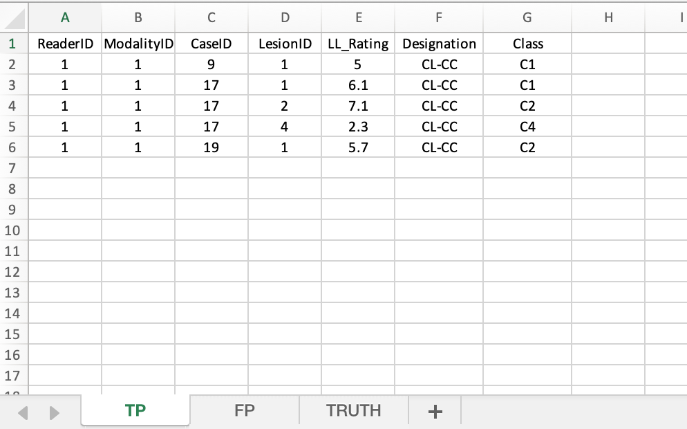
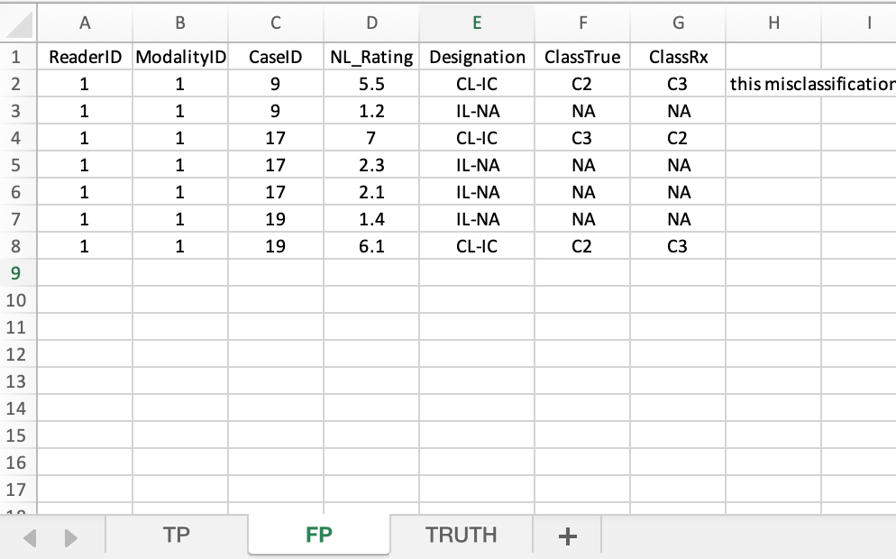
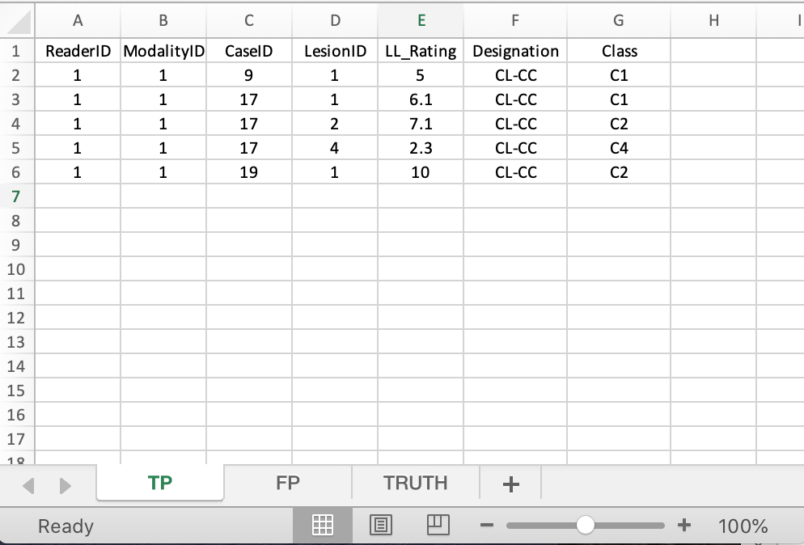

# Classification tasks {#classification-tasks}

```{r setup, include = FALSE}
  knitr::opts_chunk$set(
  collapse = TRUE,
  comment = "#>"
  )
  library(RJafroc)
  library(ggplot2)
  library(kableExtra)
  library(gridExtra)
```


## Introduction TBA {#classification-tasks-intro}

This is in progress; the topic arose from an email exchange outlined below.

## email 1

1) Have multiple classes been considered in the newest version? That means there are, for example, three types of lesions (type 1, 2, 3) in an image. Then the observer may annotate the correct location, but indicate the wrong type of the lesion (e.g. the ground truth is type2, but the observer indicates it as type1).
If not, do you know any statistical analysis method that can consider this type of error?
2) If I remember correctly, the acceptance radius R was the same value for all the tested images, can we now set a different value for each test image?


## response 1
Taking your second question first:
The acceptance radius is selected by you, in consultation with expert readers, along lines described in my book. It is outside the scope of the analysis software.

Regarding your first question:
**A key point is that spatial localization (as currently handled) is a special case of localization-with-classification (which is your interest).** 

The `TP` and `FP` Excel worksheets are relatively easy to handle. If you have 3 types of lesions, and each localization mark is associated with an indicated perceived lesion type, e.g., `Type1`, `Type2` or `Type3`, and if the perceived localization and perceived type both agree with the truth, then the rating goes in the `TP` worksheet, otherwise the rating goes in the `FP` worksheet. 

The `Truth` worksheet is more complex. The number of lesions in the `Truth` worksheet for a particular case is the sum of all lesions of all types in that case. Ideally the `Truth` worksheet should have an extra column for `lesionType`, but extensive modifications to existing code is required to implement this.

In the meantime, you can “fool” the current software by doing the localization-classification book-keeping yourself. I will illustrate with one example.

Suppose case 1 has four lesions, two of `Type1`, one of `Type2` and one of `Type3.` 

Then in the Truth worksheet `lesionID` column for that case, there will be four integer entries: 1, 2, 3 and 4. The 1 refers to the first lesion (of `Type1` - you need to keep track of this), 2 to the second lesion (also of `Type1` - etc), 3 to the third lesion (`Type2` - etc) and 4 to the fourth lesion (of `Type3` - etc).

If `lesionID` 2 is correctly localized and classified (i.e., as `Type1`), then the corresponding rating belongs in the TP worksheet with `lesionID` = 2. 
If `lesionID` 3 is correctly localized and classified (i.e., as `Type2`), then the corresponding rating belongs in the TP …  with `lesionID` = 3. 
Etc.

If `lesionID` 1 is correctly localized but incorrectly classified (i.e., as `Type2` or `Type3`), then the rating belongs in the FP worksheet. 
Any mark not corresponding (in location) to an actual lesion (the classification is irrelevant) goes in the FP worksheet.

This scoring scheme would reward readers who get both location and classification correct and penalize them otherwise. More complex reward/penalization schemes can be worked out using lesion weights, but I would try the simple approach first.

One more thing: the classification types should be distinct, with little overlap. Otherwise one faces an issue similar to the “acceptance radius” issue with location.


## email 2

I'm clear now about my first question. I'll try the simple approach.

For the second question, I mean that for example, if the test images have different resolutions, the acceptance radius will be a ratio of the input image size, rather than a fixed value.
So I'm wondering if this value can be modified for each input image in the existing code ?


## response 2
Yes, what you are suggesting is reasonable. 

When we encountered this issue in the 2016 Radiology study, the images were of very different sizes - conventional chest x-rays vs. images on CRT monitors. We never encountered the need for a hard acceptance radius - if in doubt, an independent radiologist was consulted to determine if the localization was acceptable. This is a clinical issue - super accuracy (e.g., pixel level) is not required for the radiologist and the surgeon to agree that they are talking about the same lesion.

In any case, images are not input to my software (`RJafroc`) so this has to be done independently.

## email 3

I may need to add more explanations for this question. 

Since I'm evaluating actually if I can use the JAFROC-1 in the case of object detection and localization in CV (computer-vision) problems.
The state-of-the-art is to calculate firstly the IoU (Intersection over union), then predefine an IoU threshold (say 0.5) in classifying whether the prediction is a true positive or a false positive (similar to acceptance radius), finally calculate the Average Precision (AP) which represents the area under the precision-recall curve.
Since there is no True Negative cases in this scenario, ROC is not used. Instead, they use the precision-recall curve.

So I'm wondering if the JAFROC-1 will have a higher statistical power than this state-of-the-art.

## response 3

I am not familiar with precision recall curves and thanks for you brief explanation. Is the area under the precision-recall curve bounded or unbounded? If unbounded, I see problems with its usage, similar to problems with using the area under the FROC curve. [The areas under the ROC and AFROC curves are bounded.] The TN mark does not exist in FROC studies, in the sense that it is an unobservable mark: this is a misconception that I have discussed before. [TN mark does exist in ROC studies.]

In most medical imaging studies I am not comfortable with FOMs that do not include normal cases. Therefore, I do not recommend such studies and use of JAFROC1 FOM is not recommended. 

Of course, there could be situations where JAFROC1 FOM is appropriate, but, to get to your question, I have not studied power vs. precision recall curve in such situations.

Statistical power is an important consideration, but it is not the only consideration. Clinical relevance is another important consideration. You need to decide on what is the most appropriate method for your study.


## email 4
We have 4322 cases and 14 algorithmic readers. Actually, the maximum number of classes per case is 6, but the class type is already coded in the TP/FP worksheets, eg. when the predicted class type matches the ground truth class type, it will be put in TP, if not, it will be put in FP. So we can *not* (sic) get the class information from the excel file. 

## response 4
Excerpt from my earlier email: 

>
Suppose case 1 has four lesions, two of Type1, one of Type2 and one of Type3.
Then in the Truth worksheet lesionID column for that case, there will be four integer entries: 1, 2, 3 and 4. The 1 refers to the first lesion (of Type1 - you need to keep track of this), 2 to the second lesion (also of Type1 - etc), 3 to the third lesion (Type2 - etc) and 4 to the fourth lesion (of Type3 - etc).
If lesionID 2 is correctly localized and classified (i.e., as Type1), then the corresponding rating belongs in the TP worksheet with lesionID = 2. If lesionID 3 is correctly localized and classified (i.e., as Type2), then the corresponding rating belongs in the TP … with lesionID = 3. Etc.
If lesionID 1 is correctly localized but incorrectly classified (i.e., as Type2 or Type3), then the rating belongs in the FP worksheet. Any mark not corresponding (in location) to an actual lesion (the classification is irrelevant) goes in the FP worksheet.

The class type must appear in the `Truth` sheet under `lesionID`. This establishes the TRUE class type for each lesion. The way you currently have the `Truth` sheet structured the program thinks that the maximum number of classes is 144, not six.

The class type must also appear in `TP` sheet if the lesion was correctly located and classified. The FP sheet does not have a `lesionID` field. Both correctly located but incorrectly classified lesions and incorrectly localized lesions go in this sheet. 


## Abbreviations
* Correct-localization correct-classification = CL-CC
* Correct-localization incorrect-classification = CL-IC
* Incorrect-localization classification not applicable = IL-NA


## Example, File1
* This example is implemented in file `File1.xlsx`. 
* There are four classes of lesions: `C1`, `C2`, `C3`and `C4`.
* The rating scale is 1 - 10 and positive-directed. 
* The dataset has 3 cases: 9, 17 and 19. 

### `Truth` sheet
```{r File1Truth, echo=FALSE,out.width="50%",out.height="20%",fig.cap="Truth worksheet for File1.xlsx",fig.show='hold',fig.align='center'}

``` 

* Case 9 has two lesions, with classes `C1` and `C4`. 
* Case 17 has four lesions, with classes `C1`, `C2`, `C3`and `C4`. 
* Case 19 has one lesion, with class `C2`. 

### `TP` sheet
```{r File1TP, echo=FALSE,out.width="50%",out.height="20%",fig.cap="TP worksheet for File1.xlsx",fig.show='hold',fig.align='center'}

``` 

* This holds CL-CC marks. 

#### Case 9
* Lesion `C1`, `lesionID` = 1, CL-CC mark rated 5. 

#### Case 17
* Lesion `C1`, `lesionID` = 1, CL-CC mark rated 6.1. 
* Lesion `C2`, `lesionID` = 2, CL-CC mark rated 7.1. 
* Lesion `C4`, `lesionID` = 4, CL-CC mark rated 2.3. 

#### Case 19
* Lesion `C2`, `lesionID` = 1, CL-CC mark rated 5.7. 

### `FP` sheet
```{r File1FP, echo=FALSE,out.width="50%",out.height="20%",fig.cap="FP worksheet for File1.xlsx",fig.show='hold',fig.align='center'}

``` 

* This holds IL-NA and CL-IC marks. 

#### Case 9
* CL-IC mark rated 5.5, `C2` classified as `C3`. This misclassification is especially bad as `C3` does not exist on this case. 
* IL-NA mark rated 1.2. 

#### Case 17
* CL-IC mark rated 7, `C3` classified as `C2`. 
* IL-NA mark rated 2.3. 
* IL-NA mark rated 2.1. 


#### Case 19
* IL-NA mark rated 1.4. 
* CL-IC mark rated 6.1, `C2` classified as `C3`. 

```{r}
fileName <- "R/CH83-ClassificationTask/File1.xlsx"
x <- DfReadDataFile(fileName = fileName)
x$ratings$NL[1,1,,]
x$ratings$LL[1,1,,]
```

The FOM is shown next:

```{r}
print(UtilFigureOfMerit(x, FOM = "wAFROC1"))
```

## Example, File2
I increased the LL rating for case 19 to 10; this should increase the FOM.

```{r File2TP, echo=FALSE,out.width="50%",out.height="20%",fig.cap="TP worksheet for File2.xlsx",fig.show='hold',fig.align='center'}

``` 


```{r}
fileName <- "R/CH83-ClassificationTask/File2.xlsx"
x <- DfReadDataFile(fileName = fileName)
print(UtilFigureOfMerit(x, FOM = "wAFROC1"))
```


## Example, File3
Starting with original file, I transferred a CL-IC for case 17 to the TP sheet. This should increase the FOM as credit is given for CL-CC.

```{r File3TPFP, echo=FALSE,out.width="50%",out.height="20%",fig.cap="TP and FP worksheets for File3.xlsx",fig.show='hold',fig.align='center'}
knitr::include_graphics(c("images/classification/File3TP.png", "images/classification/File3FP.png"))
``` 


```{r}
fileName <- "R/CH83-ClassificationTask/File3.xlsx"
x <- DfReadDataFile(fileName = fileName)
print(UtilFigureOfMerit(x, FOM = "wAFROC1"))
```


## Discussion{#classification-tasks-discussion}
## Detritus
This project started with an idea on how to extend localization analysis software (RJafroc) to localization-classification tasks. I exchanged several emails with Dr. Lu discussing this. Since this is new research the required data format is not in the RJafroc-documentation. I thought I provided clear instructions, but I did assume familiarity with localization task analysis.

The class type has to be coded as sequential integers starting with 1: e.g., 1, 2, 3, 4, 5, 6. These go in the lesion ID column of the Truth sheet. If a case has class 3 and 5 lesions, there will be two entries    The 1 means the lesion with class 1, etc. If class 2 is incorrectly located or correctly located but incorrectly classified, there will be an entry for this case in the FP sheet. 

The same integers need to be used in the TP sheet. If lesion 3 is correctly located and classified then you will have an entry with 3 in the lesion ID field. 

PS: 
The class has to be coded as sequential integers starting with 1: e.g., 1, 2, 3, 4, 5, 6. If a case has two lesions, one of class 3 and the other of class 5, then there will be two entries for this case, one with lesionID = 3 and the other with lesionID = 5.  Another case with 6 lesions, all of distinct classes, will have 6 rows on entries under LesionID. 


The 1 means the lesion with class 1, etc. If class 2 is incorrectly located or correctly located but incorrectly classified, there will be an entry for this case in the FP sheet. 

The same integers need to be used in the TP sheet. If lesion 3 is correctly located and classified then you will have an entry with 3 in the lesion ID field.

## References {#classification-tasks--references}

