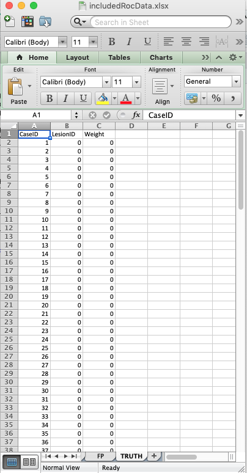
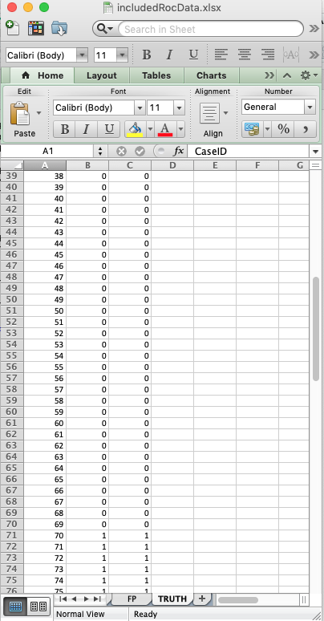
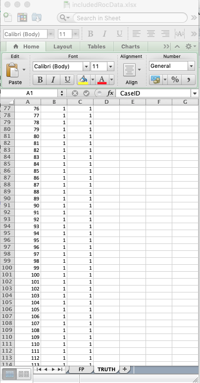
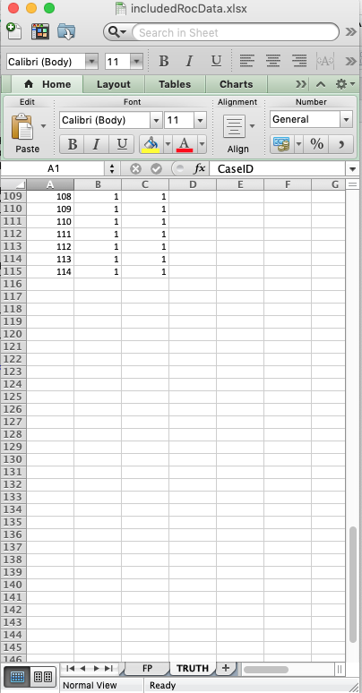

# ROC data format {#rocdataformat}


## Introduction
* In the receiver operating characteristic (__ROC__) paradigm [@RN1766] the observer's task is to  __rate__ (i.e., assign an ordered label representing the degree of suspicion) each case for confidence in presence of disease. The rating is frequently called a _confidence level_.
* The rating can be an integer or quasi- continuous (e.g., 0 – 100), or a floating point value, as long as higher numbers represent greater confidence in presence of one or more lesions in the case  ^[The directionaliy of the rating is not a limitation. If lower values correspond to increased confidence level, it is only necessary to transform the observed rating by subtracting it from a constant value. The constant value can be chosen arbitrarily, typically as the maximum of all observed ratings, thereby ensuring that the transformed value is always non-negative.].
* For human observer studies a 6-point rating scale is recommended, collected via two questions [@RN2680]:
    + Is the case diseased? 
        * Binary response: _Yes_ or _No_.
    + What is your confidence in the preceding decisions? 
        * Three level response: _Low_, _Medium_ or _High_.
* With algorithmic readers, e.g., computer aided detection algorithms a floating point rating, if possible, should be retained.
* In the most common study design, termed multiple-reader multiple-case (__MRMC__) the rating collection procedure is repeated for all cases, treatments and readers.

## An actual MRMC ROC dataset

An actual MRMC ROC dataset [@RN1993] is included as `dataset02`. It has the following structure:
  

```r
str(dataset02)
#> List of 8
#>  $ NL          : num [1:2, 1:5, 1:114, 1] 1 3 2 3 2 2 1 2 3 2 ...
#>  $ LL          : num [1:2, 1:5, 1:45, 1] 5 5 5 5 5 5 5 5 5 5 ...
#>  $ lesionNum   : int [1:45] 1 1 1 1 1 1 1 1 1 1 ...
#>  $ lesionID    : num [1:45, 1] 1 1 1 1 1 1 1 1 1 1 ...
#>  $ lesionWeight: num [1:45, 1] 1 1 1 1 1 1 1 1 1 1 ...
#>  $ dataType    : chr "ROC"
#>  $ modalityID  : Named chr [1:2] "0" "1"
#>   ..- attr(*, "names")= chr [1:2] "0" "1"
#>  $ readerID    : Named chr [1:5] "0" "1" "2" "3" ...
#>   ..- attr(*, "names")= chr [1:5] "0" "1" "2" "3" ...
```

### Overview of the data structure

* The `dataset` structure is a `list` variable with 8 members ^[This is true for ROC, FROC and ROI datasets. LROC datasets have 9 `list` members.].
    + Ratings of non-diseased cases are stored in the `NL` list member.
    + Ratings of diseased cases are stored in the `LL` list member.
    + The `lesionNum` list member is an array of length 45, filled with ones. It lists the number of lesions per case, which for ROC data, is always unity. The length of this array equals the number of diseased cases `K2`, see below.
    + The `lesionID` list member is a `[45 x 1]` array, also filled with ones. ^[The second "unnecessary" dimension is necessary for compatibility with FROC datasets.]
    + The `LesionWeight` list member is also a `[45 x 1]` array filled with ones.
    + The `dataType` list member equals the string `"ROC"`, identifying it as an ROC dataset.
    + The `modalityID` list member is a string array identifying the names of the treatments (see below).
    + The `readerID` list member is a string array, identifying the names of the readers  (see below).

### Details of the `modalityID` and `readerID` list members
* The names of the treatments are in the `modalityID` list member:


```r
attributes(dataset02$modalityID)
#> $names
#> [1] "0" "1"
```

For example, the name of the first treatment is `"0"`. The names can be longer strings, but use of very long string names may mess up the output formats of the analysis report. As per the __KISS__ principle ^[For those not familiar, KISS stands for Keep It Simple, Stupid.], keep the names short.

* The names of the readers are in the `readerID` array:


```r
attributes(dataset02$readerID)
#> $names
#> [1] "0" "1" "2" "3" "4"
```

For example, the name of the second reader is `"1"`. A similar caveat regarding long reader names applies.

### Details of the `NL` and `LL` list members
* For either `NL` or `LL` list members, the fourth dimension has unit length. This dimension, which is strictly speaking unnecessary for ROC data, is retained for ease of generalizability to the FROC and ROC paradigms, where more than one rating per case is possible.
* `dataset02` is a 2-treatment 5-reader dataset (the lengths of the first and second dimensions, respectively, of the `NL` and `LL` list members).

#### Numbers of non-diseased and diseased cases


```r
K <- length(dataset02$NL[1,1,,1])
K2 <- length(dataset02$LL[1,1,,1])
K1 <- K - K2
```

* `K1` is the number of non-diseased cases, while `K2` is the number of diseased cases.
* The third dimension of the `NL` array is the total number of __all__ cases, i.e., `K` = 114, and the third dimension of the `LL` array,  i.e., `K2` = 45, is the total number of diseased cases.

* Subtracting the number of diseased cases from the number of all cases yields the number of non-diseased cases.

* Therefore, in this dataset, there are __45__ diseased cases and __69__ non-diseased cases.

#### Why dimension the `NL` array for the total number of cases?
* Again, this is for ease of generalizability to the FROC and ROI paradigms. 

#### Ratings on a non-diseased case
* For ROC data a non-diseased case can have only one, and exactly one, `NL` rating.
* For treatment 1, reader 1 and case 1 (the first non-diseased case), the NL rating is `"1"`: 

```r
dataset02$NL[1,1,1,1]
#> [1] 1
mean(dataset02$NL[,,1:K1,1])
#> [1] 1.784058
```
* This study utilized a 5-point rating scale, 1 thru 5, so non-diseased cases are expected to have low ratings; in this case the lowest rating was observed.
* The mean rating over all non-diseased cases, treatments and readers, is 1.784058.

#### Ratings on a diseased case
* For ROC data a diseased case can have only one, and exactly one, `LL` rating.
* For treatment 1, reader 1, case 1 (the first diseased case) the LL rating is: 


```r
dataset02$LL[1,1,1,1]
#> [1] 5
mean(dataset02$LL)
#> [1] 4.297778
```

* As noted previously, this study utilized a 5-point rating scale, 1 thru 5, so diseased cases are expected to have high ratings; in this case the highest rating was observed.
* The mean rating over all diseased cases, treatments and readers, is 4.2977778.

## The ROC  Excel data file
* An Excel file in JAFROC format containing ROC data corresponding to `dataset02`, is included with the distribution. The first command (below) finds the location of the file and the second command reads it and saves it to a dataset object `ds`.  

```r
fileName <- system.file(
    "extdata", "includedRocData.xlsx", package = "RJafroc", mustWork = TRUE)
ds <- DfReadDataFile(fileName)
```

* It contains three worksheets, `Truth`, `TP` and `FP`.
* The `Truth` worksheet defines the ground-truth of each case. It indicates which cases are diseased and which are non-diseased. 
* The `CaseID` column lists the numeric labels identifying each case. Again, string names are possible, but keep them short. 
* A `1` in the `LesionID` column denotes a diseased case.
* A `0` in the `LesionID` column denotes a non-diseased case.
* The `Weight` column is irrelevant for ROC data ^[It is only needed for FROC data.].
* The contents of the `Truth` worksheet corresponding to `dataset02` are displayed next:

{width=40%}{width=40%}{width=40%}{width=40%}


    + There are 69 non-diseased cases (labeled 1-69) under column `CaseID`.
    + There are 45 diseased cases (labeled 70-114).  
    + The `LesionID` field for each non-diseased case (e.g., `CaseID` = 1) is zero. 
    + The `LesionID` field for each diseased case (e.g., `CaseID` = 70) is unity. 
    + The `Weights` field is irrelevant for ROC datasets. For convenience it is filled with zeroes.  

{width=40%}
{width=40%}

* The `FP` (or `NL`)  worksheet - this lists the ratings of ROI-level-non-diseased regions.  
    + For `ReaderID` = 1, `ModalityID` = 1 and `CaseID` = 1 there are 4 rows, corresponding to the 4 ROI-level-non-diseased regions in this case. The corresponding ratings are 1. The pattern repeats for other treatments and readers, but the rating are, of course, different.  
    + Each `CaseID` is represented in the `FP` worksheet (a rare exception could occur if a case-level abnon-diseased case has 4 abnon-diseased regions).

{width=40%}

* The `TP` (or `LL`) worksheet - this lists the ratings of ROI-level-abnon-diseased regions.  
    + Because non-diseased cases generate TPs, one does not find any entry with `CaseID` = 1-50 in the `TP` worksheet.   
    + The lowest `CaseID` in the `TP` worksheet is 51, which corresponds to the first abnon-diseased case.   
    + There are two entries for this case, corresponding to the two ROI-level-abnon-diseased regions present in this case. Recall that corresponding to this `CaseID` in the `Truth` worksheet there were two entries with `LesionID` = 2 and 3. These must match the `LesionID`'s listed for this case in the `TP` worksheet. Complementing these two entries, in the `FP` worksheet for `CaseID` = 51, there are 2 entries corresponding to the two ROI-level-non-diseased regions in this case.   
    + One should be satisfied that for each abnon-diseased case the sum of the number of entries in the `TP` and `FP` worksheets is always 4.  

