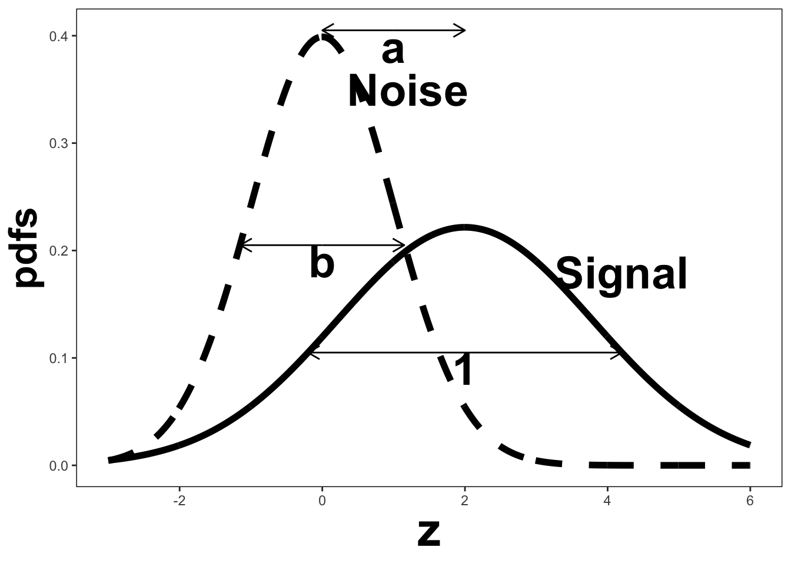
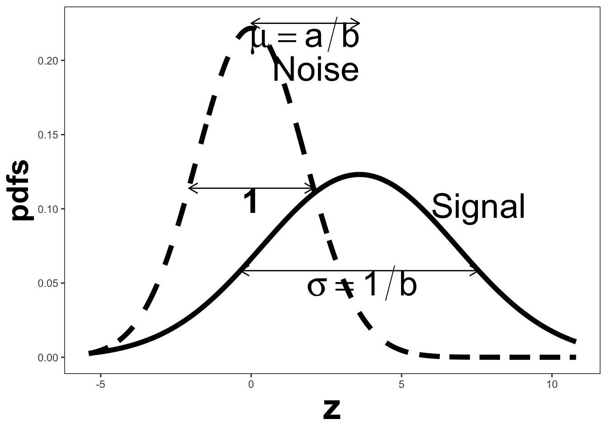

# Binormal model {#BinormalModel}


## Introduction
In this chapter the univariate binormal model is described, in which one is dealing with one ROC rating per case, as in a single observer interpreting cases, one at a time, in a single modality. By convention the qualifier "univariate" is often omitted, i.e., it is implicit. In a later chapter a bivariate binormal model will be described where each case yields two ratings, as in a single observer interpreting cases in two modalities, or equivalently, two observers interpreting cases in a single modality. 

The equal variance binormal model was described in Chapter "Binary Paradigm". The ratings method of acquiring ROC data and calculation of operating points was illustrated in Chapter "Ratings Paradigm". It was shown that for a clinical ROC dataset the unequal-variance binormal model fitted the data better than the equal-variance binormal model. This chapter deals with details of the unequal-variance binormal model, establishes necessary notation for describing the model, and derives expressions for sensitivity, specificity and the area under the predicted ROC curve (due to its complexity it appears in an Appendix). 
The main aim of this chapter is to take the mystery out of statistical curve fitting. Accordingly, this is one chapter where the Appendices are longer than the main text, but as usual, they are essential reading as they reinforce the main text. It is not too much to expect the reader to load each file beginning with "main", click on Source and see what happens. [The reader is reminded that any file that starts with "main" contains directly executable code.]


## The binormal model
The unequal-variance binormal model (henceforth abbreviated to binormal model; when the author means equal variances, it will be made explicit) is defined by (capital letters indicate random variables and their lower-case counterparts are actual realized values):

\begin{equation*} 
Z_{k_tt}\sim N\left ( \mu_t,\sigma_{t}^{2} \right );t=1,2
\end{equation*}

where 

\begin{equation*} 
\mu_1=0;\mu_2=\mu;\sigma_{1}^{2}=1;\sigma_{2}^{2}=\sigma^{2}
\end{equation*}

Eqn. (6.2.1) states that the Z-samples for non-diseased cases are distributed as a $N(0,1)$  distribution, i.e., the unit normal distribution, while the Z-samples for diseased cases are distributed as a  $N(\mu,\sigma^2)$ distribution, i.e., a normal distribution with mean $\mu$  and variance $\sigma^2$. This is a 2-parameter model of the z-samples, not counting additional threshold parameters needed for data binning.

### Binning the data
In an R-rating ROC study the observed ratings r take on integer values, 1 through R, it being understood that higher ratings correspond to greater confidence for disease. Defining dummy cutoffs $\zeta_0 = -\infty$ and  $\zeta_R = +\infty$, the binning rule for a case with realized z-sample z is (Chapter "Ratings Paradigm", Eqn. 4.13):

\begin{equation*} 
if \left (\zeta_{r-1} \le z \le \zeta_r  \right )\Rightarrow \text rating = r
\end{equation*}


```r
mu <- 1.5;sigma <- 1.5

z1 <- seq(-3, 4, by = 0.01)
z2 <- seq(-3, 6, by = 0.01)

Pdf1 <- dnorm(z1)
Pdf2 <- dnorm(z2, mu, sd = sigma)

df <- data.frame(z = c(z1, z2), pdfs = c(Pdf1, Pdf2), 
                 truth = c(rep('non-diseased', length(Pdf1)), rep('diseased', length(Pdf2))), 
                 stringsAsFactors = FALSE)

cut_point <- data.frame(z = c(-2.0, -0.5, 1, 2.5))

rocPdfs <- ggplot(df, aes(x = z, y = pdfs, color = truth)) + 
  geom_line(size = 2) + 
  scale_colour_manual(values=c("darkgrey","black")) + 
  theme(legend.title = element_blank(), legend.position = c(0.85, 0.95), 
        legend.text = element_text(size=25, face = "bold"), 
          axis.title.x = element_text(hjust = 0.8, size = 30,face="bold"),
        axis.title.y = element_text(size = 25,face="bold")) +
  geom_vline(data = cut_point, aes(xintercept = z), linetype = "dotted", size = 1.5) +
  annotation_custom(grob = textGrob(bquote(italic("O")),
                                    gp = gpar(fontsize = 32)), 
                    xmin = -3.2, xmax = -3.2, # adjust the position of "O"
                    ymin = -0.0, ymax = -0.01) +
  scale_x_continuous(expand = c(0, 0)) + 
  scale_y_continuous(expand = c(0, 0))

for (i in 1 : length(cut_point$z)){
  rocPdfs <- rocPdfs +
    annotation_custom(grob = textGrob(bquote(zeta[.(i)]),gp = gpar(fontsize = 20)),
                      xmin = cut_point$z[i], xmax = cut_point$z[i],
                      ymin = -0.01, ymax = -0.01)
}

gt <- ggplot_gtable(ggplot_build(rocPdfs))
gt$layout$clip[gt$layout$name == "panel"] <- "off"
grid.draw(gt)
```


In the unequal-variance binormal model, the variance $\sigma^2$ of the Z-samples for diseased cases, is allowed to be different from unity. Most ROC datasets are consistent with  $\sigma > 1$. The above figure, generated with  $\mu = 1.5, \sigma = 1.5$, illustrates how realized z-samples are converted to ratings, i.e., it illustrates application of the binning rule. For example, a case with  Z-sample equal to -2.5 would be rated "1", and one with  Z-sample equal to -1 would be rated "2", cases with Z-samples greater than 2.5 would be rated "5", etc.

The binormal model is not as restrictive as might appear at first sight. Any monotone increasing transformation $Y=f(Z)$  applied to the observed z-samples, and the associated thresholds, will yield the same observed data, e.g., Table 6.1. This is because such a transformation leaves the ordering of the ratings unaltered and hence results in the same operating points. While the distributions for   will not be binormal (i.e., two independent normal distributions), one can safely "pretend" that one is still dealing with an underlying binormal model. An alternative way of stating this is that any pair of distributions is allowed as long as they are reducible to a binormal model form by a monotonic increasing transformation of  Y: e.g.,  $Z=f^{-1}$. [If $f$  is a monotone increasing function of its argument, so is  $f^{-1}$}.]  For this reason, the term “pair of latent underlying normal distributions” is sometimes used to describe the binormal model. The robustness of the binormal model has been investigated5,6. The referenced paper by Dorfman et al has an excellent discussion of the robustness of the binormal model.

### Expressions for sensitivity and specificity
Let $Z_t$ denote the random Z-sample for truth state $t$ ($t$ = 1 for non-diseased and $t$ = 2 for diseased cases).  Since the distribution of Z-samples from disease-free cases is $N(0,1)$, the expression for specificity, Chapter "Modeling Binary Paradigm", Eqn. 3.13, applies. It is reproduced below: 

\begin{equation*} 
Sp\left ( \zeta \right )=P\left ( Z_1 < \zeta \right )=\Phi\left ( \zeta \right )
\end{equation*}

To obtain an expression for sensitivity, consider that for truth state $t = 2$, the random variable $\frac{Z_2-\mu}{\sigma}$  is distributed as $N(0,1)$: 

\begin{equation*} 
\frac{Z_2-\mu}{\sigma}\sim N\left ( 0,1 \right )
\end{equation*}

Sensitivity is $P\left ( Z_2 > \zeta \right )$, which implies, because $\sigma$  is positive (subtract   from both sides of the “greater than” symbol and divide by $\sigma$):

\begin{equation*} 
Se\left ( \zeta | \mu, \sigma \right )= P\left ( Z_2 > \zeta \right )=P\left ( \frac{Z_2-\mu}{\sigma} > \frac{\zeta-\mu}{\sigma} \right )
\end{equation*}

The right-hand-side can be rewritten as follows:

\begin{equation*} 
Se\left ( \zeta | \mu, \sigma \right )= 1 - P\left ( \frac{Z_2-\mu}{\sigma} \leq  \frac{\zeta-\mu}{\sigma} \right )\\
=1-\Phi\left (  \frac{\zeta-\mu}{\sigma}\right )=\Phi\left (  \frac{\mu-\zeta}{\sigma}\right )
\end{equation*}

Summarizing, the formulae for the specificity and sensitivity for the binormal model are: 

\begin{equation*} 
Sp\left ( \zeta \right ) = \Phi\left ( \zeta \right )\\
Se\left ( \zeta | \mu, \sigma \right ) = \Phi\left (  \frac{\mu-\zeta}{\sigma}\right )
\end{equation*}

The coordinates of the operating point defined by $\zeta$ are given by:

\begin{equation*} 
FPF\left ( \zeta \right ) = 1 - Sp\left ( \zeta \right ) = 1 - \Phi\left ( \zeta \right ) = \Phi\left ( -\zeta \right ) \\
TPF\left ( \zeta | \mu, \sigma \right ) = \Phi\left ( \frac{\mu-\zeta}{\sigma} \right )
\end{equation*}

These expressions allow calculation of the operating point for any $\zeta$. An equation for a curve is usually expressed as $y=f(x)$. An expression of this form for the ROC curve, i.e., the y coordinate (TPF) expressed as a function of the x coordinate (FPF), follows upon inversion of the expression for FPF, Eqn.  (6.2.11):

\begin{equation*} 
\zeta = -\Phi^{-1}\left ( FPF \right )
\end{equation*}

Substituting Eqn. (6.2.13) in the expression for TPF in 2nd Eqn. (6.2.11):

\begin{equation*} 
TPF = \Phi\left ( \frac{\mu + \Phi^{-1}\left (FPF  \right )}{\sigma} \right )
\end{equation*}

### Binormal model in "conventional" notation
The following notation is widely used in the literature: 

\begin{equation*} 
a=\frac{\mu}{\sigma};b=\frac{1}{\sigma}
\end{equation*}



The reason for the  $(a,b)$ instead of the  $(\mu,\sigma)$ notation is that Dorfman and Alf assumed, in their seminal paper3, that the diseased (often termed signal) distribution had unit variance, and the non-diseased (often termed noise) distribution had standard deviation $b$ ($b > 0$) or variance $b^2$, and that the separation of the two distributions was a, Fig. 6.2(A). In this example, $a = 1.11$ and $b = 0.556$. Dorfman and Alf's fundamental contribution, namely estimating these parameters from ratings data, to be described below, has led to the widespread usage of the  $(a,b)$ parameters, estimated by their software (RSCORE), and its modern variants (e.g., ROCFIT and ROCKIT). 

### Properties of the binormal model ROC curve
Using the a, b notation, Eqn. (6.2.14) for the ROC curve reduces to:

\begin{equation*} 
TPF = \Phi\left ( a+ b \Phi^{-1}\left (FPF  \right ) \right )
\end{equation*}

Since $\Phi^{-1}(FPF)$  is an increasing function of its argument FPF, and  $b > 0$, the argument of the  $\Phi$ function is an increasing function of FPF. Since $\Phi$  is a monotonically increasing function of its argument, TPF is a monotonically increasing function of FPF. This is true regardless of the sign of $a$. If FPF = 0, then $\Phi^{-1}(0) = -\infty$  and TPF = 0. If FPF = 1, then $\Phi^{-1}(1) = +\infty$ and TPF = 1. [The fact that TPF is a monotonic increasing function of FPF is consistent with the following argument: to increase FPF, $\zeta$  must decrease, which will increase the area under the diseased distribution to the right of $\zeta$, i.e., increase TPF.] 

Regardless of the value of $a$, as long as $b \ge 0$, the ROC curve starts at (0,0) and ends at (1,1), increasing monotonically from the origin to (1,1).

From Eqn. (6.2.11) and Eqn. (6.2.12), the expressions for FPF and TPF in terms of model parameters $(a,b)$ are:

\begin{equation*} 
FPF\left ( \zeta \right ) = \Phi\left ( -\zeta \right )\\
TPF = \Phi\left ( a - b \zeta \right )
\end{equation*}


### pdfs of the binormal model

### A fitted ROC curve

## Least-squares estimation

## Maximum likelihood estimation (MLE)

### Validating the fitting model

### Estimating the covariance matrix

### Estimating the variance of Az


## Discussion
I have tried to take out some of the mystery about how the binormal model is used to estimate parameters. A good understanding of this chapter should enable the reader to better understand alternative ROC models, discussed in a later chapter.

It has been stated without explanation that the b-parameter of the binormal model is generally observed to be less than one, consistent with the diseased distribution being wider than the non-diseased one. The ROC literature is largely silent on the reason for this finding. One reason, namely location uncertainty, is presented in Chapter "Predictions of the RSM", where RSM stands for Radiological Search Model. Basically, if the location of the lesion is unknown, then z-samples from diseased cases can be of two types, samples from the correct lesion location, or samples from other non-lesion locations. The resulting mixture distribution will then appear to have larger variance than the corresponding samples from non-diseased cases. This type of mixing need not be restricted to location uncertainty. Even is location is known, if the lesions are non-homogenous (e.g., they contain a range of contrasts) then a similar mixture-distribution induced broadening is expected.

The fact that the b-parameter is less than unity implies that the predicted ROC curve is improper, meaning its slope is not monotone decreasing as the operating point moves up the curve. The result is that a portion of the curve, near (1,1) that crosses the chance-diagonal and hooks upward approaching (1,1) with infinite slope. Ways of fitting proper ROC curves are described in Chapter "Other proper ROC models". Usually the hook is not readily visible, which has been used as an excuse to ignore the problem. For example, in Fig. 6.4, one would have to "zoom-in" on the upper right corner to see it, but the reader should make no mistake about it, the hook is there as  . 

A recent example is Fig. 1 in the publication resulting from the Digital Mammographic Imaging Screening Trial (DMIST) clinical trial14,15, involving 49,528 asymptomatic women from 33 clinical sites and involving 153 radiologists, where each of the film modality ROC plots crosses the chance diagonal and hooks upwards to (1,1), which as is known, results anytime  .

The unphysical nature of the hook (predicting worse than chance-level performance for supposedly expert readers) is not the only reason for seeking alternate ROC models. The binormal model is susceptible to degeneracy problems. If the dataset does not provide any interior operating points (i.e., all observed points lie on the axes defined by FPF = 0 or TPF = 1) then the model fits these points with b = 0. The resulting straight-line segment fits do not make physical sense. These problems are addressed by the contaminated binormal model16 to be discussed in Chapter "Other proper ROC models". The first paper in the series has particularly readable accounts of data degeneracy.

To this day the binormal model is widely used to fit ROC datasets. In spite of its limitations, the binormal model has been very useful in bringing a level of quantification to this field that did not exist prior to the work3 by Dorfman and Alf.


## References  

