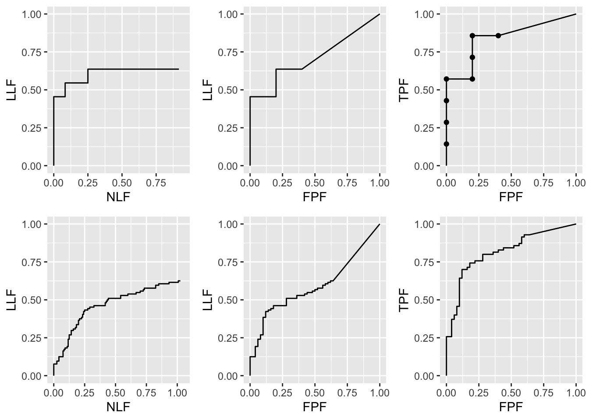
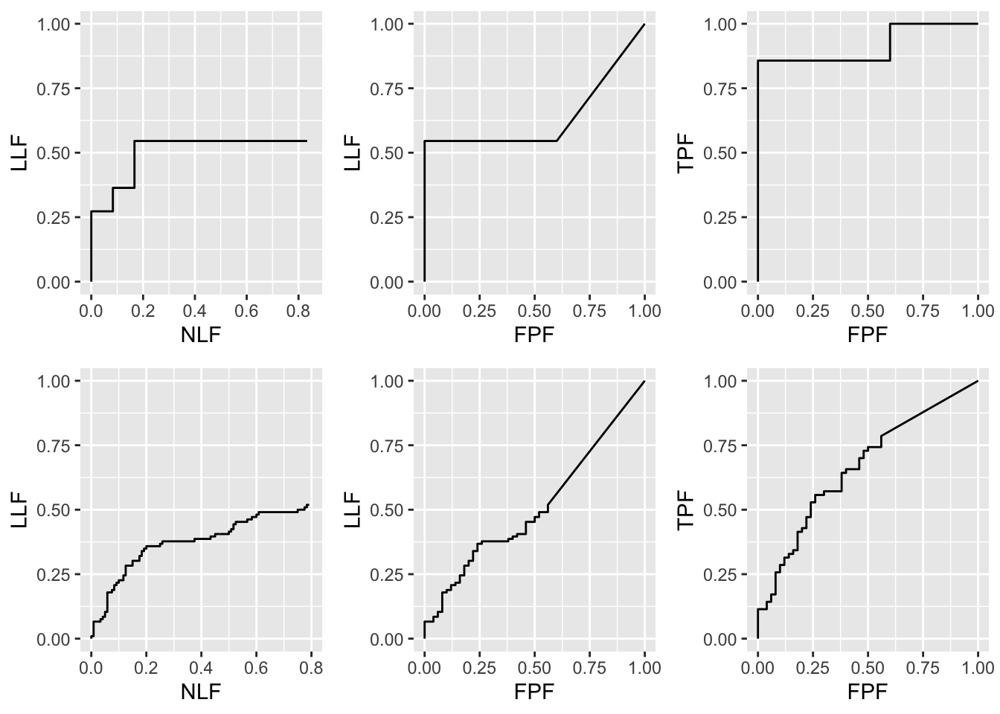

# FROC paradigm empirical plots {#froc-paradigm-empirical-plots-empirical-plots}


## Introduction {#froc-paradigm-empirical-plots-intro}
Operating characteristics are visual depicters of performance. Quantities derived from operating characteristics can serve as quantitative measures of performance, i.e., figures of merit (FOMs). This chapter defines empirical operating characteristics possible with FROC data. 

Here is the organization of this chapter. A distinction between latent  and actual marks is made followed by a summary of FROC notation applicable to a single dataset, where modality and reader indices are not needed. This is a key table, which will be referred to in later chapters. Following this, the chapter is organized into two main parts: formalism and examples. The formalism sections, §13.3 – §13.9, give formulae for calculating different empirical operating characteristics. When applied to the FROC plot the formalism is used to demonstrate an important fact, namely the semi-constrained property of the observed FROC end-point, unlike the constrained ROC end-point, whose upper limit is (1,1). 

The second part, §13.10 – §13.15, consists of coded examples of operating characteristics. An important section is devoted to some confusion about location level "true negatives", traceable to misapplication of ROC terminology to location-specific tasks. The chapter concludes with recommendations on which operating characteristics to use and which to avoid.

## Latent vs. actual marks {#froc-paradigm-empirical-plots-latent-vs-acutal-marks}
From Chapter \@ref(froc-paradigm), FROC data consists of mark-rating pairs. Each mark indicates the location of a region suspicious enough to warrant reporting and the rating is the associated confidence level. A mark is recorded as lesion localization (LL) if it is sufficiently close to a true lesion, according to the adopted proximity criterion, and otherwise it is recorded as non-lesion localization (NL). 

To distinguish between perceived suspicious regions and regions that were actually marked, it is necessary to introduce the distinction between latent marks and actual marks. 

* A *latent* mark is defined as a suspicious region, regardless of whether it was marked. A latent mark becomes an *actual* mark if it is marked.

* A latent mark is a latent LL if it is close to a true lesion and otherwise it is a latent NL. 

* A non-diseased case can only have latent NLs. A diseased case can have latent NLs and latent LLs. 

<table>
<caption>(\#tab:froc-paradigm-frocNotation)FROC notation,; all marks refer to latent marks; see details</caption>
 <thead>
  <tr>
   <th style="text-align:left;"> Row number </th>
   <th style="text-align:left;"> Symbol </th>
   <th style="text-align:left;"> Meaning </th>
  </tr>
 </thead>
<tbody>
  <tr>
   <td style="text-align:left;"> 1 </td>
   <td style="text-align:left;"> t </td>
   <td style="text-align:left;"> Case-level truth: 1 for non-diseased and 2 for diseased </td>
  </tr>
  <tr>
   <td style="text-align:left;"> 1 </td>
   <td style="text-align:left;"> $K_t$ </td>
   <td style="text-align:left;"> Number of cases with case-level truth t </td>
  </tr>
  <tr>
   <td style="text-align:left;"> 2 </td>
   <td style="text-align:left;"> $k_t t$ </td>
   <td style="text-align:left;"> Case $k_t$ in case-level truth t </td>
  </tr>
  <tr>
   <td style="text-align:left;"> 3 </td>
   <td style="text-align:left;"> s </td>
   <td style="text-align:left;"> Mark-level truth: 1 for NL and 2 for LL </td>
  </tr>
  <tr>
   <td style="text-align:left;"> 4 </td>
   <td style="text-align:left;"> $l_s s$ </td>
   <td style="text-align:left;"> Mark $l_s$ in mark-level truth s </td>
  </tr>
  <tr>
   <td style="text-align:left;"> 5 </td>
   <td style="text-align:left;"> $z_{k_t t l_1 1}$ </td>
   <td style="text-align:left;"> z-sample for case $k_t t$ and mark $l_1 1$ </td>
  </tr>
  <tr>
   <td style="text-align:left;"> 6 </td>
   <td style="text-align:left;"> $z_{k_2 2 l_2 2}$ </td>
   <td style="text-align:left;"> z-sample for case $k_2 2$ and mark $l_2 2$ </td>
  </tr>
  <tr>
   <td style="text-align:left;"> 7 </td>
   <td style="text-align:left;"> $R_{FROC}$ </td>
   <td style="text-align:left;"> Number of FROC bins </td>
  </tr>
  <tr>
   <td style="text-align:left;"> 8 </td>
   <td style="text-align:left;"> $\zeta_1$ </td>
   <td style="text-align:left;"> Lowest reporting threshold </td>
  </tr>
  <tr>
   <td style="text-align:left;"> 9 </td>
   <td style="text-align:left;"> $\zeta_r\quad(r=2,3,...,R_{FROC})$ </td>
   <td style="text-align:left;"> Other reporting thresholds </td>
  </tr>
  <tr>
   <td style="text-align:left;"> 9 </td>
   <td style="text-align:left;"> $\zeta_0, \zeta{R_{FROC}}+1)$ </td>
   <td style="text-align:left;"> Dummy thresholds </td>
  </tr>
  <tr>
   <td style="text-align:left;"> 10 </td>
   <td style="text-align:left;"> $N_{k_t t}$ </td>
   <td style="text-align:left;"> Number of NLs on case $k_t t$ </td>
  </tr>
  <tr>
   <td style="text-align:left;"> 11 </td>
   <td style="text-align:left;"> $L_{k_2}$ </td>
   <td style="text-align:left;"> Number of lesions on case $k_2 2$ </td>
  </tr>
  <tr>
   <td style="text-align:left;"> 12 </td>
   <td style="text-align:left;"> $L_T$ </td>
   <td style="text-align:left;"> Total number of lesions in dataset </td>
  </tr>
</tbody>
</table>

Details: In row 10-11 the thresholds are ordered as in $\zeta_r < \zeta_{r+1}$, and one defines dummy thresholds $\zeta_0 = -\infty$ and  $\zeta_{R_{FROC}+1} = +\infty$.

### FROC notation TBA
Recall from Section \@ref(binaryTaskDecisionVariablelModel) that the ROC paradigm requires the existence of a *case-dependent* decision variable $z$ and a case-independent decision threshold $\zeta$, and the rule that if $z \geq \zeta$ the case is diagnosed as diseased and otherwise the case is diagnosed as non-diseased. Analogously, FROC data requires the existence of a *case and location-dependent* z-sample associated with each latent mark and a *case and location-independent* reporting threshold $\zeta$ and the rule that a latent mark is marked if $z \geq \zeta$. One needs to account, in the notation, for case and location dependencies of z and for distinction between case-level and location-level ground truth. For example, a diseased case can have many regions that are non-diseased and a few diseased regions (the lesions). 

*Clear notation is vital to understanding this paradigm.* FROC notation is summarized in Table \@ref(tab:froc-paradigm-frocNotation). The table is organized into three columns, the first column is the row number, the second column has the symbol(s), and the third column has the meaning(s) of the symbol(s). 

* Row 1: The case-truth index $t$ still refers to the case (or patient), with $t = 1$ for non-diseased and $t = 2$ for diseased cases. 

* Row 2: Two indices $k_t t$ are needed to select case $k_t$ in truth state $t$. As a useful mnemonic, $k$ is for *case*. 

* Row 3 and 4: For a similar reason, two indices $l_s s$ are needed to select latent mark $l_s$ in location level truth state $s$, where $s = 1$ corresponds to a latent NL and $s = 2$ corresponds to a latent LL. One can think of $l_s$  as indexing the locations of different latent marks with local truth state $s$. As a useful mnemonic, $l$ is for *location*. 

* Row 5: The z-sample for case $k_t t$ and latent NL mark $l_1 1$ is denoted $z_{k_t t l_1 1}$. Latent NL marks are possible on non-diseased and diseased cases (both values of $t$ are allowed). The range of a z-sample is $-\infty < z_{k_t t l_1 1} < \infty$, provided $l_1 \neq \emptyset$; otherwise, it is an *unobservable event*. The z-sample of a latent LL is $z_{k_2 2 l_2 2}$. Unmarked lesions are assigned the null set labels and assigned negative infinity ratings; this is the meaning of $\left ( z_{k_2 2l_2 2} \mid l_2 = \emptyset \right )$.

* Row 6 and 7: A latent mark is actually marked if $z_{k_t t l_s s} \geq \zeta_1$, where $\zeta_1$ is the lowest reporting threshold adopted by the observer. Additional thresholds are needed to accommodate greater than one FROC bins. If marked, a latent NL is recorded as an actual NL, and likewise if marked, a latent LL is recorded as an actual LL. 

  + If not marked, a latent NL is an *unobservable event*. This is a major source of confusion among researchers familiar with ROC who use the highly misleading term location level "true negative" for unmarked latent NLs. 

  + In contrast, unmarked lesions are observable events – one knows (trivially) which lesions were not marked. In the analyses, unmarked lesions are assigned $\-infty$ ratings, guaranteed to be smaller than any rating used by the observer. 

Row 8: $N_{k_t t}$ is the total number of latent NL marks on case $k_t t$.

*It is an a-priori-unknown modality-reader-case dependent non-negative random integer. It is incorrect to estimate it by dividing the image area by the lesion area because not all regions of the image are equally likely to have lesions, lesions do not have the same size, and most important, clinicians don't work that way. The best insight into the number of latent NLs per case is obtained from eye-tracking studies [@RN1490], and even here the information is tenuous, as eye-tracking studies can only measure foveal gaze and not lesions found by peripheral vision. Experts tend to have smaller $N_{k_t t}$ than non-experts. Based on the author's experience, in screening mammography, clinical considerations limit the number of regions per case (4-views) that an expert will consider for marking to relatively small numbers, typically less than about three. About 80% on non-diseased cases have no marks. The obvious reason is that because of the low disease prevalence marking too many cases would result in unacceptably high recall rates.*

* Row 9: $L_{k_2} > 0$ is the number of lesions in diseased case $k_2 2$. Since lesions can only occur on diseased cases, a second case-truth subscript, as in $L_{k_2 2}$, is also superfluous. $L_T$ is the total number of lesions in the dataset.

The label $l_1 = \{1, 2, ..., N_{k_t t}\}$ indexes latent NL marks, provided the case has at least one NL mark, and otherwise $N_{k_t t} = 0$ and $l_1 = \emptyset$, the null set. The possible values of $l_1$  are $l_1 = \left \{ \emptyset \right \}\oplus \left \{ 1,2,...N_{k_t t} \right \}$. The null set applies when the case has no latent NL marks and $\oplus$ is the "exclusive-or" symbol ("exclusive-or" is used in the English sense: "one or the other, but not neither nor both"). In other words, $l_1$ can *either* be the null set or take on positive integer values. Likewise, $l_2 = \left \{ 1,2,...,L_{k_2 2} \right \}$ indexes latent LL marks. Unmarked LLs are assigned negative infinity ratings. The null set notation is not needed for latent LLs. 

Having covered notation, attention turns to the empirical plots possible with FROC data. The historical starting point is the FROC plot.

## The empirical FROC plot
In Chapter \@ref(froc-paradigm), the FROC was defined as the plot of LLF (along the ordinate) vs. NLF.  Using the notation of Table \@ref(tab:froc-paradigm-frocNotation) and assuming binned data ^[This is not a limiting assumption: if the data is continuous, for finite numbers of cases, no ordering information is lost if the number of ratings is chosen large enough. This is analogous to Bamber's theorem in Chapter 05, where a proof, although given for binned data, is applicable to continuous data.] then, corresponding to the operating point determined by rating $r$, the coordinates are $\text{NLF}\left ( \zeta_r \right )$, the total number of NLs rated $\geq$ threshold $\zeta_r$ divided by the total number of cases, and $\text{LLF}\left ( \zeta_r \right )$, the total number of LLs rated $\geq$ threshold $\zeta_r$ divided by the total number of lesions: 

\begin{equation}
\left.
\begin{aligned} 
\text{NLF}_r \equiv \text{NLF}\left ( \zeta_r \right ) =& \frac{n\left ( \text{NLs rated} \geq \zeta_r\right )}{n\left ( \text{cases} \right )}\\
\text{LLF}_r \equiv \text{LLF}\left ( \zeta_r \right ) =& \frac{n\left ( \text{LLs rated} \geq \zeta_r\right )}{n\left ( \text{lesions} \right )}
 \end{aligned}
\right \}
(\#eq:froc-paradigm-NLF-LLF)
\end{equation} 

Eqn. \@ref(eq:froc-paradigm-NLF-LLF) is equivalent to:


\begin{equation}
\left.
\begin{aligned} 
\text{NLF}\left ( \zeta_r \right ) =& \frac{1}{K_1+K_2} \sum_{t=1}^{2} \sum_{k_t=1}^{K_t} \sum_{l_1=1}^{N_{k_t t}} \mathbb{I} \left ( z_{k_t t l_1 1} \geq \zeta_r \mid l_1 \neq \emptyset \right ) \\
\text{LLF}\left ( \zeta_r \right ) =& \frac{1}{L_T} \sum_{k_2=1}^{K_2} \sum_{l_2=1}^{L_{k_2}} \mathbb{I} \left ( z_{k_2 2 l_2 2} \geq \zeta_r  \right ) 
\end{aligned}
\right \}
(\#eq:froc-paradigm-NLF-LLF2)
\end{equation} 

The indicator function, $\mathbb{I}$, yields unity if its argument is true and zero otherwise, so it acts like a counter. 

In Eqn. \@ref(eq:froc-paradigm-NLF-LLF2), regarding the first equation, the conditioning $l_1 \neq \emptyset$ and $z_{k_t t l_1 1} \geq \zeta_r$ ensure that only marked non-diseased regions contribute to NLF. The summations yield the total number of NLs in the dataset with z-samples  $\geq \zeta_r$ and dividing by the total number of cases yields $\text{NLF}\left ( \zeta_r \right )$. Eqn. \@ref(eq:froc-paradigm-NLF-LLF2) also shows explicitly that NLs on both non-diseased and diseased cases contribute to NLF. 

In Eqn. \@ref(eq:froc-paradigm-NLF-LLF2), regarding the second equation, because unmarked lesions are assigned the  $-\infty$ rating, Eqn. \@ref(eq:froc-paradigm-NLF-LLF2) need not be conditioned on $l_2 \neq \emptyset$. A summation over $t$ is not needed as only diseased cases contribute and both truth state indices on the right hand side of Eqn. \@ref(eq:froc-paradigm-NLF-LLF2) are set to $t = s = 2$. The denominator is the total number of lesions in the dataset. 


TBA The empirical FROC plot connects adjacent operating points $\left (\text{NLF}\left ( \zeta_r \right ), \text{LLF}\left ( \zeta_r \right )  \right )$, including the origin (0,0) *but not (1,1)*, with straight lines. 

#### Cased based vs. view-based scoring TBA
So far, the implicit assumption has been that each case or patient is represented by one image. When a case has multiple images or views, the above definitions are referred to as *case-based scoring*. A *view-based scoring* of the data is also possible, in which the denominator in the first equation in Eqn. \@ref(eq:froc-paradigm-NLF-LLF) is the total number of views. Furthermore, in view-based scoring multiple lesions on different views of the same case are counted as different lesions, even thought they may correspond to the same physical lesion [@RN1652]. The total number of lesion localizations is divided by the total number of lesions visible to the truth panel in all views, which is the counterpart of the second equation in Eqn. \@ref(eq:froc-paradigm-NLF-LLF2). When each case has a single image, the two definitions are equivalent. With four views per patient in screening mammography, case-based NLF is four times larger than view-based NLF. Since a superior system tends to have smaller NLF values, the tendency among researchers is to report view-based FROC curves, because it makes their systems "look better"^[this is an actual private comment from a prominent CAD researcher]. 

### The semi-constrained property of the observed end-point of the FROC plot
The term *semi-constrained* means that while the observed end-point ordinate is constrained to the range (0,1) the corresponding abscissa is not. Similar to the ROC, TBA Fig. 5.1, the operating points are labeled by $r$, with $r = 1$ corresponding to the upper most observed point, $r = 2$ is the next lower operating point, and $r = R_{FROC}$  corresponds to the operating point closest to the origin. The number of thresholds equals the number of FROC bins. Note the difference from the ROC paradigm, where the number of thresholds was one less than the number of ROC bins. Here is another critical difference:

While $r = R_{FROC}+1$  yields the trivial operating point (0,0), $r = 0$ does not yield a defined point.

To understand this important statement, consider the expression, using Eqn. (13.3), for  :

\begin{equation}
\left.
\begin{aligned} 
\text{NLF}_0 =& \frac{1}{K_1+K_2} \sum_{t=1}^{2} \sum_{k_t=1}^{K_t} \sum_{l_1=1}^{N_{k_t t}} \mathbb{I} \left ( z_{k_t t l_1 1} \geq \zeta_0 \mid l_1 \neq \emptyset \right ) \\
=& \frac{1}{K_1+K_2} \sum_{t=1}^{2} \sum_{k_t=1}^{K_t} \sum_{l_1=1}^{N_{k_t t}} \mathbb{I} \left ( z_{k_t t l_1 1} \geq -\infty \mid l_1 \neq \emptyset \right ) \\
\end{aligned}
\right \}
(\#eq:froc-paradigm-NLF0)
\end{equation} 


The right hand side can be separated into two terms, the contribution of latent NL marks with z-samples in the range $z \geq \zeta_1$ and those in the range $-\infty \leq z < \zeta_1$. The first term equals the abscissa of the upper-most *observed* operating point,  :

\begin{equation}
\left.
\begin{aligned} 
\text{NLF}_1 =& \frac{1}{K_1+K_2} \sum_{t=1}^{2} \sum_{k_t=1}^{K_t} \sum_{l_1=1}^{N_{k_t t}} \mathbb{I} \left ( z_{k_t t l_1 1} \geq \zeta_1 \mid l_1 \neq \emptyset \right ) \\
=& \frac{N_T}{K_1+K_2}
\end{aligned}
\right \}
(\#eq:froc-paradigm-NLF1)
\end{equation} 


This is the abscissa of the observed end-point. Since each case could have zero or more NLs, $NLF_1$ is unconstrained and, in particular, can exceed one. *Unlike the ROC plot, which is completely contained in the unit square, the FROC plot is not.*

The 2nd term is: 	

\begin{equation}
\left (\frac{1}{K_1+K_2}   \right )\sum_{t=1}^{2} \sum_{k_t=1}^{K_t} \sum_{l_1=1}^{N_{k_t t}} \mathbb{I} \left ( -\infty \leq z_{k_t t l_1 1} < \zeta_1 \mid l_1 \neq \emptyset \right )=\frac{?}{K_1+K_2}
(\#eq:froc-paradigm-NLF0a)
\end{equation} 

It represents the contribution of unmarked NLs (i.e., latent NLs whose z-samples were below $\zeta_1$). It determines *how much further to the right the observer's NLF would have moved, relative to $NLF_1$, if one could get the observer to lower the reporting criterion to $-\infty$. Since in practice the observer will not oblige, this term cannot be evaluated. 

*Another way of stating this important point is that unmarked NLs, as indicated by the question marks in the numerator of the right hand side of Eqn. \@ref(eq:froc-paradigm-NLF0a), represent unobservable events.*

Turning our attention to $LLF_0$:

\begin{equation}
\left.
\begin{aligned}
\text{LLF}_0 =& \frac{ \sum_{k_2=1}^{K_2} \sum_{l_2=1}^{L_{k_2}} \mathbb{I} \left ( z_{k_2 2 l_2 2} \geq  -\infty  \right ) }{L_T}\\
=& 1
\end{aligned}
\right \}
(\#eq:froc-paradigm-LLF0)
\end{equation}


Unlike unmarked latent NLs, unmarked lesions can safely be assigned the $-\infty$ rating, because an unmarked lesion is an observable event. The right hand side of Eqn. \@ref(eq:froc-paradigm-LLF0) can be evaluated and it evaluates to unity. However, since the corresponding abscissa $NLF_0$ is undefined, one cannot plot this point. It follows that the observed FROC end-point is semi-constrained, in the sense that its abscissa is not limited to the range (0,1).

The next lower value of LLF can be plotted: 

\begin{equation}
\left.
\begin{aligned}
\text{LLF}_1 =& \frac{ \sum_{k_2=1}^{K_2} \sum_{l_2=1}^{L_{k_2}} \mathbb{I} \left ( z_{k_2 2 l_2 2} \geq  -\zeta_1  \right ) }{L_T}\\
\leq& 1
\end{aligned}
\right \}
(\#eq:froc-paradigm-LLF1)
\end{equation}


The numerator is the total number of lesions that were actually marked. The ratio is the fraction of lesions that are marked. The above expression is the ordinate of the observed end-point.

The formalism should not obscure the fact that Eqn. (13.6) and Eqn. (13.9) are obvious conclusions about the observed end-point of the FROC, namely the ordinate is constrained to $\leq$ unity while the abscissa is unconstrained. One does not know how far to the right it might extend were the observer to report every suspicious region.


## The alternative FROC (AFROC) plot
Fig. 4 in [@RN2453] anticipated another way of visualizing FROC data. The author subsequently termed^[The late Prof. Richard Swensson did not like the author's choice of the word "alternative" in naming this operating characteristic. The author had no idea in 1989 how important this operating characteristic would later turn out to be, otherwise a more meaningful name would have been proposed.] this the *alternative FROC (AFROC)* plot [@RN761]. The AFROC is defined as the plot of $LLF(\zeta)$ along the ordinate vs. $\text{FPF}(\zeta)$ along the abscissa. Obtaining FPF, an ROC paradigm quantity, from FROC data is described next. 

### Inferred-ROC rating
By adopting a rule for converting the zero or more mark-rating data per case to a single rating per case, and commonly the highest rating rule is used, it is possible to infer ROC data points from mark-rating data. The rating of the highest rated mark on a case, or $-\infty$ if the case has no marks, is defined as the inferred-ROC rating for the case.

The rating of the highest rated mark on a case, or $-\infty$ if the case has no marks, is defined as its inferred-ROC rating. Inferred-ROC ratings on non-diseased cases are referred to as inferred-FP ratings and those on diseased cases as inferred-TP ratings. When there is little possibility for confusion, the prefix “inferred” is suppressed. Using the by now familiar cumulation procedure, FP counts are cumulated to calculate FPF and likewise, TP counts are cumulated to calculate TPF.

Definitions:

* FPF = cumulated inferred FP counts with z-sample $\geq$ threshold $\zeta$ divided by total number of non-diseased cases.
* TPF = cumulated inferred TP counts with z-sample $\geq$ threshold $\zeta$ divided by total number of diseased cases

As will become clearer later, the AFROC plot includes an important straight line extension from the observed end-point to (1,1). 

Definition of AFROC plot:

* The alternative free-response operating characteristic (AFROC) is the plot of LLF vs. inferred FPF. 
* The plot includes a straight line extension from the observed end-point to (1,1).

The mathematical definition of the AFROC follows. 

### The AFROC plot and AUC
The highest z-sample ROC false positive (FP) rating for non-diseased case $k_1 1$  is defined by: 

\begin{equation}
\left.
\begin{aligned}
FP_{k_1 1}=&\max\left ( z_{k_1 1 l_1 1 } \mid z_{k_1 1 l_1 1 } \geq \zeta_1 \right ) \\
=& -\infty \mid l_1 = \emptyset  
 \end{aligned}
\right \}
(\#eq:froc-paradigm-FP)
\end{equation}


The single vertical bar $\mid$ is the conditioning operator; e.g., $A \mid B$ is event A assuming condition B is true. It ensures that only marked regions enter the calculation. The basic idea is simple: $FP_{k_1 1}$ is the maximum z-sample over all marked locations occurring on non-diseased case $k_1 1$ , or  $-\infty$ if the case has no marks. Assignment of the $-\infty$ rating is allowed because an unmarked non-diseased case is an observable event. The corresponding false positive fraction is defined by: 

\begin{equation}
\left.
\begin{aligned} 
FPF_r \equiv FPF \left ( \zeta_r \right ) =& \frac{1}{K_1} \sum_{k_1=1}^{K_1} \mathbb{I} \left ( FP_{k_1 1} \geq \zeta_r\right )\\
=& \frac{1}{K_1} \sum_{k_1=1}^{K_1} \mathbb{I} \left ( \max_{l_1}\left ( z_{k_1 1 l_1 1}  \mid z_{k_1 1 l_1 1} \geq \zeta_r  \right )\right )\\
\end{aligned}
\right \}
(\#eq:froc-paradigm-FPF)
\end{equation}


The indicator function is a logical operator. If $\max_{l_1}\left (\right )$ is greater than or equal to $\zeta_r$, it yields unity, and otherwise it yields zero. The maximum is taken over all marked NLs. Lesion localization fraction,  $LLF_r$, is defined, as before, by Eqn. \@ref(eq:froc-paradigm-NLF-LLF2). The empirical alternative FROC (AFROC) plot connects adjacent operating points $\left( FPF_r, LLF_r  \right)$, including the origin (0,0), with straight lines plus a straight-line segment connecting the observed end-point to (1,1). 

The area under this plot is defined as the empirical AFROC AUC. A computational formula for it will be given in the next chapter.

### The constrained property of the observed end-point of the AFROC
Since $\zeta_{R_{FROC}+1 = \infty}$, according to Eqn. \@ref(eq:froc-paradigm-NLF-LLF2) and Eqn. \@ref(eq:froc-paradigm-FPF), $r = R_{FROC}+1$  yields the trivial operating point (0,0) and $r = 0$ yields the trivial point (1,1):

\begin{equation}
\left.
\begin{aligned} 
FPF_0 =& \frac{1}{K_1} \sum_{k_1=1}^{K_1} \mathbb{I} \left ( FP_{k_1 1} \geq -\infty \right )\\
=& 1\\
LLF_0 =& \frac{1}{L_T} \sum_{k_2=1}^{K_2} \sum_{l_2=1}^{L_{k_2}}\mathbb{I} \left ( LL_{k_2 2 l_2 2} \geq -\infty \right )\\
=& 1
\end{aligned}
\right \}
(\#eq:froc-paradigm-FPF0-LLF0)
\end{equation}

and

\begin{equation}
\left.
\begin{aligned} 
FPF_{R_{FROC}+1} =& \frac{1}{K_1} \sum_{k_1=1}^{K_1} \mathbb{I} \left ( FP_{k_1 1} \geq \infty \right )\\
=& 0\\
LLF_{R_{FROC}+1} =& \frac{1}{L_T} \sum_{k_2=1}^{K_2} \sum_{l_2=1}^{L_{k_2}}\mathbb{I} \left ( LL_{k_2 2 l_2 2} \geq \infty \right )\\
=& 0
\end{aligned}
\right \}
(\#eq:froc-paradigm-FPF-LLF-last)
\end{equation}


Because every non-diseased case is assigned a rating, and is therefore counted, the right hand side evaluates to unity. This is obvious for marked cases. Since each unmarked case also gets a rating, albeit a  $-\infty$ rating, it is counted (the argument of the indicator function in Eqn. \@ref(eq:froc-paradigm-FPF0-LLF0) is true even when the inferred FP rating is $-\infty$). 

Since the value of $LLF_0$ is unity and this time the corresponding value $FPF+0$ exists, one may plot it. The empirical AFROC plot is obtained by adjacent operating points, including the trivial ones, with straight lines. 


Key points:

* The ordinates LLF of the FROC and AFROC are identical
* Unlike the empirical FROC, whose observed end-point has the semi-constrained property, the AFROC end-point is constrained.


**Anticipating what is to come, the AFROC plot, especially a weighted [@RN1371; @RN2484] version of it, is of fundamental importance in the analysis of FROC data and the FROC plot is a poor summary of performance.**


Historical note: While the AFROC plot was anticipated by Bunch et al in 1978, they labeled the FROC plot as the "preferred form", see Fig. 5 in [@RN2453], when in fact it is the other way around. Also, the AFROC plots should end at (1,1) and not plateau at lower values as shown in their Fig. 4. 


### The chance level FROC and AFROC
The chance level FROC was addressed in the previous chapter; it is a "flat-liner", hugging the x-axis, except for a slight upturn at large NLF.


<div class="figure">

<p class="caption">(\#fig:froc-afroc-chance-level)The left figure is the near guessing observer's FROC and the right figure is the corresponding AFROC for for $\mu=0.01$.</p>
</div>

Fig. \@ref(fig:froc-afroc-chance-level) shows "near guessing" FROC and AFROC plots for $\mu  = 0.1$. These plots were generated by the code with $\mu$ = 0.1, $\lambda$ = 1, $\nu$ = 0.1, $\zeta_1$ = -1, $K_1$ = 50, $K_2$ = 70. One does not expect to observe curves like these with radiologists as they rarely guess in the clinic – there is too much at stake.


The AFROC of a guessing observer is not the line connecting (0,0) to (1,1). This is a serious misconception [@RN2518]. A guessing observer will also generate a "flat-liner", but this time the plot ends at FPF = 1, and the straight line extension will be a vertical line connecting this point to (1,1). In the limit $\mu \rightarrow 0+$, AFROC-AUC tends to zero. 


*To summarize, AFROC AUC of a guessing observer is zero. On the other hand, suppose an expert radiologist views screening images and the lesions on diseased cases are very difficult, even for the expert, and the radiologist does not find any of them. Being an expert the radiologist successfully screens out non-diseased cases and sees nothing suspicious in any of them – this is a measure of the expertise of the radiologist, not mistaking variants of normal anatomy for false lesions on non-diseased cases. Accordingly, the expert radiologist does not report anything, and the operating point is "stuck" at the origin. Even in this unusual situation, one would be justified in connecting the origin to (1,1) and claiming area under AFROC is 0.5. The extension gives the radiologist credit for not marking any non-diseased case; of course, the radiologist does not get any credit for marking any of the lesions. An even better radiologist, who finds and marks some of the lesions, will score higher, and AFROC-AUC will exceed 0.5. See TBA §17.7.4 for a software demonstration of this unusual situation.*

### The EFROC plot
An exponentially transformed FROC (EFROC) plot has been proposed [@RN2366] that, like the AFROC, is contained within the unit square. The EFROC inferred FPF is defined by (this is yet another way of inferring ROC data, albeit only FPF, from FROC data):

\begin{equation}
FPF_r= 1 - \exp\left ( NLF\left ( \zeta_r \right ) \right )
(\#eq:froc-paradigm-EFROC)
\end{equation}

In other words, one computes $NLF_r$ using NLs rated $\geq \zeta_r$ on all cases and then transforms it to $FPF_r$ using the exponential transformation shown. Note that FPF so defined is in the range (0,1). The empirical EFROC plot connects adjacent coordinates $\left ( FPF_r, LLF_r \right )$, including the origin (0,0), with straight lines plus a straight-line segment connecting the observed end-point to (1,1). The area under the empirical EFROC has been proposed as a figure of merit for FROC data. It has the advantage, compared to the FROC, of being contained in the unit square^[I am gratified that Dr. Popescu, at the FDA, has recognized the importance of keeping the underling curve constrained to the unit square.]. It has the advantage over the AFROC of using all NL ratings, not just the highest rated ones, but this is a mixed blessing. The effect on statistical power compared to the AFROC has not been studied, but the author expects the advantage to be minimal (because the highest rated NL contains more information than a randomly selected NL mark). A disadvantage is that cases with more LLs get more importance in the analysis; this can be corrected by replacing LLF with wLLF, see TBA Eqn. (13.17). Another disadvantage is that inclusion of NLs on diseased cases causes the EFROC plot to depend on diseased prevalence. In addition, as with several papers in this field, there are misconceptions: it shows the EFROC as smoothly approaching (1,1). In fact, Fig. 1 in the cited Popescu paper, resembles an ROC curve predicted by the equal variance binormal model. The author expects the EFROC to resemble the AFROC curves shown below, e.g., TBA Fig. 13.2 (K). Furthermore, the statement in Section C ibid 

>"By operating under the free-response conditions, the observer will mark and score *all* suspicious locations" 

(emphasis added) repeats serious misconceptions in this field. Not all suspicious regions are reported; even CAD reports a small fraction of the suspicious regions that it finds. In spite of these concerns, the EFROC represents the first recognition by someone other than the author, of significant limitations of the FROC curve, and that an operating characteristic for FROC data that is completely contained within the unit square is highly desirable. The empirical EFROC-AUC FOM is implemented in `RJafroc` software.


## The inferred ROC plot
The inferred true positive (TP) z-sample for diseased case $k_2 2$ is defined by: 

\begin{equation}
\left.
\begin{aligned}
TP_{k_2 2}=& \max_{l_1 l_2}\left ( \left (z_{k_2 2 l_1 2} ,z_{k_2 2 l_2 2}  \right ) \mid l_1 \neq \emptyset \right )\\
=& -\infty \mid\left ( l_1 = \emptyset \land z_{k_2 2 l_2 2} = -\infty  \right )
\end{aligned}
\right \}
(\#eq:froc-paradigm-TP)
\end{equation}

If $l_1$ is null and no lesion is marked, the case has no marks and is assigned the $-\infty$ rating. As noted earlier, the null set notation is not needed for $l_2$; each unmarked lesion is assigned the negative infinity rating, as it is an observable event. The maximum is over all marked NLs and all LLs on the case (to reiterate, an unmarked NL is an unobservable event; the evaluation shown in Eqn. \@ref(eq:froc-paradigm-TP) involves observable events only). 

The formula appears complex, but the basic idea is simple: $TP_{k_2 2}$ is the maximum over all ratings, NLs and LLs, whichever is higher, occurring on diseased case $k_2 2$, or $-\infty$ if the case has no marks. The  $-\infty$ assignment is justified because an unmarked diseased case is an observable event. The highest-z-sample inferred true positive fraction $TPF_r$ is defined by:

\begin{equation}
TPF_r \equiv TPF_{\zeta_r} = \frac{1}{K_2}\sum_{k_2=1}^{K_2} \mathbb{I}\left ( TP_{k_2 2} \geq \zeta_r \right )
(\#eq:froc-paradigm-TPF)
\end{equation}


The definition of $FPF_r$ is the same as before, i.e., Eqn. \@ref(eq:froc-paradigm-FPF). The inferred empirical ROC plot connects adjacent points $\left( FPF_r, TPF_r \right )$, including the origin (0,0), with straight lines plus a straight-line segment connecting the observed end-point to (1,1).


## The weighted-AFROC (wAFROC) plot
The AFROC ordinate defined in Eqn. \@ref(eq:froc-paradigm-NLF-LLF2) gives equal importance to every lesion on a case. Therefore, a case with more lesions will have more influence on the AFROC (this is explained in depth in TBA Chapter 14). This is undesirable since each case (i.e., patient) should get equal importance in the analysis. As with ROC analysis, one wishes to draw conclusions about the population of cases and each case is regarded as an equally valid sample from the population. In particular, one does not want the analysis to be skewed towards cases with greater than average number of lesions. ^[Historical note: the author became aware of how serious this issue could be when a researcher contacted him about using FROC methodology for nuclear medicine bone scan images, where the number of lesions on diseased cases can vary from a few to a hundred!] 

Another issue is that the AFROC assigns equal clinical importance to each lesion in a case. Lesion weights were introduced [@RN1385] to allow for the possibility that the clinical importance of finding a lesion might be lesion-dependent [@RN1966] (the referenced paper should be of interest to the more advanced reader). For example, it is possible that an easy to find lesion is less clinically important than a harder to find one, therefore the figure-of-merit should give more importance to the harder to find one. Clinical importance in this context could be the mortality associated with the specific lesion type, which can be obtained from epidemiological studies [@desantis2011breast]. Let $W_{k_2 l_2} \geq 0$ denote the weight (i.e., clinical importance) of lesion $l_2$ in diseased case $k_2$ (since weights are only applicable to diseased cases, one can, without ambiguity, drop the case-level and location-level truth subscripts, i.e., $W_{k_2 2 l_2 2}$ would be superfluous). For each diseased case $k_2 2$ the weights are subject to the constraint:


\begin{equation}
\sum_{l_2 =1 }^{L_{k_2}} W_{k_2 l_2} = 1
(\#eq:froc-paradigm-weights-constraint)
\end{equation}


The constraint assures that the each diseased case exerts equal importance in determining the weighted-AFROC (wAFROC) operating characteristic, regardless of the number of lesions in it (further details in Chapter 14). 

The weighted lesion localization fraction $\text{wLLF}_r$ is defined by [@RN2484]:

 \begin{equation}
\text{wLLF}_r \equiv \text{wLLF}_{\zeta_r} = \frac{1}{K_2}\sum_{k_2=1}^{K_2}\sum_{l_2=1}^{L_{k_2}}W_{k_2 l_2} \mathbb{I}\left ( z_{k_2 l_2 2} \geq \zeta_r \right )
(\#eq:froc-paradigm-wLLFr)
\end{equation}

[The conditioning operator is not needed because every lesion gets a rating.] 

The empirical wAFROC plot connects adjacent operating points $\left ( FPF_r, \text{wLLF}_r \right )$, including the origin (0,0), with straight lines plus a straight-line segment connecting the observed end-point to (1,1). The area under this plot is the empirical weighted-AFROC AUC.

## The AFROC1 plot
Historically the AFROC originally used a different definition of FPF, which is retrospectively termed the AFROC1 plot. Since NLs can occur on diseased cases, it is possible to define an inferred "FP" rating on a *diseased case* as the maximum of all NL ratings on the case, or $-\infty$ if the case has no NLs. The quotes emphasize that this is non-standard usage of ROC terminology: in an ROC study, a FP can only occur on a *non-diseased case*. Since both case-level truth states are allowed, the highest false positive (FP) z-sample for case $k_t t$ is [the "1" superscript below is necessary to distinguish it from TBA Eqn. \@ref(eq:froc-paradigm-FP)]: 

\begin{equation}
\left.
\begin{aligned}
FP_{k_t t}^1 =& \max_{l_1} \left ( z_{k_t t l_1 1 } \mid  l_1 \neq \emptyset \right )\\
=& -\infty \mid l_1 = \emptyset
\end{aligned}
\right \}
(\#eq:froc-paradigm-FP1)
\end{equation}

$FP_{k_t t}^1$ is the maximum over all marked NL z- samples, labeled by the location index $l_1$, occurring on case $k_t t$, or $-\infty$ if $l_1 = \emptyset$. One is allowed to assign the  $-\infty$ rating because a case with no NL marks is an observable event. The corresponding false positive fraction $FPF_r^1$ is defined by [the "1" superscript is necessary to distinguish it from Eqn. \@ref(eq:froc-paradigm-FPF)]: 

\begin{equation}
FPF_r^1 \equiv FPF_r^1\left ( \zeta_r \right ) = \frac{1}{K_1+K_2}\sum_{t=1}^{2}\sum_{k_t=1}^{K_t} \mathbb{I}\left ( FP_{k_t t}^1 \geq \zeta_r \right )
(\#eq:froc-paradigm-FPF1)
\end{equation}


Note the subtle differences between Eqn. \@ref(eq:froc-paradigm-FPF) and Eqn. \@ref(eq:froc-paradigm-FPF1). The latter counts "FPs" on non-diseased and diseased cases while Eqn. \@ref(eq:froc-paradigm-FPF) counts FPs on non-diseased cases only, and for that reason the denominators in the two equations are different. The advisability of allowing a diseased case to be both a TP and a FP is questionable from both clinical and statistical considerations. However, allowing this possibility leads to the following definition: the empirical alternative FROC1 (AFROC1) plot connects adjacent operating points $\left ( FPF_r^1, \text{LLF}_r \right )$, including the origin (0,0), with straight lines plus a straight-line segment connecting the observed end-point to (1,1). The only difference between AFROC1 and the AFROC plot is in the x-axis. 


## The weighted-AFROC1 (wAFROC1) plot
The empirical weighted-AFROC1 (wAFROC1) plot connects adjacent operating points $\left ( FPF_r^1, \text{wLLF}_r \right )$, including the origin (0,0), with straight lines plus a straight-line segment connecting the observed end-point to (1,1). The only difference between it and the wAFROC plot is in the x-axis. 

So far, the description has been limited to abstract definitions of various operating characteristics possible with FROC data. Now it is time to put numbers into the formulae and see actual plots. The starting point is the FROC plot. 

## Raw FROC/AFROC/ROC plots
*Raw plots* correspond to the actual simulator generated continuous ratings, prior to any binning operation. The opposite of raw plots would be *binned plots*. The FROC plots shown below were generated using the data simulator introduced in Chapter \@ref(froc-paradigm). The examples are similar to the population FROC curves shown in that chapter but the emphasis here is on understanding the FROC data structure. To this end smaller numbers of cases, not 20,000 as in the previous chapter, are used. Examples are given using continuous ratings, termed “raw data”, and binned data, for a smaller dataset and for a larger dataset. With a smaller dataset, the logic of constructing the plot is more transparent but the operating points are more susceptible to sampling variability. The examples illustrate key points distinguishing the free-response paradigm from ROC. 

## Code for raw plots {#raw-plots-code1}

```{.r .numberLines}
seed <- 1;set.seed(seed)
mu <- 1
lambda <- 1
nu <- 1 
zeta1 <- -1
K1 <- 5
K2 <- 7 
Lmax <- 2
Lk2 <- floor(runif(K2, 1, Lmax + 1))

frocDataRaw <- SimulateFrocDataset(
  mu = mu, 
  lambda = lambda, 
  nu = nu, 
  I = 1,
  J = 1,
  K1 = K1, 
  K2 = K2, 
  perCase = Lk2, 
  zeta1 = zeta1
)

p1 <- PlotEmpiricalOperatingCharacteristics(
  dataset = frocDataRaw, 
  trts= 1, rdrs = 1, opChType = "FROC", 
  legend.position = "NULL")$Plot

p2 <- PlotEmpiricalOperatingCharacteristics(
  dataset = frocDataRaw, 
  trts= 1, rdrs = 1, opChType = "AFROC", 
  legend.position = "NULL")$Plot

p3 <- PlotEmpiricalOperatingCharacteristics(
  dataset = frocDataRaw, 
  trts= 1, rdrs = 1, opChType = "ROC", 
  legend.position = "NULL")$Plot
```

### Explanation of the code
Line 1 sets the seed of the random number generator. Lines 2-5 set the simulator parameters $\mu = 1, \lambda = 1, \nu = 1, \zeta_1 = -1$. Briefly, $\mu$ determines the separation of two unit variance Gaussians, the left one determines the z-samples of latent NLs, while the right one determines the z-samples of latent LLs. $\lambda$ determines the number of latent NLs while $\nu$ determines the number of latent LLs. A latent NL or LL is marked if its z-sample $\geq \zeta_1$.

Lines 6-7 set the number of non-diseased cases $K_1 = 5$ and the number of diseased cases $K_2 = 7$. 

Line 8 sets the maximum number of lesions per diseased case to 2. Line 9 randomly samples the actual number of lesions per diseased case. The following code illustrats the process.

#### Number of lesions per diseased case


```r
Lk2
#> [1] 1 1 2 2 1 2 2
sum(Lk2)
#> [1] 11
max(floor(runif(1000, 1, Lmax + 1)))
#> [1] 2
```

This shows that the first two diseased cases have one lesion each, the third and fourth have two lesions each, etc. The total number of lesions in the dataset is 11. The last two lines of the code snippet show that, even with a thousand simulations, the number of lesions per diseased case is indeed limited to two.

#### The structure of the FROC dataset

Returning to the explanation of the code, lines 11-21 uses the function `SimulateFrocDataset` to simulate the dataset object `frocDataRaw`. Its structure is examined next:   


```r
str(frocDataRaw)
#> List of 3
#>  $ ratings     :List of 3
#>   ..$ NL   : num [1, 1, 1:12, 1:4] 0.764 -0.799 -Inf -Inf -Inf ...
#>   ..$ LL   : num [1, 1, 1:7, 1:2] -Inf 0.943 0.944 0.309 0.522 ...
#>   ..$ LL_IL: logi NA
#>  $ lesions     :List of 3
#>   ..$ perCase: num [1:7] 1 1 2 2 1 2 2
#>   ..$ IDs    : num [1:7, 1:2] 1 1 1 1 1 ...
#>   ..$ weights: num [1:7, 1:2] 1 1 0.5 0.5 1 ...
#>  $ descriptions:List of 7
#>   ..$ fileName     : chr "NA"
#>   ..$ type         : chr "FROC"
#>   ..$ name         : logi NA
#>   ..$ truthTableStr: logi NA
#>   ..$ design       : chr "FCTRL"
#>   ..$ modalityID   : chr "1"
#>   ..$ readerID     : chr "1"
```


It is seen to consist of three `list` members: `ratings`, `lesions` and `descriptions`. Let us examine the `ratings` member.

#### The structure of the ratings member

The `ratings` member is itself a list of 3, consisting of `NL` the non-lesion localization ratings, `LL` the lesion localization ratings and `LL_IL` the incorrect localization ratings. The last member is needed for LROC datasets and can be ignored for now. Let us examine the contents of the `NL` member. 


#### The structure of the NL member


```r
frocDataRaw$ratings$NL[1,1,,]
#>             [,1]       [,2]       [,3] [,4]
#>  [1,]  0.7635935       -Inf       -Inf -Inf
#>  [2,] -0.7990092       -Inf       -Inf -Inf
#>  [3,]       -Inf       -Inf       -Inf -Inf
#>  [4,]       -Inf       -Inf       -Inf -Inf
#>  [5,]       -Inf       -Inf       -Inf -Inf
#>  [6,]       -Inf       -Inf       -Inf -Inf
#>  [7,] -0.2894616       -Inf       -Inf -Inf
#>  [8,] -0.2992151 -0.4115108       -Inf -Inf
#>  [9,]  0.2522234       -Inf       -Inf -Inf
#> [10,] -0.8919211       -Inf       -Inf -Inf
#> [11,]  0.4356833  0.3773956 -0.2242679 -Inf
#> [12,]  0.1333364       -Inf       -Inf -Inf
```


* It is seen to be an array with dimensions `[1,1,1:12,1:4]`. 

* The first dimension corresponds to the number of modalities, one in this example, the second dimension corresponds to the number of readers, also one in this example. The third dimension is the total number of cases, $K_1+K_2 = 12$ in this example, because NLs are possible on *both* non-diseased and diseased cases. 

* The fourth dimension is 4, as the simulator generated, over 12 cases, a maximum of 4 latent NLs per case. 

* Note that all listed ratings are greater than $\zeta_1 = -1$. 

* Case 1, the first non-diseased case, has a single NL mark rated 0.7635935 and the remaining 3 locations are filled with $-\infty$s. 

* Case 6, the first diseased case, has zero NL marks and all 4 locations for it are filled with $-\infty$s. 

* Case 11, the sixth diseased case, has three NL marks rated 0.4356833, 0.3773956, -0.2242679 and the remaining location for it is $-\infty$. 


#### The structure of the LL member


```r
frocDataRaw$ratings$LL[1,1,,]
#>           [,1]      [,2]
#> [1,]      -Inf      -Inf
#> [2,] 0.9428932      -Inf
#> [3,] 0.9438713      -Inf
#> [4,] 0.3090462      -Inf
#> [5,] 0.5218499      -Inf
#> [6,] 0.7642934      -Inf
#> [7,] 1.3876716 0.8972123
```


* It is seen to be an array with dimensions `[1,1,1:7,1:2]`. 

* The first dimension corresponds to the number of modalities, one in this example, the second dimension corresponds to the number of readers, also one in this example. The third dimension is the total number of diseased cases, $K_2 = 7$ in this example, because LLs are only possible on diseased cases. 

* The fourth dimension is 2, as the maximum number of lesions per diseased case is 2. 

* Note that all listed ratings are greater than $\zeta_1 = -1$. 

* Case 1, the first diseased case, has zero LL marks and both locations are filled with $-\infty$s. 

* Case 2, the second diseased case, has one LL mark rated 0.9428932 and the remaining location is $-\infty$. 

* Case 7, the seventh diseased case, has two LL marks rated 1.3876716, 0.8972123 and zero locations with $-\infty$. 


### Explanation of the code, continued

Returning to the explanation of the code, \@ref(raw-plots-code1): 

* Lines 23 - 25 use the `PlotEmpiricalOperatingCharacteristics` function to calculate the FROC plot object, which is saved to `p1`. Note the argument `opChType = "FROC"`, for the desired FROC plot. 

* Lines 28 - 31 use the `PlotEmpiricalOperatingCharacteristics` function to calculate the AFROC plot object, which is saved to `p2`. Note the argument `opChType = "AFROC"`. 

* Finally, lines 33 - 35 use the `PlotEmpiricalOperatingCharacteristics` function to calculate the ROC plot object, which is saved to `p3`. Note the argument `opChType = "ROC"`.


In summary, the code generates FROC, AFROC and ROC plots shown in the top row of Fig. \@ref(fig:froc-afroc-roc-raw-seed1). The discreteness, i.e., the relatively big jumps between data points, is due to the small numbers of cases. Increasing the numbers of cases to $K_1 = 50$ and $K_2 = 70$ yields the lower row of plots in Fig. \@ref(fig:froc-afroc-roc-raw-seed1). The fact that the upper row left plot does not seem to match the lower row left plot, especially near NLF = 0.25, is due to sampling variability with few cases. 


<div class="figure">

<p class="caption">(\#fig:froc-afroc-roc-raw-seed1)Raw FROC, AFROC and ROC plots with seed = 1: the top row is for $K_1 = 5$ and $K_2 = 7$ cases while the bottom row is for $K_1 = 50$ and $K_2 = 70$ cases, details below</p>
</div>


Fig. \@ref(fig:froc-afroc-roc-raw-seed1) Raw FROC, AFROC and ROC plots with `seed` = 1: the top row is for $K_1 = 5$ and $K_2 = 7$ cases while the bottom row is for $K_1 = 50$ and $K_2 = 70$ cases. Model parameters are $\mu$ = 1, $\lambda$ = 1, $\nu$ = 1 and $\zeta_1$ = -1. The discreteness (jumps) in the upper row is due to the small number of cases. The decreased discreteness in the lower row is due to the larger numbers of cases. If the number of cases is increased further, the plots will approach continuous plots, like those shown in Chapter \@ref(froc-paradigm). Note that the AFROC and ROC plots are contained within the unit square, unlike the semi-constrained FROC plot.    

#### Effect of seed on raw plots

Shown next are similar plots but this time `seed` = 2.


<div class="figure">

<p class="caption">(\#fig:froc-afroc-roc-raw-seed2)Raw FROC, AFROC and ROC plots with seed = 2: the top row is for $K_1 = 5$ and $K_2 = 7$ cases while the bottom row is for $K_1 = 50$ and $K_2 = 70$ cases, details below</p>
</div>

Fig. \@ref(fig:froc-afroc-roc-raw-seed2) Raw FROC, AFROC and ROC plots with `seed` = 2: the top row is for $K_1 = 5$ and $K_2 = 7$ cases while the bottom row is for $K_1 = 50$ and $K_2 = 70$ cases. Model parameters are $\mu$ = 1, $\lambda$ = 1, $\nu$ = 1 and $\zeta_1$ = -1. Note the large variability in the upper row plots as compared to those in Fig. \@ref(fig:froc-afroc-roc-raw-seed1). The effect of case-sampling variability is most apparent for small datasets.     


### Key differences from the ROC paradigm:

* In a ROC study, each case generates exactly one rating. 

* In a FROC study, each case can generate zero or more (0, 1, 2, …) mark-rating pairs. 

* The number of marks per case is a random variable as is the rating of each mark. 

* Each mark corresponds to a distinct location on the image and associated with it is a rating, i.e., confidence level in presence of disease at the region indicated by the mark.

* In the ROC paradigm, each non-diseased case generates one FP and each diseased case generates one TP. 

* In a FROC study, each non-diseased case can generate zero or more NLs and each diseased case can generate zero or more NLs and zero or more LLs. 

* The number of lesions in the case limits the number of LLs.


## Binned FROC/AFROC/ROC plots 

In the preceding example, continuous ratings data was available and data binning was not employed. Shown next is the code for generating the plots when the data is binned. 

### Code for binned plots {#binned-plots-code1}

```{.r .numberLines}
seed <- 1;set.seed(seed)
zeta1 <- -1
K1 <- 5
K2 <- 7 
Lmax <- 2
Lk2 <- floor(runif(K2, 1, Lmax + 1))

frocDataRaw <- SimulateFrocDataset(
  mu = mu, 
  lambda = lambda, 
  nu = nu, 
  I = 1,
  J = 1,
  K1 = K1, 
  K2 = K2, 
  perCase = Lk2, 
  zeta1 = zeta1
)

frocDataBinned <- DfBinDataset(
  frocDataRaw, 
  desiredNumBins = 5,
  opChType = "FROC")

p1 <- PlotEmpiricalOperatingCharacteristics(
  dataset = frocDataBinned, 
  trts= 1, rdrs = 1, opChType = "FROC", 
  legend.position = "NULL")$Plot

p2 <- PlotEmpiricalOperatingCharacteristics(
  dataset = frocDataBinned, 
  trts= 1, rdrs = 1, opChType = "AFROC", 
  legend.position = "NULL")$Plot

p3 <- PlotEmpiricalOperatingCharacteristics(
  dataset = frocDataBinned, 
  trts= 1, rdrs = 1, opChType = "ROC", 
  legend.position = "NULL")$Plot
```


<div class="figure">

<p class="caption">(\#fig:froc-afroc-roc-binned-seed1)Binned FROC, AFROC and ROC plots with seed = 1: the top row is for $K_1 = 5$ and $K_2 = 7$ cases while the bottom row is for $K_1 = 50$ and $K_2 = 70$ cases, details below</p>
</div>

#### Effect of seed on binned plots
Shown next are corresponding plots with `seed` = 2.


<div class="figure">

<p class="caption">(\#fig:froc-afroc-roc-binned-seed2)Binned FROC, AFROC and ROC plots with seed = 2: the top row is for $K_1 = 5$ and $K_2 = 7$ cases while the bottom row is for $K_1 = 50$ and $K_2 = 70$ cases, details below</p>
</div>


The code is in mainOCsBinned.R. Insert a breakpoint at line 16, ensure that the number of cases is set to 5/7, the lowest reporting threshold is set to -1 and source the file yielding Fig. 13.2 (D). Next, exit debug mode, increase the sample size to 50/70 and source the code again, yielding Fig. 13.2 (E). Set the lowest reporting threshold to +1 and source the file yielding Fig. 13.2 (F).


In §13.11.2, the six command lines are those preceded by a > symbol. The rest are output produced by program. The reader should copy and paste the commands into the Console window and hit Enter to confirm the output values. The table() function converts an array into a counts table. In the first usage, there are 120 x 4 = 480 elements in the array: see confirmatory commands/output in §13.11.2. From the output of table(frocDataBinned$NL) one sees that there are 378 entries in the NL array that equal  Inf, 49 entries that equal 1, etc. These sum to 480. Because the 4th dimension of the NL array is determined by cases with the most NLs, therefore, on cases with fewer NLs, this dimension is "padded" with –Infs. One does not know how many of the 378 –Infs are latent NLs. The actual number of latent NLs could be considerably smaller, and the number of marked NLs even smaller (as this is determined by  ). The last three statements are important to understand and will be further explicated below.

The LL array contains 70 x 2 = 140 values. From the output of table(frocDataBinned$lL) one sees that there are 78 entries in the LL array that equal  Inf, 10 entries that equal 1, etc. These sum to 140. Since the total number of lesions is 104 (last 4 lines in §13.11.2), the number of unmarked lesions is known. Specifically, summing the LL counts in bins 1 through 5 (corresponding to indices 2-6, since index 1 applies to the minus infinities) and subtracting from the total number of lesions one gets: 104 – (10+10+10+15+17) = 104 – 62 = 42, see last line of §13.11.2. Therefore, the number of unmarked lesions is 42. The listed value 78, in red font, is an overestimate because it includes the  Inf counts from the fourth dimension –Inf "padding" of the LL array, This happens because some other diseased case had lesions in those location-holders. 


## Example: "raw" AFROC plots
The code for the AFROC is in mainOCsRaw.R, §13.10.1, specifically lines 18 – 19. Delete all plots ("broom" symbol in lower right panel under Plots), insert a break point at line 21 and source the code for the 5/7 dataset. The plot shown in Fig. 13.2 (G) is the raw AFROC. The code snippets, §13.12.1, illustrate conversion from FROC to inferred-ROC ratings. Since the relevant highest rating code is internal to the plotting function, line 24 demonstrates this externally, using the function DfFRoc2HrRoc(), which converts an FROC dataset object to a inferred-ROC dataset object and saves it to retRocRaw. Insert the cursor anywhere on line 24 and click Run. The resulting ROC data structure is shown in Fig. 13.4. 


 
Fig. 13.4 This figure shows the structure of the inferred ROC dataset object. Compare to Fig. 13.3 for the FROC dataset object. Unlike the former, the lesionNum, lesionID and lesionWeight arrays are filled with ones.

False positive ROC ratings are stored in the first K1 positions of the $NL array , and true positive ratings are stored in the $LL array, which has length K2. The fourth dimension of either array has unit length, as there is no need to accommodate multiple decisions per case. Copy and paste commands into the Console window to produce §13.12.1. The conversion from the NL and LL arrays to retRocRaw\$NL and retRocRaw\$LL arrays should be transparent. In this example, the LL-ratings are highest, but this is not always true. The reader should experiment with the parameters on Line 6 (try increasing lambda to 10 to generate 10 times more NLs, on the average; then chances that one of them has the highest rating on a diseased case are larger) and/or seed values to convince yourself that the conversion to highest rating always works. [The -2000 is used as a numeric "stand-in" for negative infinity. The author trusts no user will use a rating scale that extends below  2000.]


## Example: Binned AFROC plots 
The AFROC plot is produced by the code in mainOCsBinned.R, §13.11.1, specifically lines 16 – 17. The AFROC plot is shown in Fig. 13.2 (J) for the 5/7 dataset and in Fig. 13.2 (K) for the 50/70 dataset. Fig. 13.2 (L) is the AFROC plot for reporting threshold set to +1. To create the counts table, we need the relevant binned counts and cumulated fractions. These can be calculated for the 50/70 dataset and reporting threshold set to -1, as shown in §13.13.1 below (be sure to source the entire file with no breakpoints with appropriately set parameters; then copy and paste the relevant lines into the Console window).


## Example: Binned FROC/AFROC/ROC plots
Fig. 13.2 (A – L) shows raw and binned FROC and AFROC plots for three datasets, a 5 / 7 dataset with threshold at -1, a 50 / 70 dataset with threshold at -1 and a 50 / 70 dataset with threshold at +1, and in all cases, the lambda parameter was set to unity. The purpose of this section is to compare binned FROC / AFROC and ROC plots for first two datasets with one change, namely, the lambda parameter is set to two; this increases the number of NLs on the average by a factor of two. The inferred ROC is the 3rd plot produced by the code in mainOCsBinned.R, §13.11.1, specifically lines 19 – 20. Remove any breakpoints in the code and source it twice, once with the 5 / 7 dataset and once with the 50 / 70 dataset, with threshold set to -1, and with the appropriate change in lambda. Fig. 13.5 (A - F) shows FROC, AFROC and ROC operating points and corresponding empirical plots. The top row (A – C) corresponds to 5 non-diseased and 7 diseased cases, and the bottom row (D – F) to 50 non-diseased and 70 diseased cases. 

 
Fig. 13.5: From left to right, FROC, AFROC and ROC plots; the top row corresponds to 5/7 cases; the lower row to 50/70 cases. Note that lambda has been increased to 2, to show explicitly that the observed FROC end-point is semi-constrained.

Examination of these plots, particularly the lower row, where sampling variability is lower, reveals the following characteristics. AFROC and ROC plots are contained within the unit square, but the FROC plot is not (the last statement was not true for the smaller value of lambda, hence the change to demonstrate it). The ROC plot lies above the AFROC plot: compare (B) to (C) and (F) to (E): this is because sometimes a NL rating on a diseased case exceeds the LL rating, and therefore counts as the TP rating. Since the ordinate of the AFROC is defined by marked lesions, the ratings of NLs on the same cases are irrelevant. All plots have a steep slope near the origin, but not infinity, as these are empirical plots (to confirm infinite slope switch to raw curves and increase the number of cases, as in Fig. 12.2 (A - C)). With the exception of the AFROC, the slope decreases monotonically as one moves up the plot. The slope of the AFROC decreases as one moves up the plot until one reaches the observed end-point generated by cumulating all ratings. The AFROC plot literally ends there, analogous to the observed FROC end-point, but unlike the FROC, where one does not know what comes next, with the AFROC the researcher is justified in connecting the observed end-point to the upper right corner of the unit square. This line makes an important contribution to free-response performance, to be shown later, Chapter 14. 

Use the following code snippets to extract the counts and operating points necessary to construct Table 13.4 for the 50/70 dataset.


## Misconceptions about location-level "true-negatives"
The quotes around "true negatives" are intended to illustrate the misconception that results when one inappropriately applies ROC terminology to the FROC paradigm. §13.10.5.1 shows that for the 5 / 7 dataset, lambda = one and reporting threshold set to -1, the first non-diseased case has one NL rated 0.7635935. The remaining three entries for this case are filled with –Inf. 

What really happened is only known internal to the simulator. To the data analyst the following possibilities are indistinguishable:

* Four latent NLs, one of whose ratings exceeded  , i.e., three location-level "true negatives" occurred on this case.
* Three latent NLs, one of whose ratings exceeded  , i.e., two location-level "true negatives" occurred on this case.
* Two latent NLs, one of whose ratings exceeded  , i.e., one location-level "true negative" occurred on this case.
* One latent NL, whose rating exceeded  , i.e., 0 location-level "true negatives" occurred on this case.


The second non-diseased case has one NL mark rated -0.7990092 and similar ambiguities occur regarding the number of latent NLs. The third, fourth and fifth non-diseased cases have no marks. All four locations-holders on each of these cases are filled with –Inf, which indicates un-assigned values corresponding to either absence of any latent NL or presence of one or more latent NLs that did not exceed zeta1 and therefore did not get marked. 

To summarize:
Absence of an actual NL mark, indicated by a  $-\infty$ rating, could be due to either (i) non-occurrence of the corresponding latent NL or (ii) occurrence of the latent NL but its rating did not exceed  . One cannot distinguish between the two possibilities. In either scenario, the corresponding rating is assigned the  $-\infty$ value and either scenario would explain the absence of a mark. 

For those who insist on using ROC terminology to describe FROC data, and there are some, the second possibility would be termed a location level True Negative ("TN"). Their "logic" is as follows: there was the possibility of a NL mark, which they term a "FP", but the observer did not make it. Since the complement of a FP event is a TN event, this was a TN event. However, as just shown, one cannot tell if it was a "TN" event or there was no latent event in the first place. Here is the conclusion:

There is no place in the FROC lexicon for a location level "TN". This fact has been misunderstood / ignored. There is even a recommendation23 stating: "Tip: In a lesion-level analysis, be sure to explain how you calculate the number of true-negative findings." As explained in the Introduction in Chapter 12, the term "lesion-level" is ambiguous: the author believes the Editors meant "location-specific". The next part of the recommendation "be sure to explain how you calculate the number of true-negative findings" sets up an impossible task.

The author's response to comments by a reviewer questioning the validity of analysis based on the AFROC is included in a document "OnTrueNegatives.pdf" in the online supplemental material for this chapter. It illustrates location level "true negative" confusion in the mind of an expert statistician. The paper in question was eventually published24. 

If zeta1 = -Inf then all latent marks are actually marked and the ambiguities mentioned above disappear. Make this change to confirm that there were actually four latent NLs on the sixth diseased case (the 11th sequential case), §13.15.1, but the one rated -1.237538 fell below the previous value   and was consequently not marked. 


So one might wonder, why not ask the radiologists to report everything they see, no matter now low the confidence level? Unfortunately, that would be contrary to their clinical task, where there is a price to pay for excessive NLs. It would also be contrary to a principle of good experimental design: one should keep interference with actual clinical practice, designed to make the data easier to analyze, to a minimum. 

A limited study in screening mammography was conducted  where radiologists were asked, after completing their usual screening interpretation, if they had considered any other regions in the case as possibly positive for malignant lesions, no matter how low the confidence level. The author's understanding of the results of this unpublished study is that they reported very few additional locations. Nodine and Kundel have shown via eye-movement recordings performed on radiologists that the latter are sometimes not consciously aware of regions in the case that were fixated long enough to qualify as a latent mark, so the jury on this is still out, i.e., it is not clear that the radiologists actually considered very few additional locations. 

A situation where zeta1 = -Inf does occur is for designer-level computer aided detection (CAD) data25. To the designer of the CAD algorithm, the ratings of all suspicious regions found in a case are available, regardless of whether they are subsequently shown to the radiologists. Unlike a designer-level algorithm, a clinical CAD algorithm only reports those marks whose ratings exceed a threshold selected by the algorithm designer as a compromise between sensitivity and specificity.


Comments and Recommendations

### Why not use NLs on diseased cases?
The original4,8 definition of the AFROC, but missing the "1" appended to the acronym, was introduced in 1989. It used the maximum rated NL on every case to define the FPF-axis. The paper by Bunch et al3 suggested the same procedure. At that time, it seemed a good idea to include all available information and not discard any highest rated NLs. The author recalls a discussion around 2000 at SPIE Medical Imaging with Dr. Berkman Sahiner, who argued for not including highest rated NLs on diseased cases in the AFROC – the author does not recall the reasoning. At that time, the author stated that ignoring this data was, on general principles, not a good idea. In retrospect, the author was wrong. Usage of the AFROC1 as the basis of analysis is not recommended: the only exception is when the case-set contains only diseased cases although it is not clear to the author why anyone would wish to conduct an observer performance study with diseased cases only.

The reason for excluding highest rated NLs on diseased cases is that they have a fundamentally different role in the clinic from those on non-diseased cases. A recall due to a highest rated NL on a diseased case where the lesion was not seen is actually not that bad. It would be better if the recall were for the right reason, i.e., the lesion was seen, but with a recall for the wrong reason at least the doctors get a second chance to find the lesion. On the other hand, a recall resulting from a highest rated NL on a non-diseased case is unequivocally bad. The patient is unnecessarily subjected to further imaging and perhaps invasive procedures like needle-biopsy in order to rule out cancer that she does not have. All this costs money, not to mention the physical and emotional trauma inflicted on the patient. 

Another reason, more subtle, is that including highest rated NLs makes the AFROC1 curve disease-prevalence dependent (this issue was mentioned earlier in connection with the EFROC). Two investigators sampling from the same population, but one using a low-prevalence dataset while the other uses an enriched high-prevalence dataset will obtain different AFROC1 curves for the same observer. This is because observers are generally less likely to mark NLs on diseased cases. This could be satisfaction of search effect26 where it is known that diseased cases are less likely to generate NL marks than non-diseased ones; it is as if finding a lesion "satisfies" the radiologist's need to find something in the patient's image that is explanatory of the patient's symptoms. Also, from the clinical perspective, finding a lesion is enough to trigger more extensive imaging, so it is not necessary to find every other reportable suspicious region in the image, because the radiologist knows that a more extensive workup is "in the works" for this patient. Suffice to say the author has datasets showing strong dependence of number of NLs per case on disease state. More commonly, the number of NLs per case (the abscissa of the upper most operating point on the FROC) is larger if calculated over non-diseased cases than over diseased cases. So the observed FROC and the AFROC1 will be disease prevalence dependent. If disease prevalence is very low, the curves will approach one limit, extending to larger   and  , and if disease prevalence is high, the curve will approach a different limit, extending to lower   and  . The logic is also an argument against using the FROC curve, but there are several other issues with the FROC, which are more serious. 

### Recommendations

Table 13.5 summarizes the different operating characteristic possible with FROC data. 

Table 13.5: This table presents a summary of operating characteristics possible with FROC data and recommendations. In most cases the AUC under the wAFROC is the desirable operating characteristic.
Operating Characteristic	Abscissa	Ordinate	Comments	Recommended FOM?
ROC	FPF	TPF	Highest rating used to infer both FPF and TPF	Yes, if overall sensitivity and specificity are desired
FROC	NLF	LLF	Defined by marks; unmarked cases do not contribute	No
AFROC	FPF	LLF	Highest rating used to infer FPF	Yes, AUC, if number of lesions per case is less than 4 and lesion weighting is not relevant 
AFROC1	FPF1	LLF	Maximum NL ratings over every case contribute to FPF1	AUC, only when there are zero non-diseased cases and if lesion weighting is not relevant
wAFROC	FPF	wLLF	Weights, which sum to unity, affect ordinate only	Yes, AUC
wAFROC1	FPF1	wLLF	Weights affect ordinate only; maximum NL rating over every case contributes to FPF1	AUC, only when there are zero non-diseased cases 

The recommendations are based on the author's experience with simulation testing and many clinical datasets. They involve a compromise between statistical power (the ability to discriminate between modalities that are actually different) and reliability of the analysis (i.e., it yields the right p-value). 
(i)	AFROC1 vs. AFROC: Unlike the AFROC1 figures-of-merit, the AFROC figures-of-merit do not use non-lesion localization data on diseased cases, so there is loss of statistical power with using the AFROC FOM. However, AFROC analyses are more likely to be reliable. The AFROC1 figures-of-merit involve two types of comparisons: (i) those between LL-ratings and NL-ratings on non-diseased cases and (ii) those between LL-ratings and NL-ratings on diseased cases. The comparisons have different clinical implications, and mixing them does not appear to be desirable. The problem is avoided if one does not use the second type of comparison. This requires further study, but the issue does not arise if the dataset contains only diseased cases (e.g., nodule-free cases are rare in in lung cancer screening using low-dose computerized tomography) when the AFROC1 figures-of-merit should be used.
(ii)	Weighted vs. non-weighted: Weighting (i.e., using wAFROC or wAFROC1 FOM) assures that all diseased cases get equal importance, regardless of the number of lesions on them, a desirable statistical characteristic, so weighted analysis is recommended. Based on the author's experience, there is little difference between the two analyses when the number of lesions varies from 1-3. There is some loss of statistical power in using weighted over non-weighted figures-of-merit, but the benefits, vs. ROC analysis, are largely retained. Unless there are clinical reasons for doing otherwise, equal weighting is recommended.

The (highest rating inferred) ROC curve is sometimes desirable to get case-level sensitivity and specificity, as these quantities have well understood meanings to clinicians. For example the highest non-trivial point in Fig. 13.5 (F), defined by counting all highest rated marks, yields a relatively stable estimate of sensitivity and specificity, as described in a recent publication27. 

A paper has questioned the validity of the highest rating assumption28. Two other methods of inferring ROC data from FROC data have been suggested5, and are implemented in RJafroc: the average rating and the stochastically dominant rating. The author has applied both methods of inferring ROC data, in addition to the highest rating method, to the data used in Ref. 28. The results are insensitive to the choice of inferring method: so if the highest rating method is not valid, neither are any of the other proposed methods . A paper supporting the validity of the highest rating assumption has since appeared29. The highest rating assumption has a long history. See for example Swensson's LROC paper30 and other papers published by Swensson & Judy. It is intuitive. If an observer sees a highly suspicious region and a less suspicious region, why would the observer want to dilute the severity of the condition by averaging the ratings? The highest rating captures the rating of the most significant clinical finding on the case, which is usually the reason for further clinical follow-up. Much of the confusion22 regarding this issue is due to a fundamental misunderstanding of the meaning of the term "lesion".  

The AFROC and wAFROC are contained within the unit square and provide valid area measures for comparing two treatments. Except in special cases this is not possible with the FROC. 

The reason for the recommendation against the FROC follows.  
13.16.3: FROC vs. AFROC
Fig. 13.6 (A) shows FROC plots and (B) shows AFROC plots for two simulated observers, a CAD observer (i.e., a computer aided detection system for masses for screening mammography) and a RAD (expert radiologist) observer. The code to generate these plots, and explanations, are in Appendix 13.A.1, file mainFrocVsAfroc.R. Parameters that do not change between the two observers are  ,  ,   and  . The large numbers of cases was used to minimize sampling variability. In plots (A) and (B) CAD corresponds to   and   while RAD corresponds to   and  . Increasing  , which results in increased separation of the two unit variance normal distributions, increases performance; recall the solar analogy in Chapter 12. Changing   does not alter performance; rather it decreases the observed range of the curve. If   is larger, as in RAD, fewer NL and LL ratings exceed the higher threshold, and therefore less of the curve is observed. The situation is analogous to the equal–variance binormal model, where a separation parameter determined AUC for the ROC curve, while   determines the operating point on the curve; as   increases, the operating point moves down the ROC curve, so the "observed" part, extending from the origin to the operating point, shrinks. 

The code also prints the AUCs under the two AFROC plots in Fig. 13.6 (B). For CAD it is 0.608 and for RAD, it is 0.674. The RAD observer has larger AUC, consistent with the visual impression in Fig. 13.6 (B) and as expected from the larger  . The reader should try different seed values to be convinced that the higher performance of RAD is not a sampling artifact.

 
Fig. 13.6: (A) FROC curves for the CAD observer (red line),   and  , and the RAD observer,   and  , (blue line). Note the much steeper rise and shorter horizontal traverse of the RAD observer, suggesting superior performance, which is difficult to quantify from the FROC curves, as a universal AUC measure cannot be defined and, if defined over the common NLF range where both curves contribute, would ignore most NLs from the CAD observer. (B) This plot shows corresponding AFROC curves for CAD observer (red line) and the RAD observer (blue line). The AUC under the RAD observer is clearly greater than that for the CAD observer, even though the AUC estimate is biased downward against RAD. AUCs under the two AFROC plots are 0.608 for CAD and 0.674 for RAD. (C) FROC curves for CAD observer and the RAD observer for  , which is impractical with radiologist observers but possible with CAD. (D) AFROC curves for CAD observer and the RAD observer for  . AUCs under the two AFROC plots are 0.601 for CAD and 0.778 for RAD. The code to generate these plots is in file mainFrocVsAfroc.R.

From plot (A) one intuitively suspects the RAD observer is performing better than CAD. The intuition is based on the much steeper rise and much shorter traverse along the NLF axis for the RAD observer as compared to CAD. The RAD observer is better at finding lesions and producing fewer NLs, both of which are desirable characteristics. One suspects that if this observer could be induced to relax the threshold and report more NLs, then LLF would exceed that of the CAD observer while   would remain smaller than the corresponding value for CAD. Fig. 13.6 (C) corresponds to (A) the only difference being that  , so the entire FROC curves are visible for both observers. This confirms the expectation that RAD is actually the better observer. Fig. 13.6 (D) shows corresponding AFROC curves for  , the corresponding AUCs are 0.601 and 0.778.  

Plots (C) and (D) are only possible with a simulator. In practice, one cannot get the RAD observer to report every suspicious region (CAD is a different matter, at least at the designer level). Therefore, one is restricted to analyzing Fig. 13.6 (A) and (B). Based on the FROC curves in plot A, it is difficult to quantify the intuition described in the previous paragraph. One option is to compare the AUCs under the two curves in the common range of NLF where both curves contribute LLF values. Since the RAD observer generates the smaller  , denoted  , this means one can compare the AUCs under the two curves in the common range NLF = 0 to  . It is obvious from Fig. 13.6 (A) that in this range the RAD observer yields the larger AUC (imagine dropping a vertical line from the end-point of the RAD curve to the x-axis; the relevant areas under the two curves are to the left of this line). However, this would entail a big price in terms of ignored data, namely all NLs (and corresponding LLs) of the CAD observer contributing to  >   are ignored. This is in addition to ignored information in unmarked cases that is inherent in the FROC curve. 

The AFROC plots (B) show clearly that the RAD observer is performing better than the CAD observer. Since the AFROC is contained within the unit square, there is no question how to extend the curve: one simply connects the observed end-point to (1,1) with a straight line. Actually, the AFROC AUC for the RAD observer is underestimated: had the observer relaxed the criterion the straight-line extension would have started from a higher value of the ordinate, yielding an even larger difference, see plot (D). In spite of the underestimation, which affects RAD more than it affects CAD, see plot (D), the AFROC still shows superior performance for the RAD observer in plot (B). 

The following code snippets are provided to show how to extract the coordinates of the end-point (CAD threshold set to -1 and RAD threshold set to 1.5).

This looks like gobbledygook; the first statement extracts from the NLF array those with class 1, which corresponds to CAD, and takes the maximum of the returned values. The next command gives the corresponding maximum for RAD. The next two commands repeat these for the LLF arrays. One can use the str() command to unravel what is going on, as shown below:

Bottom line: the end-point coordinates are:   = 0.828,   = 0.049,   = 0.619, and  = 0.398. These values confirm the visual estimates from the plots in Fig. 13.6.

Two other examples are given. Fig. 13.7 (A) exaggerates the difference between CAD and RAD, almost to the point of being unfair to CAD. The CAD parameters are the same as in Fig. 13.6, but the RAD parameters are mu = 2 and zeta1 = +2. Doubling the separation parameter over that of CAD has a huge effect on performance. The end-point coordinates for RAD are:   = 0.015,   = 0.421. This time AUC under the common region defined by NLF = zero to NLF =   would exclude almost all of the NL and LL marks made by CAD. The AFROCs in plot B show the markedly greater performance of RAD compared to CAD (the AUCs are 0.608 for CAD and 0.708 for RAD). The difference is larger, in spite of the downward bias working against the AFROC-RAD-AUC, Fig. 13.6 (D).

 
Fig. 13.7 (A) FROC curves for CAD observer (red line) and the RAD observer (blue line). The CAD observer is identical to that shown in Fig. 13.6. The RAD observer is characterized by mu = 2 and zeta1 = 2. This time it is impossible to compare the two FROC curves, as the common range is very small. However, AFROC clearly shows the expected superiority of the RAD observer, in spite of the severe underestimate of the corresponding AUC. AUCs under the two AFROC plots are 0.608 for CAD and 0.708 for RAD. Plots C and D correspond to A and B, respectively, with zeta1 = -Inf for both readers. AUCs under the two AFROC plots are 0.601 for CAD and 0.872 for RAD.

The final example, Fig. 13.8 shows that when there is a small difference in performance, then there is less loss of information from using the FROC as a basis for measuring performance. The CAD parameters are the same as in Fig. 13.6 but the RAD parameters are mu = 1.1 and zeta1 = -1. This time there is much more common overlap in plot (A) and the area measure is counting most of the marks for both readers (but still not accounting for unmarked non-diseased cases). The superior AFROC-based performance of RAD is also apparent in (B). 

A misconception exists that using the rating of only one NL mark, as in AFROC, must sacrifice statistical power. In fact, the chosen mark is a special one, namely the highest rated NL mark on a non-diseased case, which carries more information than a randomly chosen NL mark. If the sampling distribution of the z-sample were uniform, then the highest sample is a sufficient statistic, meaning that it carries all the information in the samples. The highest rated z-sampler from a normal distribution is not a sufficient statistic, so there is some loss of information, but not as much as would occur with a randomly picked z-sample.

 
(A)	 
(B)
 
(C)	 
(D)
Fig. 13.8: (A, B) FROC/AFROC curves for CAD and RAD observers. The CAD observer is identical to that shown in Fig. 13.7 (A, B). The RAD observer is characterized by mu = 1.1 and zeta1 = -1. This time it is possible to compare the two FROC curves, as the common NLF range is large. Both FROC and AFROC show the expected slight superiority of the RAD observer. AUCs under the two AFROC plots are 0.608 for CAD and 0.634 for RAD. Plots C and D correspond to A and B, respectively, with zeta1 = -Inf for both observers. Since zeta1 in A and B is already quite small, lowering it to  $-\infty$ does not pick up too many marks. AUCs under the two AFROC plots in D are 0.601 for CAD and 0.624 for RAD.
13.16.4: Other issues with the FROC
Loss of statistical power is not the only issue with the FROC. Because it counts NLs on both diseased and non-diseased cases, the curve depends on disease-prevalence in the dataset. Because the numbers of LLs per case is variable, the curve gives undue importance to those diseased cases with unusually large numbers of lesions. As noted in 13.16.2, the clinical importance of a NL on a non-diseased case differs from that on a diseased case. The FROC curve ignores this distinction.


## Discussion{#froc-paradigm-empirical-plots-Discussion}
This chapter started with the difference between latent and actual marks and the notation to describe FROC data. The notation is exploited in deriving formulae for FROC, AFROC, and inferred ROC operating characteristics obtainable from FROC data. Coded examples are given of FROC, AFROC and ROC curves using a FROC data simulator. These allow examination of the FROC data structure at a deeper level than is possible with formalism alone. 

Since there are serious misunderstandings and confusion regarding the FROC paradigm, several key points are re-emphasized:
 
1.	An important distinction is made between observable and unobservable events. Observable events, such as unmarked lesions, can safely be assigned the  $-\infty$ rating. Negative infinity ratings cannot be assigned to unobservable events.
2.	A location level "true negative" is an unobservable event and usage of this term has no place in the FROC lexicon. This is a serious misunderstanding among some experts in ROC methodology.
3.	The FROC curve does not reach unit ordinate unless the lesions are easy to find. 
4.	The limiting end-point abscissa of the FROC, i.e., what the observer would have reached had the observer marked every latent NL, is unconstrained to the range (0,1). 
5.	The inclusion of NLs on diseased cases introduces an undesirable dependence of the FROC curve on disease prevalence. A valid operating characteristic, an example of which is the ROC, should be independent of disease prevalence. 
6.	The notion that maximum NLF is determined by the ratio of the image area to the lesion area is incorrect. This simplistic model is not supported by eye-movement data acquired on radiologists performing clinical tasks. 
7.	In contrast to the FROC, the limiting end-point of the AFROC is constrained, i.e., both coordinates are in the range (0,1). 
8.	For the observer, who does not generate any marks, the operating point is (0,0) and the AFROC is the inaccessible line connecting (0,0) to (1,1), contributing empirical AUC = 0.5. This observer has unit specificity but zero sensitivity, which is better than chance level performance (AUC = 0). The corresponding ROC observer displays chance level performance and gets no credit for perfect performance on non-diseased cases.
9.	The weighted-AFROC curve is the preferred way to summarize performance in the FROC task. Usage of the FROC to derive measures of performance is strongly discouraged. 
10.	The highest NL rating carries more information about the other NLs on the case than the rating of a randomly selected NL. The implication is that the AFROC does not sacrifice much power relative to FROC curve based measures.
11.	The highest rating method of inferring data is adequate for most purposes; alternatives such as average and stochastically dominant rating do not appear to have substantive advantages. 
12.	The highest rating inferred ROC curve is a useful way to summarize case-level sensitivity and specificity from FROC data.

It is ironic that the optimal way of summarizing FROC data, namely the AFROC, has been known for a long time, specifically 1977 in the Bunch et al papers3,31,32, although they imply that it is not the preferred way. It has also been known since 1989 in a paper by the author4, which states unambiguously that the area under the AFROC is an appropriate figure of merit for the FROC paradigm. Unfortunately, this recommendation has been largely ignored and CAD research, which would have benefited most from it, has proceeded, over more than two decades, almost entirely based on the FROC curve. Currently there is much controversy about CAD's effectiveness, especially for masses in breast cancer screening. The author believes that CAD's current poor performance is in part due to choice of the incorrect operating characteristic used to evaluate and optimize it. 

If the author appears to have "picked on others mistakes", and on CAD, it is with the objective of learning. The author has made his own share of mistakes15, which are unavoidable in science, and has contributed to some of the confusion, an example of which is the temporary recommendation of the AFROC1 noted above: progress in science rarely proceeds in a straight line. 

A legitimate concern at this point could be that most of the recommendations are based on the FROC data simulator. The author could have shown examples from actual datasets, and he has many, but chose not to do so. One does not know the truth with clinical datasets and varying parameters in a systematic manner is not possible. Details of the simulator are deferred to Chapter 16, as well as predictions of the simulator, Chapter 17. 

Having defined various operation characteristics associated with FROC data, and how to compute the coordinates of operating points, it is time to turn to formulae for figures of merit that can be derived from these plots, without recourse to planimetry (i.e., without actually "counting squares"), and their physical meanings, the subject of the next chapter.


## References {#froc-paradigm-empirical-plots-references}

