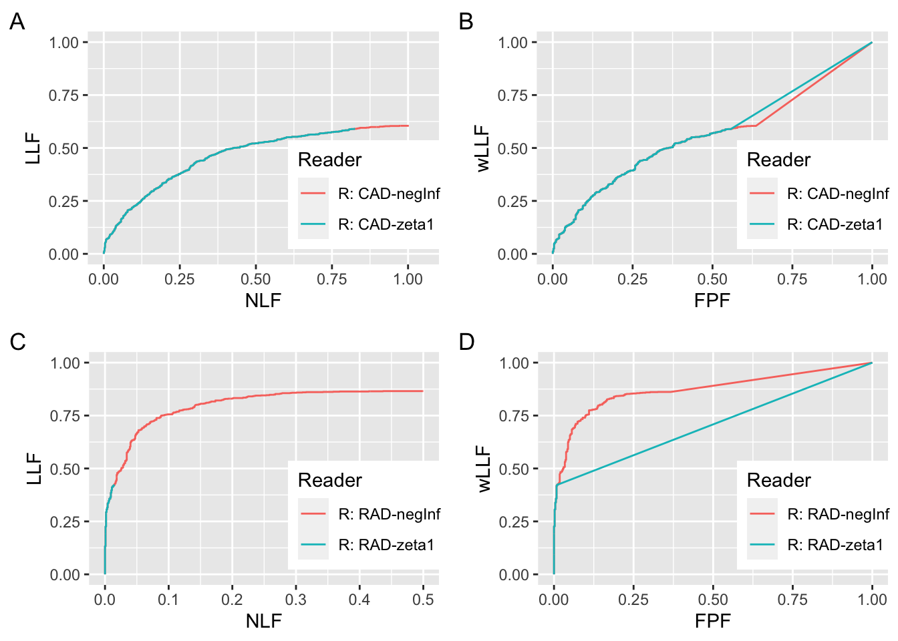

# FROC vs. wAFROC {#froc-vs-afroc}


## Introduction {#froc-vs-wafroc-intro}

-   TBA This chapter needs a major rewrite; 10/6/20
-   One plot is being repeated
-   Need to add comparisons to ROC
-   Don't need columns 1 and 3 in table

The FROC curve was introduced in [@bunch1977free] and ever since it has been widely used for evaluating performance in the free-response paradigm, particularly in CAD algorithm development. Typically CAD researchers report "sensitivity was observed to be xx at yy false positives per image." Occasionally, using less ambiguous terminology, they report an observed operating point on the FROC, as in "LLF was observed to be xx at NLF = yy". The lessons learned from ROC analysis, see Section \@ref(binary-task-beam-study), that a scalar FOM is preferable to sensitivity-specificity pairs, has apparently been forgotten.

This chapter recommends adoption of the wAFROC as the preferred operating characteristic in assessing performance in the free-response paradigm, and details simulation-based studies supporting this recommendation.

## FROC vs. wAFROC

This section examines RSM-predicted FROC and wAFROC plots for a simulated CAD (algorithmic) and RAD (radiologist) observers. Recall, from Section \@ref(froc-paradigm-preview-rsm), that the RSM is defined by 3 parameters $\mu, \lambda, \nu$ and the lowest reporting threshold parameter $\zeta_1$ which determines if latent localizations are actually marked.


```{.r .numberLines}
source(here("R/CH13-CadVsRadPlots/CadVsRadPlots.R"))

nu <- 1
lambda <- 1
K1 <- 500
K2 <- 700
muCad <- 1.0
muRad <- 1.5
zeta1Cad <- -1
zeta1Rad <- 1.5
Lmax <- 2
seed <- 1
set.seed(seed)
Lk2 <- floor(runif(K2, 1, Lmax + 1))

ret1AB <- CadVsRadPlots (
  muCad, 
  muRad, 
  lambda, 
  nu, 
  zeta1Cad, 
  zeta1Rad, 
  K1, 
  K2, 
  Lk2, 
  seed)

froc_plot_1A <- ret1AB$froc$Plot + labs(tag = "A")
wafroc_plot_1B <- ret1AB$wafroc$Plot + labs(tag = "B")
wafroc_cad_1B <- ret1AB$fomCad
wafroc_rad_1B <- ret1AB$fomRad

zeta1Cad <- -Inf
zeta1Rad <- -Inf

ret1CD <- CadVsRadPlots (
  muCad, 
  muRad, 
  lambda, 
  nu, 
  zeta1Cad, 
  zeta1Rad, 
  K1, 
  K2, 
  Lk2, 
  seed)

froc_plot_1C <- ret1CD$froc$Plot + labs(tag = "C")
wafroc_plot_1D <- ret1CD$wafroc$Plot + labs(tag = "D")
wafroc_cad_1D <- ret1CD$fomCad
wafroc_rad_1D <- ret1CD$fomRad
```

<div class="figure">

<p class="caption">(\#fig:froc-vs-afroc-plot1)Plots A and B are for CAD $\zeta_1 = -1$ and RAD $\zeta_1 = 1.5$ and plots C and D are plots for CAD $\zeta_1 = -\infty$ and RAD $\zeta_1 = -\infty$. Plots A and C: FROC curves for the CAD and RAD observers. B and D: corresponding wAFROC curves.</p>
</div>

Both CAD and RAD observers share the same $\lambda, \nu$. These are defined at lines 3 and 4 of the preceding code: $\lambda = \nu = 1$. The number of simulated cases is defined, lines 5-6, by $K_1 = 500$ and $K_2 = 700$. The simulated CAD observer $\mu$ parameter is defined at line 7 by by $\mu_{CAD} = 1$ and that of the simulated RAD observer is defined at line 8 by $\mu_{RAD} = 1.5$. The corresponding threshold parameters are (lines 9 -10) $\zeta_{1} = -1$ for CAD and $\zeta_{1} = 1.5$ for RAD. The maximum number of lesions per case is defined at line 11 by `Lmax` = 2. The actual number of lesions per case `Lk2` is determined at line 14 (`Lk2` is a $K_2$ length array consisting of random integers 1 or 2).

Line 16 calls the helper function `CadVsRadPlots()` (the file containing this function is sourced at line 1), which calculates the FROC and wAFROC plots and other statistics. The FROC is extracted at line 26 and labeled A, while the wAFROC is extracted at line 27 and labeled B. The following code extracts the coordinates of the end-points of the respective curves.


```r
# extract coordinates of end-point
nlfCad1A <- max(froc_plot_1A$data$genAbscissa[froc_plot_1A$data$Reader == "R: CAD"]) 
llfCad1A <- max(froc_plot_1A$data$genOrdinate[froc_plot_1A$data$Reader == "R: CAD"]) 
nlfRad1A <- max(froc_plot_1A$data$genAbscissa[froc_plot_1A$data$Reader == "R: RAD"]) 
llfRad1A <- max(froc_plot_1A$data$genOrdinate[froc_plot_1A$data$Reader == "R: RAD"]) 

nlfCad1C <- max(froc_plot_1C$data$genAbscissa[froc_plot_1C$data$Reader == "R: CAD"]) 
llfCad1C <- max(froc_plot_1C$data$genOrdinate[froc_plot_1C$data$Reader == "R: CAD"]) 
nlfRad1C <- max(froc_plot_1C$data$genAbscissa[froc_plot_1C$data$Reader == "R: RAD"]) 
llfRad1C <- max(froc_plot_1C$data$genOrdinate[froc_plot_1C$data$Reader == "R: RAD"]) 
```

The coordinates of the end-point of the CAD FROC in plot A are (0.8283333, 0.6076923). Those of the RAD FROC plot in A are (0.0408333, 0.4221154). The FROC for the CAD observer extends to much larger NLF values while that for the RAD observer is relatively short and steeper, as in Fig. \@ref(fig:froc-vs-afroc-plot1), plot A. One suspects the RAD observer is performing better than CAD. He is better at finding lesions and producing fewer NLs, both of which are desirable characteristics. One suspects that *if* he could be induced to relax the threshold and report more NLs, his LLF would exceed that of the CAD observer while still maintaining a lower $\text{NLF}_{\text{max}}$. However, lacking the ability to induce the radiologist to relax his threshold, it is not possible to quantify this suspicion from the observed FROC curves. [^froc-vs-afroc-1]

[^froc-vs-afroc-1]: The basic issue is the lack of a common NLF range for the two plots. If a common NLF range is "forced", for example defined as the common NLF range 0 to 0.0408333 where both curves contribute, it would ignore most NLs from the CAD observer.

CAD algorithm developers typically quote LLF at a specified NLF. According to the two plots in A, the RAD observer is better if the NLF value is chosen to less than 0.0408333 (this is the maximum NLF value for the RAD plot in A) but there is no basis for comparison for larger values of NLF (because the RAD observer does not provide any data beyond the observed end-point). A similar problem was encountered in ROC analysis when comparing a pair of sensitivity-specificity values, where, given differing choices of thresholds, ambiguous results can be obtained, see Section \@ref(binary-task-beam-study). Indeed, this was the rationale for using AUC under the ROC curve as an unambiguous measure of performance.

wAFROC curves, for the same datasets, whose FROC curves are shown in plot A, are shown in plot B. **Like the ROC, the wAFROC is contained within the unit square, a highly desirable characteristic, which solves the lack of a common NLF range problem with the FROC.** The wAFROC AUC under the RAD observer is visibly greater than that for the CAD observer, even though -- due to his higher threshold -- his AUC estimate is actually biased downward against him [^froc-vs-afroc-2]. AUCs under the two wAFROC plots in B are 0.5878207 for CAD and 0.6927457 for RAD, consistent with the visual impression of RAD \> CAD.

[^froc-vs-afroc-2]: Because the RAD observer is adopting a high threshold $\zeta_1 = 1.5$, his $\text{LLF}_{\text{max}}$ is smaller than it would have been with a lower threshold, and consequently the area under the large straight line segment from the uppermost non-trivial operating point to (1,1) is smaller than would have been the case with a lower threshold.

Since plots A and B are based on different choices of lowest reporting threshold, it is pertinent to ask what happens for identical thresholds. Lines 31-32 set the two threshold parameters to $-\infty$ and line 34 calls the function `CadVsRadPlots()` with these new values. The FROC is extracted at line 44 and labeled C, while the wAFROC is extracted at line 45 and labeled D.

The coordinates of the end-point of the CAD FROC in plot C are (1.0241667, 0.6326923). Those of the RAD FROC plot in C are (0.6675, 0.7548077). The RAD observer has higher LLF at lower NLF, and there is no doubt that he is better. Plot C confirms that RAD is actually the better observer *over his entire NLF range*.

Plot D shows the corresponding wAFROC curves. The AUCs are 0.5653186 for CAD and 0.7592486 for RAD, confirming that the RAD observer is indeed better. Moreover, this comparison, based on comparing two scalars, is unambiguous. [^froc-vs-afroc-3]

[^froc-vs-afroc-3]: The differences from the previous values (corresponding to plot B) namely 0.5878207 for CAD and 0.6927457 for RAD, is much larger -- and visually striking -- for the RAD observer than for the CAD observer. This is because the CAD observer was already adopting a low threshold $\zeta_1 = -1$ in plot B, so lowering it to $-\infty$ in plot D has a smaller effect.

### Large difference in performance

It is interesting to compare the two readers when there is large difference in performance. In Fig. \@ref(fig:froc-vs-afroc-plot2) (A), which exaggerates the difference between CAD and RAD, the CAD parameters are the same as in Fig. \@ref(fig:froc-vs-afroc-plot1), but the RAD parameters are $\mu_{RAD} = 2$ and $\zeta_1 = +2$. Doubling the separation parameter over that of CAD, $\mu_{CAD} = 1$, has a huge effect on performance.


The end-point coordinates of the FROC for RAD are (0.0125, 0.4442308). The common NLF region defined by NLF = 0 to NLF = 0.0125 *would exclude almost all of the marks made by CAD*. The wAFROC plots in plot B show the markedly greater performance of RAD over CAD (the AUCs are 0.5861714 for CAD and 0.7137629 for RAD). The difference is larger (compared to Fig. \@ref(fig:froc-vs-afroc-plot1) plot B), in spite of the greater downward bias working against the RAD observer.

Plots C and D correspond to A and B, respectively, with $\zeta_1$ = $-\infty$ for both readers. It reveals the full extent of the curves, when each observer marks every suspicious region, as long as it exists and no matter how low its z-sample.

<div class="figure">

<p class="caption">(\#fig:froc-vs-afroc-plot2)Plots A and B are for CAD $\zeta_1 = -1$ and RAD $\zeta_1 = 2$ and plots C and D are plots for CAD $\zeta_1 = -\infty$ and RAD $\zeta_1 = -\infty$. A and C: FROC curves for the CAD and RAD observers. B and D: corresponding wAFROC curves.</p>
</div>

Fig. \@ref(fig:froc-vs-afroc-plot2) (A) FROC curves for CAD observer and the RAD observer. The CAD observer is identical to that shown in Fig. \@ref(fig:froc-vs-afroc-plot1). The RAD observer is characterized by $\mu = 2$ and $\zeta_1 = 2$. This time it is impossible to compare the two FROC curves, as the common range is very small. However, wAFROC, plot B, clearly shows the expected superiority of the RAD observer, in spite of the severe underestimate of the corresponding AUC.

### Small difference in performance, identical thresholds

The final example, Fig. \@ref(fig:froc-vs-afroc-plot3) shows that *when there is a small difference in performance*, there is less ambiguity in using the FROC as a basis for measuring performance. The CAD parameters are the same as in Fig. \@ref(fig:froc-vs-afroc-plot1) but the RAD parameters are $\mu = 1.1$ and $\zeta_1= -1$. In other words, the $\mu$ parameter is 10% larger and the thresholds are identical. This time there is much more common NLF range overlap in plot A and one is counting most of the marks for the CAD reader. The superior wAFROC-based performance of RAD is also apparent in B. Plots C and D correspond to $\zeta_1 = -\infty$, and they confirm the similar performances (apparent in plots A and B) with a slight superiority for RAD.


<div class="figure">

<p class="caption">(\#fig:froc-vs-afroc-plot3)Plots A and B are for CAD $\zeta_1 = -1$ and RAD $\zeta_1 = -1$ and plots C and D are plots for CAD $\zeta_1 = -\infty$ and RAD $\zeta_1 = -\infty$. A and C: FROC curves for the CAD and RAD observers. B and D: corresponding wAFROC curves.</p>
</div>

**The bottom line is that in all three cases the wAFROC yields the right conclusion, while the FROC comparison can only be made when the two performances are similar.**

## Summary of simulations

In order to get a better overview, the following tables summarize the numerical values from the plots in this chapter. Table \@ref(tab:froc-vs-afroc-summary-table-cad) refers to CAD, and Table \@ref(tab:froc-vs-afroc-summary-table-rad) refers to the RAD observer.


<table>
<caption>(\#tab:froc-vs-afroc-summary-table-cad)Summary of CAD simulations: A refers to plot A, B refers to plot B, etc.</caption>
 <thead>
  <tr>
   <th style="text-align:left;"> FROC-A </th>
   <th style="text-align:left;"> FROC-C </th>
   <th style="text-align:left;"> wAFROC-B </th>
   <th style="text-align:left;"> wAFROC-D </th>
  </tr>
 </thead>
<tbody>
  <tr>
   <td style="text-align:left;"> (0.8283, 0.6077) </td>
   <td style="text-align:left;"> (1.024, 0.6327) </td>
   <td style="text-align:left;"> 0.5878 </td>
   <td style="text-align:left;"> 0.5653 </td>
  </tr>
</tbody>
</table>

### Summary of CAD simulations

-   The first column is labeled "FROC-A", meaning the CAD FROC plots labeled A, which are identical for Fig. \@ref(fig:froc-vs-afroc-plot1), Fig. \@ref(fig:froc-vs-afroc-plot2) and Fig. \@ref(fig:froc-vs-afroc-plot3).
-   The second column is labeled "FROC-C", meaning the CAD FROC plots labeled C, which are identical for the three figures.
-   The third column is labeled "wAFROC-B", meaning the CAD wAFROC plots labeled B, which are identical for the three figures.
-   The last column is labeled "wAFROC-D", meaning the CAD wAFROC plots labeled D, which are identical for the three figures.


<table>
<caption>(\#tab:froc-vs-afroc-summary-table-rad)Summary of RAD simulations: Fig refers to the figure number in this chapter, A refers to plot A, B refers to plot B, etc.</caption>
 <thead>
  <tr>
   <th style="text-align:left;"> Fig </th>
   <th style="text-align:left;"> FROC-A </th>
   <th style="text-align:left;"> FROC-C </th>
   <th style="text-align:left;"> wAFROC-B </th>
   <th style="text-align:left;"> wAFROC-D </th>
  </tr>
 </thead>
<tbody>
  <tr>
   <td style="text-align:left;"> 1 </td>
   <td style="text-align:left;"> (0.04083, 0.4221) </td>
   <td style="text-align:left;"> (0.6675, 0.7548) </td>
   <td style="text-align:left;"> 0.6927 </td>
   <td style="text-align:left;"> 0.7592 </td>
  </tr>
  <tr>
   <td style="text-align:left;"> 2 </td>
   <td style="text-align:left;"> (0.0125, 0.4442) </td>
   <td style="text-align:left;"> (0.5133, 0.8779) </td>
   <td style="text-align:left;"> 0.7138 </td>
   <td style="text-align:left;"> 0.8701 </td>
  </tr>
  <tr>
   <td style="text-align:left;"> 3 </td>
   <td style="text-align:left;"> (0.7433, 0.6663) </td>
   <td style="text-align:left;"> (0.8708, 0.6837) </td>
   <td style="text-align:left;"> 0.6578 </td>
   <td style="text-align:left;"> 0.6327 </td>
  </tr>
</tbody>
</table>

### Summary of RAD simulations

-   The first column refers to the figure number, for example, "1" refers to Fig. \@ref(fig:froc-vs-afroc-plot1), "2" refers to Fig. \@ref(fig:froc-vs-afroc-plot2), and "3" refers to Fig. \@ref(fig:froc-vs-afroc-plot3).
-   The second column is labeled "FROC-A", meaning the RAD FROC plot labeled A.
-   The third column is labeled "FROC-C", meaning the RAD FROC plots labeled C.
-   The fourth column is labeled "wAFROC-B", meaning the RAD wAFROC plots labeled B.
-   The last column is labeled "wAFROC-D", meaning the RAD wAFROC plots labeled D.

## Comments {#froc-vs-wafroc-comments}

-   For the same figure label (A, B, C or D) the CAD plots are identical in the three figures. This is the reason why Table \@ref(tab:froc-vs-afroc-summary-table-cad) has only one row.
-   A *fixed* CAD dataset is being compared to *varying* RAD datasets.
-   The first RAD dataset, Fig. \@ref(fig:froc-vs-afroc-plot1) A or B, might be considered an average radiologist, the second one, Fig. \@ref(fig:froc-vs-afroc-plot2) A or B, is a super-expert and the third one, Fig. \@ref(fig:froc-vs-afroc-plot3) A or B, is only nominally better than CAD.
-   Plots C and D are for hypothetical CAD and RAD readers that report all suspicious regions. The differences between A and C are minimal for the CAD observer, but marked for the RAD observer. Likewise for the differences between B and D.

## TBA FROC gives incorrect performance ordering {#froc-vs-wafroc-froc-incorrect-ordering}
A basic principle of ROC methodology is that two points on the same operating characteristic represent the same performance.
Presented next are four plots arranged to best show the effect of a change in threshold for CAD and RAD. The plots are related to Fig. \@ref(fig:froc-vs-afroc-plot1) and Fig. \@ref(fig:froc-vs-afroc-plot2), but they are arranged differently. The explanation follows after the figure.


<div class="figure">

<p class="caption">(\#fig:froc-vs-afroc-plot4)CAD/RAD FROC/wAFROC plots for two values of threshold. See below.</p>
</div>

Fig. \@ref(fig:froc-vs-afroc-plot4): Plot A is the CAD FROC for two values of $\zeta_1$: the green plot is for $\zeta_1 = -1$ and the red plot, which is mostly buried under the blue plot but the short red extension is visible, is for $\zeta_1 = -\infty$. Plot B is the CAD wAFROC for two values of $\zeta_1$: the green plot is for $\zeta_1 = -1$ and the red plot is for $\zeta_1 = -\infty$. Plot C is the RAD FROC for two values of $\zeta_1$: the green plot is for $\zeta_1 = 2$ and the red plot, which is partially buried under the blue plot but the long red extension is visible, is for $\zeta_1 = -\infty$. Plot D is the RAD wAFROC for two values of $\zeta_1$: the green plot is for $\zeta_1 = 2$ and the red plot is for $\zeta_1 = -\infty$.

In the ROC paradigm, two points on the same underlying ROC curve represent the same intrinsic performance -- all that is happening is that the observers are employing different thresholds that represent different tradeoffs between sensitivity and specificity, see the [@RN1087] study referenced in \@ref(binary-task-beam-study). If the FROC curve is to be meaningful, then two curves that differ only in thresholds must also represent identical performance.

In the following the red curve always refers to $\zeta_1 = -\infty$ while the blue curve always refers to $\zeta_1 = -1$.

1.  Plot A: The CAD red plot is completely buried (i.e., identical curves) under the CAD blue plot, except for a short red extension. This is because the two plots correspond to identical values of the RSM parameters $\mu, \lambda, \nu$, the only difference is in the threshold parameter $\zeta_1$: the blue corresponds to $\zeta_1 = -1$ while the red corresponds to $\zeta_1 = -\infty$. If the only difference in the curves is due to the effect of threshold, one has to conclude that the intrinsic performances of the two observers, i.e., CAD with different thresholds, are in fact identical. In fact this is an incorrect conclusion, see below, which argues against the notion that the FROC curve is meaningful.
2.  Plot B: this time the CAD blue curve extends all the way from (0,0) to (1,1) and so does the CAD red curve (most of which is buried under the blue one). A relatively small performance difference is evident: the blue curve has higher wAFROC-AUC = 0.5861714, than the red one, wAFROC-AUC = 0.6152086. The reason for this can be understood by noting that with the chosen $\mu = 1$ threshold $\zeta_1 = -1$ one is starting out on the relatively flat portion of the FROC. Upon extending it to higher NLF by lowering the threshold to $\zeta_1 = -\infty$, the increase in the LLF is modest, but NLF has increased substantially. Since relatively few additional lesions are being localized but the penalty is more NLs, intrinsic performance for the red curve is expected to decrease. The difference in performance is -0.0290371. *The wAFROC gives the correct ordering of the two observers, one that is missed by the FROC.* The argument is more convincing upon comparing the RAD observers' in Fig. \@ref(fig:froc-vs-afroc-plot4) C and D.
3.  Plot C: the RAD red FROC plot is partially buried under the RAD blue plot, a short near vertical segment from (0,0) to (0.0125, 0.4442308), in the region near the origin. Thereafter the RAD red FROC plot resumes a sweeping curve all the way to (0.5133333, 0.8778846). Since the two curves are identical except for changing thresholds, one must conclude based on the FROC, that the two performances are identical.
4.  Plot D: the RAD blue curve extends all the way from (0,0) to (1,1) and so does the RAD red curve (a short portion of which, near the origin, is buried under the blue one). A large performance difference is evident: the red curve has higher wAFROC-AUC = 0.8701307, than the blue one, wAFROC-AUC = 0.7137629. The explanation for this is that with the chosen RAD parameters -- $\mu = 2$ and initial threshold $\zeta_1 = 2$ -- one is starting on the relatively steep portion of the FROC and extending it to both higher LLF and higher NLF. Since many additional lesions are being localized, and one is counting only the highest rated NL on each non-diseased case, the penalty of more NLs is more than outweighed by the increased number of lesions localized. The difference in performance is 0.1563679. Again, the wAFROC gives the correct ordering of the two observers, one that is missed by the FROC.

The essential reason why the wAFROC gives the correct ordering but the FROC does not is that the wAFROC, being contained in the unit square, gives the complete picture. The FROC, not so constrained to the unit square, does not. 

Note that the direction of the threshold-change effect depends on the starting point on the FROC: if one starts on the relatively flat portion of the FROC, then lowering the threshold all the way to $-\infty$ decreases performance; if one starts on the relatively steep portion, then lowering the threshold all the way to $-\infty$ increases performance. An intermediate starting point can be found where there is no threshold-change effect.

The argument depends critically on the area under the straight line extension from the end-point to (1,1) being included in the wAFROC-AUC. If this were not allowed one could argue that the end-point of the blue curve (0.016, 0.4442308) -- quite visible as the sharp inflection in plot D -- lies on the same wAFROC curve as the end-point of the red curve (0.414, 0.8778846) -- not so readily visible. The justification for the straight line extension is deferred to Chapter \@ref(froc-meanings).


## Finding optimal operating point on the FROC

**Optimal operating point for RAD**


```
#>   mu_arr
#> 1    1.0
#> 2    1.5
#> 3    2.0
#> 4    2.5
#>   zetaMaxArr
#> 1        0.3
#> 2       -0.3
#> 3       -0.3
#> 4       -0.2
#>   max_fomArray
#> 1    0.5941014
#> 2    0.7850043
#> 3    0.8778243
#> 4    0.9321043
#>      nlfArr
#> 1 0.3820886
#> 2 0.4119409
#> 3 0.3089557
#> 4 0.2317039
```

<div class="figure">

<p class="caption">(\#fig:froc-vs-afroc-plot5)TBA. See below.</p>
</div>

**Optimal operating point for CAD**


```r
print(as.data.frame(mu_arr))
#>   mu_arr
#> 1    1.0
#> 2    1.5
#> 3    2.0
#> 4    2.5
print(as.data.frame(zetaMaxArr))
#>   zetaMaxArr
#> 1        2.0
#> 2        2.0
#> 3        1.3
#> 4        1.4
print(as.data.frame(max_fomArray))
#>   max_fomArray
#> 1    0.4536600
#> 2    0.5451357
#> 3    0.6901686
#> 4    0.8201436
print(as.data.frame(nlfArr))
#>      nlfArr
#> 1 0.2275013
#> 2 0.1516675
#> 3 0.4840024
#> 4 0.3230266
```

<div class="figure">

<p class="caption">(\#fig:froc-vs-afroc-plot6)TBA. See below.</p>
</div>

## To be moved {#froc-vs-wafroc-to-move}

A misconception exists that using the rating of only one NL mark, as in wAFROC, must sacrifice statistical power. In fact, the chosen mark is a special one, namely the highest rated NL mark on a non-diseased case, which carries more information than a randomly chosen NL mark. If the sampling distribution of the z-sample were uniform, then the highest sample is a sufficient statistic, meaning that it carries all the information in the samples. The highest rated z-sampler from a normal distribution is not a sufficient statistic, so there is some loss of information, but not as much as would occur with a randomly picked z-sample.

## Discussion {#froc-vs-wafroc-Discussion}

## References {#froc-vs-wafroc-references}
