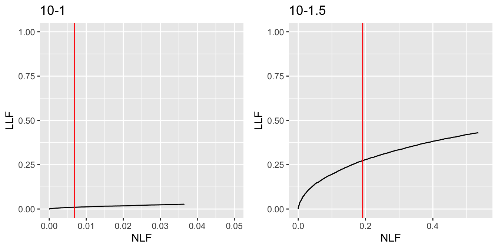
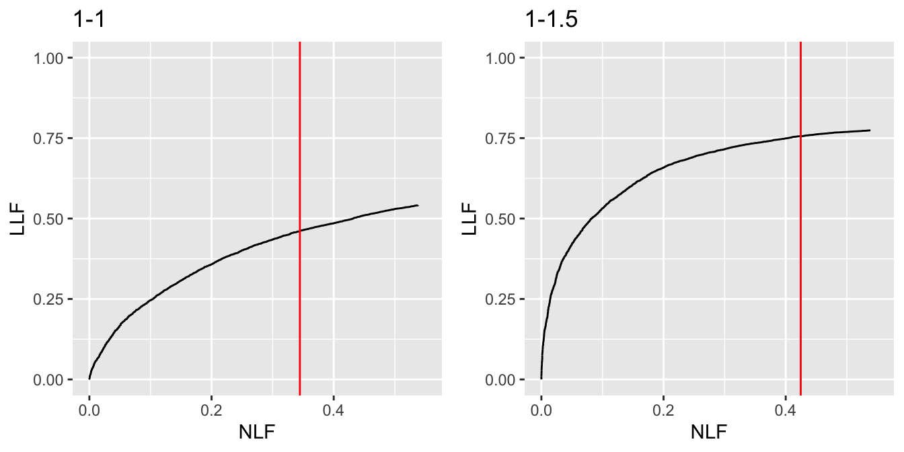
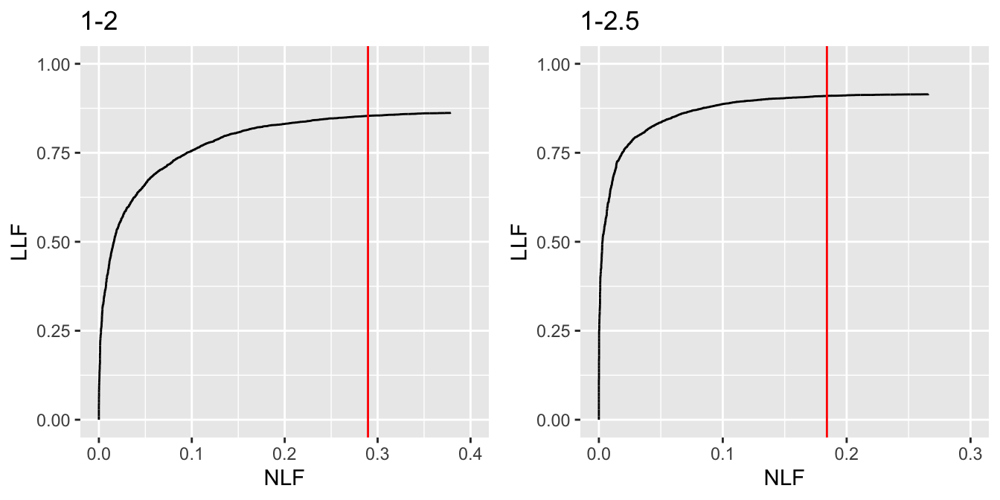

# Optimal operating point on FROC {#optim-op-point}

---
output:
  rmarkdown::pdf_document:
    fig_caption: yes        
    includes:  
      in_header: R/learn/my_header.tex
---

## Introduction {#optim-op-point-intro}
Algorithm developers are familiar with this problem: given a CAD system that yields mark-rating data, where the ratings are on a continuous scale (often termed *malignancy index* and the continuous ratings are available to the CAD algorithm designer), how does one select an optimal reporting threshold? Only mark-rating data with ratings exceeding the optimal threshold are to be displayed to the radiologist.

* From the previous chapter it is evident that performance depends of $\zeta_1$, see \@ref(froc-vs-wafroc-peformance-depends-on-zeta1).

* It is taken as an axiomatic truth that *the optimal reporting threshold $\zeta_{\text{max}}$ is that value of $\zeta_1$ that maximizes the AUC under the wAFROC*.  

* This chapter examines the effect of changing the reporting threshold $\zeta_1$ on the wAFROC AUC, with the object of determining the value that maximizes the AUC.

## Methods {#optim-op-point-methods}
* The aim is determine the optimal operating point on an FROC. Two values of the $\lambda$ parameter are considered: $\lambda = 10$ and $\lambda = 1$. The first value would characterize a CAD system that generates about 10 times the number of latent NL marks as an expert radiologist, while the second value would characterize a CAD system that generates about the same number of latent NL marks as an expert radiologist. The $\nu$ parameter is kept at the same, namely $\nu = 1$. Four values of the $\mu$ parameter are considered: 1, 1.5, 2, 2.5. All else being equal, performance is expected to improve with increasing $\mu$. 

* For each $\mu$ one scans $\zeta_1$, repeating the simulations and AUC computations for each value of $\zeta_1$. One determines the value of $\zeta_1$ that maximizes AUC; this is denoted $\zeta_{\text{max}}$. Finally, using $\zeta_{\text{max}}$ one calculates the corresponding (NLF,LLF) values, i.e., *the optimal operating point on the FROC* and the wAFROC AUC. 

* A large number of cases is used, namely the number of non-diseased cases is $K_1 = 5000$ and the number of diseased cases is $K_2 = 7000$. This minimizes sampling variability while not requiring excessive computation times.

### $\zeta_1$ optimization for $\lambda = 10$

Shown next is the variation of wAFROC AUC vs. $\zeta_1$ for $\lambda = 10$ and the four values of the $\mu$ parameter.

(\#fig:optim-op-point-AUC-vs-zeta1-10)Variation of AUC vs. $\zeta_1$ for $\lambda = 10$; AUC is the wAFROC AUC. The plots are labeled by the value of $\mu$ and zetaMax (i.e., $\zeta_{\text{max}}$, the value of $\zeta_1$ that maximizes AUC).

Fig. \@ref(fig:optim-op-point-AUC-vs-zeta1-10) corresponding to $\lambda = 10$ has four panels showing the variation of wAFROC AUC with $\zeta_1$. Each panel is labeled by the values of $\mu$ and  $\zeta_{\text{max}}$. For example, the panel labeled `mu = 1.5, zetaMax = 1.9` shows that AUC has a maximum at $\zeta_1 = 1.9$. For $\mu = 1$ the maximum is at the top of a broad plateau, but for higher values the maximum is better defined.

### $\zeta_1$ optimization for $\lambda = 1$

Shown next is the variation of wAFROC AUC vs. $\zeta_1$ for $\lambda = 1$ and the four values of the $\mu$ parameter.

(\#fig:optim-op-point-AUC-vs-zeta1-01)Variation of AUC vs. $\zeta_1$ for $\lambda = 1$.

Fig. \@ref(fig:optim-op-point-AUC-vs-zeta1-01) corresponds to $\lambda = 1$ and employs a similar labeling scheme as Fig. \@ref(fig:optim-op-point-AUC-vs-zeta1-10). For example, the panel labeled `mu = 1, zetaMax = 0.4` shows that AUC has a maximum at $\zeta_1 = 0.4$. For each maximum the optimal operating point on the FROC is determined as well as the wAFROC AUCs.

### Summary of simulations and comments {#optim-op-point-comments-threshold-optimization}

<table>
<caption>(\#tab:optim-op-point-cad-optim-table)Summary of optimal threshold values: "measure" refers to a performance measure, "mu1" refers to $\mu = 1$, etc. The row labels are as follows: AUC10 is the wAFROC AUC for lambda = 10, AUC01 is the wAFROC AUC for $\lambda = 1$, NLF10 is NLF for $\lambda = 10$, ..., LLF01 is LLF for $\lambda = 1$.</caption>
 <thead>
  <tr>
   <th style="text-align:left;"> measure </th>
   <th style="text-align:right;"> mu1 </th>
   <th style="text-align:right;"> mu1.5 </th>
   <th style="text-align:right;"> mu2 </th>
   <th style="text-align:right;"> mu2.5 </th>
  </tr>
 </thead>
<tbody>
  <tr>
   <td style="text-align:left;"> AUC10 </td>
   <td style="text-align:right;"> 0.50224 </td>
   <td style="text-align:right;"> 0.55628 </td>
   <td style="text-align:right;"> 0.69876 </td>
   <td style="text-align:right;"> 0.83833 </td>
  </tr>
  <tr>
   <td style="text-align:left;"> AUC01 </td>
   <td style="text-align:right;"> 0.60507 </td>
   <td style="text-align:right;"> 0.78199 </td>
   <td style="text-align:right;"> 0.88091 </td>
   <td style="text-align:right;"> 0.93461 </td>
  </tr>
  <tr>
   <td style="text-align:left;"> NLF10 </td>
   <td style="text-align:right;"> 0.00687 </td>
   <td style="text-align:right;"> 0.19144 </td>
   <td style="text-align:right;"> 0.40378 </td>
   <td style="text-align:right;"> 0.63462 </td>
  </tr>
  <tr>
   <td style="text-align:left;"> LLF10 </td>
   <td style="text-align:right;"> 0.00879 </td>
   <td style="text-align:right;"> 0.26769 </td>
   <td style="text-align:right;"> 0.62753 </td>
   <td style="text-align:right;"> 0.85659 </td>
  </tr>
  <tr>
   <td style="text-align:left;"> NLF01 </td>
   <td style="text-align:right;"> 0.34458 </td>
   <td style="text-align:right;"> 0.42455 </td>
   <td style="text-align:right;"> 0.28963 </td>
   <td style="text-align:right;"> 0.18407 </td>
  </tr>
  <tr>
   <td style="text-align:left;"> LLF01 </td>
   <td style="text-align:right;"> 0.45876 </td>
   <td style="text-align:right;"> 0.75189 </td>
   <td style="text-align:right;"> 0.85264 </td>
   <td style="text-align:right;"> 0.91039 </td>
  </tr>
</tbody>
</table>

Table \@ref(tab:optim-op-point-cad-optim-table) summarizes the results of the simulations. In this table the first two rows compare the AUCs for $\lambda=10$ and $\lambda=1$ for the four values of $\mu$. The next two rows show the operating point (NLF, LLF) for $\lambda = 10$ for the four values of $\mu$ and the final two rows are the operating point for $\lambda = 1$ for the four values of $\mu$. The following trends are evident.

* All else being equal, AUC increases with increasing $\mu$. Increasing the separation of the two unit variance normal distributions that determine the ratings of NLs and LLs leads to higher performance
* All else being equal, AUC increases with decreasing $\lambda$. Decreasing the propensity of the observer to generate NLs leads to increasing performance.
* For each value of $\lambda$ optimal LLF increases with increasing $\mu$.
* For $\lambda = 10$ optimal NLF increases with increasing $\mu$.
* For $\lambda = 1$ optimal NLF *peaks* around $\mu = 1.5$.

All of these observations make intuitive sense except, perhaps, that for NLF01. To understand the peaking behavior it is necessary to examine the FROC curves corresponding to the eight -- two $\lambda$ values times four $\mu$ values -- combinations of parameters. In the following eight plots, each labeled by the appropriate $\lambda-\mu$ combination, the optimal value of NLF, corresponding to $\zeta_1 = \zeta_{\text{max}}$, is shown as a red vertical line.

(\#fig:optim-op-point-froc-10-first-two-plots)Extended FROC plots: the plot labeled 10-1 is for $\lambda = 10$ and $\mu = 1$, and that labeled 10-1.5 is for $\lambda = 10$ and $\mu = 1.5$.

#### Explanations {#optim-op-point-threshold-explanations}

* In Fig. \@ref(fig:optim-op-point-froc-10-next-two-plots) and the plot labeled **10-1**: the vertical red line is at NLF = 0.0068714. The predicted end-point for the curve is (NLF = 0.0068714, LLF = 0.0087887) while the empirical end-point is (NLF = 0.0056667, LLF = 0.0096337) and the extended curve (defined below) ends at (NLF = 0.0364167, LLF = 0.0274704). In the plot labeled **10-1.5**: The vertical red line is at NLF = 0.1914437. The predicted end-point for the curve is (NLF = 0.1914437, LLF = 0.2676925) while the empirical end-point is (NLF = 0.1958333, LLF = 0.2757535) and the extended curve ends at (NLF = 0.53475, LLF = 0.4302747).

* In Fig. \@ref(fig:optim-op-point-froc-10-first-two-plots) the plot labeled **10-1** is the *extended* FROC curve for $\lambda = 10$ and $\mu = 1$.
* Meaning of *extended*: due to sampling effects the predicted end-point will not, in general, coincide with the *empirical* end-point, but will be near it. In order to show a fuller extent of the FROC curve it is necessary to *extend* the observed curve beyond the predicted end-point. This was done by setting $\zeta_1$ = $\zeta_{\text{max}} - 0.5$, which has the effect of letting the curve run a little bit further to the right. As a concrete example the predicted end-point for the curve in question is (NLF = 0.0068714, LLF = 0.0087887) while the empirical end-point is (NLF = 0.0056667, LLF = 0.0096337) and the extended curve ends at (NLF = 0.0364167, LLF = 0.0274704).
* The vertical red line is drawn at the *predicted* optimal NLF corresponding to $\zeta_{\text{max}}$ for this parameter combination, not the *empirical* NLF.  
* In Fig. \@ref(fig:optim-op-point-froc-10-first-two-plots) panel labeled 10-1, AUC performance is quite low. In fact AUC = 0.5022367. The optimal operating point of the algorithm is actually rather close to the origin, specifically NLF = 0.0068714 and LLF = 0.0087887.
* Since algorithm performance is so poor, the sensible choice for the algorithm designer is to only show those marks that have, according to the algorithm, very high confidence level for being right (note that an operating point near the origin corresponds to a high value of $\zeta$).
* For higher values of $\mu$ shown in Fig. \@ref(fig:optim-op-point-froc-10-first-two-plots) -- e.g., the plots labeled 10-1.5, 10-2 and 10-2.5 -- AUC performance progressively increases. It now makes sense to show marks with lower confidence levels corresponding to moving up the FROC curve. While it is true that one is also showing more NLs, the increase in the number of LLs shown is enough to compensate. This trend is seen to be true for all operating points listed in the third and fourth rows of Table \@ref(tab:optim-op-point-cad-optim-table).
* It remains to explain the seemingly anomalous behavior seen in the fifth row of Table \@ref(tab:optim-op-point-cad-optim-table) - NLF shows a peak at $\mu = 1.5$ as a function of $\mu$ and thereafter NLF decreases. The relevant FROC curve is shown in Fig. \@ref(fig:optim-op-point-froc-01-first-two-plots), panel labeled 1-1.5. The basic reason is that as $\mu$ increases, the end-point of the FROC keeps moving upwards and to the left (approaching NLF = 0 and LLF = 1 in the limit of infinite $\mu$). Because of this effect the expected increase in NLF seen in the third row of the table is terminated - one literally runs out of FROC curve to move up on. Another way of explaining this is that in In Fig. \@ref(fig:optim-op-point-froc-10-first-two-plots) the true end-point, i.e., that corresponding to $\zeta_1 = -\infty$, is much further to the right, than in Fig. \@ref(fig:optim-op-point-froc-10-next-two-plots). This allows NLF to keep increasing in Fig. \@ref(fig:optim-op-point-froc-10-first-two-plots) but not in Fig. \@ref(fig:optim-op-point-froc-10-next-two-plots).

(\#fig:optim-op-point-froc-10-next-two-plots)Extended FROC plots: the plot labeled 10-2 is for $\lambda = 10$ and $\mu = 2$ and that labeled 10-2.5 is for $\lambda = 10$ and $\mu = 2.5$.

* In Fig. \@ref(fig:optim-op-point-froc-10-next-two-plots) and the plot labeled **10-2**: The vertical red line is at NLF = 0.4037833. The predicted end-point for the curve is (NLF = 0.4037833, LLF = 0.6275277) while the empirical end-point is (NLF = 0.3984167, LLF = 0.631343) and the extended curve ends at (NLF = 0.9109167, LLF = 0.7486646). In the plot labeled **10-2.5**: The vertical red line is at NLF = 0.634621. The predicted end-point for the curve is (NLF = 0.634621, LLF = 0.8565917) while the empirical end-point is (NLF = 0.6330833, LLF = 0.8606448) and the extended curve ends at (NLF = 1.2324167, LLF = 0.9008966).

(\#fig:optim-op-point-froc-01-first-two-plots)Extended FROC plots: the plot labeled 1-1 is for $\lambda = 1$ and $\mu = 1$ and that labeled 10-1.5 is for $\lambda = 1$ and $\mu = 1.5$.

* In Fig. \@ref(fig:optim-op-point-froc-01-first-two-plots), the panel labeled **1-1**: The vertical red line is at NLF = 0.3445783. The predicted end-point for the curve is (NLF = 0.3445783, LLF = 0.4587595) while the empirical end-point is (NLF = 0.33925, LLF = 0.4581267) and the extended curve ends at (NLF = 0.5379167, LLF = 0.5411103). In the plot labeled **10-1.5**: The vertical red line is at NLF = 0.4245538. The predicted end-point for the curve is (NLF = 0.4245538, LLF = 0.7518882) while the empirical end-point is (NLF = 0.4209167, LLF = 0.7555322) and the extended curve ends at (NLF = 0.5386667, LLF = 0.7740366).

(\#fig:optim-op-point-froc-01-next-two-plots)Extended FROC plots: the plot labeled 1-2 is for $\lambda = 1$ and $\mu = 2$ and that labeled 1-2.5 is for $\lambda = 1$ and $\mu = 2.5$.

* In Fig. \@ref(fig:optim-op-point-froc-01-next-two-plots), the panel labeled **1-2**: The vertical red line is at NLF = 0.2896299. The predicted end-point for the curve is (NLF = 0.2896299, LLF = 0.8526429) while the empirical end-point is (NLF = 0.2874167, LLF = 0.853491) and the extended curve ends at (NLF = 0.3786667, LLF = 0.8620755). In the plot labeled **10-2.5**: The vertical red line is at NLF = 0.1840689. The predicted end-point for the curve is (NLF = 0.1840689, LLF = 0.9103904) while the empirical end-point is (NLF = 0.18475, LLF = 0.909958) and the extended curve ends at (NLF = 0.2659167, LLF = 0.9144411).

## How to use the method {#optim-op-point-how-to-use-method}
Assume that one has designed an algorithmic observer that has been optimized with respect to all other parameters except the reporting threshold. At this point the algorithm reports every suspicious region no matter how low the malignancy index. The mark-rating pairs are entered into a `RJafroc` format Excel input file. The next step is to read the data file -- 
`DfReadDataFile()` -- convert it to an ROC dataset -- `DfFroc2Roc()` -- and then perform a radiological search model (RSM) fit to the dataset using function `FitRsmRoc()`. This yields the necessary $\lambda, \mu, \nu$ parameters. These values are used to perform the simulations described in the embedded code in this chapter, i.e., that leading to, for example, one of the panels in Fig. \@ref(fig:optim-op-point-AUC-vs-zeta1-01). This determines the optimal reporting threshold: essentially, one scans $\zeta_1$ values looking for maximum in wAFROC AUC -- calculated using `UtilFigureOfMerit()`. This determines the optimal value of $\zeta_1$, namely $\zeta_{\text{max}}$. The RSM parameter values and $\zeta_{\text{max}}$ determine NLF, the optimal reporting point on the FROC curve. The designer sets the algorithm to only report marks with confidence level exceeding $\zeta_{\text{max}}$.  

## Discussion {#optim-op-point-Discussion}
TBA

## References {#optim-op-point-references}
